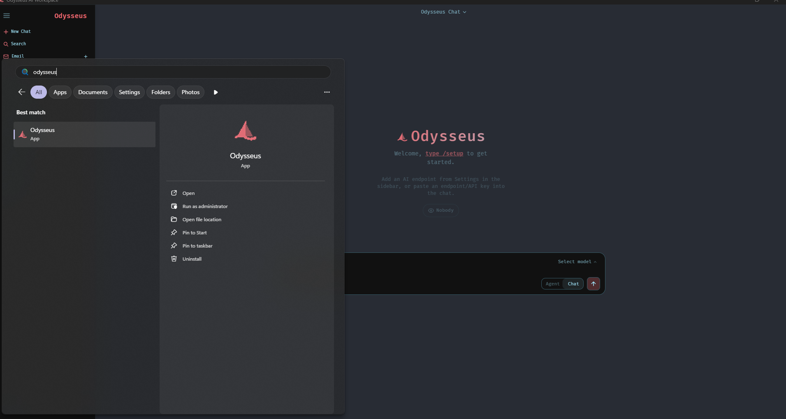

<p align="center">
  
</p>

<p align="center">
  A self-hosted AI workspace for chat, agents, research, documents, email, notes, calendar, and local model workflows.
</p>

<p align="center">
  <a href="#quick-start">Quick Start</a> ·
  <a href="docs/setup.md">Setup Guide</a> ·
  <a href="CONTRIBUTING.md">Contributing</a> ·
  <a href="ROADMAP.md">Roadmap</a>
</p>

<p align="center">
  <a href="https://repology.org/project/odysseus-ai/versions"></a>
</p>

<p align="center">
  
</p>

---

## Quick Start

> `dev` is the default branch and gets the newest changes first. Use [`main`](https://github.com/pewdiepie-archdaemon/odysseus/tree/main) if you want the more curated branch.

```bash
git clone https://github.com/pewdiepie-archdaemon/odysseus.git
cd odysseus
cp .env.example .env
docker compose up -d --build
```

Open `http://localhost:7000` when the containers are healthy. The first admin password is printed in `docker compose logs odysseus`.

### Windows Desktop

For a native desktop experience with system tray, taskbar icon, and no browser tabs, use the included `odysseus-desktop.py` harness (requires Python 3.11+ and Git for Windows).

Until the upstream PR is merged, clone this branch (it already includes the harness + deps):

```bash
git clone -b desktop/windows-native-harness https://github.com/whoxllm/odysseus.git
cd odysseus
python -m venv venv
venv\Scripts\activate
pip install -r requirements.txt
python setup.py install
venv\Scripts\python.exe odysseus-desktop.py
```

After the PR merges into upstream `dev`/`main`, the same commands work with:

```bash
git clone https://github.com/pewdiepie-archdaemon/odysseus.git
```

`pip install -r requirements.txt` pulls `pywebview`, `pystray`, and `pillow` automatically — the harness needs all three.

**What it does:**
- Starts the uvicorn backend as a managed subprocess (auto-restarts on crash, up to 5 retries)
- Opens the web UI in a native pywebview window — no browser needed
- System tray icon (boat logo) with Start/Stop/Open/Quit controls
- Close button minimizes to tray instead of quitting
- Taskbar icon set to the Odysseus boat logo

**First launch:** the web UI auto-detects there's no admin account yet and shows a "Create Admin Account" setup screen (username, password, confirm password) instead of the login form. No separate signup step needed — just fill it in and you're logged in as admin.

**Resetting the account:** if you need to redo setup — testing, handing the app to someone else, or you forgot the password — use the tray menu's **"Reset Account (First-Run Setup)"** option. It deletes the stored admin credentials, restarts the backend, and reloads the window straight to the "Create Admin Account" screen. Sessions, chats, and other data are untouched.

**PyInstaller packaging** (optional, builds a standalone `.exe`):
```bash
venv\Scripts\python.exe -m PyInstaller odysseus-desktop.spec
```
Output: `dist\Odysseus Desktop.exe`

For local models, point Odysseus to `http://localhost:11434/v1` (Ollama) in Settings after launch.

Native installs, GPU notes, Windows/macOS instructions, HTTPS, and configuration live in the [setup guide](docs/setup.md).

## Features

- **Chat + Agents** — local/API models, tools, MCP, files, shell, skills, and memory.
- **Cookbook** — hardware-aware model recommendations, downloads, and serving.
- **Deep Research** — multi-step web research with source reading and report generation.
- **Compare** — blind side-by-side model testing and synthesis.
- **Documents** — writing-first editor with AI edits, suggestions, Markdown, HTML, CSV, and syntax highlighting.
- **Email** — IMAP/SMTP inbox with triage, tags, summaries, reminders, and reply drafts.
- **Notes, Tasks + Calendar** — reminders, todos, scheduled agent tasks, and CalDAV sync.
- **Extras** — gallery/image editor, themes, uploads, web search, presets, sessions, and 2FA.

## Demo

A full hover-to-play tour lives on the landing page: [`docs/index.html`](docs/index.html).

## Contributing

Help is welcome. The best entry points are fresh-install testing, provider setup bugs, mobile/editor polish, docs, and small focused refactors. See [CONTRIBUTING.md](CONTRIBUTING.md) and [ROADMAP.md](ROADMAP.md).

## Security

Odysseus is a self-hosted workspace with powerful local tools. Keep auth enabled, keep private data out of Git, and do not expose raw model/service ports publicly. Deployment details are in the [setup guide](docs/setup.md#security-notes).

## Star History

<a href="https://www.star-history.com/?repos=pewdiepie-archdaemon%2Fodysseus&type=date&legend=top-left">
 <picture>
   <source media="(prefers-color-scheme: dark)" srcset="https://api.star-history.com/chart?repos=pewdiepie-archdaemon/odysseus&type=date&theme=dark&legend=top-left" />
   <source media="(prefers-color-scheme: light)" srcset="https://api.star-history.com/chart?repos=pewdiepie-archdaemon/odysseus&type=date&legend=top-left" />
   
 </picture>
</a>

## License

AGPL-3.0-or-later -- see [LICENSE](LICENSE) and [ACKNOWLEDGMENTS.md](ACKNOWLEDGMENTS.md).
