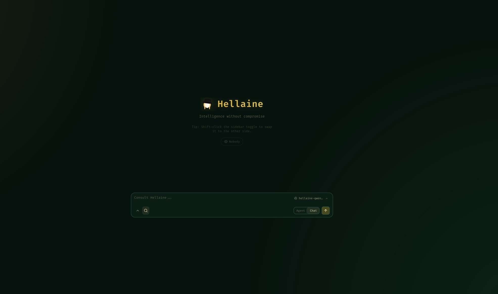

<p align="center">
  
</p>

<p align="center">
  A self-hosted AI workspace for chat, agents, research, documents, email, notes, calendar, and local model workflows.
</p>

<p align="center">
  <a href="#quick-start">Quick Start</a> ·
  <a href="docs/setup.md">Setup Guide</a> ·
  <a href="CONTRIBUTING.md">Contributing</a> ·
  <a href="ROADMAP.md">Roadmap</a>
</p>

<p align="center">
  <a href="https://repology.org/project/odysseus-ai/versions"></a>
</p>

<p align="center">
  
</p>

---

## Quick Start

> `dev` is the default branch and gets the newest changes first. Use [`main`](https://github.com/pewdiepie-archdaemon/odysseus/tree/main) if you want the more curated branch.

```bash
git clone https://github.com/pewdiepie-archdaemon/odysseus.git
cd odysseus
cp .env.example .env
docker compose up -d --build
```

Open `http://localhost:7000` when the containers are healthy. The first admin password is printed in `docker compose logs odysseus`.

## Run locally (without Docker)

Odysseus runs natively on Linux, macOS, and Windows — no Docker required. You only
need **Python 3.11+**. Running natively also lets Cookbook detect and use your
machine's GPU (Docker on macOS can't reach Metal). The first run prints an initial
**admin password** in the console — save it, that's your login.

**Windows** — one-command launcher (creates the venv, installs deps, runs setup, starts the server):

```powershell
powershell -ExecutionPolicy Bypass -File .\launch-windows.ps1
```

Then open `http://localhost:7000`.

**macOS (Apple Silicon)** — one-command launcher (installs Homebrew deps, sets up the venv, launches):

```bash
./start-macos.sh
```

Then open `http://127.0.0.1:7860` (port `7860` because macOS AirPlay often holds `7000`).

**Manual install** (any OS — the steps both launchers automate):

```bash
python3 -m venv venv
source venv/bin/activate          # Windows: venv\Scripts\Activate.ps1
pip install -r requirements.txt
python setup.py                   # creates data dirs + DB, prints the admin password
python -m uvicorn app:app --host 127.0.0.1 --port 7000
```

Bind to `127.0.0.1` for local-only use; set `--host 0.0.0.0` (or `APP_BIND=0.0.0.0`
in `.env`) only when you intentionally want other devices on your LAN/Tailscale to
reach it. The launchers are safe to re-run — they skip whatever already exists.

> Tip: installing **Git for Windows** (so `bash.exe` is on PATH) unlocks full
> Cookbook background downloads and the agent shell tool. The core app works without it.

Native installs, GPU notes, Windows/macOS instructions, HTTPS, and configuration live in the [setup guide](docs/setup.md).

## Features

- **Chat + Agents** — local/API models, tools, MCP, files, shell, skills, and memory.
- **Cookbook** — hardware-aware model recommendations, downloads, and serving.
- **Deep Research** — multi-step web research with source reading and report generation.
- **Compare** — blind side-by-side model testing and synthesis.
- **Documents** — writing-first editor with AI edits, suggestions, Markdown, HTML, CSV, and syntax highlighting.
- **Email** — IMAP/SMTP inbox with triage, tags, summaries, reminders, and reply drafts.
- **Notes, Tasks + Calendar** — reminders, todos, scheduled agent tasks, and CalDAV sync.
- **Extras** — gallery/image editor, themes, uploads, web search, presets, sessions, and 2FA.

## Demo

A full hover-to-play tour lives on the landing page: [`docs/index.html`](docs/index.html).

## Contributing

Help is welcome. The best entry points are fresh-install testing, provider setup bugs, mobile/editor polish, docs, and small focused refactors. See [CONTRIBUTING.md](CONTRIBUTING.md) and [ROADMAP.md](ROADMAP.md).

## Security

Odysseus is a self-hosted workspace with powerful local tools. Keep auth enabled, keep private data out of Git, and do not expose raw model/service ports publicly. Deployment details are in the [setup guide](docs/setup.md#security-notes).

## Star History

<a href="https://www.star-history.com/?repos=pewdiepie-archdaemon%2Fodysseus&type=date&legend=top-left">
 <picture>
   <source media="(prefers-color-scheme: dark)" srcset="https://api.star-history.com/chart?repos=pewdiepie-archdaemon/odysseus&type=date&theme=dark&legend=top-left" />
   <source media="(prefers-color-scheme: light)" srcset="https://api.star-history.com/chart?repos=pewdiepie-archdaemon/odysseus&type=date&legend=top-left" />
   
 </picture>
</a>

## License

AGPL-3.0-or-later -- see [LICENSE](LICENSE) and [ACKNOWLEDGMENTS.md](ACKNOWLEDGMENTS.md).
