# Fable-fix — CMD Center Data Visual Debugging Postmortem

> **Scope:** Breakdown of the V.A.U.L.T. globe visualization failures and fixes from **Jul 6, 2026**, covering the period when the data visual went blank through the card-to-node connector lines going live.  
> **Primary files:** `static/js/cmdCenterScene.js`, `static/js/cmdCenter.js`, `services/home/cmd_center.py`  
> **Session transcript:** [eb3d2499-5cdf-4608-8b7f-b03117fab500](C:\Users\tylar\.cursor\projects\c-Users-tylar-code-odysseus\agent-transcripts\eb3d2499-5cdf-4608-8b7f-b03117fab500\eb3d2499-5cdf-4608-8b7f-b03117fab500.jsonl)

**Contents:** [Executive summary](#executive-summary) · [Orchestration plan](#orchestration-plan--what-ran-in-what-order-and-why) · [Timeline](#timeline) · [Incidents 1–3](#incident-1--i-see-nothing-the-data-visual-is-broken) · [Tool inventory](#tool-call-inventory-debugging-session) · [Lessons](#lessons-learned)

---

## Executive summary

Three separate issues were conflated under “the data visual is broken,” but they had different root causes and fixes:

| # | Symptom | Root cause | Fix | Deploy path |
|---|---------|------------|-----|-------------|
| **1** | Blank stage — no globe, only floating cards + `⟳ AUTO` chip | `ReferenceError: onPopupOpen is not defined` during `initCmdCenterScene()` | Add `onPopupOpen` to function destructuring | Bind-mounted `static/` — no Docker rebuild |
| **2** | Globe renders but no card→node network lines | `setCardAnchors([])` — cards had empty `data-branch` because container backend omits `stage_cards[].branch` | Frontend `CARD_BRANCH_FALLBACK` map by card id | Bind-mounted `static/` — no Docker rebuild |
| **3** | Lines existed in code but were too faint / dropped on back hemisphere | `_drawCardConnectors` used low-alpha arcs and `continue` when `bp.z < -0.1` | Bold connectors, endpoint dots, target rings, dim-not-drop | Bind-mounted `static/` — no Docker rebuild |

**Docker rebuild status (as of this document):** **No.** The Odysseus image was not rebuilt. Python backend inside the container still runs an older baked-in `cmd_center.py` without `branch` on stage cards. Frontend fallbacks compensate.

---

## Orchestration plan — what ran, in what order, and why

This session was not one bug fix — it was **five sequential missions** driven by user messages. Each mission triggered a different investigation strategy because the symptom class changed.

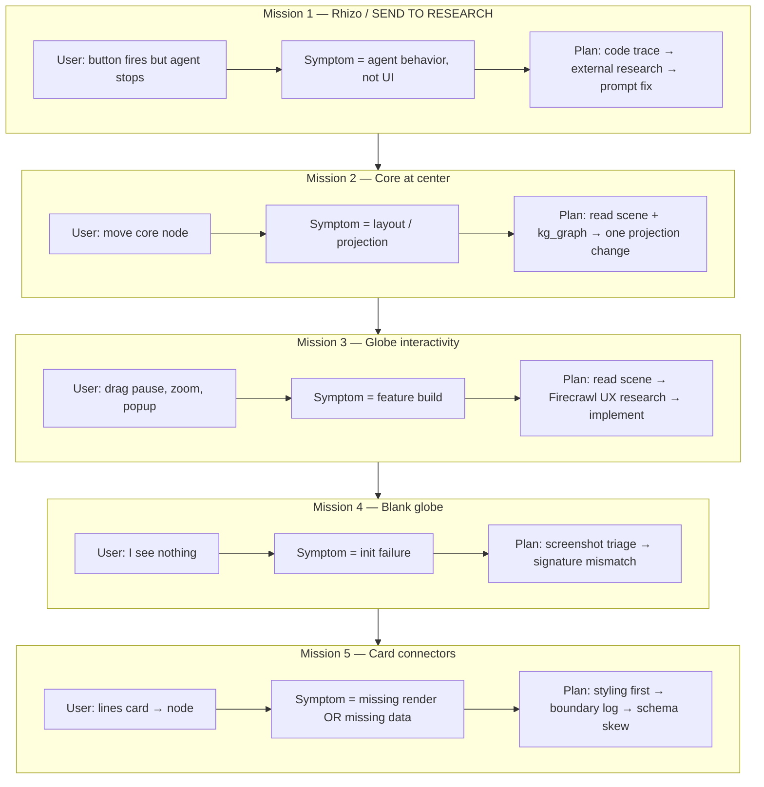

### How the agent chose *where* to look first

Every user message was classified into a **symptom bucket** before any file was opened. That bucket determined the entry point in the codebase:

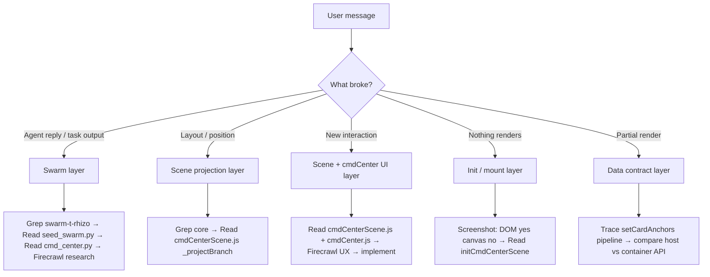

| User ask | Symptom class | First file opened | Why that file |
|----------|---------------|-------------------|---------------|
| SEND TO RESEARCH stops | **Agent logic** | `scripts/seed_swarm.py` | Button `data-id="swarm-t-rhizo"` → task definition is source of truth |
| Core at center | **Projection math** | `cmdCenterScene.js` | Globe is canvas-rendered; Python `kg_graph.py` only supplies data |
| Drag / zoom / popup | **Interaction design** | `cmdCenterScene.js` | Pointer handlers and `_draw` loop live here |
| Data visual broken | **Init crash** | `initCmdCenterScene()` in scene JS | Cards visible + no canvas = init threw before canvas append |
| Network lines | **Render + data pipe** | `_drawCardConnectors` then `_updateCardAnchors` | User wanted lines; code already had connector function |

**Rule used repeatedly:** follow the **user-visible artifact** backward to the **first code that produces it**.

- Button label → `cmdCenter.js` `_runAction` → `task_routes.py` → `seed_swarm.py` prompt
- Floating cards → `cmd_center.py` `stage_cards` → `cmdCenter.js` `_renderStageCards`
- Globe pixels → `cmdCenterScene.js` `_draw` loop
- Connector lines → `setCardAnchors` → `data-branch` on DOM → API JSON

---

## Mission 1 orchestration — Rhizo bootstrap (context)

Although not the “broken visual” incident, this established the **session's investigation pattern**: grep for ID → read source of truth → read dispatch layer → external research → minimal targeted fix.

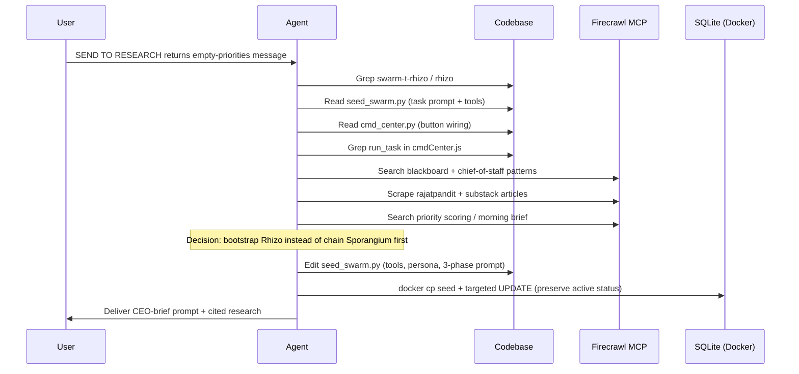

### Decision fork — three designs considered for Rhizo

| Option | Mechanism | Why rejected / chosen |
|--------|-----------|------------------------|
| **A. Chain Sporangium first** | Button runs COO plan, then Rhizo | Extra latency; two agent runs; user wanted one button |
| **B. Bootstrap in Rhizo** | Empty board → sense notes/calendar/memory → write board → research | **Chosen** — matches blackboard “degrade gracefully” research |
| **C. Pre-fill board in CMD Center API** | Python aggregates priorities before task runs | Larger backend change; duplicates agent logic |

### Tool-call reasoning (Mission 1)

| Tool | Trigger | What it proved |
|------|---------|----------------|
| `Grep` `swarm-t-rhizo` | User gave exact button `data-id` | Locates task definition without reading entire repo |
| `Read` `seed_swarm.py` | Grep hit | Prompt literally says “read blackboard” — confirms hard dependency |
| `Read` `cmd_center.py` | Need to verify button ≠ broken | Button correctly maps to `run_task` |
| `CallMcpTool` Firecrawl search ×3 | User asked to “Firecrawl the situation” | External validation of bootstrap / chief-of-staff pattern |
| `CallMcpTool` firecrawl_scrape ×2 | Search hits looked high-signal | Full text for citations in deliverable |
| `docker inspect` + `docker cp` | Host Python missing `pyotp` / deps | Code baked in image; DB on volume — update inside container |
| `StrReplace` `seed_swarm.py` | Source of truth | Host repo stays aligned for future rebuilds |

---

## Mission 3 orchestration — interactive globe (what introduced the break)

User asked for three features **plus** Firecrawl research and a plan before coding.

```mermaid
flowchart LR
    subgraph Research
        R1[Read cmdCenterScene.js — current handlers]
        R2[Read kg_graph.py — node kinds/colors]
        R3[Firecrawl: canvas zoom + drag UX]
        R4[Firecrawl: retro terminal popup CSS]
    end

    subgraph Plan
        P1[SwitchMode plan — rejected by user]
        P2[Present trade-offs: popup vs navigate]
        P3[User picks: popup-first + voice on open]
    end

    subgraph Implement
        I1[cmdCenterScene.js — zoom, drag pause, popup]
        I2[cmdCenter.js — CSS, AUTO chip, onPopupOpen wire]
        I3[7 sequential StrReplace batches]
    end

    Research --> Plan --> Implement
```

### Design decisions locked before coding

| Decision | Options | Choice | Rationale |
|----------|---------|--------|-----------|
| Auto-spin after drag | Resume immediately vs stay paused | **Stay paused** | User: “explore their data” — resume-on-release defeats exploration |
| Zoom anchor | Zoom-to-cursor vs center | **Center** | Globe is radial; center zoom keeps hub stable |
| Click behavior | Navigate vs popup vs both | **Popup first** for data nodes; branch nodes keep navigate | User confirmed; branch markers are navigation affordances |
| Voice | Silent vs speak on open | **Speak summary** | User confirmed; uses existing `voiceRealtime.speakText` |
| Scene API | New exports vs extend init options | **`onPopupOpen` callback** | Mirrors existing `onNodeClick` pattern |

### Implementation map (files × concern)

```
┌─────────────────────────────────────────────────────────────────┐
│  cmdCenter.js                    cmdCenterScene.js            │
├─────────────────────────────────────────────────────────────────┤
│  CSS: .cmd-scene-popup           State: _viewScale, _popup    │
│  CSS: .cmd-scene-auto            _autoSpin pause on drag move │
│  Markup: ⟳ AUTO chip             wheel → zoom                 │
│  _mountScene({ onPopupOpen })    dblclick → reset zoom+spin   │
│  _speakNodeSummary()             _showPopup / _hidePopup     │
│  _wireAutoToggle()               POPUP_KINDS click routing     │
└─────────────────────────────────────────────────────────────────┘
                              │
                              ▼
                    initCmdCenterScene()  ←── BUG: missing onPopupOpen param
```

**This implementation batch is what caused Mission 4.** The body referenced `onPopupOpen` but the destructuring list did not — a contract mismatch introduced during rapid multi-edit implementation.

---

## Mission 4 orchestration — blank globe triage funnel

When the user reported “I see nothing,” the agent used a **failure-mode classifier** before touching code:

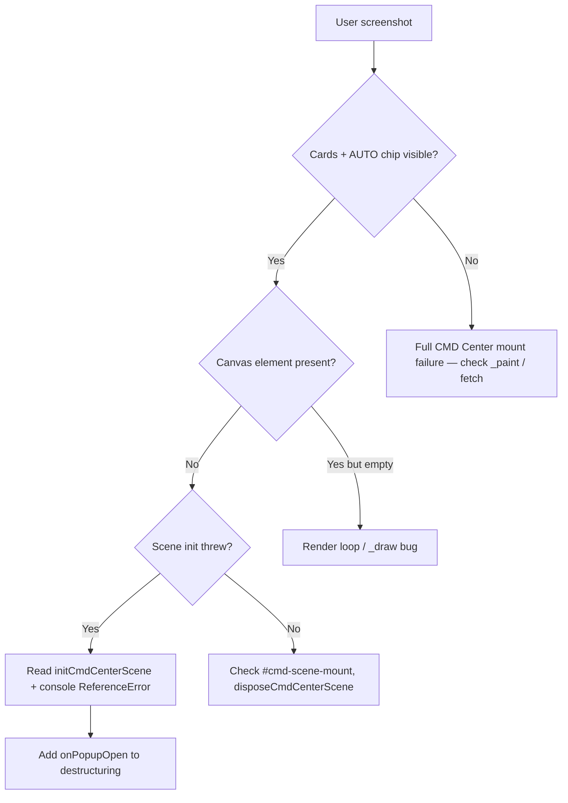

### Why certain hypotheses were deprioritized

| Hypothesis | Triage signal | Verdict |
|------------|---------------|---------|
| Zoom math broke `_draw` | Would throw **inside** animation frame; stars might flash first | Unlikely — total absence of canvas |
| Core-at-center broke graph | Only affects branch position | Unlikely — init fails before first draw |
| Stale static mount | `curl` served file has new code | Ruled out |
| CSP blocked canvas | CSP blocks fonts, not canvas API | Ruled out |
| **`onPopupOpen` ReferenceError** | Init assigns undeclared binding; matches “cards yes, canvas no” | **Confirmed** |

### Investigation sequence (Mission 4)

```
1. OBSERVE  → screenshot: DOM cards + AUTO chip, no globe
2. CLASSIFY → init-time failure (not render-time)
3. SEARCH   → Grep "onPopupOpen" across static/js/
4. COMPARE  → caller passes onPopupOpen │ init signature lacks it │ body assigns it
5. FIX      → one-line destructuring addition
6. VERIFY   → browser reload → CMD Center → screenshot + console
```

---

## Mission 5 orchestration — connector lines (two-pass debug)

User request sounded like a **rendering** problem. The agent ran a **two-pass** strategy: fix visibility first, then fix data.

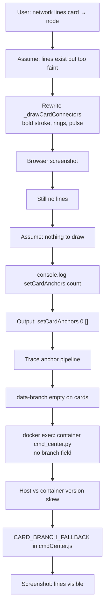

### Anchor pipeline — where to look at each step

```mermaid
flowchart LR
    subgraph Backend
        PY["cmd_center.py<br/>stage_cards[].branch"]
    end

    subgraph Frontend DOM
        R["_renderStageCards()<br/>data-branch attr"]
        U["_updateCardAnchors()<br/>edge point math"]
    end

    subgraph Scene
        S["setCardAnchors()"]
        D["_drawCardConnectors()"]
    end

    PY -->|JSON API| R
    R --> U
    U --> S
    S --> D

    style PY fill:#331111
    style R fill:#331111
    style U fill:#331111
```

**Break was at the first arrow** when container backend omitted `branch`. Every downstream step “worked” with empty input.

### Decision: fix frontend vs rebuild Docker

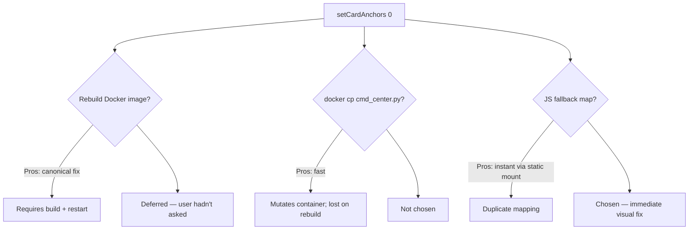

---

## Tool selection matrix — when each tool was chosen

| Tool | Use when | Used in this session for |
|------|----------|--------------------------|
| **Grep** | Known string/id (`swarm-t-rhizo`, `onPopupOpen`, `setCardAnchors`) | Fast needle search across repo |
| **Read** | Need full function/context after Grep hit | Init signature, anchor math, docker-compose mounts |
| **SemanticSearch** | *Not used* — user rules prefer Grep for renames/refs; IDs were known | — |
| **Glob** | Find files by name pattern | Locate `cmdCenterScene.js` |
| **StrReplace** | Minimal targeted edits | All JS/Python fixes |
| **Shell** | Verify syntax, inspect container, curl served assets | `node --check`, `docker exec`, `docker inspect` |
| **Firecrawl MCP** | User explicitly asked for external UX/architecture research | Rhizo patterns, globe interaction precedents |
| **SwitchMode plan** | Multi-trade-off feature before code | Offered for globe interactions; user skipped |
| **Browser MCP** | Visual confirmation required | Screenshots, console errors, CMD Center navigation |
| **Task/explore subagent** | *Not used* — scope was 2–3 files per incident | — |

### Parallel vs sequential tool calls

| Pattern | Example | Why |
|---------|---------|-----|
| **Parallel Grep** | `swarm-t-rhizo` + `run_task` same turn | Independent searches, same investigation phase |
| **Parallel Read + Grep** | `cmd_center.py` + `run_task` in cmdCenter.js | Dispatch path has two halves |
| **Parallel Firecrawl** | Zoom UX search + terminal popup search | Independent research threads |
| **Sequential debug** | Style fix → screenshot → log → docker exec | Each step informed the next hypothesis |
| **Never parallel** | `docker cp` + host DB write | Avoid SQLite lock conflicts |

---

## Codebase map — visual layers the agent navigated

```
                    ┌──────────────────────────────────────┐
                    │           USER INTERFACE             │
                    │  cmdCenter.js  │  cmdCenterScene.js   │
                    │  (DOM, cards,  │  (canvas globe,     │
                    │   commands)    │   connectors)       │
                    └───────┬────────────────┬─────────────┘
                            │                │
              /api/home/cmd-center          initCmdCenterScene()
                            │                │
                    ┌───────▼────────────────▼─────────────┐
                    │         BACKEND (Python)              │
                    │  cmd_center.py  │  kg_graph.py        │
                    │  stage_cards    │  globe_graph nodes  │
                    └───────┬──────────────────────────────┘
                            │
                    ┌───────▼────────┐
                    │  SWARM / TASKS │
                    │  seed_swarm.py │
                    │  SQLite tasks  │
                    └────────────────┘

    Bind-mounted (live):  ./static  ──────────────────────► JS fixes apply on refresh
    Baked in image:      services/, scripts/  ───────────► needs docker compose build
    Bind-mounted (live):  ./data/app.db  ─────────────────► task DB updates persist
```

---

## Reasoning patterns worth reusing

1. **Screenshot-first classification** — Partial DOM (cards without canvas) narrows to init vs render immediately.
2. **Follow the ID** — User-provided `data-id="swarm-t-rhizo"` and card labels (`MORNING REPORT`) become grep anchors.
3. **Contract triangle** — For callbacks (`onPopupOpen`): check **caller**, **signature**, and **assignment** together.
4. **Boundary logging** — One log at `setCardAnchors` distinguished “draw code broken” from “empty input.”
5. **Host vs container diff** — When frontend looks correct but runtime data wrong, inspect **what the container actually runs** (`docker exec cat …`).
6. **Research before prompt rewrites** — Firecrawl validated bootstrap pattern before editing Rhizo persona (reduces guesswork on agent design).
7. **Minimal blast radius** — Targeted DB update vs full `seed_swarm.py` re-run (which would pause all tasks).

---

## Timeline

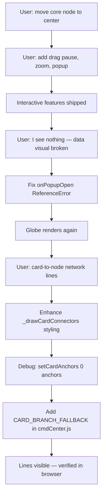

### Phase 0 — Context (before the break)

Prior work in the same session (not the break itself):

1. **Rhizo / SEND TO RESEARCH** — swarm task bootstrapping when blackboard empty (`scripts/seed_swarm.py`, DB update in container).
2. **Core node at globe center** — `_projectBranch()` special-cases `branch.id === 'core'` to `{ x: _cx, y: _cy }`.
3. **Interactive globe features** — drag pauses auto-spin, scroll zoom (`_viewScale`), retro terminal popup on data-node click, voice narration via `onPopupOpen`, `⟳ AUTO` toggle chip.

The break was introduced during **Phase 3** implementation, not during core-center or Rhizo work.

---

## Incident 1 — “I see nothing the data visual is broken”

### Symptom

User screenshot showed:

- CMD Center shell, rails, and floating cards (Morning Report, Agent Relay, etc.) **present**
- `⟳ AUTO` chip visible (added in the same feature batch)
- **No canvas globe** — empty dark stage where the point-cloud sphere should be

This pattern means: **DOM mounted, scene init failed before or during canvas creation.**

### What was *not* the cause (hypotheses considered)

During triage, these were considered and ruled out or secondary:

| Hypothesis | Why considered | Outcome |
|------------|----------------|---------|
| `_viewScale` breaking projection math | New zoom code touched `_projectNode` | Globe would partially render or throw in `_draw`, not fail at init |
| Core-at-center breaking spokes/connectors | Special-cased `core` projection | Affects layout, not init |
| `_dismissBinding` document listener | New global pointer listener | Runs after init; wouldn't prevent canvas append |
| CSP / font load failure | Console showed Google Fonts CSP warning | Cosmetic; doesn't block canvas |
| Docker static mount stale | `static/` is bind-mounted | Served file contained new code (`curl` verified) |

### Actual root cause

**Incomplete API wiring in `initCmdCenterScene`.**

The interactive popup feature added:

1. State: `let _onPopupOpen = null`
2. Assignment in init: `_onPopupOpen = onPopupOpen || null`
3. Call site in `_showPopup`: `_onPopupOpen?.(node)`
4. Caller in `cmdCenter.js`: `onPopupOpen: (node) => _speakNodeSummary(node)`

But the **function signature was never updated** to destructure `onPopupOpen`:

```javascript
// BROKEN — onPopupOpen used but not declared in parameters
export function initCmdCenterScene(mountEl, { branchHealth, inProgress = 0, globeGraph, onNodeClick } = {}) {
  // ...
  _onPopupOpen = onPopupOpen || null;  // ReferenceError: onPopupOpen is not defined
```

In JavaScript, referencing an undeclared binding in strict mode (ES modules are strict) throws **`ReferenceError`** at assignment time — before `_canvas` is created or `_frame = requestAnimationFrame(_draw)` runs.

### Debugging path

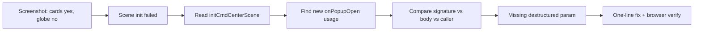

| Step | Tool / action | Reasoning |
|------|---------------|-----------|
| 1 | User screenshot | Cards without canvas ⇒ init abort, not render-loop bug |
| 2 | `Read` `cmdCenterScene.js` init + recent edits | Trace new popup/zoom/auto-spin code paths |
| 3 | `Grep` `onPopupOpen` across `static/js/` | Find declaration vs usage mismatch |
| 4 | `StrReplace` add `onPopupOpen` to destructuring | Minimal fix matching existing `onNodeClick` pattern |
| 5 | `browser_navigate` + open CMD Center + screenshot | Confirm globe returns |
| 6 | `browser_console_messages` | Confirm `ReferenceError` gone (stale entries may remain from prior loads) |

### Fix applied

```826:837:static/js/cmdCenterScene.js
export function initCmdCenterScene(mountEl, { branchHealth, inProgress = 0, globeGraph, onNodeClick, onPopupOpen } = {}) {
  disposeCmdCenterScene();
  if (!mountEl) return false;
  // ...
  _onPopupOpen = onPopupOpen || null;
```

### Verification

- Globe point cloud, halo, and branch nodes visible again
- `⟳ AUTO` chip coexists with canvas (expected — both are intentional UI)
- Console: no new `onPopupOpen` errors after hard reload

---

## Incident 2 — Card-to-node network lines missing

### Symptom

After the globe was restored, user requested (with annotated screenshot):

> Each major point must connect with the information card upfront and readable — make a network line showing the connection.

Floating cards were visible; **no lines** from cards to globe nodes (user drew red annotation lines showing desired behavior).

### Architecture (how connectors are supposed to work)

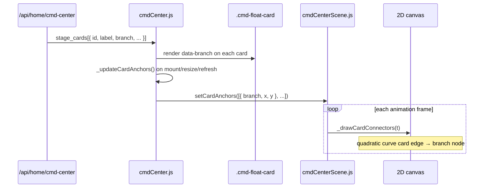

**Key contracts:**

1. Each stage card must carry a **branch id** (`agency`, `relay`, `prod`, `core`, …) matching `BRANCH_SPHERE` keys in `cmdCenterScene.js`.
2. `_updateCardAnchors()` reads `card.dataset.branch`; if empty, card is **skipped**.
3. `setCardAnchors()` filters `anchors.filter(a => a && a.branch)` — empty branch ⇒ no anchors.
4. `_drawCardConnectors()` early-returns if `!_cardAnchors.length`.

### Debugging path — first assumption (styling only)

Initial work assumed connectors existed but were **too subtle**:

- Old code used `_drawArc(a, b, 0.5, '166,226,46')` (~0.1 alpha effective)
- Back-hemisphere branches hit `if (bp.z < -0.1) continue` — line **vanished** entirely

**Decision:** Redesign `_drawCardConnectors` for readability:

- 1.5px stroke, ~0.6 alpha (0.22 when behind)
- Glow via `shadowBlur`
- Endpoint dot at card edge
- Target ring at branch node
- Travelling pulse along quadratic bezier

**Tool calls:** `StrReplace` on `_drawCardConnectors`, `node --check`, browser screenshot.

**Result:** Still no visible lines → styling wasn't the primary blocker.

### Debugging path — second assumption (anchors empty)

Added temporary debug log:

```javascript
console.log('[scene] setCardAnchors', _cardAnchors.length, JSON.stringify(_cardAnchors));
```

**Observed:** `setCardAnchors 0 []`

| Step | Tool / action | Finding |
|------|---------------|---------|
| Inspect `_updateCardAnchors` | `Read` `cmdCenter.js` | Requires `data-branch` on cards |
| Inspect `_renderStageCards` | `Read` `cmdCenter.js` | Sets `data-branch="${c.branch \|\| ''}"` |
| Inspect API payload | `docker exec` read `/app/services/home/cmd_center.py` | Container `stage_cards` **have no `branch` key** |
| Compare host vs container | `Read` host `cmd_center.py` | Host **has** `"branch": "agency"` etc. |
| Check `docker-compose.yml` | `Read` | Only `./static` bind-mounted; Python baked into image |

**Root cause:** Frontend/backend **version skew**.

- Host workspace: newer `cmd_center.py` with `branch` on each stage card.
- Running container: older image without that field.
- Cards render with `data-branch=""` → anchor collector skips all → zero connectors.

### Fix applied — frontend fallback (no rebuild required)

```466:478:static/js/cmdCenter.js
/** Older backends omit stage_cards[].branch — fall back by card id so the
 * globe connector lines always know which node each card belongs to. */
const CARD_BRANCH_FALLBACK = {
  morning_report: 'agency',
  agent_relay: 'relay',
  plan_today: 'prod',
  metrics_pull: 'core',
  up_next: 'comms',
};

function _cardBranch(c) {
  return c.branch || CARD_BRANCH_FALLBACK[c.id] || '';
}
```

Applied in:

- `_renderStageCards()` — initial paint
- `_updateStageCardsInPlace()` — soft refresh without full re-render

**Decision rationale:**

| Option | Pros | Cons | Chosen? |
|--------|------|------|---------|
| Rebuild Docker image | Backend sends `branch` natively | Requires build + restart; user hadn't asked yet | Deferred |
| `docker cp` updated `cmd_center.py` + restart | Fast backend fix | Lost on next rebuild; mutates container | No |
| **JS fallback by card `id`** | Works immediately via bind mount; stable across backend versions | Duplicate mapping logic | **Yes** |

### Connector rendering (final `_drawCardConnectors` behavior)

```344:404:static/js/cmdCenterScene.js
function _drawCardConnectors(t) {
  if (!_cardAnchors.length) return;
  for (const anchor of _cardAnchors) {
    const branch = _branches[anchor.branch];
    if (!branch) continue;
    const bp = _projectBranch(branch, t);
    const behind = bp.z < -0.1;
    const lineAlpha = behind ? 0.22 : 0.6;
    // ... quadratic curve, endpoint dot, target ring, travelling pulse
  }
}
```

**Card → branch mapping (current):**

| Card id | Label | Branch node | Globe region |
|---------|-------|-------------|--------------|
| `morning_report` | Morning Report | `agency` | Lower-front hemisphere |
| `agent_relay` | Agent Relay | `relay` | Red busy node, upper-right |
| `plan_today` | Plan Today | `prod` | Production branch |
| `metrics_pull` | Vault Sync | `core` | **Center hub** (special projection) |
| `up_next` | Up Next | `comms` | Communications branch |

### Verification

- Browser screenshot: lines from all four corner cards to nodes
- Agent Relay → red relay node with target ring
- Vault Sync → core center node
- `node --check` on both JS files passes
- Served JS contains new connector code (`curl` + `rg "Target ring"`)

---

## Incident 3 — Popup vs navigation confusion (not a break, but relevant)

While testing “click red node for popup,” clicks opened **Agent Bin** instead of the retro terminal popup.

**Finding:** User was clicking the **relay branch node** (large red branch marker), not a **data node**.

| Entity | Has `kind` in `POPUP_KINDS`? | Has `action`? | Click behavior |
|--------|------------------------------|---------------|----------------|
| Data node (`urgent`, `agent`, …) | Often yes | Sometimes | Popup if kind matches |
| Branch node (`relay`, …) | No | `agent_bin` | Direct navigation |

`POPUP_KINDS = ['project', 'agent', 'urgent', 'scheduled']` — backend `kg_graph.py` also emits kinds like `handoff`, `job`, `note`, `task` which **do not** open popups today. Documented as follow-up, not part of the “blank globe” break.

---

## Tool-call inventory (debugging session)

| Tool | Role in this fix |
|------|------------------|
| **Read** | Inspect `initCmdCenterScene`, `_drawCardConnectors`, `_updateCardAnchors`, `docker-compose.yml` |
| **Grep** | Find `onPopupOpen`, `setCardAnchors`, `stage_cards`, card CSS |
| **StrReplace** | Apply signature fix, connector styling, `CARD_BRANCH_FALLBACK` |
| **Shell** | `node --check`, `curl` served JS, `docker exec` inspect container `cmd_center.py` |
| **browser_navigate / click / screenshot** | Visual regression checks on CMD Center |
| **browser_console_messages** | Capture `ReferenceError`, confirm anchor debug output |
| **CallMcpTool (cursor-ide-browser)** | End-to-end UI verification |

---

## Files changed (cumulative)

### `static/js/cmdCenterScene.js`

| Change | Purpose |
|--------|---------|
| Core at center in `_projectBranch` | User request — hub visualization |
| `_viewScale`, wheel, dblclick handlers | Zoom + reset |
| `_autoSpin` pause on drag | Explore without spin |
| Popup DOM + `_showPopup` / `_hidePopup` | Terminal-style detail card |
| `POPUP_KINDS`, `_popupHeader` | Popup content routing |
| **`onPopupOpen` in init signature** | **Fix blank globe** |
| `_drawCardConnectors` rewrite | Readable network lines |
| `setCardAnchors` export | Anchor API for cards |
| `isCmdCenterSceneAutoSpin` / `toggleCmdCenterSceneAutoSpin` | AUTO chip |

### `static/js/cmdCenter.js`

| Change | Purpose |
|--------|---------|
| Popup + AUTO chip CSS/markup | UI for new interactions |
| `onPopupOpen` → `_speakNodeSummary` | Voice reads node summary |
| `_wireAutoToggle` | AUTO chip behavior |
| **`CARD_BRANCH_FALLBACK` + `_cardBranch`** | **Fix empty anchors / missing lines** |
| `_updateCardAnchors` + ResizeObserver | Track card positions for connectors |

### `services/home/cmd_center.py` (host only — not in running container)

| Change | Purpose |
|--------|---------|
| `stage_cards[].branch` fields | Native backend→frontend branch wiring |
| `_build_up_next_card` | Fifth floating card |

---

## Deployment model (why fixes behaved differently)

From `docker-compose.yml`:

```yaml
volumes:
  - ./static:/app/static:z   # LIVE — JS/CSS changes apply on refresh
  # Python services NOT bind-mounted — baked into image at build time
```

| Layer | Update mechanism | Rebuild needed? |
|-------|------------------|-----------------|
| Frontend JS | Bind mount | No — hard refresh |
| Python backend | Image rebuild | **Yes** — `docker compose build odysseus && docker compose up -d odysseus` |

This explains why:

- `onPopupOpen` fix worked immediately
- `CARD_BRANCH_FALLBACK` worked immediately
- Host `cmd_center.py` `branch` fields had **no effect** until rebuild

---

## Current state

| Component | Status |
|-----------|--------|
| Globe canvas | Working |
| Core node at center | Working |
| Drag / zoom / AUTO spin | Working |
| Floating stage cards | Working |
| Card→node connector lines | Working (via JS fallback) |
| Retro popup on data-node click | Partial — kind mismatch with backend (`handoff`, `job`, etc.) |
| Backend `stage_cards.branch` | Present on host; **not** in running container until rebuild |
| Docker image rebuild | **Not done** as of this document |

---

## Recommended follow-ups

1. **Rebuild container** when convenient so backend sends `branch` natively and `CARD_BRANCH_FALLBACK` becomes redundant safety net:

   ```powershell
   cd c:\Users\tylar\code\odysseus
   docker compose build odysseus
   docker compose up -d odysseus
   ```

2. **Align `POPUP_KINDS`** with `kg_graph.py` node kinds (`handoff`, `job`, `note`, `task`) so “big colored data points” open the terminal popup instead of navigating or doing nothing.

3. **Add a smoke test** — e.g. `node --check` in CI plus a minimal test that `initCmdCenterScene` accepts `{ onPopupOpen: () => {} }` without throwing.

4. **Consider bind-mounting `services/` in dev** (optional) to reduce frontend/backend skew during V.A.U.L.T. iteration.

---

## Lessons learned

1. **When DOM partial-renders (cards yes, canvas no), suspect init-time exceptions** — not the animation loop.
2. **Destructuring must match caller contracts** — adding `_onPopupOpen = onPopupOpen` without a parameter is a silent time bomb until the path is exercised.
3. **Verify data contracts end-to-end** — connector code was correct; empty anchors came from API/schema drift between host and container.
4. **Temporary `console.log` at system boundaries** (`setCardAnchors`) quickly distinguishes “not drawing” vs “nothing to draw.”
5. **Bind mounts create two speeds of truth** — JS can be fixed live; Python cannot without rebuild.

---

## Quick reference — error signatures

```
Uncaught ReferenceError: onPopupOpen is not defined
  at initCmdCenterScene (cmdCenterScene.js:~810)
```
→ Add `onPopupOpen` to `initCmdCenterScene` parameter destructuring.

```
[scene] setCardAnchors 0 []
```
→ Cards missing `data-branch`; check API `stage_cards[].branch` or enable `CARD_BRANCH_FALLBACK`.

---

*Generated from the Jul 6, 2026 CMD Center / Fable interactive globe session.*
