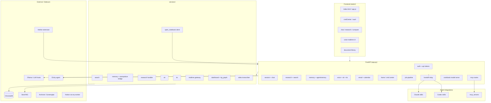

# Graphy — Odysseus Codebase Analysis

> Generated: 2026-07-13 · AI-friendly structural overview of `odysseus`
> Scanned excluding: `.git`, `node_modules`, `.venv`, `venv`, `__pycache__`, `.pytest_cache`, `data`, `logs`, `tiles`

---

## Summary

| Metric | Count |
|--------|------:|
| **Total files** | 1,427 |
| **Total directories** | 119 |
| **Python modules** | 931 |
| **JavaScript files** | 216 |
| **Markdown docs** | 117 |
| **Route modules** | 60 |
| **Service modules** | 44 |

**Stack:** FastAPI + Uvicorn (Python) · Vanilla JS frontend (`static/`) · SQLite + ChromaDB · Docker Compose · MCP servers

**Entry point:** `app.py` — FastAPI orchestrator mounting 50+ routers and `/static`

---

## Extension Breakdown

| Extension | Files | Role |
|-----------|------:|------|
| `.py` | 931 | Backend, services, routes, tests, scripts |
| `.js` | 216 | Frontend UI (`static/js/`) |
| `.md` | 117 | Docs, handoffs, session reviews, prompts |
| `.json` | 19 | Config, manifests, package locks |
| `.jsx` | 18 | Aether Chrome extension (React) |
| `.html` | 13 | Static pages, reports, session mind-graphs |
| `.ps1` / `.sh` | 19 | Deploy & ops scripts |
| `.yml` / `.yaml` | 8 | Docker Compose, SearXNG, PixelRAG |
| `.css` | 5 | Global styles + Aether popup |
| `.ts` | 2 | `my-worker` Notion sync worker |

---

## Top-Level File Distribution

| Directory | Files | Purpose |
|-----------|------:|---------|
| `tests/` | 607 | pytest suite (largest footprint) |
| `static/` | 204 | Frontend assets (JS, CSS, fonts, lib) |
| `src/` | 127 | Core app logic, agents, pipelines |
| `Aether/` | 87 | Chrome extension for transcription |
| `scripts/` | 67 | Ops, migrations, probes, pipelines |
| `routes/` | 61 | FastAPI route modules |
| `services/` | 60 | Business logic layer |
| `docs/` | 41 | Specs, handoffs, research briefs |
| `integrations/` | 12 | Claude/Codex skill packs + API scripts |
| `mcp_servers/` | 5 | MCP tool servers (email, RAG, memory, image) |
| `my-worker/` | 8 | TypeScript Notion workers scaffold |
| `atlas_framework/` | 10 | Memory framework (embed, hybrid search) |
| `deploy/` | 5 | Local service launch scripts |

---

## Directory Tree (depth 2)

```
odysseus/
├── Aether/                    # Chrome extension — tab/audio transcription
│   ├── backend/               # Modal Whisper server
│   ├── src/                   # React popup (Record, Transcribe, History)
│   └── popup/, public/, icons/
├── atlas_framework/
│   └── atlas_framework/memory/  # embed, hybrid_search, semantic_search
├── clicky/                    # Clicky agent config
├── clicky_integration/        # Odysseus ↔ Clicky bridge
├── companion/                 # Device pairing routes
├── config/searxng/            # Self-hosted search settings
├── core/                      # Auth, DB, constants, middleware
├── deploy/scripts/            # start-archivist, start-clicky, screenpipe, pixelrag
├── docker/                    # entrypoint, GPU overlays, open-notebook
├── docs/                      # PRDs, handoffs, build specs, transcripts
├── integrations/
│   ├── claude/skills/         # odysseus, handoff, problem-statement
│   └── codex/skills/          # Same skill packs for Codex
├── mcp_servers/               # email, image_gen, memory, rag
├── my-worker/                 # Notion sync worker (TypeScript)
├── prompts/                   # Executive brief, morning brief templates
├── research-orch/             # Multi-leg research swarm outputs
├── routes/                    # 60 FastAPI route modules (see map below)
├── scripts/                   # Migrations, probes, pipelines, system map gen
├── services/                  # Domain services (see map below)
├── session-review-*/          # Cursor session audit artifacts
├── src/                       # Agent loop, job pipeline, embeddings, caldav
├── static/
│   ├── js/                    # 104 root + 53 editor + feature subdirs
│   ├── lib/                   # highlight, mammoth, three.js, fuse
│   └── index.html, style.css, app.js
├── tests/                     # pytest + streaming invariant tests
├── tools/                     # Agent memory, embed worker, clicky API
├── app.py                     # ★ Main FastAPI entry
├── docker-compose.yml         # odysseus + chromadb + searxng stack
└── requirements.txt
```

---

## Architecture Map



---

## Route Modules (60)

Grouped by domain — all mounted from `app.py`:

| Domain | Routes |
|--------|--------|
| **Auth & admin** | `auth_routes`, `api_token_routes`, `admin_wipe_routes`, `backup_routes` |
| **Chat & sessions** | `chat_routes`, `session_routes`, `history_routes`, `compare_routes`, `copilot_routes` |
| **Memory & skills** | `memory_routes`, `agentmemory_routes`, `skills_routes`, `embedding_routes` |
| **Research & search** | `research_routes`, `search_routes`, `transcribe_routes` |
| **Voice & audio** | `voice_routes`, `stt_routes`, `stt_stream_routes`, `tts_routes` |
| **Documents** | `document_routes`, `gallery_routes`, `editor_draft_routes`, `signature_routes` |
| **Email & calendar** | `email_routes`, `calendar_routes`, `contacts_routes` |
| **Home / VAULT** | `home_routes`, `vault_routes` |
| **Jobs & tasks** | `job_routes`, `task_routes`, `assistant_routes`, `note_routes` |
| **Integrations** | `clicky_routes`, `handoff_relay_routes`, `codex_routes`, `claude_routes`, `mcp_routes`, `webhook_routes` |
| **Models & infra** | `model_routes`, `cookbook_routes`, `hwfit_routes`, `shell_routes`, `diagnostics_routes` |
| **Personalization** | `preset_routes`, `prefs_routes`, `font_routes`, `emoji_routes`, `formflow_routes`, `prompt_routes` |
| **Other** | `upload_routes`, `cleanup_routes`, `personal_routes`, `companion_routes`, `chatgpt_subscription_routes` |

---

## Service Modules (44)

| Package | Modules | Responsibility |
|---------|---------|----------------|
| `services/search/` | core, providers, ranking, cache, analytics | Web search orchestration (Brave, Tavily, Serper, SearXNG) |
| `services/memory/` | memory, memory_vector, skill_extractor, skills | Semantic memory, skill import/extract |
| `services/research/` | research_handler, hero_image, audio_brief | Deep research pipeline + report assets |
| `services/voice/` | realtime_gateway, mic_lease, vault_brief, voice_tools | Realtime voice agent gateway |
| `services/stt/` | stt_service | Speech-to-text |
| `services/tts/` | tts_service | Text-to-speech (Voice.ai, etc.) |
| `services/home/` | cmd_center, dashboard, kg_graph | V.A.U.L.T. command center + knowledge globe |
| `services/transcribe/` | video_transcriber | YouTube/video transcription |
| `services/mempalace/` | bridge | MemPalace knowledge graph bridge |
| `services/open_notebook/` | client | Audio briefs for doc library "Listen" |
| `services/hwfit/` | fit, hardware, profiles, image_models | Hardware fit / image model discovery |
| `services/documents/` | audio_brief | Document audio brief generation |
| `services/docs/` | service | Docs service layer |
| `services/shell/` | service | Shell command execution |
| `services/youtube/` | youtube_handler | YouTube transcript fetch |
| `services/clicky_launcher.py` | — | Clicky process launcher |

---

## Frontend JS Layout (`static/js/`)

| Area | Files | Notes |
|------|------:|-------|
| `(root)` | 104 | Main app modules: chat, research, calendar, admin, voice |
| `editor/` | 53 | Rich text / document editor subsystem |
| `compare/` | 10 | Model comparison UI |
| `emailLibrary/` | 5 | Email library browser |
| `calendar/` | 2 | Calendar views |
| `research/` | 2 | Research output rendering |
| `color/`, `markdown/`, `model/`, `util/` | 1 each | Utilities |

Key static entry files: `static/index.html`, `static/app.js`, `static/style.css` (~29K lines CSS)

---

## `src/` Core Logic (127 files)

Notable packages beyond thin route handlers:

| Path | Purpose |
|------|---------|
| `src/agent_loop.py`, `agent_runs.py` | Agent execution loop |
| `src/job_pipeline/` | Job application pipeline (ingest, dedupe, brief, apply queue) |
| `src/agent_tools/` | Filesystem, subprocess, web tools for agents |
| `src/embeddings.py` | FastEmbed / embedding config |
| `src/caldav_sync.py` | CalDAV calendar sync |
| `src/api_key_manager.py` | Encrypted API key storage |
| `src/visual_report.py` | Research HTML report renderer |

---

## Docker Stack (`docker-compose.yml`)

| Service | Role |
|---------|------|
| `odysseus` | Main app (:7000), mounts `data/`, `static/`, HF cache, gog OAuth |
| `chromadb` | Vector store for RAG + semantic memory |
| `searxng` | Self-hosted meta-search |
| `open-notebook` | Optional audio brief sidecar (`docker/open-notebook.yml`) |

GPU overlays: `docker-compose.gpu-amd.yml`, `docker-compose.gpu-nvidia.yml`

---

## MCP & Agent Integrations

**MCP servers** (`mcp_servers/`):
- `email_server.py` — Gmail/email tools
- `memory_server.py` — Agent memory recall/save
- `rag_server.py` — Document RAG
- `image_gen_server.py` — Image generation

**Skill packs** (`integrations/claude/`, `integrations/codex/`):
- `odysseus` — Scoped Odysseus API client
- `handoff` — Cross-agent handoff relay
- `problem-statement` — Concise problem statements

**Handoff relay:** `routes/handoff_relay_routes.py` + `scripts/handoff-relay-watcher.ps1`

---

## Ops & Scripts (high-signal)

| Script | Purpose |
|--------|---------|
| `deploy/scripts/start-archivist.ps1` | Launch Archivist sidecar |
| `deploy/scripts/start-clicky.ps1` | Launch Clicky agent |
| `deploy/scripts/start-screenpipe.ps1` | Launch Screenpipe capture |
| `scripts/generate_system_map_excalidraw.py` | Agentic OS Excalidraw map |
| `scripts/migrate_memory_json_to_sqlite.py` | Memory store migration |
| `scripts/load_test_voice_gateway.py` | Voice gateway load test |
| `scripts/run_job_pipeline_once.py` | One-shot job pipeline |

---

## Related Artifacts

| File | Description |
|------|-------------|
| `docs/odysseus-system-map.excalidraw` | Visual agentic OS map |
| `docs/odysseus-data-dictionary.md` | Data model reference |
| `docs/vault-cmd-center-prd.md` | V.A.U.L.T. command center PRD |
| `session-review-*/mind-graph.html` | Cursor session relationship graphs |
| `odysseus-handoff.md` | Cross-session handoff context |

---

## Quick Orientation for Agents

1. **Start here:** `app.py` → grep `include_router` for the full API surface
2. **Add an endpoint:** `routes/<feature>_routes.py` + wire in `app.py`
3. **Business logic:** `services/<domain>/` — keep routes thin
4. **Frontend feature:** `static/js/<feature>.js` + register in `static/app.js` or `index.html`
5. **Agent tool:** `mcp_servers/` or `integrations/*/skills/`
6. **Run locally:** `docker compose up` or `uvicorn app:app --port 7000`
7. **Tests:** `pytest tests/` (607 test files)

---

*Graphy report — structural summary for AI context and repo orientation.*
