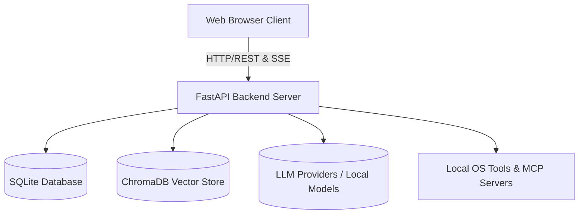
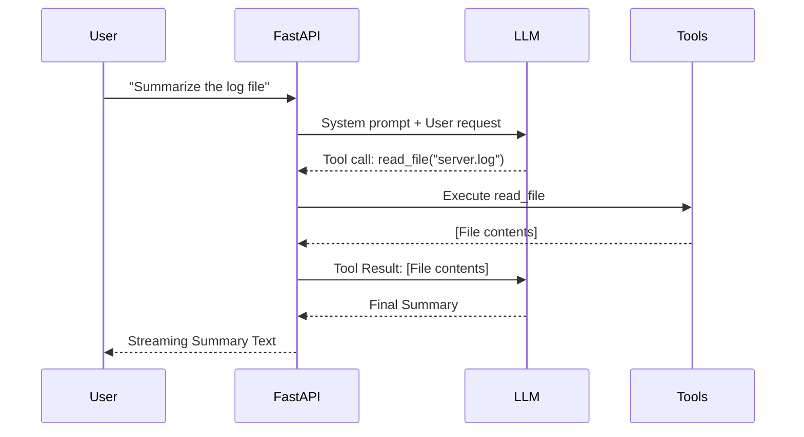

# Odysseus Architecture Report

Odysseus is a self-hosted AI workspace. It is designed to be local-first and privacy-focused, offering features typically seen in platforms like ChatGPT or Claude, but fully controlled by the user.

This document serves as a comprehensive overview of the system's architecture, including its backend orchestration, frontend structure, deployment models, and core algorithms. It is intended for new contributors, system administrators, and anyone interested in understanding the inner workings of Odysseus.

---

## 1. System Overview

At a high level, Odysseus is a client-server web application with an embedded background task runner. The backend is built in Python using **FastAPI**, while the frontend is a **Vanilla JavaScript** single-page application (SPA).

### Core Responsibilities
- **Frontend (Vanilla JS):** Manages user interactions, chat rendering, file attachments, state management, and real-time streaming updates.
- **Backend (FastAPI):** Orchestrates API routes, manages the database, executes agent loops and system tools, and interfaces with LLM providers or local models.
- **Cookbook & Hardware Fitness:** Analyzes the host's hardware (RAM, VRAM, GPU bandwidth) to recommend and manage local LLM serving (via `vLLM` or `llama.cpp`).
- **Memory & Storage:** Stores conversations, preferences, and calendars in SQLite, and maintains persistent semantic memory using ChromaDB.

---

## 2. Backend Architecture

The backend is built around a slim orchestrator (`app.py`), which glues together several sub-modules. It uses **FastAPI** for route handling and **SQLAlchemy** for database interactions.

### Directory Structure
- **`app.py`**: The FastAPI entry point.
- **`core/`**: Database configuration (`database.py`), middleware, and constants.
- **`src/`**: The core logic engine. Contains the agent loop (`agent_loop.py`), tool execution logic (`agent_tools.py`), LLM interactions (`llm_core.py`), and more.
- **`routes/`**: FastAPI router definitions, separated by feature (e.g., `chat_routes.py`, `document_routes.py`, `memory_routes.py`).
- **`services/`**: Sub-services for specialized tasks like hardware fitness scoring (`hwfit/`), search integrations, TTS/STT, etc.

### The Agent Loop (`src/agent_loop.py`)
The most complex part of the backend is the agent loop, which handles how the AI processes multi-step tasks.

1. **Prompt Assembly:** The loop begins by gathering context: recent messages, available tools, system instructions, and RAG (Retrieval Augmented Generation) context.
2. **Execution Round:** The model generates a response. If the response contains tool calls (e.g., "search the web", "read a file"), the loop intercepts it.
3. **Tool Dispatch:** The backend maps the tool call to Python functions (defined in `src/tool_implementations.py`).
4. **Re-injection:** The results of the tool execution are appended to the conversation history as a "tool response" message.
5. **Recursion:** The loop iterates, sending the updated history back to the model until the model provides a final answer or hits a maximum round limit.

### Database & Storage
- **Relational DB:** A SQLite database (`data/app.db`) managed via SQLAlchemy. It stores chats, sessions, documents, agent tasks, and calendar events.
- **Vector DB:** ChromaDB is used for semantic search. Memories, skills, and personal documents are embedded using ONNX fastembed and stored as vectors.
- **Data Locality:** All data is kept local within the `data/` directory, adhering to the project's privacy-first ethos.

---

## 3. Frontend Architecture

The frontend avoids heavy frameworks like React or Vue, opting for vanilla JavaScript ES modules. This choice keeps the application lightweight and reduces build complexity.

### Directory Structure
- **`static/index.html`**: The main entry point. It defines the layout and loads all scripts.
- **`static/app.js`**: (Note: the project uses modular scripts, and initialization is typically handled in `index.html` or specific module entry points).
- **`static/js/`**: Contains modular logic files:
  - `chat.js`: Handles chat state, message submission, and SSE (Server-Sent Events) streaming.
  - `ui.js`: General UI utilities, toast notifications, auto-scrolling.
  - `sessions.js`, `memory.js`, `models.js`: Manage specific application domains.

### Communication Pattern
The frontend communicates with the backend primarily through standard REST APIs. However, for chat generation, it heavily relies on **Server-Sent Events (SSE)**.

- **Streaming:** When a chat is submitted, the frontend opens an SSE connection (`/api/chat_stream`). The backend streams chunks of markdown text, which the frontend renders incrementally using `markdown.js` and `chatRenderer.js`.
- **Tool Progress:** While the backend agent loop is executing tools, it streams progress indicators to the frontend, which are displayed as "thinking" or "executing" animations.

---

## 4. Hardware Fitness and Local Deployment (`Cookbook`)

One of Odysseus's standout features is its ability to run local models efficiently.

### Hardware Discovery (`services/hwfit/`)
The `hwfit` module analyzes the host machine:
- It detects total RAM and estimates available VRAM (using `check-docker-gpu.sh` outputs or native NVML/ROCm libraries).
- It calculates Memory Bandwidth (GB/s).
- It uses these metrics in `fit.py` (`_fit_score`, `_speed_score`) to rank available HuggingFace models. Models that fit entirely in VRAM are scored higher, ensuring optimal inference speed.

### Deployment Models
Odysseus is designed to run anywhere, but Docker is recommended.

- **Docker:** The default setup (`docker-compose.yml`) runs Odysseus alongside ChromaDB and SearXNG.
- **GPU Passthrough:** Special overlays (`docker/gpu.nvidia.yml`, `docker/gpu.amd.yml`) are provided. A robust script (`scripts/check-docker-gpu.sh`) assists in configuring NVIDIA passthrough, ensuring the Docker container can see the host GPU.
- **Local Serving Engine:** Instead of bundling a heavy inference engine, Odysseus acts as a control plane. When a local model is selected, the "Cookbook" feature dynamically installs and configures `vLLM` or `llama.cpp` in the local data directory, serving the model natively.

---

## 5. Notes for Future Sessions & Upgrade Ideas

For developers looking to extend or upgrade Odysseus, here are some focal points:

1. **Frontend Refactoring:** While vanilla JS is lightweight, the `chat.js` module is massive (over 2000 lines). Breaking it down further into smaller, more testable state machines could improve maintainability.
2. **Agent Loop Extensibility:** The tool mapping in `agent_tools.py` is somewhat manual. Moving towards a dynamic plugin architecture (similar to how MCP - Model Context Protocol - is partially implemented) would allow users to drop in custom tools without modifying core code.
3. **Database Migration:** Currently, the system heavily relies on SQLite. While fine for single-user self-hosting, adding an abstraction layer to optionally support PostgreSQL would benefit users wanting to scale the system for small teams.
4. **Enhanced Auth:** The current authentication is simple. Integrating standard OAuth2 providers (GitHub, Google) for login would modernize the access flow.

---
*Generated by Jules, Vibecoder.*