# Odysseus Architecture Report

Odysseus is a self-hosted AI workspace. It is designed to be local-first and privacy-focused, offering features typically seen in platforms like ChatGPT or Claude, but fully controlled by the user.

This document serves as a comprehensive overview of the system's architecture, including its backend orchestration, frontend structure, deployment models, integrations, and core algorithms. It is intended for new contributors, system administrators, and anyone interested in understanding the inner workings of Odysseus.

---

## Overview & Structure
<details>
<summary>View Overview & Structure</summary>

### Directory Structure

<details>
<summary>Click to expand directory tree</summary>

```text
└── pewdiepie-archdaemon-odysseus/
    ├── .github/
    │   ├── ISSUE_TEMPLATE/
    │   │   ├── bug_report.yml
    │   │   ├── config.yml
    │   │   └── feature_request.yml
    │   ├── scripts/
    │   │   ├── check-issue-description.js
    │   │   └── check-pr-description.js
    │   ├── workflows/
    │   │   ├── ci.yml
    │   │   ├── docker-publish.yml
    │   │   ├── issue-description-check.yml
    │   │   └── pr-description-check.yml
    │   └── pull_request_template.md
    ├── companion/
    │   ├── README.md
    │   ├── __init__.py
    │   ├── pairing.py
    │   └── routes.py
    ├── config/
    │   └── searxng/
    │       └── settings.yml
    ├── core/
    │   ├── __init__.py
    │   ├── atomic_io.py
    │   ├── auth.py
    │   ├── constants.py
    │   ├── database.py
    │   ├── exceptions.py
    │   ├── middleware.py
    │   ├── models.py
    │   ├── platform_compat.py
    │   └── session_manager.py
    ├── docker/
    │   ├── entrypoint.sh
    │   ├── gpu.amd.yml
    │   └── gpu.nvidia.yml
    ├── docs/
    │   ├── ARCHITECTURE.md
    │   ├── email-outlook.md
    │   ├── index.html
    │   └── pr-blocker-audit.md
    ├── integrations/
    │   ├── claude/
    │   │   ├── skills/
    │   │   │   └── odysseus/
    │   │   │       ├── scripts/
    │   │   │       │   └── odysseus_api.py
    │   │   │       └── SKILL.md
    │   │   └── README.md
    │   └── codex/
    │       ├── .codex-plugin/
    │       │   └── plugin.json
    │       ├── scripts/
    │       │   └── odysseus_api.py
    │       ├── skills/
    │       │   └── odysseus/
    │       │       └── SKILL.md
    │       └── README.md
    ├── licenses/
    │   ├── DeepResearch-Apache-2.0.txt
    │   ├── llmfit-MIT-LICENSE.txt
    │   └── opencode-MIT-LICENSE.txt
    ├── mcp_servers/
    │   ├── __init__.py
    │   ├── email_server.py
    │   ├── image_gen_server.py
    │   ├── memory_server.py
    │   └── rag_server.py
    ├── routes/
    │   ├── __init__.py
    │   ├── admin_wipe_routes.py
    │   ├── api_token_routes.py
    │   ├── assistant_routes.py
    │   ├── auth_routes.py
    │   ├── backup_routes.py
    │   ├── calendar_routes.py
    │   ├── chat_helpers.py
    │   ├── chat_routes.py
    │   ├── chatgpt_subscription_routes.py
    │   ├── cleanup_routes.py
    │   ├── codex_routes.py
    │   ├── compare_routes.py
    │   ├── contacts_routes.py
    │   ├── cookbook_helpers.py
    │   ├── cookbook_routes.py
    │   ├── copilot_routes.py
    │   ├── device_flow.py
    │   ├── diagnostics_routes.py
    │   ├── document_helpers.py
    │   ├── document_routes.py
    │   ├── editor_draft_routes.py
    │   ├── email_helpers.py
    │   ├── email_pollers.py
    │   ├── email_routes.py
    │   ├── embedding_routes.py
    │   ├── emoji_routes.py
    │   ├── font_routes.py
    │   ├── gallery_helpers.py
    │   ├── gallery_routes.py
    │   ├── history_routes.py
    │   ├── hwfit_routes.py
    │   ├── mcp_routes.py
    │   ├── memory_routes.py
    │   ├── model_routes.py
    │   ├── note_routes.py
    │   ├── personal_routes.py
    │   ├── prefs_routes.py
    │   ├── preset_routes.py
    │   ├── research_routes.py
    │   ├── search_routes.py
    │   ├── session_routes.py
    │   ├── shell_routes.py
    │   ├── signature_routes.py
    │   ├── skills_routes.py
    │   ├── stt_routes.py
    │   ├── task_routes.py
    │   ├── tts_routes.py
    │   ├── upload_routes.py
    │   ├── vault_routes.py
    │   └── webhook_routes.py
    ├── scripts/
    │   ├── _completion/
    │   │   ├── odysseus.bash
    │   │   └── odysseus.zsh
    │   ├── _lib/
    │   │   ├── __init__.py
    │   │   └── cli.py
    │   ├── demo_email/
    │   │   ├── demo_account.py
    │   │   ├── manage.sh
    │   │   └── seed_demo_emails.py
    │   ├── add_hwfit_models.py
    │   ├── check-docker-amd-gpu.sh
    │   ├── check-docker-gpu.sh
    │   ├── claim_ownerless.py
    │   ├── diffusion_server.py
    │   ├── encode_previews.sh
    │   ├── fix_paths.py
    │   ├── hf_download.py
    │   ├── index_documents.py
    │   ├── migrate_faiss_to_chroma.py
    │   ├── odysseus
    │   ├── odysseus-backup
    │   ├── odysseus-calendar
    │   ├── odysseus-contacts
    │   ├── odysseus-cookbook
    │   ├── odysseus-docs
    │   ├── odysseus-gallery
    │   ├── odysseus-logs
    │   ├── odysseus-mail
    │   ├── odysseus-mcp
    │   ├── odysseus-memory
    │   ├── odysseus-notes
    │   ├── odysseus-personal
    │   ├── odysseus-preset
    │   ├── odysseus-research
    │   ├── odysseus-sessions
    │   ├── odysseus-signature
    │   ├── odysseus-skills
    │   ├── odysseus-tasks
    │   ├── odysseus-theme
    │   ├── odysseus-webhook
    │   ├── pr_blocker_audit.py
    │   └── update_database.py
    ├── services/
    │   ├── docs/
    │   │   ├── __init__.py
    │   │   └── service.py
    │   ├── faces/
    │   │   └── __init__.py
    │   ├── hwfit/
    │   │   ├── __init__.py
    │   │   ├── fit.py
    │   │   ├── hardware.py
    │   │   ├── image_models.py
    │   │   ├── models.py
    │   │   └── profiles.py
    │   ├── memory/
    │   │   ├── __init__.py
    │   │   ├── memory.py
    │   │   ├── memory_extractor.py
    │   │   ├── memory_vector.py
    │   │   ├── service.py
    │   │   ├── skill_extractor.py
    │   │   ├── skill_format.py
    │   │   ├── skill_importer.py
    │   │   └── skills.py
    │   ├── research/
    │   │   ├── __init__.py
    │   │   ├── research_handler.py
    │   │   └── service.py
    │   ├── search/
    │   │   ├── __init__.py
    │   │   ├── analytics.py
    │   │   ├── cache.py
    │   │   ├── content.py
    │   │   ├── core.py
    │   │   ├── providers.py
    │   │   ├── query.py
    │   │   ├── ranking.py
    │   │   └── service.py
    │   ├── shell/
    │   │   ├── __init__.py
    │   │   └── service.py
    │   ├── stt/
    │   │   ├── __init__.py
    │   │   └── stt_service.py
    │   ├── tts/
    │   │   ├── __init__.py
    │   │   └── tts_service.py
    │   ├── youtube/
    │   │   ├── __init__.py
    │   │   └── youtube_handler.py
    │   └── __init__.py
    ├── src/
    │   ├── agent_tools/
    │   │   ├── __init__.py
    │   │   ├── filesystem_tools.py
    │   │   ├── subprocess_tools.py
    │   │   └── web_tools.py
    │   ├── search/
    │   │   ├── __init__.py
    │   │   ├── analytics.py
    │   │   ├── cache.py
    │   │   ├── content.py
    │   │   ├── core.py
    │   │   ├── providers.py
    │   │   ├── query.py
    │   │   └── ranking.py
    │   ├── action_intents.py
    │   ├── agent_loop.py
    │   ├── agent_runs.py
    │   ├── ai_interaction.py
    │   ├── api_key_manager.py
    │   ├── app_helpers.py
    │   ├── app_initializer.py
    │   ├── assistant_log.py
    │   ├── auth_helpers.py
    │   ├── bg_jobs.py
    │   ├── bg_monitor.py
    │   ├── builtin_actions.py
    │   ├── builtin_mcp.py
    │   ├── caldav_sync.py
    │   ├── caldav_writeback.py
    │   ├── chat_handler.py
    │   ├── chat_helpers.py
    │   ├── chat_processor.py
    │   ├── chatgpt_subscription.py
    │   ├── chroma_client.py
    │   ├── cleanup_service.py
    │   ├── config.py
    │   ├── constants.py
    │   ├── context_budget.py
    │   ├── context_compactor.py
    │   ├── cookbook_serve_lifecycle.py
    │   ├── copilot.py
    │   ├── database.py
    │   ├── deep_research.py
    │   ├── document_actions.py
    │   ├── document_processor.py
    │   ├── email_thread_parser.py
    │   ├── embedding_lanes.py
    │   ├── embeddings.py
    │   ├── endpoint_resolver.py
    │   ├── event_bus.py
    │   ├── exceptions.py
    │   ├── generated_images.py
    │   ├── goal_based_extractor.py
    │   ├── integrations.py
    │   ├── llm_core.py
    │   ├── markitdown_runtime.py
    │   ├── mcp_manager.py
    │   ├── mcp_oauth.py
    │   ├── memory.py
    │   ├── memory_provider.py
    │   ├── memory_vector.py
    │   ├── model_context.py
    │   ├── model_discovery.py
    │   ├── pdf_form_doc.py
    │   ├── pdf_forms.py
    │   ├── pdf_runtime.py
    │   ├── personal_docs.py
    │   ├── preset_manager.py
    │   ├── prompt_security.py
    │   ├── rag_manager.py
    │   ├── rag_singleton.py
    │   ├── rag_vector.py
    │   ├── rate_limiter.py
    │   ├── readiness.py
    │   ├── request_models.py
    │   ├── research_handler.py
    │   ├── research_utils.py
    │   ├── secret_storage.py
    │   ├── service_health.py
    │   ├── session_actions.py
    │   ├── session_search.py
    │   ├── settings.py
    │   ├── settings_scrub.py
    │   ├── task_endpoint.py
    │   ├── task_scheduler.py
    │   ├── teacher_escalation.py
    │   ├── text_helpers.py
    │   ├── tls_overrides.py
    │   ├── tool_execution.py
    │   ├── tool_implementations.py
    │   ├── tool_index.py
    │   ├── tool_parsing.py
    │   ├── tool_policy.py
    │   ├── tool_schemas.py
    │   ├── tool_security.py
    │   ├── tool_utils.py
    │   ├── topic_analyzer.py
    │   ├── upload_handler.py
    │   ├── upload_limits.py
    │   ├── url_safety.py
    │   ├── url_security.py
    │   ├── user_time.py
    │   ├── visual_report.py
    │   ├── webhook_manager.py
    │   └── youtube_handler.py
    ├── static/
    │   ├── fonts/
    │   │   └── custom/
    │   ├── js/
    │   │   ├── calendar/
    │   │   │   ├── reminders.js
    │   │   │   └── utils.js
    │   │   ├── color/
    │   │   │   └── hex.js
    │   │   ├── compare/
    │   │   │   ├── icons.js
    │   │   │   ├── index.js
    │   │   │   ├── models.js
    │   │   │   ├── panes.js
    │   │   │   ├── probe.js
    │   │   │   ├── scoreboard.js
    │   │   │   ├── selector.js
    │   │   │   ├── state.js
    │   │   │   ├── stream.js
    │   │   │   └── vote.js
    │   │   ├── editor/
    │   │   │   ├── build/
    │   │   │   │   ├── controls.js
    │   │   │   │   ├── popups.js
    │   │   │   │   ├── right-panel.js
    │   │   │   │   ├── toolbar.js
    │   │   │   │   ├── topbar.js
    │   │   │   │   └── transform-popup.js
    │   │   │   ├── filters/
    │   │   │   │   ├── blur.js
    │   │   │   │   └── edge-feather.js
    │   │   │   ├── fx/
    │   │   │   │   ├── adj-popup.js
    │   │   │   │   ├── filter-string.js
    │   │   │   │   ├── histogram.js
    │   │   │   │   └── pixel-pass.js
    │   │   │   ├── tools/
    │   │   │   │   ├── clone.js
    │   │   │   │   ├── crop.js
    │   │   │   │   ├── flood-fill.js
    │   │   │   │   ├── lasso-mask.js
    │   │   │   │   ├── lasso.js
    │   │   │   │   ├── move.js
    │   │   │   │   ├── stroke.js
    │   │   │   │   ├── transform-drag.js
    │   │   │   │   ├── transform-handles.js
    │   │   │   │   ├── transform-session.js
    │   │   │   │   └── wand.js
    │   │   │   ├── ai-inpaint.js
    │   │   │   ├── ai-models.js
    │   │   │   ├── ai-rembg.js
    │   │   │   ├── ai-tool-runner.js
    │   │   │   ├── ai-tools-misc.js
    │   │   │   ├── canvas-coords.js
    │   │   │   ├── canvas-events.js
    │   │   │   ├── canvas-transforms.js
    │   │   │   ├── checkerboard.js
    │   │   │   ├── clipboard-and-drop.js
    │   │   │   ├── composite-helpers.js
    │   │   │   ├── harmonize-masks.js
    │   │   │   ├── history-panel.js
    │   │   │   ├── keyboard-shortcuts.js
    │   │   │   ├── layer-helpers.js
    │   │   │   ├── layer-panel.js
    │   │   │   ├── mask-utils.js
    │   │   │   ├── shortcuts-popover.js
    │   │   │   ├── slider-ux.js
    │   │   │   ├── snap.js
    │   │   │   ├── state.js
    │   │   │   ├── stroke-pipeline.js
    │   │   │   ├── stroke-tool-sliders.js
    │   │   │   ├── wire-import.js
    │   │   │   ├── wire-inpaint-controls.js
    │   │   │   ├── wire-merge-buttons.js
    │   │   │   ├── wire-selection-controls.js
    │   │   │   ├── wire-topbar-menus.js
    │   │   │   ├── wire-topbar-overflow.js
    │   │   │   └── wire-topbar.js
    │   │   ├── emailLibrary/
    │   │   │   ├── replyRecipients.js
    │   │   │   ├── signatureFold.js
    │   │   │   ├── state.js
    │   │   │   └── utils.js
    │   │   ├── markdown/
    │   │   │   └── tableRow.js
    │   │   ├── model/
    │   │   │   └── matchKey.js
    │   │   ├── research/
    │   │   │   ├── jobs.js
    │   │   │   └── panel.js
    │   │   ├── util/
    │   │   │   └── ordinal.js
    │   │   ├── MODULE_SUMMARY.md
    │   │   ├── a11y.js
    │   │   ├── admin.js
    │   │   ├── assistant.js
    │   │   ├── calendar.js
    │   │   ├── censor.js
    │   │   ├── chat.js
    │   │   ├── chatRenderer.js
    │   │   ├── chatStream.js
    │   │   ├── codeRunner.js
    │   │   ├── colorPicker.js
    │   │   ├── composerArrowUpRecall.js
    │   │   ├── cookbook-diagnosis.js
    │   │   ├── cookbook-hwfit.js
    │   │   ├── cookbook.js
    │   │   ├── cookbookDownload.js
    │   │   ├── cookbookProgressSignal.js
    │   │   ├── cookbookRunning.js
    │   │   ├── cookbookSchedule.js
    │   │   ├── cookbookServe.js
    │   │   ├── document.js
    │   │   ├── documentLibrary.js
    │   │   ├── dragSort.js
    │   │   ├── emailInbox.js
    │   │   ├── emailLibrary.js
    │   │   ├── emojiPicker.js
    │   │   ├── emojiShortcodes.js
    │   │   ├── escMenuStack.js
    │   │   ├── fileHandler.js
    │   │   ├── gallery.js
    │   │   ├── galleryEditor.js
    │   │   ├── group.js
    │   │   ├── init.js
    │   │   ├── keyboard-shortcuts.js
    │   │   ├── langIcons.js
    │   │   ├── markdown.js
    │   │   ├── memory.js
    │   │   ├── modalManager.js
    │   │   ├── modalSnap.js
    │   │   ├── modelPicker.js
    │   │   ├── modelSort.js
    │   │   ├── models.js
    │   │   ├── notes.js
    │   │   ├── package.json
    │   │   ├── platform.js
    │   │   ├── presets.js
    │   │   ├── providerDeviceFlow.js
    │   │   ├── providers.js
    │   │   ├── rag.js
    │   │   ├── researchSynapse.js
    │   │   ├── search-chat.js
    │   │   ├── search.js
    │   │   ├── section-management.js
    │   │   ├── sessions.js
    │   │   ├── settings.js
    │   │   ├── sidebar-layout.js
    │   │   ├── signature.js
    │   │   ├── skills.js
    │   │   ├── slashAutocomplete.js
    │   │   ├── slashCommands.js
    │   │   ├── spinner.js
    │   │   ├── storage.js
    │   │   ├── streamingRenderer.js
    │   │   ├── streamingSegmenter.js
    │   │   ├── tasks.js
    │   │   ├── theme.js
    │   │   ├── tileManager.js
    │   │   ├── tourAutoplay.js
    │   │   ├── tourHints.js
    │   │   ├── tts-ai.js
    │   │   ├── ui.js
    │   │   ├── voiceRecorder.js
    │   │   ├── windowDrag.js
    │   │   └── windowResize.js
    │   ├── lib/
    │   │   ├── docx.umd.min.js
    │   │   ├── highlight.min.js
    │   │   ├── html2pdf.bundle.min.js
    │   │   ├── mammoth.browser.min.js
    │   │   ├── qrcode.min.js
    │   │   └── xlsx.full.min.js
    │   ├── app.js
    │   ├── index.html
    │   ├── login.html
    │   ├── manifest.json
    │   ├── style.css
    │   └── sw.js
    ├── tests/
    │   ├── helpers/
    │   │   ├── __init__.py
    │   │   ├── cli_loader.py
    │   │   ├── db_stubs.py
    │   │   ├── import_state.py
    │   │   └── sqlite_db.py
    │   ├── streaming/
    │   │   ├── corpus.mjs
    │   │   ├── invariant.test.mjs
    │   │   ├── markdownHarness.mjs
    │   │   └── segmenter.test.mjs
    │   ├── README.md
    │   ├── TESTING_STANDARD.md
    │   ├── _taxonomy.py
    │   ├── bombadil-spec.ts
    │   ├── conftest.py
    │   ├── markdown_codefence_placeholder_regression.mjs
    │   ├── run_focus.py
    │   ├── test_action_intents.py
    │   ├── test_action_intents_shell_verbs.py
    │   ├── test_active_document_clear.py
    │   ├── test_admin_device_flow_static.py
    │   ├── test_admin_wipe_gallery.py
    │   ├── test_agent_loop.py
    │   ├── test_agent_rounds_exhausted.py
    │   ├── test_agent_tools_truncate_nonstring.py
    │   ├── test_ai_interaction_owner_scope.py
    │   ├── test_amd_gpu_check_args.py
    │   ├── test_anthropic_response_parse.py
    │   ├── test_api_chat_security.py
    │   ├── test_api_key_manager_corrupt_load.py
    │   ├── test_api_key_manager_resilience.py
    │   ├── test_api_token_routes.py
    │   ├── test_api_token_user_route_gate.py
    │   ├── test_app.py
    │   ├── test_app_static_mime.py
    │   ├── test_archived_sessions_model_filter.py
    │   ├── test_ask_user_tool.py
    │   ├── test_atomic_io.py
    │   ├── test_auth_config_lock_concurrency.py
    │   ├── test_auth_event_loop.py
    │   ├── test_auth_regressions.py
    │   ├── test_auth_require_privilege_nondict.py
    │   ├── test_auth_session_revocation.py
    │   ├── test_aux_llm_owner_scope.py
    │   ├── test_backup_cli_security.py
    │   ├── test_backup_import_cross_user_dedup.py
    │   ├── test_backup_import_skills.py
    │   ├── test_backup_import_skills_dedup.py
    │   ├── test_bg_jobs_store.py
    │   ├── test_bg_monitor_stream.py
    │   ├── test_blind_compare_redaction.py
    │   ├── test_build_user_content_pdf_marker.py
    │   ├── test_builtin_actions_nonstring.py
    │   ├── test_builtin_actions_owner_scope.py
    │   ├── test_builtin_mcp_npx_cache.py
    │   ├── test_builtin_memory_consolidation.py
    │   ├── test_caldav_google_principal_url.py
    │   ├── test_caldav_prune_parse_failure.py
    │   ├── test_caldav_redirect_hardening.py
    │   ├── test_caldav_sync_prune_local_events.py
    │   ├── test_caldav_sync_uid_scope.py
    │   ├── test_caldav_url_hardening.py
    │   ├── test_caldav_url_nonstring.py
    │   ├── test_caldav_writeback.py
    │   ├── test_caldav_writeback_route.py
    │   ├── test_calendar_cli_name.py
    │   ├── test_calendar_event_contrast.py
    │   ├── test_calendar_list_range_aliases.py
    │   ├── test_calendar_owner_scope.py
    │   ├── test_calendar_parse_dt_naive.py
    │   ├── test_calendar_parse_dt_tonight.py
    │   ├── test_calendar_recurrence.py
    │   ├── test_calendar_rrule.py
    │   ├── test_calendar_rrule_until_utc.py
    │   ├── test_calendar_update_event_tz.py
    │   ├── test_calendar_utils_dates_js.py
    │   ├── test_censor_pref_js.py
    │   ├── test_chat_attachment_picker.py
    │   ├── test_chat_cached_model_normalization.py
    │   ├── test_chat_helpers.py
    │   ├── test_chat_image_routing.py
    │   ├── test_chat_metrics.py
    │   ├── test_chat_preprocess_tool_policy.py
    │   ├── test_chat_route_tool_policy.py
    │   ├── test_chat_stream_scope.py
    │   ├── test_chat_tool_screenshot_xss.py
    │   ├── test_chat_upload_limit_config.py
    │   ├── test_chatgpt_subscription_routes.py
    │   ├── test_check_outbound_url_nonstring.py
    │   ├── test_chroma_client.py
    │   ├── test_claim_ownerless_json.py
    │   ├── test_cleanup_owner_scope.py
    │   ├── test_cleanup_service_utcnow.py
    │   ├── test_code_nav_tools.py
    │   ├── test_compact_truncate_tool_call_args.py
    │   ├── test_compaction_summary_failure.py
    │   ├── test_companion_pairing.py
    │   ├── test_companion_readonly.py
    │   ├── test_compare_endpoint_owner_scope.py
    │   ├── test_compare_js.py
    │   ├── test_compare_stop_disconnect_poll.py
    │   ├── test_composer_arrow_up_recall_js.py
    │   ├── test_compute_next_run_monthly_clamp.py
    │   ├── test_consolidate_memory_explicit_drops.py
    │   ├── test_contacts_add_null_name.py
    │   ├── test_contacts_carddav_security.py
    │   ├── test_contacts_cli_rows.py
    │   ├── test_contacts_vcard_parse.py
    │   ├── test_context_budget.py
    │   ├── test_context_cache_per_endpoint.py
    │   ├── test_context_compactor.py
    │   ├── test_context_compactor_nonstring.py
    │   ├── test_cookbook_cli_state.py
    │   ├── test_cookbook_cpu_only_serve.py
    │   ├── test_cookbook_dependency_completion_regression.py
    │   ├── test_cookbook_diagnosis.py
    │   ├── test_cookbook_download_toast_duration.py
    │   ├── test_cookbook_endpoint_registration.py
    │   ├── test_cookbook_error_feedback.py
    │   ├── test_cookbook_gemma4_thinking_template.py
    │   ├── test_cookbook_helpers.py
    │   ├── test_cookbook_package_detection.py
    │   ├── test_cookbook_progress_signal_js.py
    │   ├── test_cookbook_same_host_server_profiles_js.py
    │   ├── test_copilot.py
    │   ├── test_copilot_routes.py
    │   ├── test_cors_preflight.py
    │   ├── test_database_utcnow.py
    │   ├── test_db_stubs_helper.py
    │   ├── test_ddg_redirect_resolution.py
    │   ├── test_deep_research_date_context.py
    │   ├── test_deep_research_extraction_controls.py
    │   ├── test_deep_research_parse_json_array_echo.py
    │   ├── test_deep_research_search_error.py
    │   ├── test_deep_research_synthesis_resilience.py
    │   ├── test_delete_message_no_session.py
    │   ├── test_delete_user_invalidates_token_cache.py
    │   ├── test_delete_user_revokes_api_tokens.py
    │   ├── test_deleted_session_sidebar_regression.py
    │   ├── test_derive_title_nonstring.py
    │   ├── test_device_flow_routes.py
    │   ├── test_diagnostics_service_route.py
    │   ├── test_dialog_aria.py
    │   ├── test_diffusion_server_security.py
    │   ├── test_digest_windows.py
    │   ├── test_direct_upload_limits.py
    │   ├── test_doc_library_open_orphaned.py
    │   ├── test_docs_cli_content_length.py
    │   ├── test_docs_no_orphan_images.py
    │   ├── test_docs_query_nondict_rows.py
    │   ├── test_document_actions_nonstring.py
    │   ├── test_document_ai_preview_refresh_js.py
    │   ├── test_document_close_clears_active_route.py
    │   ├── test_document_deeplink.py
    │   ├── test_document_diff_discard_on_update_js.py
    │   ├── test_document_editor_scroll.py
    │   ├── test_document_library_delete_counters.py
    │   ├── test_document_library_language_facet.py
    │   ├── test_document_library_pdf_metadata.py
    │   ├── test_document_pdf_marker.py
    │   ├── test_document_processor_attachment_budget.py
    │   ├── test_document_session_owner_scope.py
    │   ├── test_document_tidy_null_timestamp.py
    │   ├── test_document_tool_owner_scope.py
    │   ├── test_edit_file.py
    │   ├── test_editor_draft_payload.py
    │   ├── test_email_decode_header.py
    │   ├── test_email_envelope_recipients.py
    │   ├── test_email_fallback_reconnect.py
    │   ├── test_email_helpers_decode_header_spaces.py
    │   ├── test_email_imap_timeout.py
    │   ├── test_email_library_bulk_actions.py
    │   ├── test_email_linkify_security_js.py
    │   ├── test_email_owner_scope.py
    │   ├── test_email_polly_imap_leak.py
    │   ├── test_email_smtp_security.py
    │   ├── test_email_split_border_css.py
    │   ├── test_email_thread_parser_nonstring.py
    │   ├── test_embedding_cache_confinement.py
    │   ├── test_embedding_endpoint_config.py
    │   ├── test_embedding_lane_ndarray_restore.py
    │   ├── test_embedding_lanes.py
    │   ├── test_embeddings.py
    │   ├── test_emoji_shortcodes_js.py
    │   ├── test_emoji_svg_hardening.py
    │   ├── test_endpoint_owner_scope_followup.py
    │   ├── test_endpoint_probing.py
    │   ├── test_endpoint_resolver.py
    │   ├── test_esc_menu_stack_js.py
    │   ├── test_estimate_tokens_tool_calls.py
    │   ├── test_extract_quotes.py
    │   ├── test_extract_skill_json_nonstring.py
    │   ├── test_extract_statistics.py
    │   ├── test_extract_urls.py
    │   ├── test_fenced_example_not_executed_for_native_models.py
    │   ├── test_fenced_invoke_no_raw_xml.py
    │   ├── test_font_routes.py
    │   ├── test_fork_session_metadata.py
    │   ├── test_form_markdown_roundtrip.py
    │   ├── test_forwarded_message_divider.py
    │   ├── test_function_call_non_object_args.py
    │   ├── test_gallery_album_owner_scope.py
    │   ├── test_gallery_cli_album_count.py
    │   ├── test_gallery_cli_preview.py
    │   ├── test_gallery_endpoint_matching.py
    │   ├── test_gallery_endpoint_ssrf.py
    │   ├── test_gallery_exif_orientation.py
    │   ├── test_gallery_filename_confinement.py
    │   ├── test_gallery_image_endpoint_owner_scope.py
    │   ├── test_gallery_image_privileges.py
    │   ├── test_gallery_null_user_routes.py
    │   ├── test_gallery_owner_filter_single_user.py
    │   ├── test_generated_image_confinement.py
    │   ├── test_gmail_quote_attribution_js.py
    │   ├── test_gpu_compose_standalone.py
    │   ├── test_group_chat_storage.py
    │   ├── test_helpers_import_state.py
    │   ├── test_hex_to_rgb_js.py
    │   ├── test_history_compact_tool_calls.py
    │   ├── test_history_db_fallback_hidden.py
    │   ├── test_history_order_by_timestamp_regression.py
    │   ├── test_history_topics_owner_scope.py
    │   ├── test_hwfit_amd.py
    │   ├── test_hwfit_bandwidth_nonstring.py
    │   ├── test_hwfit_macos.py
    │   ├── test_hwfit_manual_backend.py
    │   ├── test_hwfit_native_quant_labels.py
    │   ├── test_hwfit_params_b_malformed.py
    │   ├── test_hwfit_quant_formats.py
    │   ├── test_hwfit_unified_nvidia.py
    │   ├── test_hwfit_windows.py
    │   ├── test_icloud_imap_full_fetch.py
    │   ├── test_ics_escape.py
    │   ├── test_ics_export_escaping.py
    │   ├── test_ics_import_dedup_tz.py
    │   ├── test_image_models_nondict_system.py
    │   ├── test_image_models_nonstring_search.py
    │   ├── test_imap_leak_fixes.py
    │   ├── test_imap_mailbox_quoting.py
    │   ├── test_inside_base_dir_nonstring.py
    │   ├── test_integrations_api_call_truncation.py
    │   ├── test_integrations_store_shape.py
    │   ├── test_internal_api_base.py
    │   ├── test_is_youtube_url_nonstring.py
    │   ├── test_is_youtube_url_nonstring_svc.py
    │   ├── test_keybind_altgr_js.py
    │   ├── test_kv_cache_invalidation_2927.py
    │   ├── test_lang_icon_null_opts_js.py
    │   ├── test_llama_server_models_url.py
    │   ├── test_llm_core_anthropic_cache.py
    │   ├── test_llm_core_anthropic_temp_clamp.py
    │   ├── test_llm_core_concurrency.py
    │   ├── test_llm_core_fallback.py
    │   ├── test_llm_core_ollama.py
    │   ├── test_llm_core_ollama_thinking.py
    │   ├── test_llm_core_reasoning.py
    │   ├── test_llm_core_reasoning_content_fallback.py
    │   ├── test_llm_core_sanitize_tool_calls.py
    │   ├── test_llm_core_sse_no_space.py
    │   ├── test_llm_core_streaming.py
    │   ├── test_llm_core_system_msg_missing_content.py
    │   ├── test_llm_core_temperature.py
    │   ├── test_llm_core_usage_finish_delta.py
    │   ├── test_lmstudio_discovery.py
    │   ├── test_lmstudio_vision.py
    │   ├── test_local_endpoint_api_key_js.py
    │   ├── test_local_endpoint_js.py
    │   ├── test_logs_cli_resolve_nonstring.py
    │   ├── test_loop_breaker_runaway.py
    │   ├── test_mail_cli_read_empty_fetch.py
    │   ├── test_mail_cli_recipients.py
    │   ├── test_manage_notes_owner_gate.py
    │   ├── test_manage_settings_token_budget.py
    │   ├── test_markdown_dom_xss_helpers.py
    │   ├── test_markdown_rendering_js.py
    │   ├── test_markdown_table_row_js.py
    │   ├── test_markitdown_format_nonstring.py
    │   ├── test_markitdown_runtime.py
    │   ├── test_match_model_key_js.py
    │   ├── test_mcp_cache_invalidation.py
    │   ├── test_mcp_cli_env_serialize.py
    │   ├── test_mcp_cli_json.py
    │   ├── test_mcp_common_truncate.py
    │   ├── test_mcp_email_decode_header_spaces.py
    │   ├── test_mcp_manager.py
    │   ├── test_mcp_oauth.py
    │   ├── test_mcp_param_hint_hardening.py
    │   ├── test_mcp_reconnect_args.py
    │   ├── test_mcp_tool_params_in_prompt.py
    │   ├── test_memory_bullet_extraction.py
    │   ├── test_memory_cli_rows.py
    │   ├── test_memory_extract_chat_nondict.py
    │   ├── test_memory_extraction_parse.py
    │   ├── test_memory_extractor_rows.py
    │   ├── test_memory_extractor_vector_cross_tenant.py
    │   ├── test_memory_extractor_vector_degraded.py
    │   ├── test_memory_fallback_dislike.py
    │   ├── test_memory_imports.py
    │   ├── test_memory_provider.py
    │   ├── test_memory_recall_nondict_rows.py
    │   ├── test_memory_routes_session_owner.py
    │   ├── test_memory_validate_entries_nondict.py
    │   ├── test_merge_last_assistant_rows.py
    │   ├── test_migrate_faiss_to_chroma.py
    │   ├── test_modal_dock_composer_clearance.py
    │   ├── test_model_context.py
    │   ├── test_model_discovery_status.py
    │   ├── test_model_helper_owner_scope.py
    │   ├── test_model_name_tooltip.py
    │   ├── test_model_routes.py
    │   ├── test_model_sort_js.py
    │   ├── test_new_chat_clears_input.py
    │   ├── test_new_chat_model_preference.py
    │   ├── test_nix_upload_text.py
    │   ├── test_note_reminder_fire_scope.py
    │   ├── test_notes_cli_items.py
    │   ├── test_notes_dom_xss_helpers.py
    │   ├── test_notes_select_esc_listener_js.py
    │   ├── test_notes_update_due_date.py
    │   ├── test_null_owner_gates.py
    │   ├── test_odysseus_dispatcher.py
    │   ├── test_og_image_extraction.py
    │   ├── test_ollama_port_detection.py
    │   ├── test_ordinal_suffix_js.py
    │   ├── test_owned_document_query.py
    │   ├── test_parse_due_time_first.py
    │   ├── test_pdf_runtime.py
    │   ├── test_personal_cli_rows.py
    │   ├── test_personal_dir_symlink_escape.py
    │   ├── test_personal_docs_exclusions.py
    │   ├── test_personal_docs_keyword_nondict.py
    │   ├── test_personal_docs_lists.py
    │   ├── test_personal_docs_office_index.py
    │   ├── test_personal_docs_pdf_index.py
    │   ├── test_personal_docs_state_store.py
    │   ├── test_personal_upload_isolation.py
    │   ├── test_personal_upload_privilege.py
    │   ├── test_plan_mode.py
    │   ├── test_platform_compat.py
    │   ├── test_popup_opener_isolation_js.py
    │   ├── test_pr_blocker_audit.py
    │   ├── test_prefs_atomic_write.py
    │   ├── test_prefs_routes.py
    │   ├── test_prefs_single_user_no_clobber.py
    │   ├── test_preset_atomic_save.py
    │   ├── test_preset_cli_invalid_entries.py
    │   ├── test_preset_cli_set_corrupt_entry.py
    │   ├── test_preset_cli_store.py
    │   ├── test_preset_expand_owner_scope.py
    │   ├── test_preset_fill_missing_defaults.py
    │   ├── test_preset_local_storage_js.py
    │   ├── test_preset_store_shape.py
    │   ├── test_promote_image_fields.py
    │   ├── test_prompt_security.py
    │   ├── test_provider_classification.py
    │   ├── test_provider_detection.py
    │   ├── test_provider_device_flow_js.py
    │   ├── test_provider_endpoints.py
    │   ├── test_providers_mixtral_logo_js.py
    │   ├── test_public_blocked_tool_nonstring.py
    │   ├── test_question_type_detection.py
    │   ├── test_rag_keyword_fallback_owner.py
    │   ├── test_rag_manager_owner_compat.py
    │   ├── test_rag_remove_directory_scope.py
    │   ├── test_rag_server_directory_nonstring.py
    │   ├── test_rag_vector_id_stability.py
    │   ├── test_rate_limiter.py
    │   ├── test_readiness.py
    │   ├── test_readme_ascii_fenced.py
    │   ├── test_rename_user_case_insensitive.py
    │   ├── test_rename_user_owner_sync.py
    │   ├── test_rename_user_token_cache.py
    │   ├── test_replace_messages_multimodal.py
    │   ├── test_reply_all_cc_nonstring_js.py
    │   ├── test_reply_recipients_js.py
    │   ├── test_research_chat_stream_owner.py
    │   ├── test_research_cli_preview.py
    │   ├── test_research_cli_status_filter.py
    │   ├── test_research_cli_store.py
    │   ├── test_research_endpoint_owner_scope.py
    │   ├── test_research_handler_path_confinement.py
    │   ├── test_research_handler_raw_nondict.py
    │   ├── test_research_handler_sources_nondict.py
    │   ├── test_research_owner_scope_routes.py
    │   ├── test_research_probe_errors.py
    │   ├── test_research_query_fallback.py
    │   ├── test_research_report_read.py
    │   ├── test_research_service.py
    │   ├── test_research_session_id_validation.py
    │   ├── test_research_source_link_xss.py
    │   ├── test_research_utils.py
    │   ├── test_research_utils_low_quality_nonstring.py
    │   ├── test_reserved_username_admin_escalation.py
    │   ├── test_resolve_endpoint_fallbacks.py
    │   ├── test_resolve_session_auth_chatgpt.py
    │   ├── test_resolve_upload_path_nondict.py
    │   ├── test_review_regressions.py
    │   ├── test_rewrite_persist_column.py
    │   ├── test_run_focus.py
    │   ├── test_sanitize_multimodal_merge.py
    │   ├── test_sanitize_preserves_reasoning.py
    │   ├── test_schedule_email_offset_normalization.py
    │   ├── test_scheduler_restart_doublefire.py
    │   ├── test_scheduler_scheduled_time_validation.py
    │   ├── test_search_analytics_defaults.py
    │   ├── test_search_cache_invalidation.py
    │   ├── test_search_config_no_key_leak.py
    │   ├── test_search_config_provider_key.py
    │   ├── test_search_content_block_source_index.py
    │   ├── test_search_content_extraction_parity.py
    │   ├── test_search_content_url_guards.py
    │   ├── test_search_module_consolidation.py
    │   ├── test_search_provider_json.py
    │   ├── test_search_query.py
    │   ├── test_search_query_entities_nonstring.py
    │   ├── test_search_query_nonstring.py
    │   ├── test_search_ranking.py
    │   ├── test_search_ranking_recency.py
    │   ├── test_search_ranking_sports_substring.py
    │   ├── test_search_ranking_subject_substring.py
    │   ├── test_search_service_nondict_rows.py
    │   ├── test_searchservice_search_call.py
    │   ├── test_searxng_image_pinned.py
    │   ├── test_security_headers_middleware.py
    │   ├── test_security_headers_pdf_preview.py
    │   ├── test_security_regressions.py
    │   ├── test_select_dropdown_theme_css.py
    │   ├── test_sender_signature_skip_roles.py
    │   ├── test_serve_profiles.py
    │   ├── test_service_health.py
    │   ├── test_service_search_provider_guards.py
    │   ├── test_services_research_low_quality_sources.py
    │   ├── test_services_search_analytics_defaults.py
    │   ├── test_session_actions_cleanup.py
    │   ├── test_session_concurrent.py
    │   ├── test_session_context_excludes_slash.py
    │   ├── test_session_endpoint_owner_scope.py
    │   ├── test_session_export_filename.py
    │   ├── test_session_export_nonstring_content.py
    │   ├── test_session_ghost_delete.py
    │   ├── test_session_list_owner_scope.py
    │   ├── test_session_manager.py
    │   ├── test_session_manager_cleanup.py
    │   ├── test_session_manager_persist_guard.py
    │   ├── test_session_mode_helpers.py
    │   ├── test_session_owner_attribution.py
    │   ├── test_session_search.py
    │   ├── test_sessions_cli.py
    │   ├── test_settings_error_paths.py
    │   ├── test_settings_scrub.py
    │   ├── test_settings_store_shape.py
    │   ├── test_setup_admin_user.py
    │   ├── test_setup_device_auth_static.py
    │   ├── test_shell_routes.py
    │   ├── test_shell_service.py
    │   ├── test_signature_cli_export.py
    │   ├── test_signature_fold_js.py
    │   ├── test_signature_fold_self_closing_br_js.py
    │   ├── test_signature_route_hardening.py
    │   ├── test_signature_settings_dom_xss.py
    │   ├── test_skill_extractor_json.py
    │   ├── test_skill_extractor_rows.py
    │   ├── test_skill_extractor_stray_brace.py
    │   ├── test_skill_importer.py
    │   ├── test_skill_index_prompt_injection.py
    │   ├── test_skill_save_no_rename.py
    │   ├── test_skills_cli_preview.py
    │   ├── test_skills_cli_rows.py
    │   ├── test_skills_delete_owner.py
    │   ├── test_skills_manager_owner_isolation.py
    │   ├── test_skills_routes_nondict.py
    │   ├── test_skills_routes_owner_update.py
    │   ├── test_skills_tag_token_match.py
    │   ├── test_slash_autocomplete_static.py
    │   ├── test_snap_other_layers_nonarray_js.py
    │   ├── test_speech_service_toggles.py
    │   ├── test_split_chunks_no_duplicate_tail.py
    │   ├── test_sqlite_foreign_keys.py
    │   ├── test_src_search_query_nonstring.py
    │   ├── test_streaming_segmenter_js.py
    │   ├── test_strip_reasoning_prose_dataloss.py
    │   ├── test_strip_think.py
    │   ├── test_stt_leak.py
    │   ├── test_task_chain_owner_scope.py
    │   ├── test_task_scheduler_cancel.py
    │   ├── test_task_scheduler_session_delivery.py
    │   ├── test_task_session_folder.py
    │   ├── test_tasks_cli_preview.py
    │   ├── test_taxonomy.py
    │   ├── test_teacher_audit_owner_scope.py
    │   ├── test_teacher_eval_nonstring_reply.py
    │   ├── test_theme_cli_store.py
    │   ├── test_tls_overrides_scope.py
    │   ├── test_tool_index_keyword_boundaries.py
    │   ├── test_tool_parsing_nonstring.py
    │   ├── test_tool_path_confinement.py
    │   ├── test_tool_policy.py
    │   ├── test_tool_rag_keyword_hints.py
    │   ├── test_tool_support_heuristic.py
    │   ├── test_tool_utils_import_clean.py
    │   ├── test_topic_analyzer.py
    │   ├── test_totp_failclosed.py
    │   ├── test_truncate_message_count_regression.py
    │   ├── test_tts_cache_stats.py
    │   ├── test_tts_speed_malformed.py
    │   ├── test_ui_control_rag_toggle.py
    │   ├── test_unknown_tool_calls.py
    │   ├── test_update_database_script.py
    │   ├── test_update_plan_tool.py
    │   ├── test_upload_error_surfaced.py
    │   ├── test_upload_handler_atomicity.py
    │   ├── test_upload_id_extension.py
    │   ├── test_upload_id_validation.py
    │   ├── test_upload_limits_centralized.py
    │   ├── test_upload_multifile.py
    │   ├── test_upload_routes_owner_scope.py
    │   ├── test_url_safety.py
    │   ├── test_user_time.py
    │   ├── test_vault_password_not_in_argv.py
    │   ├── test_venice_hosts.py
    │   ├── test_vision_model_detection.py
    │   ├── test_vision_owner_scope.py
    │   ├── test_visual_report.py
    │   ├── test_visual_report_icon_url.py
    │   ├── test_visual_report_nonstring.py
    │   ├── test_web_search_time_filter.py
    │   ├── test_webhook_cli_mask.py
    │   ├── test_webhook_sanitize_error_ipv6.py
    │   ├── test_webhook_ssrf_resilience.py
    │   ├── test_webhook_trigger_auth_exempt.py
    │   ├── test_windows_update_script.py
    │   ├── test_youtube_comments_timeout.py
    │   ├── test_youtube_extract_id_nonstring.py
    │   ├── test_youtube_svc_comments_nondict.py
    │   └── test_youtube_transcript_seg_nondict.py
    ├── .dockerignore
    ├── .env.example
    ├── .gitattributes
    ├── .gitignore
    ├── ACKNOWLEDGMENTS.md
    ├── CONTRIBUTING.md
    ├── Dockerfile
    ├── LICENSE
    ├── README.md
    ├── ROADMAP.md
    ├── SECURITY.md
    ├── THREAT_MODEL.md
    ├── app.py
    ├── build-macos-app.sh
    ├── docker-compose.gpu-amd.yml
    ├── docker-compose.gpu-nvidia.yml
    ├── docker-compose.yml
    ├── install-service.sh
    ├── launch-windows.ps1
    ├── odysseus-ui.service
    ├── package-lock.json
    ├── package.json
    ├── pyproject.toml
    ├── requirements-optional.txt
    ├── requirements.txt
    ├── setup.py
    ├── start-macos.sh
    └── update_windows.bat
```

</details>

---

### High-level System Overview

<details>
<summary>View High-level System Overview</summary>


At a high level, Odysseus is a client-server web application with an embedded background task runner. The backend is built in Python using **FastAPI**, while the frontend is a **Vanilla JavaScript** single-page application (SPA).

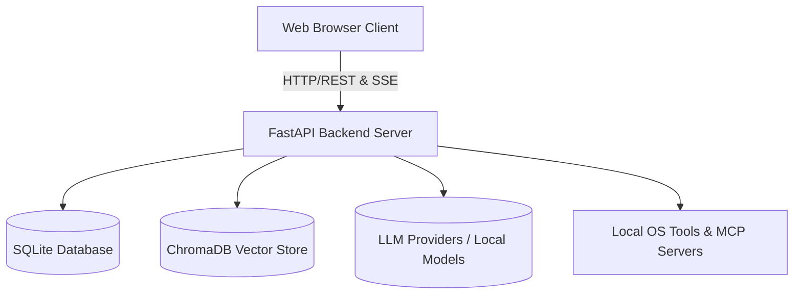

### Core Responsibilities
- **Frontend (Vanilla JS):** Manages user interactions, chat rendering, file attachments, state management, and real-time streaming updates.
- **Backend (FastAPI):** Orchestrates API routes, manages the database, executes agent loops and system tools, and interfaces with LLM providers or local models.
- **Cookbook & Hardware Fitness:** Analyzes the host's hardware (RAM, VRAM, GPU bandwidth) to recommend and manage local LLM serving (via `vLLM` or `llama.cpp`).
- **Memory & Storage:** Stores conversations, preferences, and calendars in SQLite, and maintains persistent semantic memory using ChromaDB.

---

</details>

</details>

## Frontend Architecture
<details>
<summary>View Frontend Architecture</summary>

### Frontend Architecture (Vanilla JS)

<details>
<summary>View Frontend Architecture (Vanilla JS)</summary>

The frontend avoids heavy frameworks like React or Vue, opting for vanilla JavaScript ES modules. This choice keeps the application lightweight and reduces build complexity. It is centered around [`static/app.js`](../static/app.js) and [`static/js/`](../static/js/), tying together a decentralized but clean architecture.

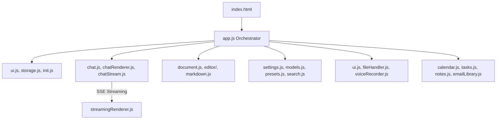

### Directory Structure & Module Families
- **Documentation Entry (`docs/index.html`)**: [`docs/index.html`](../docs/index.html) is a static HTML page that serves as the entry point for viewing generated project documentation.
- **[`package.json`](../static/js/package.json)** & **[`static/js/MODULE_SUMMARY.md`](../static/js/MODULE_SUMMARY.md)**: Metadata, scripts, and summary of the frontend JS ecosystem.
- **[`static/index.html`](../static/index.html)**: The main entry point. It defines the layout and loads all scripts.
- **Assets & Web App Config**:
  - **[`manifest.json`](../static/manifest.json)**: Configures Odysseus as a standalone Progressive Web App with custom icons and theme colors.
  - **[`style.css`](../static/style.css)**: The consolidated stylesheet that dictates the UI layout, using CSS Variables to manage theming.
- **[`static/app.js`](../static/app.js) & [`static/js/init.js`](../static/js/init.js)**: The main orchestrator. Eagerly binds global event listeners (drag and drop, shortcuts) and bootstraps state.
- **Core Wiring**: [`storage.js`](../static/js/storage.js) provides wrappers for LocalStorage persistence, while [`platform.js`](../static/js/platform.js) handles OS and browser detection.
- **Chat Engine ([`chat.js`](../static/js/chat.js), [`chatStream.js`](../static/js/chatStream.js), [`chatRenderer.js`](../static/js/chatRenderer.js))**: The largest monolith. Directs UI transitions, manages chat session logic, submission, and SSE streaming. [`chat.js`](../static/js/chat.js) has a watchdog to detect stalled streams. Rendering output and markdown logic is handled via [`chatRenderer.js`](../static/js/chatRenderer.js), [`streamingRenderer.js`](../static/js/streamingRenderer.js), and [`streamingSegmenter.js`](../static/js/streamingSegmenter.js).
- **Editors & Visuals ([`document.js`](../static/js/document.js), [`editor/`](../static/js/editor/), [`gallery.js`](../static/js/gallery.js))**: A multi-tab markdown/HTML editor with AI integration. [`document.js`](../static/js/document.js) manages state and SSE sync. [`gallery.js`](../static/js/gallery.js) handles image assets and grids. [`editor/`](../static/js/editor/) contains specialized tools for masking and layout.
- **Session & Memory ([`sessions.js`](../static/js/sessions.js), [`memory.js`](../static/js/memory.js))**: Manages CRUD for chat sessions and user vector memory.
- **Sub-Apps**: Major integrations are separated completely, e.g., [`emailLibrary.js`](../static/js/emailLibrary.js) (IMAP client UI), [`calendar.js`](../static/js/calendar.js) (CalDAV sync rendering), [`tasks.js`](../static/js/tasks.js), and [`notes.js`](../static/js/notes.js).
- **Cookbook (Hardware Management)**: The `cookbook*.js` modules execute complex, multi-step tasks across SSE streams, including diagnosis, hardware fitting, and download signaling.
- **Third-party Libraries (`static/lib/`)**:
  - [`docx.umd.min.js`](../static/lib/docx.umd.min.js), [`highlight.min.js`](../static/lib/highlight.min.js), [`html2pdf.bundle.min.js`](../static/lib/html2pdf.bundle.min.js), [`mammoth.browser.min.js`](../static/lib/mammoth.browser.min.js), [`qrcode.min.js`](../static/lib/qrcode.min.js), [`xlsx.full.min.js`](../static/lib/xlsx.full.min.js): Bundled external dependencies for rendering and exporting various document formats and generating QR codes directly in the browser.
- **Service Worker (`static/sw.js`)**: [`static/sw.js`](../static/sw.js) provides caching capabilities to enable offline functionality and fast loading of static assets.
- **Login (`static/login.html`)**: [`static/login.html`](../static/login.html) serves as the authentication portal when `AUTH_ENABLED` is set to true.
- **Component Specifics**: Modular features like UI helpers ([`ui.js`](../static/js/ui.js)), keyboard shortcuts ([`keyboard-shortcuts.js`](../static/js/keyboard-shortcuts.js)), file handlers ([`fileHandler.js`](../static/js/fileHandler.js)), voice recorders, markdown processing ([`markdown.js`](../static/js/markdown.js)), drag sorting ([`dragSort.js`](../static/js/dragSort.js)), assistant logic ([`assistant.js`](../static/js/assistant.js)), loading indicators ([`spinner.js`](../static/js/spinner.js)), and theming/color utilities ([`theme.js`](../static/js/theme.js), [`color/hex.js`](../static/js/color/hex.js), [`util/ordinal.js`](../static/js/util/ordinal.js)). Other UI and feature modules include [`composerArrowUpRecall.js`](../static/js/composerArrowUpRecall.js), [`emojiShortcodes.js`](../static/js/emojiShortcodes.js), [`group.js`](../static/js/group.js), [`langIcons.js`](../static/js/langIcons.js), [`modelPicker.js`](../static/js/modelPicker.js), [`models.js`](../static/js/models.js), [`modelSort.js`](../static/js/modelSort.js), [`model/matchKey.js`](../static/js/model/matchKey.js), [`presets.js`](../static/js/presets.js), [`providerDeviceFlow.js`](../static/js/providerDeviceFlow.js), [`providers.js`](../static/js/providers.js), [`rag.js`](../static/js/rag.js), [`researchSynapse.js`](../static/js/researchSynapse.js), [`section-management.js`](../static/js/section-management.js), [`settings.js`](../static/js/settings.js), [`signature.js`](../static/js/signature.js), [`skills.js`](../static/js/skills.js), [`tourAutoplay.js`](../static/js/tourAutoplay.js), and [`tourHints.js`](../static/js/tourHints.js).


<details>
<summary>Click to view granular descriptions of `static/js/` files</summary>

- **[`static/js/MODULE_SUMMARY.md`](../static/js/MODULE_SUMMARY.md)**: Markdown document outlining the general structure and responsibilities of the frontend modules.
- **[`static/js/a11y.js`](../static/js/a11y.js)**: Handles global accessibility updates, such as dynamically adding ARIA labels and managing screen reader announcements.
- **[`static/js/admin.js`](../static/js/admin.js)**: Responsible for rendering and managing UI components that are only visible to authenticated users with administrative privileges.
- **[`static/js/assistant.js`](../static/js/assistant.js)**: Manages interactions with the virtual assistant logic on the client side, including persona management.
- **[`static/js/calendar.js`](../static/js/calendar.js)**: Main module for calendar functionalities, handling rendering, event interactions, and synchronizing with the backend.
- **[`static/js/calendar/reminders.js`](../static/js/calendar/reminders.js)**: Evaluates upcoming calendar events to trigger browser-native reminders.
- **[`static/js/calendar/utils.js`](../static/js/calendar/utils.js)**: Provides helper functions for date math, formatting, and recurring rule calculations within the calendar application.
- **[`static/js/censor.js`](../static/js/censor.js)**: Employs heuristic regex rules to visually obscure sensitive information (like passwords or API keys) in the chat UI.
- **[`static/js/chat.js`](../static/js/chat.js)**: The core controller for the chat interface, capturing user input, managing auto-scroll, and triggering backend completions.
- **[`static/js/chatRenderer.js`](../static/js/chatRenderer.js)**: Manages the visual rendering of complete chat messages, transforming raw text and markdown into DOM elements.
- **[`static/js/chatStream.js`](../static/js/chatStream.js)**: Consumes the Server-Sent Events (SSE) from the backend, handling connection lifecycle and dispatching text chunks.
- **[`static/js/codeRunner.js`](../static/js/codeRunner.js)**: Provides functionality to execute embedded code snippets (e.g., Python, JS) directly within the chat interface.
- **[`static/js/color/hex.js`](../static/js/color/hex.js)**: Utilities for parsing, validating, and converting hexadecimal color codes to RGB/HSL for dynamic theming.
- **[`static/js/colorPicker.js`](../static/js/colorPicker.js)**: A lightweight, custom color picker component designed without external dependencies.
- **[`static/js/compare/icons.js`](../static/js/compare/icons.js)**: Supplies specific SVG icons used within the blind comparison interface.
- **[`static/js/compare/index.js`](../static/js/compare/index.js)**: The entry point for the Compare Mode application, initializing the layout and core components.
- **[`static/js/compare/models.js`](../static/js/compare/models.js)**: Manages the fetching and local state of available models specifically for the comparison view.
- **[`static/js/compare/panes.js`](../static/js/compare/panes.js)**: Controls the synchronized dual-pane layout, ensuring both model outputs are displayed correctly side-by-side.
- **[`static/js/compare/probe.js`](../static/js/compare/probe.js)**: Diagnostic module that checks network and connection health specifically for the synchronized compare streams.
- **[`static/js/compare/scoreboard.js`](../static/js/compare/scoreboard.js)**: Calculates and renders the ongoing ELO or win/loss ratio of models involved in blind testing.
- **[`static/js/compare/selector.js`](../static/js/compare/selector.js)**: UI component enabling the user to choose which specific models to pit against each other before obfuscation.
- **[`static/js/compare/state.js`](../static/js/compare/state.js)**: Manages the centralized state for a comparison session, including selected models, the prompt, and voting status.
- **[`static/js/compare/stream.js`](../static/js/compare/stream.js)**: Handles the complexity of opening and tracking two concurrent Server-Sent Event streams for real-time model racing.
- **[`static/js/compare/vote.js`](../static/js/compare/vote.js)**: Submits the user's vote back to the API and subsequently reveals the obscured identities of the competing models.
- **[`static/js/composerArrowUpRecall.js`](../static/js/composerArrowUpRecall.js)**: Adds terminal-like history recall to the chat input field when the user presses the Up Arrow key.
- **[`static/js/cookbook-diagnosis.js`](../static/js/cookbook-diagnosis.js)**: Periodically polls the status of background services (like Ollama) to ensure they are available for the Cookbook.
- **[`static/js/cookbook-hwfit.js`](../static/js/cookbook-hwfit.js)**: Interacts with the backend's hardware profiling API to display VRAM and model fit metrics visually.
- **[`static/js/cookbook.js`](../static/js/cookbook.js)**: The main orchestrator module for the Cookbook interface, managing local LLM setup and management.
- **[`static/js/cookbookDownload.js`](../static/js/cookbookDownload.js)**: Handles the UI and API requests for initiating the download of models from Hugging Face or other registries.
- **[`static/js/cookbookProgressSignal.js`](../static/js/cookbookProgressSignal.js)**: Parses real-time SSE progress events during model downloads, updating progress bars and ETA readouts.
- **[`static/js/cookbookRunning.js`](../static/js/cookbookRunning.js)**: Monitors and displays the status of currently active local models being served by vLLM or llama.cpp.
- **[`static/js/cookbookSchedule.js`](../static/js/cookbookSchedule.js)**: Provides UI for scheduling when specific models should be loaded or unloaded from memory.
- **[`static/js/cookbookServe.js`](../static/js/cookbookServe.js)**: Sends the API commands to launch a model server process inside a managed background session.
- **[`static/js/document.js`](../static/js/document.js)**: Main entry point for the Document Editor view, handling state, layout, and document lifecycle events.
- **[`static/js/documentLibrary.js`](../static/js/documentLibrary.js)**: Renders the file browser for the user's personal document collection and handles batch operations.
- **[`static/js/dragSort.js`](../static/js/dragSort.js)**: Provides general-purpose drag-and-drop sorting capabilities for list items across the SPA.
- **[`static/js/editor/ai-inpaint.js`](../static/js/editor/ai-inpaint.js)**: Gathers masked regions from the canvas and orchestrates inpainting requests to the backend image generator.
- **[`static/js/editor/ai-models.js`](../static/js/editor/ai-models.js)**: Manages the configuration and selection of specific image models available for canvas operations.
- **[`static/js/editor/ai-rembg.js`](../static/js/editor/ai-rembg.js)**: Extracts the foreground of a layer by calling the backend background removal service and pasting the result.
- **[`static/js/editor/ai-tool-runner.js`](../static/js/editor/ai-tool-runner.js)**: A generic wrapper that handles loading states, error catching, and layer insertion for all AI-powered canvas tools.
- **[`static/js/editor/ai-tools-misc.js`](../static/js/editor/ai-tools-misc.js)**: Houses miscellaneous AI operations for the canvas, such as upscaling or style transfer integrations.
- **[`static/js/editor/build/controls.js`](../static/js/editor/build/controls.js)**: Constructs generic, reusable UI controls (buttons, sliders) for the canvas editor toolbars.
- **[`static/js/editor/build/popups.js`](../static/js/editor/build/popups.js)**: Manages the instantiation and lifecycle of floating popup dialogues within the canvas context.
- **[`static/js/editor/build/right-panel.js`](../static/js/editor/build/right-panel.js)**: Builds the UI for the right-hand properties panel, typically housing layer and history controls.
- **[`static/js/editor/build/toolbar.js`](../static/js/editor/build/toolbar.js)**: Assembles the primary tool palette (brush, lasso, move, etc.) along the edge of the canvas.
- **[`static/js/editor/build/topbar.js`](../static/js/editor/build/topbar.js)**: Renders the persistent header bar of the editor for global actions like save, export, or undo.
- **[`static/js/editor/build/transform-popup.js`](../static/js/editor/build/transform-popup.js)**: Creates the specific floating dialogue used during layer transform operations (scale, rotate, skew).
- **[`static/js/editor/canvas-coords.js`](../static/js/editor/canvas-coords.js)**: Translates raw screen mouse events into accurate logical canvas coordinates, accounting for zoom and pan states.
- **[`static/js/editor/canvas-events.js`](../static/js/editor/canvas-events.js)**: The central event delegator that captures all mouse and touch interactions on the main HTML5 canvas element.
- **[`static/js/editor/canvas-transforms.js`](../static/js/editor/canvas-transforms.js)**: Implements the mathematical matrices to pan, zoom, and rotate the canvas viewport itself.
- **[`static/js/editor/checkerboard.js`](../static/js/editor/checkerboard.js)**: Draws the tiled gray/white background to visually indicate transparent areas of the canvas.
- **[`static/js/editor/clipboard-and-drop.js`](../static/js/editor/clipboard-and-drop.js)**: Listens for paste events or dragged files, converting them into new image layers on the canvas.
- **[`static/js/editor/composite-helpers.js`](../static/js/editor/composite-helpers.js)**: Provides lower-level Canvas 2D API utilities for merging multiple distinct layers into a single image buffer.
- **[`static/js/editor/filters/blur.js`](../static/js/editor/filters/blur.js)**: Applies a Gaussian blur convolution matrix to the currently selected layer or mask.
- **[`static/js/editor/filters/edge-feather.js`](../static/js/editor/filters/edge-feather.js)**: Softens the harsh boundaries of a mask or selection to enable smooth compositing.
- **[`static/js/editor/fx/adj-popup.js`](../static/js/editor/fx/adj-popup.js)**: Renders the UI dialogue for tweaking image adjustments (brightness, contrast, saturation).
- **[`static/js/editor/fx/filter-string.js`](../static/js/editor/fx/filter-string.js)**: Compiles user adjustment settings into standard CSS `filter` strings for non-destructive previewing.
- **[`static/js/editor/fx/histogram.js`](../static/js/editor/fx/histogram.js)**: Calculates and renders a graphical representation of the tonal distribution in the active layer.
- **[`static/js/editor/fx/pixel-pass.js`](../static/js/editor/fx/pixel-pass.js)**: Executes raw, per-pixel manipulations on image data arrays for advanced effects.
- **[`static/js/editor/harmonize-masks.js`](../static/js/editor/harmonize-masks.js)**: Ensures that independently drawn masks properly align and clip against their parent layers.
- **[`static/js/editor/history-panel.js`](../static/js/editor/history-panel.js)**: Displays the stack of past actions and enables the user to jump back to previous states in the undo tree.
- **[`static/js/editor/keyboard-shortcuts.js`](../static/js/editor/keyboard-shortcuts.js)**: Maps keybinds specific to the canvas editor context (e.g., `B` for brush, `Ctrl+Z` for undo).
- **[`static/js/editor/layer-helpers.js`](../static/js/editor/layer-helpers.js)**: Centralizes CRUD operations for the canvas layer stack, including visibility toggles and blend modes.
- **[`static/js/editor/layer-panel.js`](../static/js/editor/layer-panel.js)**: Renders the visual representation of the layer stack, allowing drag-and-drop reordering.
- **[`static/js/editor/mask-utils.js`](../static/js/editor/mask-utils.js)**: Contains algorithms for expanding, contracting, or manipulating black-and-white alpha masks.
- **[`static/js/editor/shortcuts-popover.js`](../static/js/editor/shortcuts-popover.js)**: Displays an overlay summarizing the available hotkeys while the user is inside the editor.
- **[`static/js/editor/slider-ux.js`](../static/js/editor/slider-ux.js)**: Implements specialized drag behaviors for range inputs, allowing precise adjustments.
- **[`static/js/editor/snap.js`](../static/js/editor/snap.js)**: Provides logic to magnetically align layers or guides to specific edges and centers during movement.
- **[`static/js/editor/state.js`](../static/js/editor/state.js)**: The master state container for the canvas application, tracking active tools, layers, and viewport matrices.
- **[`static/js/editor/stroke-pipeline.js`](../static/js/editor/stroke-pipeline.js)**: Optimizes the rendering of continuous brush strokes by interpolating points to prevent jagged lines.
- **[`static/js/editor/stroke-tool-sliders.js`](../static/js/editor/stroke-tool-sliders.js)**: Binds the UI sliders to update the size, hardness, and opacity of the currently selected brush tool.
- **[`static/js/editor/tools/clone.js`](../static/js/editor/tools/clone.js)**: Implements a clone stamp tool that samples pixels from a source point and paints them elsewhere.
- **[`static/js/editor/tools/crop.js`](../static/js/editor/tools/crop.js)**: Handles the UI overlay and destructive image slicing for the crop tool.
- **[`static/js/editor/tools/flood-fill.js`](../static/js/editor/tools/flood-fill.js)**: Uses a breadth-first search algorithm to fill contiguous areas of similar color (the paint bucket).
- **[`static/js/editor/tools/lasso-mask.js`](../static/js/editor/tools/lasso-mask.js)**: Specializes the lasso to purely edit alpha masks rather than pixel data.
- **[`static/js/editor/tools/lasso.js`](../static/js/editor/tools/lasso.js)**: Allows the user to draw freehand paths to create pixel selections.
- **[`static/js/editor/tools/move.js`](../static/js/editor/tools/move.js)**: Updates layer coordinates when dragged by the mouse.
- **[`static/js/editor/tools/stroke.js`](../static/js/editor/tools/stroke.js)**: The core implementation of the freehand brush/pencil tool for applying color.
- **[`static/js/editor/tools/transform-drag.js`](../static/js/editor/tools/transform-drag.js)**: Manages the complex mathematics of scaling or rotating a layer based on dragging bounding box handles.
- **[`static/js/editor/tools/transform-handles.js`](../static/js/editor/tools/transform-handles.js)**: Renders the visual control points (corners, edges) around a selected layer.
- **[`static/js/editor/tools/transform-session.js`](../static/js/editor/tools/transform-session.js)**: Encapsulates the state of an ongoing transformation, only committing the changes to the layer when confirmed.
- **[`static/js/editor/tools/wand.js`](../static/js/editor/tools/wand.js)**: Implements the magic wand tool, performing tolerance-based region selection.
- **[`static/js/editor/wire-import.js`](../static/js/editor/wire-import.js)**: Glues the UI buttons for "Import File" to the underlying layer ingestion logic.
- **[`static/js/editor/wire-inpaint-controls.js`](../static/js/editor/wire-inpaint-controls.js)**: Wires up the prompt text area and generate buttons specifically for AI inpainting workflows.
- **[`static/js/editor/wire-merge-buttons.js`](../static/js/editor/wire-merge-buttons.js)**: Connects the layer panel actions for merging down or flattening the entire document.
- **[`static/js/editor/wire-selection-controls.js`](../static/js/editor/wire-selection-controls.js)**: Hooks up actions like "Invert Selection" or "Clear Selection" to the active tool state.
- **[`static/js/editor/wire-topbar-menus.js`](../static/js/editor/wire-topbar-menus.js)**: Controls the dropdown menus (File, Edit, Layer) located in the main header.
- **[`static/js/editor/wire-topbar-overflow.js`](../static/js/editor/wire-topbar-overflow.js)**: Manages responsive hiding of topbar items on narrow screens, placing them in an overflow menu.
- **[`static/js/editor/wire-topbar.js`](../static/js/editor/wire-topbar.js)**: The central module that initializes and coordinates all topbar interactions.
- **[`static/js/emailInbox.js`](../static/js/emailInbox.js)**: The primary entry point for the Email application UI, bootstrapping the layout and fetching the initial inbox listing.
- **[`static/js/emailLibrary.js`](../static/js/emailLibrary.js)**: A wrapper handling generic email viewing functionality and routing within the SPA.
- **[`static/js/emailLibrary/replyRecipients.js`](../static/js/emailLibrary/replyRecipients.js)**: Parses the `To` and `Cc` headers of an incoming email to correctly populate the reply fields.
- **[`static/js/emailLibrary/signatureFold.js`](../static/js/emailLibrary/signatureFold.js)**: Detects lengthy signature blocks or repeated quotes in email chains and collapses them behind a "Show more" toggle.
- **[`static/js/emailLibrary/state.js`](../static/js/emailLibrary/state.js)**: Maintains local state for the email client, such as which folder is active and which messages are selected.
- **[`static/js/emailLibrary/utils.js`](../static/js/emailLibrary/utils.js)**: Provides small helper functions for formatting dates and parsing raw email addresses.
- **[`static/js/emojiPicker.js`](../static/js/emojiPicker.js)**: Implements an internal UI component for searching and selecting Unicode emojis without external libraries.
- **[`static/js/emojiShortcodes.js`](../static/js/emojiShortcodes.js)**: Translates text strings like `:smile:` into their actual Unicode emoji equivalents automatically.
- **[`static/js/escMenuStack.js`](../static/js/escMenuStack.js)**: Manages a stack of open UI elements to ensure that pressing the "Escape" key correctly closes the top-most modal or menu.
- **[`static/js/fileHandler.js`](../static/js/fileHandler.js)**: Provides robust handling for drag-and-drop file uploads, orchestrating the file picker and interfacing with the upload limits API.
- **[`static/js/gallery.js`](../static/js/gallery.js)**: The main view controller for the photo/image gallery, managing the dynamic grid layout and multi-select interactions.
- **[`static/js/galleryEditor.js`](../static/js/galleryEditor.js)**: Acts as a bridge to open selected images from the gallery directly into the full AI canvas editor context.
- **[`static/js/group.js`](../static/js/group.js)**: Handles UI interactions relating to grouping or organizing elements, primarily for chats and memory nodes.
- **[`static/js/init.js`](../static/js/init.js)**: A bootstrap script that eagerly attaches global event listeners and ensures base stores are populated before specific apps initialize.
- **[`static/js/keyboard-shortcuts.js`](../static/js/keyboard-shortcuts.js)**: Binds application-wide keyboard shortcuts, distinct from those bound specifically within the canvas editor.
- **[`static/js/langIcons.js`](../static/js/langIcons.js)**: Maps programming language names to their corresponding SVG icon filenames for use in rendered code blocks.
- **[`static/js/markdown.js`](../static/js/markdown.js)**: Configures and extends the markdown rendering engine, integrating custom rules for code blocks and UI elements.
- **[`static/js/markdown/tableRow.js`](../static/js/markdown/tableRow.js)**: A specialized extension to the markdown parser that enables advanced formatting specifically within table rows.
- **[`static/js/memory.js`](../static/js/memory.js)**: Main entry point for the Memory interface, allowing users to view, edit, and manually index semantic facts.
- **[`static/js/modalManager.js`](../static/js/modalManager.js)**: The central controller for creating, tracking, and destroying modular pop-up windows across the SPA.
- **[`static/js/modalSnap.js`](../static/js/modalSnap.js)**: Adds window-manager-like capabilities, allowing modals to snap to the left or right edges of the screen.
- **[`static/js/model/matchKey.js`](../static/js/model/matchKey.js)**: A utility to reliably normalize and compare LLM model string IDs against expected formats or known lists.
- **[`static/js/modelPicker.js`](../static/js/modelPicker.js)**: Renders the dropdown interface for selecting which AI model should handle the current conversation or task.
- **[`static/js/modelSort.js`](../static/js/modelSort.js)**: Provides logic to sort available models in the UI based on heuristics (like favoring local models or sorting by size).
- **[`static/js/models.js`](../static/js/models.js)**: Handles fetching the catalog of available models from the backend and organizing them for other UI components.
- **[`static/js/notes.js`](../static/js/notes.js)**: Provides the frontend interface for creating and managing quick text snippets and to-do lists.
- **[`static/js/package.json`](../static/js/package.json)**: The Node.js configuration file defining scripts and dependencies specifically needed for running frontend tests and linters.
- **[`static/js/platform.js`](../static/js/platform.js)**: Utility functions detecting the user's OS and browser capabilities, used to alter keyboard shortcut hints (e.g., Ctrl vs Cmd).
- **[`static/js/presets.js`](../static/js/presets.js)**: Manages the UI for user-defined AI personas, handling form submissions and updating local state when a preset is altered.
- **[`static/js/providerDeviceFlow.js`](../static/js/providerDeviceFlow.js)**: Handles the polling logic necessary to authorize new external services via OAuth 2.0 Device Flow.
- **[`static/js/providers.js`](../static/js/providers.js)**: Interface for managing API keys and settings for external AI providers (OpenAI, Anthropic, etc.).
- **[`static/js/rag.js`](../static/js/rag.js)**: Controls the UI toggles and visual indicators relating to Retrieval-Augmented Generation context injection.
- **[`static/js/research/jobs.js`](../static/js/research/jobs.js)**: Tracks the active state of asynchronous deep research jobs, updating the UI when a job finishes.
- **[`static/js/research/panel.js`](../static/js/research/panel.js)**: Renders the detailed view of a research report, organizing the source citations and synthesized findings.
- **[`static/js/researchSynapse.js`](../static/js/researchSynapse.js)**: Implements visual animations showing multi-step reasoning processes during complex agent tasks.
- **[`static/js/search-chat.js`](../static/js/search-chat.js)**: A bridge module specifically injecting external web search results directly into the active chat interface.
- **[`static/js/search.js`](../static/js/search.js)**: Manages global search logic, distinct from web searching, handling queries across local chats, files, and memories.
- **[`static/js/section-management.js`](../static/js/section-management.js)**: Coordinates the visibility of major SPA "sections" (e.g., swapping between the Chat view and the Gallery view).
- **[`static/js/sessions.js`](../static/js/sessions.js)**: Handles the CRUD operations and sidebar rendering for conversational session histories.
- **[`static/js/settings.js`](../static/js/settings.js)**: Main module for the settings modal, dispatching configuration updates to the backend and persisting local preferences.
- **[`static/js/sidebar-layout.js`](../static/js/sidebar-layout.js)**: Manages the collapsible state and width resizing of the main application sidebar.
- **[`static/js/signature.js`](../static/js/signature.js)**: Manages the rendering and parsing of email signatures configured by the user.
- **[`static/js/skills.js`](../static/js/skills.js)**: Provides the interface to manage `SKILL.md` documents, allowing users to view or edit learned agent procedures.
- **[`static/js/slashAutocomplete.js`](../static/js/slashAutocomplete.js)**: Renders the type-ahead suggestion box when a user begins a prompt with a slash (`/`).
- **[`static/js/slashCommands.js`](../static/js/slashCommands.js)**: Defines the available slash commands and their corresponding execution behaviors in the chat input.
- **[`static/js/spinner.js`](../static/js/spinner.js)**: Provides standard, reusable loading animation components.
- **[`static/js/storage.js`](../static/js/storage.js)**: Wraps `localStorage` access with parsing safeguards to prevent exceptions on corrupt JSON.
- **[`static/js/streamingRenderer.js`](../static/js/streamingRenderer.js)**: Receives batched chunks of text and applies them to the DOM, interacting heavily with the segmenter to handle markdown blocks safely.
- **[`static/js/streamingSegmenter.js`](../static/js/streamingSegmenter.js)**: Parses incoming, incomplete markdown text character-by-character to detect safe boundaries for highlighting.
- **[`static/js/tasks.js`](../static/js/tasks.js)**: Main entry point for the scheduled tasks UI, allowing viewing and administration of cron-like jobs.
- **[`static/js/theme.js`](../static/js/theme.js)**: Manages dark/light mode toggling and the injection of custom CSS variable themes.
- **[`static/js/tileManager.js`](../static/js/tileManager.js)**: Controls the dashboard grid system, allowing different UI components (tiles) to be resized and rearranged.
- **[`static/js/tourAutoplay.js`](../static/js/tourAutoplay.js)**: Automatically launches the welcome tutorial tour for first-time users based on local storage flags.
- **[`static/js/tourHints.js`](../static/js/tourHints.js)**: Stores the text and anchor points for the interactive onboarding tutorial popups.
- **[`static/js/tts-ai.js`](../static/js/tts-ai.js)**: Interfaces with the text-to-speech API, handling the playback of generated audio responses.
- **[`static/js/ui.js`](../static/js/ui.js)**: A collection of miscellaneous DOM manipulation helpers (like toasts and generic tooltips).
- **[`static/js/util/ordinal.js`](../static/js/util/ordinal.js)**: Small utility to append the correct English ordinal suffix (st, nd, rd, th) to numbers.
- **[`static/js/voiceRecorder.js`](../static/js/voiceRecorder.js)**: Manages the `MediaRecorder` API to capture microphone input and send it to the backend for speech-to-text.
- **[`static/js/windowDrag.js`](../static/js/windowDrag.js)**: Implements the logic required to drag floating modal windows around the viewport by clicking their title bars.
- **[`static/js/windowResize.js`](../static/js/windowResize.js)**: Allows floating modal windows to be resized by dragging their edges or corners.
</details>


### Communication Pattern
The frontend communicates with the backend primarily through standard REST APIs. However, for chat generation and long-running tasks, it heavily relies on **Server-Sent Events (SSE)**.
- **Streaming:** When a chat is submitted, the frontend opens an SSE connection (`/api/chat_stream`). The backend streams chunks of markdown text, which the frontend renders incrementally.
- **Tool Progress:** While the backend agent loop is executing tools, it streams progress indicators to the frontend, which are displayed as "thinking" or "executing" animations.
- **Document Streaming:** Changes to documents are streamed via specific SSE event types (e.g., `doc_stream_open`, `doc_stream_delta`) and updated live in the editor panel.

---

</details>

### Frontend Realtime Streaming & Chat

<details>
<summary>View Frontend Realtime Streaming & Chat</summary>

The real-time conversational UI relies heavily on Server-Sent Events (SSE) to update the UI without dropping frames or blocking user input during long text generations.

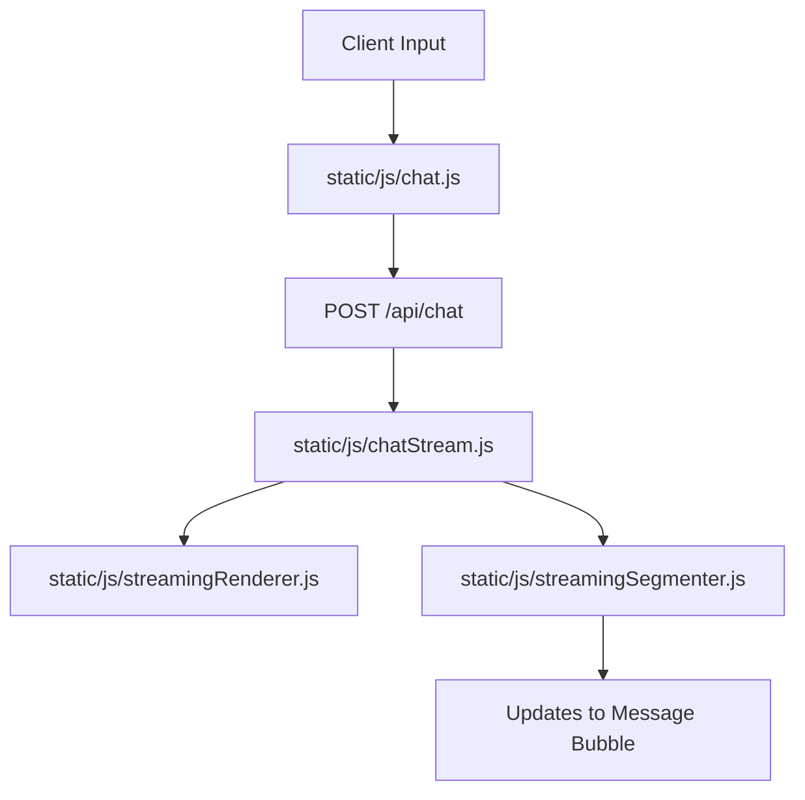

### Components
- **Chat Orchestrator ([`static/js/chat.js`](../static/js/chat.js) & [`chatRenderer.js`](../static/js/chatRenderer.js))**: The primary controller that captures user inputs, manages auto-scrolling, and delegates message rendering. It keeps the local message state in sync with the server response.
- **SSE Consumer ([`static/js/chatStream.js`](../static/js/chatStream.js))**: Opens the event stream and listens to JSON lines. It handles network disconnects, error codes, and maps raw text deltas into actionable state updates for the renderer.
- **Render Engine ([`static/js/streamingRenderer.js`](../static/js/streamingRenderer.js) & [`streamingSegmenter.js`](../static/js/streamingSegmenter.js))**: As tokens arrive sequentially, they are batched and flushed to the DOM. The segmenter handles complex boundary logic (e.g., detecting when a markdown code block ` ``` ` begins or ends) to ensure syntax highlighting is only applied once a block is complete, avoiding constant, CPU-heavy re-parsing of incomplete HTML.

---

</details>

### UI & UX Helpers

<details>
<summary>View UI & UX Helpers</summary>

Small foundational pieces to support the frontend SPA.

### Purpose
Provide localization, theming, and consistent rendering mechanics.

### Components
- **[`routes/emoji_routes.py`](../routes/emoji_routes.py) & [`routes/font_routes.py`](../routes/font_routes.py)**: Serves static SVGs and webfonts dynamically based on the current workspace themes.
- **[`src/text_helpers.py`](../src/text_helpers.py)**: Utilities for stripping reasoning chains or specific tokens from LLM output before presentation.
- **[`src/user_time.py`](../src/user_time.py)**: Manages timezone calculations so that when an agent is told "remind me tomorrow", it correctly translates to the user's localized time based on browser data.

- **Window & Modal Management**: Uses modular window logic. [`modalManager.js`](../static/js/modalManager.js) handles lifecycle and stacking, [`modalSnap.js`](../static/js/modalSnap.js) enables snapping to screen edges, and [`escMenuStack.js`](../static/js/escMenuStack.js) ensures the escape key logically pops UI layers. Panel resizing and dragging are driven by [`windowDrag.js`](../static/js/windowDrag.js) and [`windowResize.js`](../static/js/windowResize.js).
- **Workspace Layout**: Managed by [`sidebar-layout.js`](../static/js/sidebar-layout.js) (collapsible sidebars) and [`tileManager.js`](../static/js/tileManager.js) (dynamic workspace grids).
- **Interactive Tools & Utilities**:
  - [`codeRunner.js`](../static/js/codeRunner.js): Handles execution of code blocks (like Python/JS) directly within the chat UI.
  - [`slashCommands.js`](../static/js/slashCommands.js) & [`slashAutocomplete.js`](../static/js/slashAutocomplete.js): Provides type-ahead UI for system commands (e.g., `/search`, `/imagine`).
  - [`tts-ai.js`](../static/js/tts-ai.js) & [`voiceRecorder.js`](../static/js/voiceRecorder.js): Frontend integrations for audio playback and microphone capture.
  - [`colorPicker.js`](../static/js/colorPicker.js) & [`emojiPicker.js`](../static/js/emojiPicker.js): Custom, lightweight drop-ins avoiding heavy external dependencies.
  - [`a11y.js`](../static/js/a11y.js): Global accessibility observer that adds ARIA labels dynamically.
  - [`admin.js`](../static/js/admin.js): Renders privileged UI segments when the authenticated user holds administrative rights.
- **Specialized Subsystems (`static/js/*/`)**:
  - **`calendar/`**: [`reminders.js`](../static/js/calendar/reminders.js) and [`utils.js`](../static/js/calendar/utils.js) calculate recurrent rule sets and manage browser notification lifecycles.
  - **`emailLibrary/`**: Features standalone logic for folding long signature blocks ([`signatureFold.js`](../static/js/emailLibrary/signatureFold.js)) and deriving reply recipients dynamically ([`replyRecipients.js`](../static/js/emailLibrary/replyRecipients.js)).
  - **`markdown/`**: Custom extensions to the Markdown renderer, e.g., [`tableRow.js`](../static/js/markdown/tableRow.js) for advanced table rendering.
  - **`research/`**: Components like [`jobs.js`](../static/js/research/jobs.js) and [`panel.js`](../static/js/research/panel.js) to view ongoing deep research execution state and source collation.
  - **`researchSynapse.js`**: Drives the UI graph visualization for multi-agent or multi-step reasoning.


---

</details>

### Compare Mode (Model Blind Testing)

<details>
<summary>View Compare Mode (Model Blind Testing)</summary>

Compare mode provides a dual-pane, blind AB testing interface to evaluate the quality of multiple AI models side-by-side on identical prompts.

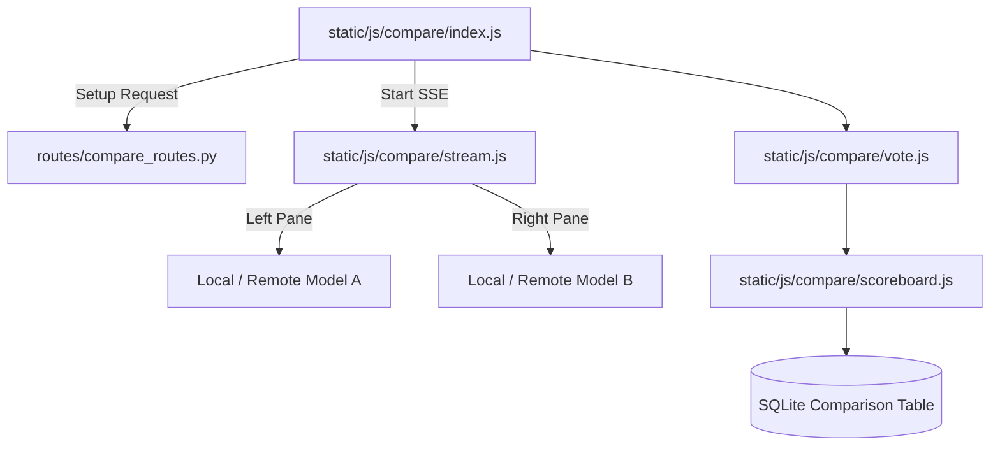

### Components
- **Frontend State ([`static/js/compare/`](../static/js/compare/))**: Comprises numerous modular files handling the dual UI ([`panes.js`](../static/js/compare/panes.js)), tracking connection health ([`probe.js`](../static/js/compare/probe.js)), and managing the synchronized SSE streams for both models ([`stream.js`](../static/js/compare/stream.js)). The models' identities remain obfuscated until a winner is declared ([`vote.js`](../static/js/compare/vote.js)). Additional components include [`icons.js`](../static/js/compare/icons.js), [`index.js`](../static/js/compare/index.js), [`models.js`](../static/js/compare/models.js), [`scoreboard.js`](../static/js/compare/scoreboard.js), [`selector.js`](../static/js/compare/selector.js), and [`state.js`](../static/js/compare/state.js).
- **Backend Routing ([`routes/compare_routes.py`](../routes/compare_routes.py))**: Manages the API surface area for starting a comparison, validating model access, handling vote submission, and managing the `RecordVoteRequest` schema to compile metrics over time.

---

</details>

### AI Canvas Editor Architecture

<details>
<summary>View AI Canvas Editor Architecture</summary>

The rich image editor features a comprehensive, multi-layer HTML5 Canvas architecture integrated tightly with local backend AI operations.

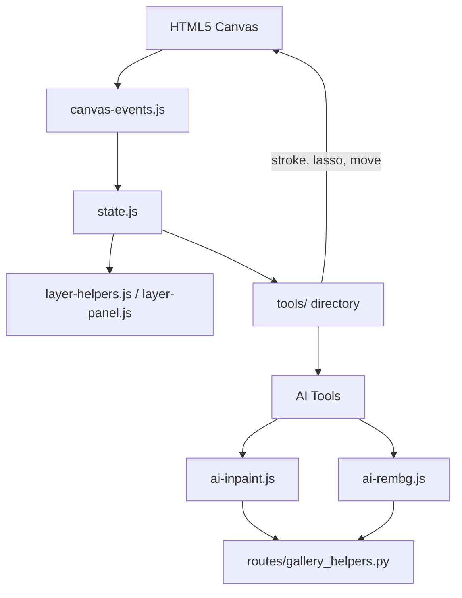

### Components
- **Core Canvas Logic ([`static/js/editor/`](../static/js/editor/))**: Managed by [`state.js`](../static/js/editor/state.js), with interactions translated through [`canvas-coords.js`](../static/js/editor/canvas-coords.js) and [`canvas-events.js`](../static/js/editor/canvas-events.js) to account for zooming and panning across the viewport. Additional state and rendering constraints are mapped via [`canvas-transforms.js`](../static/js/editor/canvas-transforms.js), [`checkerboard.js`](../static/js/editor/checkerboard.js), and [`snap.js`](../static/js/editor/snap.js). Shortcuts are managed via [`keyboard-shortcuts.js`](../static/js/editor/keyboard-shortcuts.js).
- **Tools & Effects**: Standard editing tools ([`tools/crop.js`](../static/js/editor/tools/crop.js), [`tools/flood-fill.js`](../static/js/editor/tools/flood-fill.js), [`tools/lasso-mask.js`](../static/js/editor/tools/lasso-mask.js), [`tools/lasso.js`](../static/js/editor/tools/lasso.js), [`tools/move.js`](../static/js/editor/tools/move.js), [`tools/stroke.js`](../static/js/editor/tools/stroke.js), [`tools/wand.js`](../static/js/editor/tools/wand.js), transform scripts like [`tools/transform-drag.js`](../static/js/editor/tools/transform-drag.js) / [`tools/transform-handles.js`](../static/js/editor/tools/transform-handles.js) / [`tools/transform-session.js`](../static/js/editor/tools/transform-session.js), and [`tools/clone.js`](../static/js/editor/tools/clone.js)) live in the [`tools/`](../static/js/editor/tools/) directory. Non-destructive overlays and visual filters reside in [`fx/`](../static/js/editor/fx/) (e.g., [`fx/adj-popup.js`](../static/js/editor/fx/adj-popup.js), [`fx/filter-string.js`](../static/js/editor/fx/filter-string.js), [`fx/histogram.js`](../static/js/editor/fx/histogram.js), [`fx/pixel-pass.js`](../static/js/editor/fx/pixel-pass.js)) and [`filters/`](../static/js/editor/filters/) (e.g., [`filters/blur.js`](../static/js/editor/filters/blur.js), [`filters/edge-feather.js`](../static/js/editor/filters/edge-feather.js)). Specialized operations like [`harmonize-masks.js`](../static/js/editor/harmonize-masks.js), [`composite-helpers.js`](../static/js/editor/composite-helpers.js), [`clipboard-and-drop.js`](../static/js/editor/clipboard-and-drop.js), and [`stroke-pipeline.js`](../static/js/editor/stroke-pipeline.js) support advanced composite workflows.
- **UI & Layout Controllers**: The editor interface is heavily modularized with floating panels, toolbars, and dynamic controls wrapped in the `wire-*.js` and `build/` files (e.g., [`wire-topbar.js`](../static/js/editor/wire-topbar.js), [`wire-topbar-menus.js`](../static/js/editor/wire-topbar-menus.js), [`wire-topbar-overflow.js`](../static/js/editor/wire-topbar-overflow.js), [`wire-selection-controls.js`](../static/js/editor/wire-selection-controls.js), [`wire-inpaint-controls.js`](../static/js/editor/wire-inpaint-controls.js), [`wire-import.js`](../static/js/editor/wire-import.js), [`wire-merge-buttons.js`](../static/js/editor/wire-merge-buttons.js), [`build/controls.js`](../static/js/editor/build/controls.js), [`build/popups.js`](../static/js/editor/build/popups.js), [`build/right-panel.js`](../static/js/editor/build/right-panel.js), [`build/toolbar.js`](../static/js/editor/build/toolbar.js), [`build/topbar.js`](../static/js/editor/build/topbar.js), [`build/transform-popup.js`](../static/js/editor/build/transform-popup.js)), driving components like the [`history-panel.js`](../static/js/editor/history-panel.js), [`layer-panel.js`](../static/js/editor/layer-panel.js), [`shortcuts-popover.js`](../static/js/editor/shortcuts-popover.js), [`stroke-tool-sliders.js`](../static/js/editor/stroke-tool-sliders.js), and specialized slider UX [`slider-ux.js`](../static/js/editor/slider-ux.js).
- **AI Integrations**: Specific files like [`ai-inpaint.js`](../static/js/editor/ai-inpaint.js), [`ai-rembg.js`](../static/js/editor/ai-rembg.js), [`ai-tools-misc.js`](../static/js/editor/ai-tools-misc.js), and [`ai-models.js`](../static/js/editor/ai-models.js) hook into the active canvas state to generate masks ([`mask-utils.js`](../static/js/editor/mask-utils.js)), transmit them to the backend, and apply the returned images onto new, non-destructive canvas layers ([`layer-helpers.js`](../static/js/editor/layer-helpers.js)). The actual tool API orchestration goes through [`ai-tool-runner.js`](../static/js/editor/ai-tool-runner.js).


</details>

## Backend & Core Services
<details>
<summary>View Backend & Core Services</summary>

### Backend Architecture & Routing (FastAPI)

<details>
<summary>View Backend Architecture & Routing (FastAPI)</summary>

The backend is built around a slim orchestrator ([`app.py`](../app.py)), which glues together several sub-modules. It uses **FastAPI** for route handling and **SQLAlchemy** for database interactions.

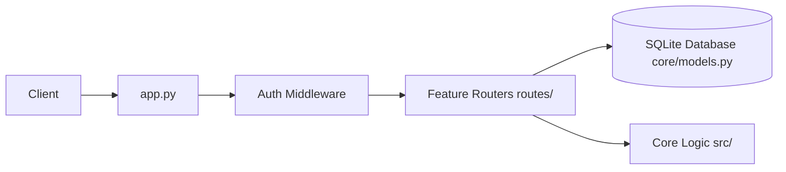

### Directory Structure & Core Components
- **[`app.py`](../app.py)**: The FastAPI entry point. Handles middleware (CORS, Auth, Security Headers), lifecycle events, and mounts routes using `include_router`.
- **[`core/models.py`](../core/models.py)**: SQLAlchemy declarative base models. It defines the schema for `ChatMessage`, `Session`, `Document`, `EmailAccount`, `McpServer`, etc.
- **[`core/database.py`](../core/database.py)**: Manages the SQLite connection pool, SQLAlchemy engine, and encrypted text types.
- **[`core/session_manager.py`](../core/session_manager.py)**: Handles transactional logic for session states and chat history persistence.
- **[`src/`](../src/)**: The core logic engine. Contains the agent loop ([`agent_loop.py`](../src/agent_loop.py)), tool execution logic ([`tool_execution.py`](../src/tool_execution.py)), LLM interactions ([`llm_core.py`](../src/llm_core.py)), and more.
- **[`routes/`](../routes/)**: FastAPI router definitions, separated by feature (e.g., [`chat_routes.py`](../routes/chat_routes.py), [`document_routes.py`](../routes/document_routes.py), [`memory_routes.py`](../routes/memory_routes.py)).
- **[`services/`](../services/)**: Sub-services for specialized tasks like hardware fitness scoring ([`hwfit/`](../services/hwfit/)), search integrations, TTS/STT, etc.

---

</details>

### API Routing & Controllers ([`routes/`](../routes/))

<details>
<summary>View API Routing & Controllers ([`routes/`](../routes/))</summary>

Odysseus isolates the API surface area from business logic through a highly modular router design. Instead of a monolithic routing file, the application features over 40 distinct route controllers in the [`routes/`](../routes/) directory.

### Routing Organization
- **[`routes/__init__.py`](../routes/__init__.py)**: Initialization for the routes package.
- **[`app.py`](../app.py) Mounting:** The primary FastAPI application imports and mounts these routers using `include_router`.
- **Feature Encapsulation:** Endpoints are strictly scoped to their domain. For instance, [`document_routes.py`](../routes/document_routes.py) manages all `GET/POST /api/documents` operations, while [`chat_routes.py`](../routes/chat_routes.py) handles generation and SSE streams.
- **Helper Extraction:** Complex or reusable logic inside a router is often extracted to a companion file (e.g., [`chat_helpers.py`](../routes/chat_helpers.py), [`document_helpers.py`](../routes/document_helpers.py), [`cookbook_helpers.py`](../routes/cookbook_helpers.py)).
- **Security Scope:** Middleware ensures that endpoints are protected based on user roles. Most routers perform their own checks against `get_current_user` to restrict data access to the session owner. Certain administrative routes ([`api_token_routes.py`](../routes/api_token_routes.py), [`webhook_routes.py`](../routes/webhook_routes.py)) mandate a higher privilege level via `require_admin`.

- **Specialized Routers**:
  - **[`preset_routes.py`](../routes/preset_routes.py) & [`skills_routes.py`](../routes/skills_routes.py)**: Manage the lifecycle (CRUD) of user-defined AI personas and tool-use scripts.
  - **[`email_routes.py`](../routes/email_routes.py) & [`email_helpers.py`](../routes/email_helpers.py)**: Serve mail client operations (SMTP send, IMAP fetch/move), abstracting away raw `email` library complexities.


---

</details>

### Core Utilities & Platform Mechanisms ([`core/`](../core/))

<details>
<summary>View Core Utilities & Platform Mechanisms ([`core/`](../core/))</summary>

The core utilities manage foundational backend state, security, process infrastructure, and cross-platform mechanisms.

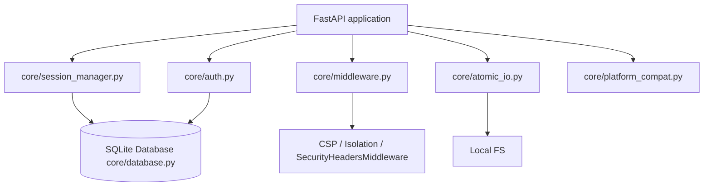

### Components
- **[`core/__init__.py`](../core/__init__.py)**: Initialization file for the core package.
- **Session Management ([`core/session_manager.py`](../core/session_manager.py))**: A centralized state machine holding in-memory references to user chat sessions and synchronizing them with SQLite. This module guarantees the transaction lifecycle, archiving inactive chats, tracking history, and purging deleted threads gracefully.
- **Authentication ([`core/auth.py`](../core/auth.py))**: Provides security logic for the web application and external integrations. It handles Bearer tokens for API integrations and user TOTP secrets.
- **Security Middleware ([`core/middleware.py`](../core/middleware.py))**: Intercepts all incoming requests to inject critical headers. It applies the `SecurityHeadersMiddleware`, enforcing the Content Security Policy (CSP), mitigating clickjacking by preventing framing (except on specific routes like the PDF previewer), and ensuring cross-origin isolation and loopback agent security.
- **Atomic IO ([`core/atomic_io.py`](../core/atomic_io.py))**: Provides safe file-writing operations using temporary files and atomic renames. This ensures that a sudden power loss or application crash during a save operation (e.g., updating a [`user_prefs.json`](../data/user_prefs.json)) does not result in a corrupted, zero-byte file.
- **Platform Compatibility ([`core/platform_compat.py`](../core/platform_compat.py))**: Normalizes differences between Windows, macOS, and Linux. This includes abstracting file path creation, permission handling (which differs vastly between POSIX and NTFS), and process signal management.
- **Constants ([`core/constants.py`](../core/constants.py))**: Re-exports constants.
- **Exceptions ([`core/exceptions.py`](../core/exceptions.py))**: Defines custom exceptions for core logic.

---

</details>

### Configuration & Data Models

<details>
<summary>View Configuration & Data Models</summary>

Odysseus uses strict typing and configuration management to ensure payload integrity and environment consistency.

### Components
- **[`src/config.py`](../src/config.py)**: Loads environment variables using `pydantic-settings`. It defines the `Settings` schema that validates ports, booleans, and system paths at boot time, failing loudly if the `.env` file is misconfigured.
- **[`src/request_models.py`](../src/request_models.py)**: Houses the Pydantic schemas (e.g., `ChatRequest`, `DocumentUploadRequest`) used across all FastAPI routes. This provides automatic validation, OpenAPI schema generation, and defends against malformed JSON payloads.

---

</details>

### Internal & Background Services ([`services/`](../services/))

<details>
<summary>View Internal & Background Services ([`services/`](../services/))</summary>

The internal architecture separates discrete background jobs into standalone, stateless modules. These modules serve external integration requests triggered by the agent loop or via direct route access.

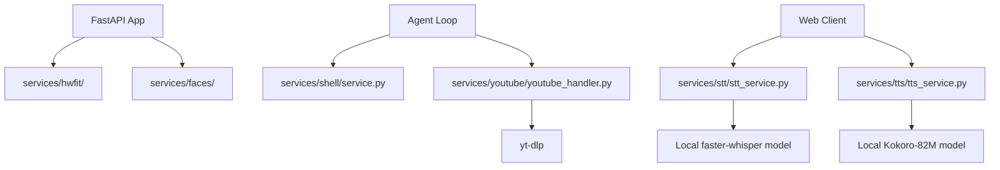

### Components
- **[`services/__init__.py`](../services/__init__.py)**: Root package initialization.
- **Hardware Fitness ([`services/hwfit/`](../services/hwfit/))**: Profiles the host machine dynamically.
  - **[`services/hwfit/__init__.py`](../services/hwfit/__init__.py)**: Package init.
  - **[`services/hwfit/models.py`](../services/hwfit/models.py)**, **[`services/hwfit/image_models.py`](../services/hwfit/image_models.py)**: Define hardware fit models and sizing logic.
  - **[`services/hwfit/profiles.py`](../services/hwfit/profiles.py)**: Stores sizing heuristics.
  - **[`services/hwfit/data/hf_models.json`](../services/hwfit/data/hf_models.json)**: Model repository index.
- **Document Services ([`services/docs/__init__.py`](../services/docs/__init__.py))**: Core logic for internal document service management.
- **AI Services (Faces) ([`services/faces/`](../services/faces/))**:
  - **[`services/faces/__init__.py`](../services/faces/__init__.py)**: Init file.
- **Memory Services ([`services/memory/`](../services/memory/))**:
  - **[`services/memory/__init__.py`](../services/memory/__init__.py)**: Init file.
  - **[`services/memory/memory.py`](../services/memory/memory.py)**, **[`services/memory/memory_vector.py`](../services/memory/memory_vector.py)**, **[`services/memory/service.py`](../services/memory/service.py)**: Logic for vector storage and semantic extraction.
- **Research Services ([`services/research/`](../services/research/))**:
  - **[`services/research/__init__.py`](../services/research/__init__.py)**, **[`services/research/research_handler.py`](../services/research/research_handler.py)**, **[`services/research/service.py`](../services/research/service.py)**: Background worker scripts managing deep research logic.
- **Search Services ([`services/search/`](../services/search/))**:
  - **[`services/search/__init__.py`](../services/search/__init__.py)**: Init file.
  - **[`services/search/analytics.py`](../services/search/analytics.py)**, **[`services/search/cache.py`](../services/search/cache.py)**, **[`services/search/content.py`](../services/search/content.py)**, **[`services/search/core.py`](../services/search/core.py)**, **[`services/search/providers.py`](../services/search/providers.py)**, **[`services/search/query.py`](../services/search/query.py)**, **[`services/search/ranking.py`](../services/search/ranking.py)**, **[`services/search/service.py`](../services/search/service.py)**: The underlying engine executing searches, caching results, and ranking the most relevant output snippets.
- **Shell Executor ([`services/shell/`](../services/shell/))**:
  - **[`services/shell/__init__.py`](../services/shell/__init__.py)**, **[`services/shell/service.py`](../services/shell/service.py)**: Provides controlled subprocess execution capabilities.
- **Speech Processing ([`services/stt/`](../services/stt/) & [`services/tts/`](../services/tts/))**:
  - **[`services/stt/__init__.py`](../services/stt/__init__.py)**, **[`services/stt/stt_service.py`](../services/stt/stt_service.py)**: Speech-to-text integration.
  - **[`services/tts/__init__.py`](../services/tts/__init__.py)**, **[`services/tts/tts_service.py`](../services/tts/tts_service.py)**: Text-to-speech engine.
- **YouTube Handler ([`services/youtube/`](../services/youtube/))**:
  - **[`services/youtube/__init__.py`](../services/youtube/__init__.py)**, **[`services/youtube/youtube_handler.py`](../services/youtube/youtube_handler.py)**: Employs `youtube_transcript_api` and `yt-dlp` to asynchronously pull video transcripts.

---

</details>

### Advanced Container Management ([`docker/`](../docker/))

<details>
<summary>View Advanced Container Management ([`docker/`](../docker/))</summary>

The [`docker/`](../docker/) directory contains critical infrastructure for securely and reliably hosting Odysseus on Linux environments.

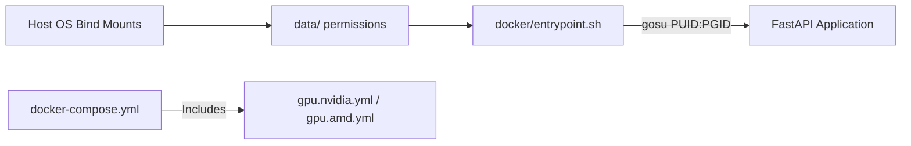

### Components
- **[`entrypoint.sh`](../docker/entrypoint.sh)**: Fixes the #1 self-hosting footgun—root ownership of bind-mounted volumes. It reads `PUID` and `PGID` environment variables, creates a matching unprivileged user (`odysseus`), `chown`s the `/data` directory appropriately, and drops privileges via `gosu` before starting the application. This ensures users can interact with downloaded SQLite or memory databases on the host OS natively without permission denied errors.
- **[`gpu.nvidia.yml`](../docker/gpu.nvidia.yml) & [`gpu.amd.yml`](../docker/gpu.amd.yml)**: Compose profiles that inject required hardware passthrough directives (`deploy.resources.reservations.devices` for NVIDIA, `/dev/kfd` and `/dev/dri` for AMD ROCm). The main compose file is kept minimal, while these profiles act as composable overlays depending on the user's hardware.

---

</details>

### Cookbook & System Utilities

<details>
<summary>View Cookbook & System Utilities</summary>

A collection of operational scripts, setup hooks, and diagnostic endpoints.

### Purpose
To initialize the app predictably and provide developers insights into the running system.

### Components
- **[`routes/cookbook_routes.py`](../routes/cookbook_routes.py), [`routes/hwfit_routes.py`](../routes/hwfit_routes.py), [`routes/diagnostics_routes.py`](../routes/diagnostics_routes.py)**: API endpoints exposing system load, GPU status (hardware fitness), and local recipes (cookbook).
- **[`routes/shell_routes.py`](../routes/shell_routes.py), [`routes/upload_routes.py`](../routes/upload_routes.py), [`routes/signature_routes.py`](../routes/signature_routes.py)**: Handles standard terminal requests to the host OS and manages file IO/upload chunking.
- **[`src/app_helpers.py`](../src/app_helpers.py), [`src/app_initializer.py`](../src/app_initializer.py), [`src/constants.py`](../src/constants.py), [`src/exceptions.py`](../src/exceptions.py)**: Foundational bootstrap code. Bootstraps the SQLite tables, loads `.env` variables, and defines global exception classes.


</details>

## Agent & AI Orchestration
<details>
<summary>View Agent & AI Orchestration</summary>

### Agent Orchestration, Tools & RAG

<details>
<summary>View Agent Orchestration, Tools & RAG</summary>

The Agent Loop is the brain of Odysseus, dynamically looping the LLM with local tools, semantic memory (RAG), and Teacher Escalation. It handles how the AI processes multi-step tasks.


### The Agent Loop ([`src/agent_loop.py`](../src/agent_loop.py))
1. **Prompt Assembly:** The loop begins by gathering context: recent messages, available tools, system instructions, and RAG (Retrieval Augmented Generation) context.
2. **Tool Selection (RAG vs Fallback):**
   - Odysseus uses a `ToolIndex` ([`src/tool_index.py`](../src/tool_index.py)) to semantically match available tools to the user's query. This prevents overwhelming the LLM prompt with hundreds of tool schemas.
   - If RAG fails or is skipped, it falls back to a keyword-based heuristic.
3. **Execution Round:** The model generates a response. If the response contains tool calls (e.g., "search the web", "read a file"), the loop intercepts it.
4. **Tool Dispatch:** The backend maps the tool call to Python functions (defined in [`src/tool_implementations.py`](../src/tool_implementations.py) and mapped via [`src/tool_execution.py`](../src/tool_execution.py)) or MCP counterparts.
5. **Re-injection:** The results of the tool execution are appended to the conversation history as a "tool response" message.
6. **Recursion:** The loop iterates, sending the updated history back to the model until the model provides a final answer or hits a maximum round limit.

### Loop Breakers & Supervisors
- **Runaway Detector:** Identifies if a model is repeatedly calling the same tool with identical arguments without making progress, and breaks the loop.
- **Intent-without-action Supervisor:** Detects if a model says it will do something (e.g., "Let me check the logs") but fails to actually emit a tool call. It nudges the model to perform the action.
- **Completion Verifier:** A secondary, independent LLM evaluation pass that verifies if the requested task is genuinely complete before allowing the agent to end its turn.

### Teacher Escalation ([`src/teacher_escalation.py`](../src/teacher_escalation.py))
For self-hosted models that may struggle with complex tasks, Odysseus implements a "Teacher Escalation" mechanism.
1. If the student model fails (detected via regex on tool errors or "giving up" language), it pauses.
2. It sends the failing trace to a configured "Teacher" model (typically a stronger, cloud-based API like GPT-4o or Claude 3.5 Sonnet).
3. The Teacher explains how to solve the problem and creates a structured `SKILL.md` file.
4. This new skill is saved to the `SkillsManager`, empowering the student model to succeed on similar tasks in the future.

### MCP & RAG Components
- **MCP Manager ([`src/mcp_manager.py`](../src/mcp_manager.py))**: Dynamically connects external Model Context Protocol servers via stdio/HTTP.
- **RAG & Memory ([`src/rag_manager.py`](../src/rag_manager.py), [`src/memory_vector.py`](../src/memory_vector.py))**: Vector store abstractions around ChromaDB using `fastembed` to index personal documents and memories.

---

</details>

### Chat Processing & Engine Logic ([`src/`](../src/))

<details>
<summary>View Chat Processing & Engine Logic ([`src/`](../src/))</summary>

The core execution of conversational AI interactions lives primarily in [`src/chat_processor.py`](../src/chat_processor.py), [`src/chat_handler.py`](../src/chat_handler.py), and [`src/agent_runs.py`](../src/agent_runs.py). These files form the glue bridging conversational memory with the underlying agent loop, assembling context objects, recording new learnings, and parsing complex documents inline.

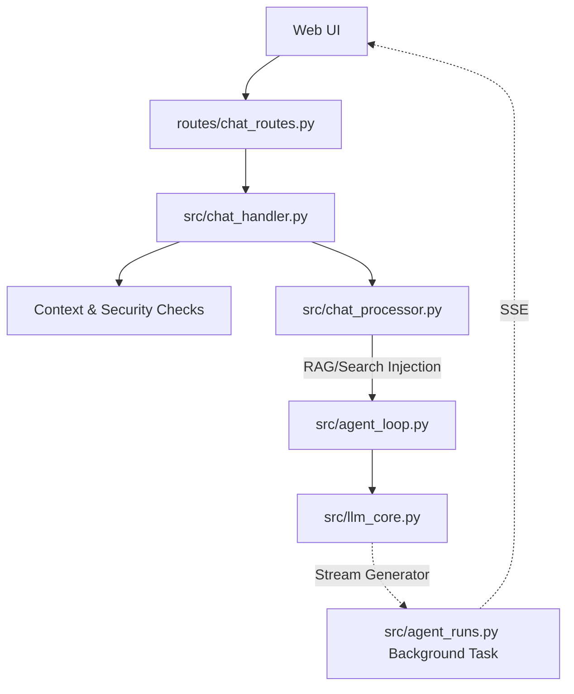

### Components
- **[`chat_handler.py`](../src/chat_handler.py):** Parses incoming chat requests, manages attachment validations, coerces sessions, and sets up the async streams.
- **[`chat_processor.py`](../src/chat_processor.py):** Applies NLP tasks. It checks for stopwords, extracts URLs directly via regex for immediate search querying, and handles security logic (like `UNTRUSTED_CONTEXT_POLICY`) to sanitize unsafe context windows.
- **[`chat_helpers.py`](../src/chat_helpers.py)**: Contains additional utilities for managing text chunking, formatting, and processing tasks required by the chat logic.
- **[`agent_runs.py`](../src/agent_runs.py):** Implements detached agent-runs. The model streams text even if the browser drops the SSE connection. This module catches the stream into a replay buffer that users can re-subscribe to upon page refresh, preventing mid-thought data loss.
- **[`routes/assistant_routes.py`](../routes/assistant_routes.py), [`src/assistant_log.py`](../src/assistant_log.py)**: Manages the persona traits of the primary assistant and logging of its internal monologue.
- **[`src/memory_provider.py`](../src/memory_provider.py), [`src/ai_interaction.py`](../src/ai_interaction.py)**: The interface between raw text streams and the structured memory graph.
- **[`src/context_budget.py`](../src/context_budget.py)**: Dynamically truncates conversational history so it fits securely within the model's configured input token limit.
- **[`routes/compare_routes.py`](../routes/compare_routes.py), [`routes/editor_draft_routes.py`](../routes/editor_draft_routes.py), [`src/pdf_form_doc.py`](../src/pdf_form_doc.py)**: Specialized tools for editing rich text documents inside the interface, and generating PDFs inline based on text fields.

---

</details>

### Action Intents & Chat Routing ([`src/action_intents.py`](../src/action_intents.py))

<details>
<summary>View Action Intents & Chat Routing ([`src/action_intents.py`](../src/action_intents.py))</summary>

Odysseus employs a lightweight routing heuristic to determine when a standard chat prompt should be promoted to full "agent mode" (invoking the agent loop and tools).

```mermaid
graph TD
    Input[User Prompt] --> Regex[Regex Intent Detection]
    Regex --> |"can you search...", "read this..."| Agent[Promote to Agent Mode]
    Regex --> |General question| Chat[Standard Chat Completion]
    Agent --> LoadTools[Load Tools & System Prompt]
    Chat --> LLM[LLM Generation]
```

### Purpose
To avoid unnecessary LLM overhead and reduce latency/cost, the system uses deterministic regex patterns to detect when a user is explicitly asking the assistant to take an action (e.g., "can you search...", "please read this file...") rather than simply asking an informational question.

### Mechanics
- **`ToolIntent`**: A dataclass that evaluates `needs_tools`, `category`, and `reason`.
- **Patterns**: Scans for imperative verbs ("search", "read", "deploy"), modal questions ("can you", "would you"), UI/panel toggles, calendar lookups, and deep research invocations. It explicitly avoids triggering on explanatory questions (e.g., "how do I use grep?").
- **Outcome**: If an action intent is detected, the frontend is signaled or the backend automatically escalates the chat into the agent loop, loading the necessary tools and system prompts. This keeps general conversational chat fast and cheap, while reserving the heavy, multi-prompt `Agent Loop` strictly for tool-use workflows.

---

</details>

### Agent Tools Subsystem ([`src/agent_tools/`](../src/agent_tools/))

<details>
<summary>View Agent Tools Subsystem ([`src/agent_tools/`](../src/agent_tools/))</summary>

Odysseus provides its agent loop with a suite of highly privileged, local-first tools. These are organized functionally to limit scope and ensure secure execution.

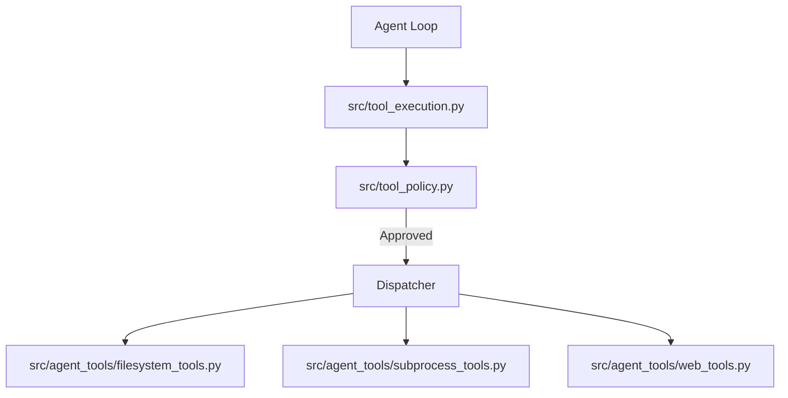

### Components
- **[`src/agent_tools/__init__.py`](../src/agent_tools/__init__.py)**: Agent tools package init.
- **Filesystem Tools ([`src/agent_tools/filesystem_tools.py`](../src/agent_tools/filesystem_tools.py))**: Provides concrete implementations for `read_file`, `write_file`, `list_directory`, etc. These tools are heavily sandboxed by the policy layer, meaning they generally cannot escape the [`data/`](../data/) directory unless explicitly authorized by an admin context.
- **Subprocess Tools ([`src/agent_tools/subprocess_tools.py`](../src/agent_tools/subprocess_tools.py))**: Allows the agent to run arbitrary shell commands. It manages timeout constraints, captures `stdout` and `stderr` safely, and ensures long-running processes do not hang the main agent loop.
- **Web Tools ([`src/agent_tools/web_tools.py`](../src/agent_tools/web_tools.py))**: Includes utilities for fetching webpage content, often interacting with local headless browsers or `BeautifulSoup` to strip away visual clutter and return clean markdown directly to the agent's context.

---

</details>

### Built-in Actions & Scheduled Tasks ([`src/builtin_actions.py`](../src/builtin_actions.py))

<details>
<summary>View Built-in Actions & Scheduled Tasks ([`src/builtin_actions.py`](../src/builtin_actions.py))</summary>

Odysseus features a registry of native automation actions that can be executed periodically by the task scheduler without needing to spin up an LLM.

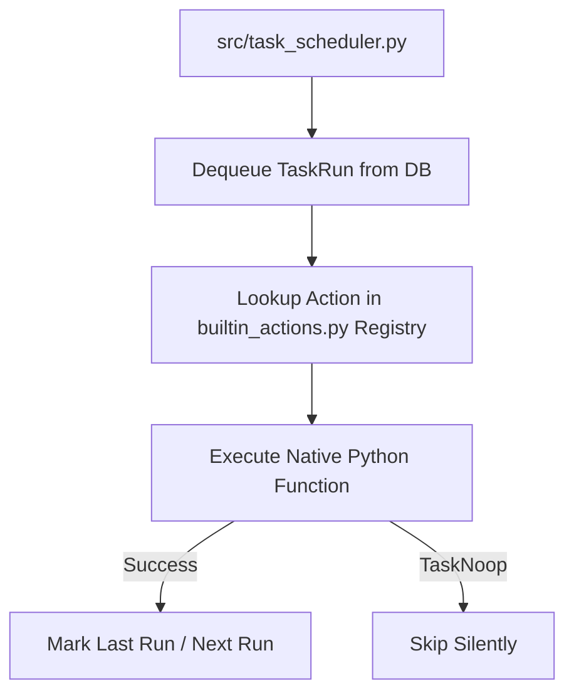

### Purpose
Provides reliable, zero-cost execution for routine system maintenance and user-defined scheduled tasks.

### Mechanics
- **Registry**: Houses predefined python functions mapped to string identifiers (e.g., `system.tidy_calendar`, `system.poll_email`).
- **`TaskNoop` Exception**: A silent exception used by actions to indicate there was nothing to do (e.g., no new emails, calendar already synced), preventing log spam.
- **Execution**: The scheduler ([`src/task_scheduler.py`](../src/task_scheduler.py)) dequeues pending tasks from the database and invokes the corresponding function in [`builtin_actions.py`](../src/builtin_actions.py).


</details>

## Data, Memory & RAG
<details>
<summary>View Data, Memory & RAG</summary>

### Data, Memory, and Storage

<details>
<summary>View Data, Memory, and Storage</summary>


All data is kept local within the [`data/`](../data/) directory, adhering to the project's privacy-first ethos.

### SQLite Database
- **[`src/database.py`](../src/database.py)**: Engine connection setup and dependency injection utilities for SQLite database connections.
- **Relational Data:** Managed via SQLAlchemy ([`data/app.db`](../data/app.db)).
- **Stores:** Chats, sessions, API tokens, MCP server configs, Webhooks, user privileges, scheduled tasks, and calendar events.

### ChromaDB (Vector Store)
- **Semantic Memory:** Odysseus uses `ChromaDB` and ONNX `fastembed` for vector similarity search.
- **`MemoryManager` ([`src/memory.py`](../src/memory.py)):** Extracts and stores long-term facts, preferences, and contacts. It uses hybrid search (Jaccard similarity + semantic keyword boosting) to inject relevant memories into the agent's context.

### SkillsManager
- Manages `SKILL.md` files representing procedures.
- Published skills and teacher-escalation drafts are injected into the agent prompt based on relevance to the current conversation.

---

</details>

### Model Configuration & RAG Core

<details>
<summary>View Model Configuration & RAG Core</summary>


The system coordinates between multiple LLM backends (local Ollama, OpenAI, Anthropic) while also maintaining a persistent RAG index.

### Purpose
Provides a unified layer to interact with LLMs and Vector Embeddings, hiding the implementation specifics from the main Agent Loop.

### Components
- **[`routes/model_routes.py`](../routes/model_routes.py) & [`src/model_discovery.py`](../src/model_discovery.py)**: Automatically polls APIs (e.g., standard `localhost:11434`) to list available models. [`model_discovery.py`](../src/model_discovery.py) aggregates these lists and surfaces them to the UI.
- **[`src/model_context.py`](../src/model_context.py) & [`src/endpoint_resolver.py`](../src/endpoint_resolver.py)**: Resolves logical model names to concrete endpoint URLs and handles context window limit calculations to prevent prompt overflow.
- **[`routes/embedding_routes.py`](../routes/embedding_routes.py) & [`src/embeddings.py`](../src/embeddings.py) & [`src/embedding_lanes.py`](../src/embedding_lanes.py)**: Configures the semantic search backend. Manages switching between external API embeddings (like OpenAI text-embedding-ada-002) and local fastembed onnx models.
- **[`src/chroma_client.py`](../src/chroma_client.py), [`src/rag_singleton.py`](../src/rag_singleton.py), [`src/rag_vector.py`](../src/rag_vector.py)**: Wrapper clients for the ChromaDB vector store, managing RAG collection logic and querying similarities.

---

</details>

### Advanced Memory & Skills Pipeline

<details>
<summary>View Advanced Memory & Skills Pipeline</summary>


Long-term semantic context goes beyond just storing facts; the system contains a dedicated pipeline for discovering, extracting, and importing structured "Skills".

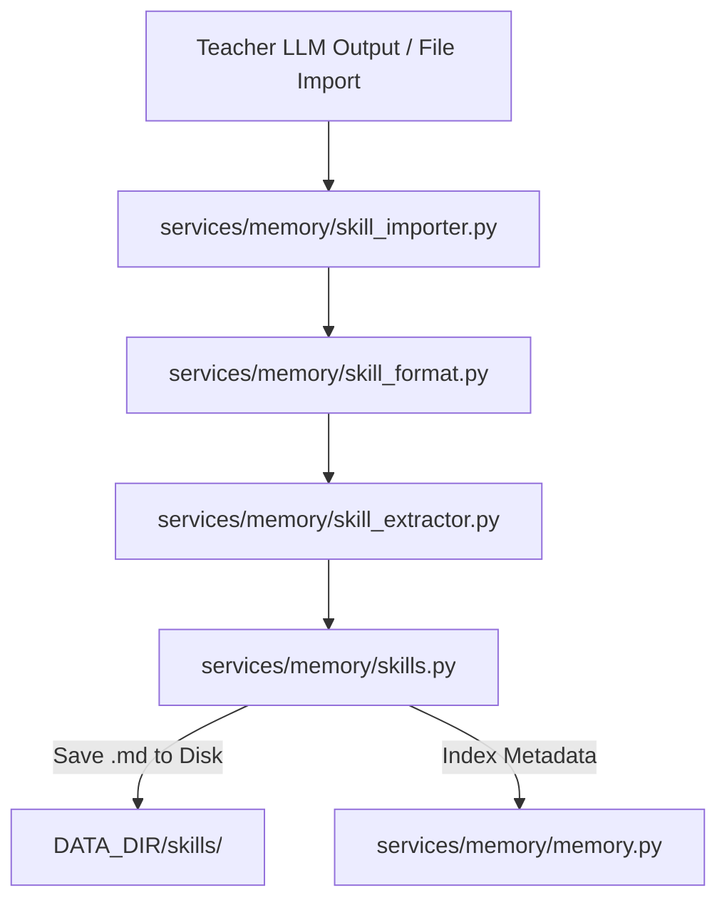

### Components
- **Skill Extraction ([`services/memory/skill_extractor.py`](../services/memory/skill_extractor.py), [`services/memory/memory_extractor.py`](../services/memory/memory_extractor.py))**: Uses intelligent parsing to derive structured procedure steps and preconditions from freeform conversation text or teacher model outputs. The generic `memory_extractor.py` handles parsing generic life facts and preferences.
- **Skill Formatting ([`services/memory/skill_format.py`](../services/memory/skill_format.py))**: Ensures that every skill strictly adheres to the markdown specifications required for the Agent loop to parse it effectively (e.g., maintaining `SKILL.md` boundaries).
- **Skill Importer ([`services/memory/skill_importer.py`](../services/memory/skill_importer.py))**: Handles the ingest of external skill packs (like those from the integrations folder), safely validating content without trusting external metadata completely.
- **Manager ([`services/memory/skills.py`](../services/memory/skills.py))**: The central service that orchestrates reading and writing skills to the local disk and synchronizing them with the Vector Database for semantic retrieval later.


</details>

</details>

## Features & Integrations
<details>
<summary>View Features & Integrations</summary>

### External Integrations & Companion Bridge

<details>
<summary>View External Integrations & Companion Bridge</summary>

Odysseus can pair with companion apps, securely bridge third-party AI agents, and dispatch external webhooks.
- **Companion Bridge API ([`companion/README.md`](../companion/README.md))**: Detailed API routes and setup instructions for the mobile bridge.
- **Claude Code Integration ([`integrations/claude/`](../integrations/claude/))**: A skill bundle enabling Anthropic's Claude Code CLI to connect to the scoped Odysseus API. Includes a setup guide ([`README.md`](../integrations/claude/README.md)) and the skill definition ([`SKILL.md`](../integrations/claude/skills/odysseus/SKILL.md)).
- **Codex Integration ([`integrations/codex/`](../integrations/codex/))**: A plugin enabling the Codex Agent to interact with Odysseus data. Contains its setup guide ([`README.md`](../integrations/codex/README.md)), plugin manifest ([`plugin.json`](../integrations/codex/.codex-plugin/plugin.json)), and skill definition ([`SKILL.md`](../integrations/codex/skills/odysseus/SKILL.md)).

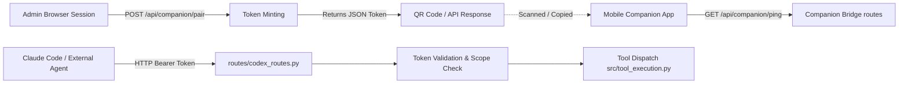

### Components
- **Companion Bridge ([`companion/pairing.py`](../companion/pairing.py), [`companion/routes.py`](../companion/routes.py), [`companion/__init__.py`](../companion/__init__.py))**: Manages secure pairing using tokens and QR codes, allowing mobile or external apps to interact with the API securely without duplicating core LLM logic. Endpoints like `/api/companion/info` allow discovery, while token minting enforces strict CSRF protections.
- **Webhook Manager ([`src/webhook_manager.py`](../src/webhook_manager.py))**: Dispatches system events out to configured webhooks securely, filtering out private IP loopbacks.
- **External API Integrations ([`src/integrations.py`](../src/integrations.py))**: A generalized module to store and resolve API keys, OAuth tokens, and connection configs for external tools.
- **The "Codex" Abstraction ([`routes/codex_routes.py`](../routes/codex_routes.py))**: Historically named "codex", this router exposes the canonical, scope-gated API endpoints (`/api/codex/*`) that external agents (like Claude Code) hit to list available tools and execute them. Plugins reside in [`integrations/claude/`](../integrations/claude/) and utilize Python glue scripts like [`integrations/claude/skills/odysseus/scripts/odysseus_api.py`](../integrations/claude/skills/odysseus/scripts/odysseus_api.py) and [`integrations/codex/scripts/odysseus_api.py`](../integrations/codex/scripts/odysseus_api.py) to securely relay tool calls to the backend. API tokens are strictly scoped.
- **YouTube Handler ([`src/youtube_handler.py`](../src/youtube_handler.py))**: Provides core YouTube video interaction capabilities, transcript fetching, and metadata extraction.

---

</details>

### MCP Extensibility & Built-in Servers

<details>
<summary>View MCP Extensibility & Built-in Servers</summary>

The system natively supports adding extensions via the Model Context Protocol (MCP), registering native functionalities, and supporting third-party subscriptions.

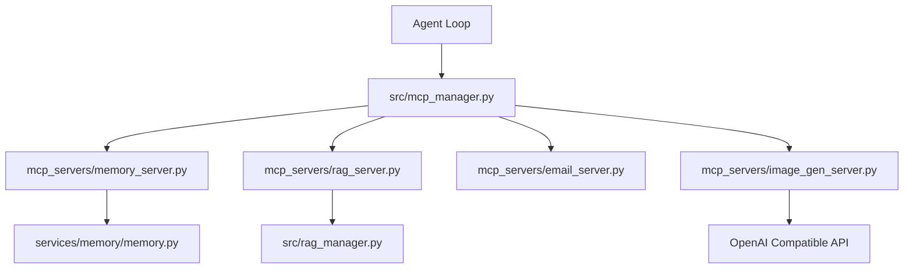

### Purpose
To leverage existing Copilot subscriptions, register built-in tools like memory or email cleanly into the prompt, and allow dynamic loading of tools that aren't natively compiled into the Python source.

### Components
- **MCP Manager ([`src/mcp_manager.py`](../src/mcp_manager.py), [`routes/mcp_routes.py`](../routes/mcp_routes.py), [`src/builtin_mcp.py`](../src/builtin_mcp.py), [`src/mcp_oauth.py`](../src/mcp_oauth.py))**: Scaffolds the setup and oauth workflows required to integrate external MCP servers (e.g., Google Drive, GitHub) via stdio or HTTP. It dynamically converts MCP JSON schemas into OpenAI-compatible function calling schemas.
- **Built-in Servers ([`mcp_servers/`](../mcp_servers/))**:
  - **[`mcp_servers/__init__.py`](../mcp_servers/__init__.py)**: Initialization file for the MCP servers package.
  - **Memory Server ([`mcp_servers/memory_server.py`](../mcp_servers/memory_server.py))**: Exposes facts, preferences, and events directly bridging to `MemoryManager`.
  - **RAG Server ([`mcp_servers/rag_server.py`](../mcp_servers/rag_server.py))**: Gives the agent control over the semantic store.
  - **Email Server ([`mcp_servers/email_server.py`](../mcp_servers/email_server.py))**: Allows AI to query IMAP, download attachments, and compose replies over SMTP.
  - **Image Generation ([`mcp_servers/image_gen_server.py`](../mcp_servers/image_gen_server.py))**: Proxies image generation commands and inserts URL responses into the chat.
- **Copilot Provider ([`src/copilot.py`](../src/copilot.py), [`routes/copilot_routes.py`](../routes/copilot_routes.py), [`routes/chatgpt_subscription_routes.py`](../routes/chatgpt_subscription_routes.py), [`src/chatgpt_subscription.py`](../src/chatgpt_subscription.py))**: Implements GitHub OAuth Device Flow to use Copilot's backing models as an LLM provider. Emulates an OpenAI-compatible endpoint by injecting required headers without needing a separate API key or token exchange. Additionally manages reverse-engineered ChatGPT Plus subscription token lifecycles.

---

</details>

### Deep Research ([`src/deep_research.py`](../src/deep_research.py))

<details>
<summary>View Deep Research ([`src/deep_research.py`](../src/deep_research.py))</summary>

An iterative `Think → Search → Extract → Synthesize` loop that generates sub-queries, executes searches, extracts content, and synthesizes findings into a final report.

---

</details>

### Email & CalDAV Integration

<details>
<summary>View Email & CalDAV Integration</summary>

- **Email:** Built-in IMAP/SMTP triage. It can summarize, auto-tag, and draft replies using AI.
- **CalDAV:** Local-first calendar synchronization with external providers (Radicale, Nextcloud, Apple, Fastmail).


</details>

## Core Systems (Search, Auth, Files)
<details>
<summary>View Core Systems (Search, Auth, Files)</summary>

### Security, Authentication & User Management

<details>
<summary>View Security, Authentication & User Management</summary>

Odysseus treats the self-hosted environment like an admin console due to powerful local tools (shell, file IO). It uses a combination of route handling and helper logic to manage access control.

### Purpose
To authenticate incoming requests, issue and validate tokens, protect routes, and provide device-flow authorization when needed.

### Components
- **AuthManager & Routing ([`core/auth.py`](../core/auth.py), [`routes/auth_routes.py`](../routes/auth_routes.py), [`src/auth_helpers.py`](../src/auth_helpers.py)):** Handles bcrypt-hashed passwords, session cookies, and user login logic. Enabled by `AUTH_ENABLED=true`. Generates JWT tokens and authenticates against the user database.
- **API Tokens ([`src/api_key_manager.py`](../src/api_key_manager.py)):** Supports Bearer token authentication for external integrations (like Webhooks or Zapier). Tokens are cached for performance and invalidated on change.
- **Security Middleware:** `SecurityHeadersMiddleware` enforces safe browser headers. `AuthMiddleware` protects routes and validates proxy/tunnel forwarding headers to prevent auth bypass.
- **Device Flow ([`routes/device_flow.py`](../routes/device_flow.py)):** Facilitates the OAuth 2.0 Device Authorization Grant, allowing head-less devices to securely pair.

---

</details>

### Vault & Secret Storage ([`src/secret_storage.py`](../src/secret_storage.py), [`routes/vault_routes.py`](../routes/vault_routes.py))

<details>
<summary>View Vault & Secret Storage ([`src/secret_storage.py`](../src/secret_storage.py), [`routes/vault_routes.py`](../routes/vault_routes.py))</summary>

Odysseus provides an encrypted secret store, safeguarding credentials while ensuring usability.

```mermaid
graph TD
    App[FastAPI Endpoints] --> SecretStore[src/secret_storage.py]
    SecretStore --> KeyFile[.app_key (chmod 600)]
    SecretStore --> SQLite[(data/app.db)]
    App --> VaultRoute[routes/vault_routes.py]
    VaultRoute --> VaultCLI[bw / Bitwarden CLI]
    VaultCLI --> TokenFile[(data/vault.json)]
```

### Components
- **Secret Storage ([`src/secret_storage.py`](../src/secret_storage.py))**: A Fernet-based symmetric encryption module. It generates an [`.app_key`](../data/.app_key) (secured with `0o600` permissions) to encrypt sensitive configuration data, such as IMAP/SMTP passwords, before storing them in the SQLite database. Encrypted rows are prepended with `enc:` to seamlessly handle unencrypted legacy values.
- **Vault Integration ([`routes/vault_routes.py`](../routes/vault_routes.py))**: A wrapper around the `bw` (Bitwarden / Vaultwarden) CLI. It allows admins to unlock their vault, caching the session token in [`data/vault.json`](../data/vault.json). Passwords are deliberately passed via `stdin` rather than command-line arguments to prevent leakage into `ps` or `/proc/<pid>/cmdline`.

---

</details>

### Threat Model & Prompt Security ([`THREAT_MODEL.md`](../THREAT_MODEL.md), [`src/prompt_security.py`](../src/prompt_security.py))

<details>
<summary>View Threat Model & Prompt Security ([`THREAT_MODEL.md`](../THREAT_MODEL.md), [`src/prompt_security.py`](../src/prompt_security.py))</summary>

Managing the interaction between the system, the LLM, and external data is critical for both utility and safety. Odysseus acknowledges its nature as a privileged admin console.

### Key Tenets
1. **Admin Isolation**: Admins have full access (shell, files, MCP, etc.). Non-admin users are strictly segregated and cannot execute commands or read arbitrary files.
2. **Internal Tool Loopback**: The agent loop talks back to the API over a secured loopback using a random, non-persisted `INTERNAL_TOOL_TOKEN`. The backend explicitly verifies the user's privilege before allowing the loopback to execute an admin-only tool.
3. **No Network Egress Sandbox**: Tools executed by the LLM run directly as the app process user. A successful prompt-injection attack that escapes the prompt security wrapper could execute shell commands, but only if the user is an admin.

### Components
- **Preset Manager ([`src/preset_manager.py`](../src/preset_manager.py))**: Maintains predefined system prompts, temperature configurations, and max token limits (`Code Analyze`, `Brainstorm`, `Reason`) as well as user-created templates. It performs atomic, concurrent-safe writes to [`data/presets.json`](../data/presets.json).
- **Prompt Security ([`src/prompt_security.py`](../src/prompt_security.py))**: Defends against prompt-injection attacks. Any text originating from a potentially untrusted source (emails, web results, external URLs) is sandboxed inside a `<<<UNTRUSTED_SOURCE_DATA>>>` boundary. The wrapper instructs the LLM strictly to treat the encapsulated content as data rather than executable instructions, preventing malicious documents from co-opting the agent.

---

</details>

### Search Provider & Ranking Engine

<details>
<summary>View Search Provider & Ranking Engine</summary>

Odysseus implements a modular and extensible search abstraction tier, allowing swapping of underlying search providers while maintaining unified output format and caching.

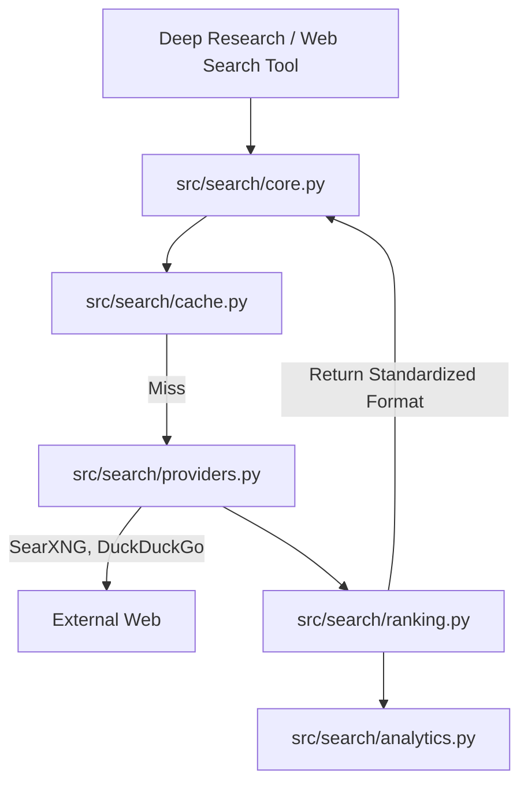

### Components
- **[`src/search/__init__.py`](../src/search/__init__.py)**: Search package init.
- **Core Orchestrator ([`src/search/core.py`](../src/search/core.py), [`services/search/`](../services/search/))**: Manages the flow of fetching configurations and routing the search term to the designated active provider.
- **Query & Content Handlers ([`src/search/query.py`](../src/search/query.py), [`src/search/content.py`](../src/search/content.py))**: Handles parsing of search intent into actionable query objects and extracts raw text or metadata from webpage bodies respectively.
- **Caching ([`src/search/cache.py`](../src/search/cache.py))**: Reduces outbound requests by locally caching queries with identical parameters.
- **Provider Implementations ([`src/search/providers.py`](../src/search/providers.py))**: Abstracts provider-specific API oddities (e.g., JSON handling from SearXNG vs raw HTTP scraping from DuckDuckGo) into a standardized `dict` format.
- **Ranking & Analytics ([`src/search/ranking.py`](../src/search/ranking.py), [`src/search/analytics.py`](../src/search/analytics.py))**: Analyzes results to filter out spam or low-quality hits before they reach the LLM, tracking failure rates and error conditions centrally.

<details>
<summary>Click to view granular descriptions of `src/search/` files</summary>

- **[`src/search/__init__.py`](../src/search/__init__.py)**: Initialization file for the modular search package.
- **[`src/search/analytics.py`](../src/search/analytics.py)**: Collects metrics on search successes, failure rates, and provider latencies to optimize automated routing.
- **[`src/search/cache.py`](../src/search/cache.py)**: Implements caching mechanisms to store and retrieve recent search queries, minimizing repetitive outbound API calls.
- **[`src/search/content.py`](../src/search/content.py)**: Manages fetching and extracting clean, readable text from webpage bodies, stripping out irrelevant HTML boilerplate.
- **[`src/search/core.py`](../src/search/core.py)**: The central orchestrator for the search module, directing queries to the active provider and aggregating results.
- **[`src/search/providers.py`](../src/search/providers.py)**: Contains implementations for various backend search services (like SearXNG or DuckDuckGo) normalizing their distinct outputs.
- **[`src/search/query.py`](../src/search/query.py)**: Defines data structures and parsing logic for standardizing search requests and intent.
- **[`src/search/ranking.py`](../src/search/ranking.py)**: Evaluates and scores search results based on relevance and quality heuristics before presenting them to the LLM.
</details>

- **Frontend Clients ([`static/js/search.js`](../static/js/search.js), [`static/js/search-chat.js`](../static/js/search-chat.js))**: Responsible for coordinating web search UI state and injecting results into the chat flow.

---

</details>

### Deep Research & Topic Analysis

<details>
<summary>View Deep Research & Topic Analysis</summary>

Deep Research allows multi-step, autonomous information gathering resulting in a visually appealing HTML report. It facilitates complex web searching, summarization, and extracting topic intent from queries.

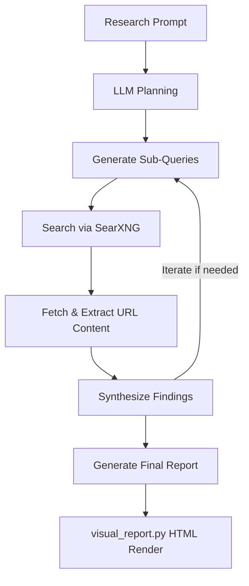

### Components
- **Deep Researcher ([`src/deep_research.py`](../src/deep_research.py))**: The orchestration class. Implements an iterative think-search-extract-synthesize loop.
- **Research API & Handlers ([`routes/research_routes.py`](../routes/research_routes.py), [`src/research_handler.py`](../src/research_handler.py))**: Manages the API surface and underlying orchestration to spin off long-running deep research loops.
- **Search Utilities ([`src/research_utils.py`](../src/research_utils.py), [`routes/search_routes.py`](../routes/search_routes.py))**: Utilities for parsing web scrape data and routes to interface with SearXNG backends for general querying.
- **Visual Report ([`src/visual_report.py`](../src/visual_report.py))**: Transforms the synthesized markdown report and JSON sources into a self-contained, themed HTML file with a table of contents and inline references.
- **Topic Analysis ([`src/topic_analyzer.py`](../src/topic_analyzer.py), [`src/goal_based_extractor.py`](../src/goal_based_extractor.py))**: Analyzes the generated content dynamically to form a structured summary or determine if the research goal has been met.


</details>

## Workspace & Apps
<details>
<summary>View Workspace & Apps</summary>

### Document & Workspace Logic

<details>
<summary>View Document & Workspace Logic</summary>


Odysseus supports an AI-assisted rich text and markdown editor.

### Components
- **[`src/document_processor.py`](../src/document_processor.py):** Determines if a document is code, text, or binary. Applies syntax formatting to specific extensions and prepares text to be manipulated by the LLM.
- **[`src/document_actions.py`](../src/document_actions.py):** Contains functions that process AI commands on documents (like inpainting, summarization, or translation) directly on the document body.
- **Document Editor Streaming:** Much like chat, document updates are streamed live to the UI via Server-Sent Events, ensuring that AI transformations (or collaborative sync updates) are rendered immediately in the markdown editor without requiring full page reloads. This relies heavily on invariants tested by the Node.js suite inside [`tests/streaming/`](../tests/streaming/).

---

</details>

### Personal & Workspace Data

<details>
<summary>View Personal & Workspace Data</summary>


This module handles isolated user contexts such as personal settings, contacts, and workspace-specific document storage.

### Purpose
To ensure multi-tenancy and data isolation where users only interact with their configured environment.

### Components
- **Personal Document RAG ([`services/docs/service.py`](../services/docs/service.py))**: A dedicated service wrapper `DocsService` that interfaces with the underlying `RAGManager`. It handles bulk directory indexing, querying the document vector index, and surfacing retrieval stats. The frontend counterparts like [`documentLibrary.js`](../static/js/documentLibrary.js) interface with these APIs.
- **[`routes/personal_routes.py`](../routes/personal_routes.py) & [`src/personal_docs.py`](../src/personal_docs.py)**: Handles user-specific document uploads that feed into their personalized RAG store.
- **[`src/settings.py`](../src/settings.py) & [`src/settings_scrub.py`](../src/settings_scrub.py) & [`routes/prefs_routes.py`](../routes/prefs_routes.py)**: Manages reading and writing application preferences, including redacting (scrubbing) secrets before returning config to the client.
- **[`routes/contacts_routes.py`](../routes/contacts_routes.py)**: Stores and retrieves contact lists used by agents for communication tasks.
- **[`routes/backup_routes.py`](../routes/backup_routes.py) & [`routes/admin_wipe_routes.py`](../routes/admin_wipe_routes.py)**: Administrative endpoints to export the entire workspace data as zip or to perform dangerous reset operations safely.

---

</details>

### Tasks, Background Jobs & Notes

<details>
<summary>View Tasks, Background Jobs & Notes</summary>


Odysseus implements a built-in scheduler to manage long-running operations and recurring events natively.

### Components
- **[`src/task_scheduler.py`](../src/task_scheduler.py):** An asynchronous scheduler managing `ScheduledTask` entries from the database. It handles deduplication of API fetches with a TTL cache (`_shared_cache`) for simultaneous triggers and executes recurring tasks reliably.
- **[`src/bg_jobs.py`](../src/bg_jobs.py):** Runs heavy operations (like `ffmpeg`, model downloads, package installations via the `bash` tool) in a detached process. The agent writes exit-code status files rather than relying on live PIDs, guaranteeing survival across server restarts.
- **[`src/task_endpoint.py`](../src/task_endpoint.py) / [`src/note_routes.py`](../routes/note_routes.py):** Expose endpoints for creating quick-capture notes, to-do lists, and scheduled actions that the system acts on periodically.

---

</details>

### File Uploads & Document Parsers

<details>
<summary>View File Uploads & Document Parsers</summary>


To extract and interpret user data natively, Odysseus incorporates several parsing strategies.

### Components
- **[`src/upload_handler.py`](../src/upload_handler.py):** Governs file ingests. It standardizes sanitization (`secure_filename`), applies environment-defined limits ([`upload_limits.py`](../src/upload_limits.py)), and moves the artifacts to `DATA_DIR/uploads`.
- **PDF Infrastructure ([`src/pdf_runtime.py`](../src/pdf_runtime.py), [`src/pdf_forms.py`](../src/pdf_forms.py), [`src/pdf_form_doc.py`](../src/pdf_form_doc.py))**:
  - Uses `PyMuPDF` (when optionally installed) for robust PDF handling.
  - Extracts text and parses fillable AcroForm fields.
  - Features dynamic HTML-comment and markdown generation (`pdf_form_doc.py`) to turn a visual PDF form into an editable markdown document, preserving the hidden widget metadata in sidecar files.
  - Provides advanced abilities like stamping user-drawn signature PNGs or text directly onto exact X/Y coordinates over a PDF page.
- **Office Document Parsing ([`src/markitdown_runtime.py`](../src/markitdown_runtime.py)):** Provides extraction for proprietary office formats (`.docx`, `.xlsx`, `.pptx`) using the `markitdown` tool, converting complex structural elements into flat Markdown suitable for the LLM context window.

---

</details>

### Gallery & Media Editing

<details>
<summary>View Gallery & Media Editing</summary>


Odysseus includes an AI-integrated gallery and media editor.

### Components
- **Gallery Routes ([`routes/gallery_routes.py`](../routes/gallery_routes.py))**: Exposes REST endpoints to query, filter, and upload images. All queries are heavily owner-scoped to ensure strict tenant isolation.
- **Frontend State ([`static/js/gallery.js`](../static/js/gallery.js), [`static/js/galleryEditor.js`](../static/js/galleryEditor.js))**: Manages the multi-select interface, tag filtering, album sorting, and dynamic grid rendering, alongside routing into the standalone image editor.
- **AI Editor ([`static/js/editor/`](../static/js/editor/))**: A complex, multi-layered HTML5 canvas application. Features include checkerboard backgrounds, mask creation tools ([`wand.js`](../static/js/editor/tools/wand.js), [`lasso.js`](../static/js/editor/tools/lasso.js)), image composition ([`clone.js`](../static/js/editor/tools/clone.js)), and direct hooks to the backend for AI-assisted operations like inpainting or background removal ([`ai-inpaint.js`](../static/js/editor/ai-inpaint.js), [`ai-rembg.js`](../static/js/editor/ai-rembg.js)).

---

</details>

### Session & History Management

<details>
<summary>View Session & History Management</summary>


A core feature of the agent UI is managing conversational sessions and historical context over time.

### Purpose
To persist user chats across reloads, prune stale data, and provide search functionalities over past conversations.

### Components
- **[`routes/session_routes.py`](../routes/session_routes.py) & [`src/session_actions.py`](../src/session_actions.py)**: Manages REST API endpoints for loading, renaming, and exporting chat sessions. Handles state logic like creating new empty sessions.
- **[`src/session_search.py`](../src/session_search.py) & [`routes/history_routes.py`](../routes/history_routes.py)**: Powers the UI's sidebar history lookup. [`session_search.py`](../src/session_search.py) performs the database lookups across raw JSON blobs containing chat history.
- **[`routes/cleanup_routes.py`](../routes/cleanup_routes.py) & [`src/cleanup_service.py`](../src/cleanup_service.py)**: Manages garbage collection of orphaned session data, preventing the SQLite database from bloating infinitely with abandoned drafts.

---

</details>

### Context Compaction ([`src/context_compactor.py`](../src/context_compactor.py))

<details>
<summary>View Context Compaction ([`src/context_compactor.py`](../src/context_compactor.py))</summary>


To prevent the LLM context window from overflowing during long sessions, Odysseus implements an automatic context compaction mechanism.

```mermaid
graph TD
    History[Conversation History] --> Check[Estimate Token Count]
    Check --> |Exceeds Threshold| Isolate[Isolate Oldest Messages]
    Isolate --> Summarize[LLM Summarization Call]
    Summarize --> DBUpdate[Replace Messages with Summary System Message]
    DBUpdate --> NewHistory[Compacted Conversation History]
    Check --> |Within Threshold| Proceed[Continue Normally]
```

### Purpose
It ensures that long-running conversations do not crash due to token limits while preserving essential context and historical facts.

### Mechanics
- **Token Estimation**: Monitors the token count of the conversation history.
- **Compaction Trigger**: When the context approaches a predefined limit, it isolates the oldest messages.
- **Summarization**: It uses a fast LLM call (often a smaller model or the current one) to generate a dense summary of the oldest interactions.
- **State Update**: Replaces the summarized block in the SQLite database with a single "system" message containing the summary, significantly reducing token usage while maintaining narrative continuity.

---

</details>

### Email & Calendar Sync

<details>
<summary>View Email & Calendar Sync</summary>


Odysseus features robust, local-first syncing for emails (IMAP/SMTP) and calendars (CalDAV).

```mermaid
graph TD
    ExtCal[External CalDAV Server] <--> Sync[caldav_sync.py]
    ExtMail[IMAP / SMTP Server] <--> MailPoll[email_pollers.py]
    Sync <--> DB[(SQLite Local Cache)]
    MailPoll <--> DB
    MailPoll --> Parser[email_thread_parser.py]
    MailPoll --> LLM[Auto Summarize & Classify]
```

### Components
- **CalDAV Sync ([`src/caldav_sync.py`](../src/caldav_sync.py), [`src/caldav_writeback.py`](../src/caldav_writeback.py))**: Resolves CalDAV hosts, fetches `.ics` events, caches them locally, and pushes local edits back to the remote server.
- **Email Pollers ([`routes/email_pollers.py`](../routes/email_pollers.py))**: Background threads that poll IMAP folders, detect new mail, and run background LLM tasks to summarize, tag, or auto-reply.
- **Thread Parser ([`src/email_thread_parser.py`](../src/email_thread_parser.py))**: An advanced HTML/plaintext parser that strips quotes, mashes headers, and normalizes email body contents for LLM consumption.
- **Frontend Mail UI ([`static/js/emailInbox.js`](../static/js/emailInbox.js), [`static/js/emailLibrary/state.js`](../static/js/emailLibrary/state.js), [`static/js/emailLibrary/utils.js`](../static/js/emailLibrary/utils.js))**: Responsible for the email inbox view, state management of selected threads, and formatting tools.

---

</details>

### Cookbook & Hardware Fitness

<details>
<summary>View Cookbook & Hardware Fitness</summary>


The "Cookbook" automatically analyzes host hardware to recommend, download, and serve models.

```mermaid
graph LR
    OS[OS / sysfs / WMI] --> HW[Hardware Discovery hardware.py]
    HW --> Fit[Fitness Scoring fit.py]
    Fit --> Serve[Model Serving cookbook_serve_lifecycle.py]
    Serve --> Engine[vLLM / llama.cpp / tmux]
```

### Components
- **Hardware Discovery ([`services/hwfit/hardware.py`](../services/hwfit/hardware.py))**: Reads `/sys/class/drm`, `nvidia-smi`, or Windows WMI to accurately gauge CPU, RAM, GPU architectures, and VRAM availability.
- **Fitness Scoring & Routing ([`services/hwfit/fit.py`](../services/hwfit/fit.py))**:
  - Computes a dynamic `_fit_score` based on required vs. available VRAM and context window parameters.
  - `image_models.py` and `profiles.py` provide specific tuning constraints and known parameter bounds for stable diffusion and language model variants.
  - Manages quantization formats (e.g., distinguishing between GGUF for llama.cpp vs AWQ/FP8 for vLLM).
  - Explicitly restricts consumer AMD hardware (RDNA) and Apple Silicon platforms to GGUF formats to ensure compatibility, hiding models that won't run locally.
- **Serve Lifecycle ([`src/cookbook_serve_lifecycle.py`](../src/cookbook_serve_lifecycle.py))**: Orchestrates the downloading and serving of models via `tmux` sessions, hooking directly into local inference engines like vLLM or Ollama.

---

</details>

### Cookbook UI State Machine

<details>
<summary>View Cookbook UI State Machine</summary>


The local model manager ("Cookbook") features a robust client-side state machine capable of tracking detached background processes safely across browser refreshes.

```mermaid
graph TD
    User[Client] --> CookbookUI[cookbook.js]
    CookbookUI --> Diagnosis[cookbook-diagnosis.js]
    CookbookUI --> HWFit[cookbook-hwfit.js]
    HWFit --> |Fetch Metrics| HWAPI[routes/hwfit_routes.py]
    CookbookUI --> Actions[Download / Serve]
    Actions --> Download[cookbookDownload.js]
    Actions --> Serve[cookbookServe.js]
    Download --> |SSE Tracking| Signal[cookbookProgressSignal.js]
    Serve --> Running[cookbookRunning.js]
```

### Components
- **Core Wrapper ([`static/js/cookbook.js`](../static/js/cookbook.js))**: Main orchestrator for cookbook UI integration.
- **UI Diagnostics ([`static/js/cookbook-diagnosis.js`](../static/js/cookbook-diagnosis.js))**: Polling mechanisms to verify if background processes like `ollama` or `vllm` are accessible before allowing operations.
- **Hardware Fitness Client ([`static/js/cookbook-hwfit.js`](../static/js/cookbook-hwfit.js))**: Renders the visual bars for required VRAM and Context Window budgeting based on the data provided by the backend's [`fit.py`](../services/hwfit/fit.py) via [`hwfit_routes.py`](../routes/hwfit_routes.py).
- **Process Signals ([`static/js/cookbookProgressSignal.js`](../static/js/cookbookProgressSignal.js), [`static/js/cookbookDownload.js`](../static/js/cookbookDownload.js), [`static/js/cookbookServe.js`](../static/js/cookbookServe.js), [`static/js/cookbookRunning.js`](../static/js/cookbookRunning.js), [`static/js/cookbookSchedule.js`](../static/js/cookbookSchedule.js))**: Tracks asynchronous SSE streams for model downloads and serving execution. If the browser tab is closed during a download, the next time the Cookbook is opened, [`cookbookRunning.js`](../static/js/cookbookRunning.js) attempts to reconnect and parse the active system state to restore the progress bar seamlessly.

---

</details>

### Tooling, Execution & Security

<details>
<summary>View Tooling, Execution & Security</summary>


Odysseus dynamically gives tools to the LLMs, requiring strict security boundaries.

### Purpose
To execute code and filesystem tools securely while protecting the host machine from rogue LLM behavior.

### Components
- **[`src/tool_execution.py`](../src/tool_execution.py) & [`src/tool_utils.py`](../src/tool_utils.py)**: Core executors that actually perform requested actions, like appending to a file or running a bash command.
- **[`src/tool_parsing.py`](../src/tool_parsing.py) & [`src/tool_schemas.py`](../src/tool_schemas.py)**: Maps unstructured LLM responses (JSON or XML) into strictly typed Pydantic models for execution.
- **[`src/tool_policy.py`](../src/tool_policy.py) & [`src/tool_security.py`](../src/tool_security.py)**: Enforces rules about which tools an agent can call. Blocks read/write paths outside the designated `/data` workspace unless running as an explicit administrator.
- **[`src/url_safety.py`](../src/url_safety.py) & [`src/url_security.py`](../src/url_security.py) & [`src/tls_overrides.py`](../src/tls_overrides.py)**: Analyzes generated outbound URLs (e.g., web scraping calls) to ensure they are external, preventing Server Side Request Forgery (SSRF) onto local networks.

---

</details>

### Multimedia & Background Tasks

<details>
<summary>View Multimedia & Background Tasks</summary>


The system handles more than just text generation, acting as an ambient AI workspace.

### Purpose
To handle audio processing (TTS/STT), gallery imaging, background scheduling, and calendar synchronization.

### Components
- **[`routes/stt_routes.py`](../routes/stt_routes.py) & [`routes/tts_routes.py`](../routes/tts_routes.py)**: Fast endpoints interfacing with whisper (or remote endpoints) for speech-to-text and text-to-speech.
- **[`routes/gallery_helpers.py`](../routes/gallery_helpers.py) & [`src/generated_images.py`](../src/generated_images.py)**: Helper logic routing for AI image generation (e.g., Stable Diffusion) and parsing EXIF data.
- **[`routes/task_routes.py`](../routes/task_routes.py), [`routes/calendar_routes.py`](../routes/calendar_routes.py), [`src/bg_monitor.py`](../src/bg_monitor.py)**: Core routing for user-scheduled tasks and cron jobs. [`bg_monitor.py`](../src/bg_monitor.py) polls for detached subprocesses to ensure background routines complete cleanly.

---

</details>

</details>

## Infrastructure, Ops & Testing
<details>
<summary>View Infrastructure, Ops & Testing</summary>

### Deployment, Hardware Discovery & Background Jobs

<details>
<summary>View Deployment, Hardware Discovery & Background Jobs</summary>

Odysseus is designed to run anywhere, but Docker is recommended. It employs standard and GPU-accelerated Docker builds along with native OS scripts.

### Hardware Discovery ([`services/hwfit/`](../services/hwfit/))
The `hwfit` module analyzes the host machine (RAM, VRAM, GPU bandwidth) to score HuggingFace models. Models fitting entirely in VRAM are prioritized.

### Deployment Models & Launchers
- **Docker Compose:** The default setup runs Odysseus alongside ChromaDB and SearXNG, orchestrated by [`docker-compose.yml`](../docker-compose.yml).
- **Docker Entrypoints ([`docker/entrypoint.sh`](../docker/entrypoint.sh))**: Runs PUID/PGID matching to ensure bind-mounted volumes don't suffer from root-ownership permission issues.
- **GPU Passthrough:** Special overlays ([`docker-compose.gpu-nvidia.yml`](../docker-compose.gpu-nvidia.yml), [`docker-compose.gpu-amd.yml`](../docker-compose.gpu-amd.yml)) configure NVIDIA or AMD ROCm passthrough.
- **Native Launchers ([`launch-windows.ps1`](../launch-windows.ps1), [`start-macos.sh`](../start-macos.sh))**: Automate Venv creation, dependency installation, and server binding on native OSes. Additionally, [`update_windows.bat`](../update_windows.bat) helps keep Windows installations up to date, and [`build-macos-app.sh`](../build-macos-app.sh) packages the application for macOS. [`install-service.sh`](../install-service.sh) sets up the systemd service on Linux.
- **Local Serving Engine:** The "Cookbook" dynamically installs and configures `vLLM` or `llama.cpp` in the local data directory, orchestrating inference via `tmux` sessions.

### Task Scheduler & Background Jobs
- **Task Scheduler ([`src/task_scheduler.py`](../src/task_scheduler.py), [`src/bg_jobs.py`](../src/bg_jobs.py))**: Background loops that execute delayed actions, background research runs, ping reminders, and cron-scheduled tasks.

---

</details>

### Event Bus & Application Readiness

<details>
<summary>View Event Bus & Application Readiness</summary>

Odysseus incorporates a lightweight, in-memory event bus to trigger automated jobs without relying on heavyweight external message brokers (like Redis or RabbitMQ).

```mermaid
graph TD
    System[Application Events] --> |fire_event| Bus[src/event_bus.py]
    Bus --> |Loop create_task| Handler[_handle_event]
    Handler --> |If threshold met| Scheduler[src/task_scheduler.py]
    Scheduler --> DB[(SQLite ScheduledTasks)]
```

### Components
- **Event Bus ([`src/event_bus.py`](../src/event_bus.py))**: Provides a decoupled way to fire events (e.g., `session.created`, `message.sent`). It manages in-memory counters and triggers specific tasks via the scheduler when thresholds are crossed.
- **Readiness Probes ([`src/readiness.py`](../src/readiness.py), [`src/service_health.py`](../src/service_health.py))**: Implements strict `GET /api/ready` logic. Beyond simple liveness, it executes real SQL (`SELECT 1`) to ensure the DB connection pool is functional, and tests write permissions to the `DATA_DIR`. The `service_health.py` module orchestrates deep diagnostic polling for external email servers, webhook receivers, and model APIs under strict timeouts.
- **Rate Limiter ([`src/rate_limiter.py`](../src/rate_limiter.py))**: Uses an in-memory sliding window algorithm to throttle abuse of endpoints (e.g., token minting or login attempts) before the requests reach the deeper application logic.

---

</details>

### Outgoing Webhooks ([`src/webhook_manager.py`](../src/webhook_manager.py))

<details>
<summary>View Outgoing Webhooks ([`src/webhook_manager.py`](../src/webhook_manager.py))</summary>

Odysseus can dispatch system events to external HTTP endpoints, allowing automation platforms like ntfy, Zapier, or custom scripts to react to chat completions and new sessions.

```mermaid
graph TD
    EventBus[Event Bus / Agent Loop] --> |session.created, chat.completed| Manager[src/webhook_manager.py]
    Manager --> |Lookup Subscriptions| DB[(SQLite Webhooks)]
    Manager --> |Validate URL| SSRF[SSRF Security Layer]
    SSRF --> |Block Private IP| Drop[Discard]
    SSRF --> |Permit| Dispatch[HTTPX Async POST]
    Dispatch --> |X-Odysseus-Signature| External[External Webhook URL]
```

### Components & Security
- **Event Dispatch**: Monitored events trigger `webhook_manager.dispatch(event_type, payload)` asynchronously in the background.
- **SSRF Protection (`_PRIVATE_NETWORKS`)**: To prevent Server-Side Request Forgery, where a user configures a webhook to attack internal infrastructure (e.g., querying `127.0.0.1` or `10.0.x.x`), the webhook manager strictly resolves target domains and drops requests bound for private, loopback, or link-local subnets.
- **Signature Validation**: Outgoing requests include an `X-Odysseus-Signature` header computed via HMAC-SHA256, allowing external recipients to verify that the webhook legitimately originated from Odysseus and hasn't been tampered with.

---

</details>

### Configuration & Third-party Services ([`config/`](../config/), [`licenses/`](../licenses/))

<details>
<summary>View Configuration & Third-party Services ([`config/`](../config/), [`licenses/`](../licenses/))</summary>

Odysseus relies on several external components and strictly manages their configuration.

### Components
- **[`config/searxng/settings.yml`](../config/searxng/settings.yml)**: A pre-configured settings file for the SearXNG search aggregator. Odysseus mounts this into the SearXNG container to enforce specific output formats (JSON/HTML) and inject a secret key securely without requiring user intervention.
- **[`licenses/`](../licenses/)**: The directory tracking open-source licenses for embedded components. Odysseus uses modified or integrated parts of tools like `DeepResearch` or `llmfit`, and this directory ensures proper MIT/Apache 2.0 attribution without bloating the root project directory.

---

</details>

### Operational CLI Scripts ([`scripts/`](../scripts/))

<details>
<summary>View Operational CLI Scripts ([`scripts/`](../scripts/))</summary>

For maintenance, debugging, and offline operations, Odysseus includes a suite of Python CLI tools.

### Components
- **`odysseus-*` commands**: A collection of scripts starting with `odysseus-` providing low-level access to the database and systems. This includes: [`odysseus`](../scripts/odysseus), [`odysseus-backup`](../scripts/odysseus-backup), [`odysseus-calendar`](../scripts/odysseus-calendar), [`odysseus-contacts`](../scripts/odysseus-contacts), [`odysseus-cookbook`](../scripts/odysseus-cookbook), [`odysseus-docs`](../scripts/odysseus-docs), [`odysseus-gallery`](../scripts/odysseus-gallery), [`odysseus-logs`](../scripts/odysseus-logs), [`odysseus-mail`](../scripts/odysseus-mail), [`odysseus-mcp`](../scripts/odysseus-mcp), [`odysseus-memory`](../scripts/odysseus-memory), [`odysseus-notes`](../scripts/odysseus-notes), [`odysseus-personal`](../scripts/odysseus-personal), [`odysseus-preset`](../scripts/odysseus-preset), [`odysseus-research`](../scripts/odysseus-research), [`odysseus-sessions`](../scripts/odysseus-sessions), [`odysseus-signature`](../scripts/odysseus-signature), [`odysseus-skills`](../scripts/odysseus-skills), [`odysseus-tasks`](../scripts/odysseus-tasks), [`odysseus-theme`](../scripts/odysseus-theme), and [`odysseus-webhook`](../scripts/odysseus-webhook).
- **[`_lib/__init__.py`](../scripts/_lib/__init__.py) & [`_lib/cli.py`](../scripts/_lib/cli.py)**: A shared library simplifying the process of writing CLI tools, managing initialization, loading the [`app.db`](../data/app.db), and setting up rich console output.

<details>
<summary>Click to view granular descriptions of `scripts/` files</summary>

- **[`scripts/_completion/odysseus.bash`](../scripts/_completion/odysseus.bash)**: Bash shell completion script to enable tab-autocomplete for CLI commands.
- **[`scripts/_completion/odysseus.zsh`](../scripts/_completion/odysseus.zsh)**: Zsh shell completion script to enable tab-autocomplete for CLI commands.
- **[`scripts/_lib/__init__.py`](../scripts/_lib/__init__.py)**: Initialization for the internal CLI library routines.
- **[`scripts/_lib/cli.py`](../scripts/_lib/cli.py)**: Shared scaffolding and helper functions used by all `odysseus-*` operational scripts, standardizing database access and output formatting.
- **[`scripts/add_hwfit_models.py`](../scripts/add_hwfit_models.py)**: Tool to manually add or update hardware fit profiles for specific models within the Cookbook registry.
- **[`scripts/check-docker-amd-gpu.sh`](../scripts/check-docker-amd-gpu.sh)**: Diagnostic shell script to verify if the host system correctly supports AMD ROCm container passthrough.
- **[`scripts/check-docker-gpu.sh`](../scripts/check-docker-gpu.sh)**: Diagnostic shell script to verify if the host system correctly supports NVIDIA CUDA container passthrough.
- **[`scripts/claim_ownerless.py`](../scripts/claim_ownerless.py)**: Administrative script that scans the database and assigns orphaned records to an active administrator account.
- **[`scripts/demo_email/demo_account.py`](../scripts/demo_email/demo_account.py)**: Helper script used exclusively for configuring simulated email accounts during local demonstration setups.
- **[`scripts/demo_email/manage.sh`](../scripts/demo_email/manage.sh)**: Utility script to start or stop the local mock email server infrastructure for testing.
- **[`scripts/demo_email/seed_demo_emails.py`](../scripts/demo_email/seed_demo_emails.py)**: Populates the mock email server with test messages to facilitate frontend UI development.
- **[`scripts/diffusion_server.py`](../scripts/diffusion_server.py)**: A standalone worker script that loads and serves diffusion-based image generation models.
- **[`scripts/encode_previews.sh`](../scripts/encode_previews.sh)**: Uses `ffmpeg` to transcode and optimize video/image assets for faster web delivery.
- **[`scripts/fix_paths.py`](../scripts/fix_paths.py)**: Corrects malformed or outdated file paths in the SQLite database resulting from application updates or migrations.
- **[`scripts/hf_download.py`](../scripts/hf_download.py)**: Dedicated script to reliably download model weights from Hugging Face, handling resumes and authentication.
- **[`scripts/index_documents.py`](../scripts/index_documents.py)**: Forces a manual parse and vector-embedding update for all files within a user's document directory.
- **[`scripts/migrate_faiss_to_chroma.py`](../scripts/migrate_faiss_to_chroma.py)**: A historical migration tool that transitions old vector memory banks from FAISS to the modern ChromaDB format.
- **[`scripts/odysseus`](../scripts/odysseus)**: The primary command-line entry point for system administration.
- **[`scripts/odysseus-backup`](../scripts/odysseus-backup)**: CLI command to trigger a full or partial export of the local application state and user data.
- **[`scripts/odysseus-calendar`](../scripts/odysseus-calendar)**: CLI interface for inspecting and debugging calendar events and sync states.
- **[`scripts/odysseus-contacts`](../scripts/odysseus-contacts)**: CLI tool to manually view or manage stored address book entries.
- **[`scripts/odysseus-cookbook`](../scripts/odysseus-cookbook)**: Administrative command to interact with the model Cookbook, viewing status or forcing installations.
- **[`scripts/odysseus-docs`](../scripts/odysseus-docs)**: CLI tool for interacting with the document library and inspecting vector index states.
- **[`scripts/odysseus-gallery`](../scripts/odysseus-gallery)**: Provides command-line access to query image metadata and album status.
- **[`scripts/odysseus-logs`](../scripts/odysseus-logs)**: Helper command to dump, tail, or format application log files safely.
- **[`scripts/odysseus-mail`](../scripts/odysseus-mail)**: CLI utility for debugging the IMAP/SMTP poller queues and inspecting raw email threads.
- **[`scripts/odysseus-mcp`](../scripts/odysseus-mcp)**: Command to list, reload, or troubleshoot configured Model Context Protocol server endpoints.
- **[`scripts/odysseus-memory`](../scripts/odysseus-memory)**: CLI interface allowing administrators to directly query or prune the semantic memory database.
- **[`scripts/odysseus-notes`](../scripts/odysseus-notes)**: Exposes the quick-notes system to the terminal for rapid data entry or inspection.
- **[`scripts/odysseus-personal`](../scripts/odysseus-personal)**: Command managing individual user configuration states outside of the web UI.
- **[`scripts/odysseus-preset`](../scripts/odysseus-preset)**: Tool to export, import, or validate AI persona preset templates.
- **[`scripts/odysseus-research`](../scripts/odysseus-research)**: CLI for initiating or monitoring long-running background deep research jobs.
- **[`scripts/odysseus-sessions`](../scripts/odysseus-sessions)**: Allows administrators to purge orphaned chat sessions or debug chat history token sizes.
- **[`scripts/odysseus-signature`](../scripts/odysseus-signature)**: CLI command to inspect or format email signatures stored in user settings.
- **[`scripts/odysseus-skills`](../scripts/odysseus-skills)**: Command line interface for verifying and organizing structured `SKILL.md` procedures.
- **[`scripts/odysseus-tasks`](../scripts/odysseus-tasks)**: Tool to list upcoming cron jobs and manually trigger scheduled background tasks.
- **[`scripts/odysseus-theme`](../scripts/odysseus-theme)**: CLI utility for managing default workspace color variables and theme properties.
- **[`scripts/odysseus-webhook`](../scripts/odysseus-webhook)**: Command for registering or testing outgoing system event webhooks.
- **[`scripts/pr_blocker_audit.py`](../scripts/pr_blocker_audit.py)**: Evaluates a pull request branch against a strict set of predefined architectural guidelines and rules.
- **[`scripts/update_database.py`](../scripts/update_database.py)**: Critical operational script used during updates to execute SQLAlchemy migrations and alter table schemas.
</details>

- **Shell Completions**: Scripts located in `scripts/_completion/` ([`odysseus.bash`](../scripts/_completion/odysseus.bash), [`odysseus.zsh`](../scripts/_completion/odysseus.zsh)) to facilitate terminal autocomplete.
- **Maintenance & Migration**:
  - **[`update_database.py`](../scripts/update_database.py)**: An essential operational script to run schema migrations and ensure the database reflects the current SQLAlchemy models without data loss.
  - **[`index_documents.py`](../scripts/index_documents.py)**: A script to manually force re-indexing of documents into ChromaDB.
  - **[`migrate_faiss_to_chroma.py`](../scripts/migrate_faiss_to_chroma.py)**: A historical migration script ensuring safe transfer of semantic memories.
  - **[`claim_ownerless.py`](../scripts/claim_ownerless.py)** & **[`fix_paths.py`](../scripts/fix_paths.py)**: Utilities to repair permissions and correct malformed database paths.
- **Model Fetching & Serving**:
  - **[`hf_download.py`](../scripts/hf_download.py)** & **[`add_hwfit_models.py`](../scripts/add_hwfit_models.py)**: Utilities for parsing Hugging Face repositories and seeding the local model catalogue.
  - **[`diffusion_server.py`](../scripts/diffusion_server.py)**: Background worker template for launching diffusion-based generation models locally.
- **Deployment & Media**:
  - **[`check-docker-gpu.sh`](../scripts/check-docker-gpu.sh) & [`check-docker-amd-gpu.sh`](../scripts/check-docker-amd-gpu.sh)**: Utilities used during deployment to confirm the container runtime supports the hardware passthrough required.
  - **[`encode_previews.sh`](../scripts/encode_previews.sh)**: Media transcoding hook.
- **Demo Assets ([`scripts/demo_email/`](../scripts/demo_email/))**: Includes scripts like [`demo_account.py`](../scripts/demo_email/demo_account.py), [`manage.sh`](../scripts/demo_email/manage.sh), and [`seed_demo_emails.py`](../scripts/demo_email/seed_demo_emails.py) for bootstrapping local testing environments.

---

</details>

### CI/CD, Build, and Repository Management

<details>
<summary>View CI/CD, Build, and Repository Management</summary>

Odysseus utilizes standard tools for Python/Node environments, augmented by strict GitHub Actions workflows to maintain code quality.

### Build & Dependencies
- **[`pyproject.toml`](../pyproject.toml) & [`setup.py`](../setup.py)**: Manages Python project metadata, entry points, and dependencies. `requirements.txt` contains pinned core packages, while `requirements-optional.txt` isolates heavy dependencies like PyMuPDF.
- **[`package.json`](../package.json)**: Despite the frontend being vanilla JS, `npm` is used to orchestrate test runners (`node:test`) and manage development linters.
- **[`package-lock.json`](../package-lock.json)**: Lockfile guaranteeing deterministic installs of Node toolchains required in the CI checks and streaming tests.
- **[`requirements.txt`](../requirements.txt)**: Core Python dependencies (e.g., FastAPI, SQLAlchemy) tracked for production.
- **[`requirements-optional.txt`](../requirements-optional.txt)**: Defines packages needed for specific feature enablement (e.g., `faster-whisper` for local STT).
- **Docker Artifacts**: **[`Dockerfile`](../Dockerfile)** acts as the build recipe, while **[`.dockerignore`](../.dockerignore)** prevents cache artifacts from bloating the image context.

### Repository Metadata & Guidelines
- **Core Docs**: **[`README.md`](../README.md)** (entry point), **[`CONTRIBUTING.md`](../CONTRIBUTING.md)**, **[`ACKNOWLEDGMENTS.md`](../ACKNOWLEDGMENTS.md)**, **[`ROADMAP.md`](../ROADMAP.md)**, and **[`SECURITY.md`](../SECURITY.md)**.
- **Configuration & Legal**: **[`LICENSE`](../LICENSE)**, **[`.gitignore`](../.gitignore)**, **[`.gitattributes`](../.gitattributes)**, and **[`.env.example`](../.env.example)**.
- **[`odysseus-ui.service`](../odysseus-ui.service)**: A systemd service file template for headless Linux deployment.

### GitHub Issue & PR Templates
- **`.github/ISSUE_TEMPLATE/`**: Standardized templates for bug reports ([`bug_report.yml`](../.github/ISSUE_TEMPLATE/bug_report.yml)) and feature requests ([`feature_request.yml`](../.github/ISSUE_TEMPLATE/feature_request.yml)), plus an issue config ([`config.yml`](../.github/ISSUE_TEMPLATE/config.yml)).
- **[`pull_request_template.md`](../.github/pull_request_template.md)**: Template enforcing strict rules for Pull Request descriptions.


- **Project Documentation ([`docs/`](../docs/))**: Includes this architecture document ([`ARCHITECTURE.md`](../docs/ARCHITECTURE.md)), the pre-commit review audit guide ([`pr-blocker-audit.md`](../docs/pr-blocker-audit.md)), and email setup steps ([`email-outlook.md`](../docs/email-outlook.md)).
### GitHub Workflows ([`.github/`](../.github/))
- **`ci.yml`**: The primary Continuous Integration pipeline. It runs the Pytest suite, Node.js invariant tests, enforces typing with `mypy`, and checks formatting.
- **`docker-publish.yml`**: Automatically builds and pushes multi-architecture (AMD64, ARM64) Docker images to the registry on new releases.
- **Issue & PR Validations**: Workflows like `issue-description-check.yml` and `pr-description-check.yml` execute scripts (e.g., [`check-pr-description.js`](../.github/scripts/check-pr-description.js)) to enforce minimum character limits and template adherence, reducing triage overhead.
- **`.github/scripts/`**: Automation scripts like [`check-issue-description.js`](../.github/scripts/check-issue-description.js) and [`check-pr-description.js`](../.github/scripts/check-pr-description.js) to enforce structural requirements on community submissions.

---

</details>

### Testing Taxonomy & Tooling ([`tests/`](../tests/), [`scripts/`](../scripts/))

<details>
<summary>View Testing Taxonomy & Tooling ([`tests/`](../tests/), [`scripts/`](../scripts/))</summary>

Odysseus enforces a strict, deterministic testing strategy designed to eliminate order-dependence and global state leakage. A robust local environment requires automated regression assurance and operations tooling.

```mermaid
graph TD
    TestRunner[Pytest Runner] --> Collection[conftest.py / _taxonomy.py]
    Collection --> Tags[Taxonomy Area Tags]
    Tags --> Unit[tests/ unit / helpers]
    Tags --> Routes[tests/ routes integration]
    Tags --> Services[tests/ services / background]
    Tags --> Security[tests/ security / isolation]
    TestRunnerNode[Node.js Runner] --> JS[tests/ streaming/*.mjs]
    Unit -.-> |Import State Isolation| Module[Core Modules]
    JS --> Segmenter[static/js/streamingSegmenter.js]
    CLI[scripts/_lib/cli.py] --> OdyScripts[scripts/odysseus-*]
    OdyScripts --> Core[Core Python Application]
```

### Components & Principles
- **Taxonomy Tags ([`tests/_taxonomy.py`](../tests/_taxonomy.py))**: Tests are categorized (e.g., `security`, `routes`, `cli`, `js`) during collection based on filename conventions.
- **Pytest Suite ([`tests/`](../tests/))**: High-coverage Python testing logic isolating the agent, session, search, and uploading modules.
- **Determinism & Isolation ([`tests/helpers/import_state.py`](../tests/helpers/import_state.py))**: Tests are heavily isolated. `sys.modules`, `os.environ`, and `cwd` are strictly guarded against cross-test leakage, preventing order-dependent execution failures.
- **In-memory Default ([`tests/conftest.py`](../tests/conftest.py))**: Pytest initiates with a fallback in-memory SQLite database to prevent collection-time side-effects within the user's [`data/`](../data/) directory.
- **Behavior-First Validation**: The testing philosophy strongly discourages `read_text()` or `ast.parse` style source code checks. Tests are required to exercise routing, database interactions, and module calls directly, prioritizing real-world execution state over text inspection.
- **Streaming Invariant Tests ([`tests/streaming/`](../tests/streaming/))**: Node.js harness scripts ensuring the Server-Sent Event boundary ([`streamingSegmenter.js`](../static/js/streamingSegmenter.js)) accurately matches equivalent static Markdown rendering paths without leaking mid-generation tags. Testing streamed server-sent events mathematically ensures the frontend markdown parsing never tears or flashes mid-stream.
  - **[`invariant.test.mjs`](../tests/streaming/invariant.test.mjs)** feeds a known Markdown corpus into the segmenter character-by-character.
  - **Isolation**: These node tests run without a DOM (via `node:test` and `node:assert`), executing purely functional validations. If the streaming segmenter logic fails, the CI block is caught at the Node level, preventing UI degradation in production.
- **Operational CLI ([`scripts/`](../scripts/))**: Repositories for standalone CLI ops, from database maintenance ([`update_database.py`](../scripts/update_database.py)), headless model indexing ([`index_documents.py`](../scripts/index_documents.py)), hardware profiling scripts, and GitHub action analyzers ([`pr_blocker_audit.py`](../scripts/pr_blocker_audit.py)).


</details>

## Future
<details>
<summary>View Future</summary>

### Future Upgrade Paths

<details>
<summary>View Future Upgrade Paths</summary>


For developers looking to extend or upgrade Odysseus:

1. **Frontend Refactoring:** Break down massive modules like [`chat.js`](../static/js/chat.js) into smaller, more manageable state machines.
2. **Database Migration:** Introduce an abstraction layer to support PostgreSQL, enabling scalability for small teams.
3. **Enhanced Teacher Self-Eval:** Implement a "Tier 2" LLM-based self-evaluation step in [`teacher_escalation.py`](../src/teacher_escalation.py) for more nuanced failure detection.
4. **OAuth Authentication:** Integrate standard OAuth2 providers (GitHub, Google) for user login, augmenting the current username/password system.

---
*Generated by Jules, Vibecoder.*

</details>

### Known Issues & Future Improvements

<details>
<summary>View Known Issues & Future Improvements</summary>


While Odysseus is robust, its architecture reflects organic growth. Several areas are identified for future refinement.

### Frontend Monoliths
- **Large Files**: Core modules like [`chat.js`](../static/js/chat.js) and [`document.js`](../static/js/document.js) have grown significantly. Refactoring these into smaller, dedicated state machines or leveraging a lightweight reactive store would improve maintainability.
- **Censoring ([`censor.js`](../static/js/censor.js))**: The frontend uses regex to detect and blur sensitive information (API keys, passwords) in LLM responses. This is a heuristic approach and could be improved with more robust parsing or moved to a backend middleware for unified enforcement.

### Testing & Stability
- **Test Coverage**: While critical paths are covered, edge cases in streaming and hardware discovery (`hwfit`) could benefit from deeper integration tests across different OS environments.
- **Background Jobs**: The [`bg_jobs.py`](../src/bg_jobs.py) system relies on writing exit-code files to track detached processes. A more robust IPC (Inter-Process Communication) or lightweight queue (like Redis or Celery, though contrary to the zero-config ethos) might be necessary if workloads increase.

### Database Abstraction
- Currently tightly coupled to SQLite. While SQLite is fantastic for single-user self-hosting, abstracting the ORM to easily support PostgreSQL would enable multi-user scaling or team deployments.


</details>

</details>
