# Odysseus Architecture Report

Odysseus is a self-hosted AI workspace. It is designed to be local-first and privacy-focused, offering features typically seen in platforms like ChatGPT or Claude, but fully controlled by the user.

This document serves as a comprehensive overview of the system's architecture, including its backend orchestration, frontend structure, deployment models, integrations, and core algorithms. It is intended for new contributors, system administrators, and anyone interested in understanding the inner workings of Odysseus.

---

## Overview & Structure
<details>
<summary>View Overview & Structure</summary>

### Directory Structure

<details>
<summary>Click to expand directory tree</summary>

```text
└── pewdiepie-archdaemon-odysseus/
    ├── README.md
    ├── ACKNOWLEDGMENTS.md
    ├── app.py
    ├── build-macos-app.sh
    ├── CONTRIBUTING.md
    ├── docker-compose.gpu-amd.yml
    ├── docker-compose.gpu-nvidia.yml
    ├── docker-compose.yml
    ├── Dockerfile
    ├── install-service.sh
    ├── launch-windows.ps1
    ├── LICENSE
    ├── odysseus-ui.service
    ├── package.json
    ├── pyproject.toml
    ├── requirements-optional.txt
    ├── requirements.txt
    ├── ROADMAP.md
    ├── SECURITY.md
    ├── setup.py
    ├── start-macos.sh
    ├── THREAT_MODEL.md
    ├── update_windows.bat
    ├── .dockerignore
    ├── .env.example
    ├── companion/
    │   ├── README.md
    │   ├── __init__.py
    │   ├── pairing.py
    │   └── routes.py
    ├── config/
    │   └── searxng/
    │       └── settings.yml
    ├── core/
    │   ├── __init__.py
    │   ├── atomic_io.py
    │   ├── auth.py
    │   ├── constants.py
    │   ├── database.py
    │   ├── exceptions.py
    │   ├── middleware.py
    │   ├── models.py
    │   ├── platform_compat.py
    │   └── session_manager.py
    ├── docker/
    │   ├── entrypoint.sh
    │   ├── gpu.amd.yml
    │   └── gpu.nvidia.yml
    ├── docs/
    │   ├── bg.webm
    │   ├── chat.webm
    │   ├── compare.webm
    │   ├── document.webm
    │   ├── email-outlook.md
    │   ├── gallery.webm
    │   ├── index.html
    │   ├── notes.webm
    │   ├── pr-blocker-audit.md
    │   ├── research.webm
    │   └── theme.webm
    ├── integrations/
    │   ├── claude/
    │   │   ├── README.md
    │   │   └── skills/
    │   │       └── odysseus/
    │   │           ├── SKILL.md
    │   │           └── scripts/
    │   │               └── odysseus_api.py
    │   └── codex/
    │       ├── README.md
    │       ├── scripts/
    │       │   └── odysseus_api.py
    │       ├── skills/
    │       │   └── odysseus/
    │       │       └── SKILL.md
    │       └── .codex-plugin/
    │           └── plugin.json
    ├── licenses/
    │   ├── DeepResearch-Apache-2.0.txt
    │   ├── llmfit-MIT-LICENSE.txt
    │   └── opencode-MIT-LICENSE.txt
    ├── mcp_servers/
    │   ├── __init__.py
    │   ├── email_server.py
    │   ├── image_gen_server.py
    │   ├── memory_server.py
    │   └── rag_server.py
    ├── routes/
    │   ├── __init__.py
    │   ├── admin_wipe_routes.py
    │   ├── api_token_routes.py
    │   ├── assistant_routes.py
    │   ├── auth_routes.py
    │   ├── backup_routes.py
    │   ├── calendar_routes.py
    │   ├── chat_helpers.py
    │   ├── chat_routes.py
    │   ├── chatgpt_subscription_routes.py
    │   ├── cleanup_routes.py
    │   ├── codex_routes.py
    │   ├── compare_routes.py
    │   ├── contacts_routes.py
    │   ├── cookbook_helpers.py
    │   ├── cookbook_routes.py
    │   ├── copilot_routes.py
    │   ├── device_flow.py
    │   ├── diagnostics_routes.py
    │   ├── document_helpers.py
    │   ├── document_routes.py
    │   ├── editor_draft_routes.py
    │   ├── email_helpers.py
    │   ├── email_pollers.py
    │   ├── email_routes.py
    │   ├── embedding_routes.py
    │   ├── emoji_routes.py
    │   ├── font_routes.py
    │   ├── gallery_helpers.py
    │   ├── gallery_routes.py
    │   ├── history_routes.py
    │   ├── hwfit_routes.py
    │   ├── mcp_routes.py
    │   ├── memory_routes.py
    │   ├── model_routes.py
    │   ├── note_routes.py
    │   ├── personal_routes.py
    │   ├── prefs_routes.py
    │   ├── preset_routes.py
    │   ├── research_routes.py
    │   ├── search_routes.py
    │   ├── session_routes.py
    │   ├── shell_routes.py
    │   ├── signature_routes.py
    │   ├── skills_routes.py
    │   ├── stt_routes.py
    │   ├── task_routes.py
    │   ├── tts_routes.py
    │   ├── upload_routes.py
    │   ├── vault_routes.py
    │   └── webhook_routes.py
    ├── scripts/
    │   ├── add_hwfit_models.py
    │   ├── check-docker-amd-gpu.sh
    │   ├── check-docker-gpu.sh
    │   ├── claim_ownerless.py
    │   ├── diffusion_server.py
    │   ├── encode_previews.sh
    │   ├── fix_paths.py
    │   ├── hf_download.py
    │   ├── index_documents.py
    │   ├── migrate_faiss_to_chroma.py
    │   ├── odysseus
    │   ├── odysseus-backup
    │   ├── odysseus-calendar
    │   ├── odysseus-contacts
    │   ├── odysseus-cookbook
    │   ├── odysseus-docs
    │   ├── odysseus-gallery
    │   ├── odysseus-logs
    │   ├── odysseus-mail
    │   ├── odysseus-mcp
    │   ├── odysseus-memory
    │   ├── odysseus-notes
    │   ├── odysseus-personal
    │   ├── odysseus-preset
    │   ├── odysseus-research
    │   ├── odysseus-sessions
    │   ├── odysseus-signature
    │   ├── odysseus-skills
    │   ├── odysseus-tasks
    │   ├── odysseus-theme
    │   ├── odysseus-webhook
    │   ├── pr_blocker_audit.py
    │   ├── update_database.py
    │   ├── _completion/
    │   │   ├── odysseus.bash
    │   │   └── odysseus.zsh
    │   ├── _lib/
    │   │   ├── __init__.py
    │   │   └── cli.py
    │   └── demo_email/
    │       ├── demo_account.py
    │       ├── manage.sh
    │       └── seed_demo_emails.py
    ├── services/
    │   ├── __init__.py
    │   ├── docs/
    │   │   ├── __init__.py
    │   │   └── service.py
    │   ├── faces/
    │   │   └── __init__.py
    │   ├── hwfit/
    │   │   ├── __init__.py
    │   │   ├── fit.py
    │   │   ├── hardware.py
    │   │   ├── image_models.py
    │   │   ├── models.py
    │   │   ├── profiles.py
    │   │   └── data/
    │   │       └── hf_models.json
    │   ├── memory/
    │   │   ├── __init__.py
    │   │   ├── memory.py
    │   │   ├── memory_extractor.py
    │   │   ├── memory_vector.py
    │   │   ├── service.py
    │   │   ├── skill_extractor.py
    │   │   ├── skill_format.py
    │   │   ├── skill_importer.py
    │   │   └── skills.py
    │   ├── research/
    │   │   ├── __init__.py
    │   │   ├── research_handler.py
    │   │   └── service.py
    │   ├── search/
    │   │   ├── __init__.py
    │   │   ├── analytics.py
    │   │   ├── cache.py
    │   │   ├── content.py
    │   │   ├── core.py
    │   │   ├── providers.py
    │   │   ├── query.py
    │   │   ├── ranking.py
    │   │   └── service.py
    │   ├── shell/
    │   │   ├── __init__.py
    │   │   └── service.py
    │   ├── stt/
    │   │   ├── __init__.py
    │   │   └── stt_service.py
    │   ├── tts/
    │   │   ├── __init__.py
    │   │   └── tts_service.py
    │   └── youtube/
    │       ├── __init__.py
    │       └── youtube_handler.py
    ├── src/
    │   ├── action_intents.py
    │   ├── agent_loop.py
    │   ├── agent_runs.py
    │   ├── agent_tools.py
    │   ├── ai_interaction.py
    │   ├── api_key_manager.py
    │   ├── app_helpers.py
    │   ├── app_initializer.py
    │   ├── assistant_log.py
    │   ├── auth_helpers.py
    │   ├── bg_jobs.py
    │   ├── bg_monitor.py
    │   ├── builtin_actions.py
    │   ├── builtin_mcp.py
    │   ├── caldav_sync.py
    │   ├── caldav_writeback.py
    │   ├── chat_handler.py
    │   ├── chat_helpers.py
    │   ├── chat_processor.py
    │   ├── chatgpt_subscription.py
    │   ├── chroma_client.py
    │   ├── cleanup_service.py
    │   ├── config.py
    │   ├── constants.py
    │   ├── context_budget.py
    │   ├── context_compactor.py
    │   ├── cookbook_serve_lifecycle.py
    │   ├── copilot.py
    │   ├── database.py
    │   ├── deep_research.py
    │   ├── document_actions.py
    │   ├── document_processor.py
    │   ├── email_thread_parser.py
    │   ├── embedding_lanes.py
    │   ├── embeddings.py
    │   ├── endpoint_resolver.py
    │   ├── event_bus.py
    │   ├── exceptions.py
    │   ├── generated_images.py
    │   ├── goal_based_extractor.py
    │   ├── integrations.py
    │   ├── llm_core.py
    │   ├── markitdown_runtime.py
    │   ├── mcp_manager.py
    │   ├── mcp_oauth.py
    │   ├── memory.py
    │   ├── memory_provider.py
    │   ├── memory_vector.py
    │   ├── model_context.py
    │   ├── model_discovery.py
    │   ├── pdf_form_doc.py
    │   ├── pdf_forms.py
    │   ├── pdf_runtime.py
    │   ├── personal_docs.py
    │   ├── preset_manager.py
    │   ├── prompt_security.py
    │   ├── rag_manager.py
    │   ├── rag_singleton.py
    │   ├── rag_vector.py
    │   ├── rate_limiter.py
    │   ├── readiness.py
    │   ├── request_models.py
    │   ├── research_handler.py
    │   ├── research_utils.py
    │   ├── secret_storage.py
    │   ├── session_actions.py
    │   ├── session_search.py
    │   ├── settings.py
    │   ├── settings_scrub.py
    │   ├── task_endpoint.py
    │   ├── task_scheduler.py
    │   ├── teacher_escalation.py
    │   ├── text_helpers.py
    │   ├── tls_overrides.py
    │   ├── tool_execution.py
    │   ├── tool_implementations.py
    │   ├── tool_index.py
    │   ├── tool_parsing.py
    │   ├── tool_policy.py
    │   ├── tool_schemas.py
    │   ├── tool_security.py
    │   ├── tool_utils.py
    │   ├── topic_analyzer.py
    │   ├── upload_handler.py
    │   ├── upload_limits.py
    │   ├── url_safety.py
    │   ├── url_security.py
    │   ├── user_time.py
    │   ├── visual_report.py
    │   ├── webhook_manager.py
    │   ├── youtube_handler.py
    │   └── search/
    │       ├── __init__.py
    │       ├── analytics.py
    │       ├── cache.py
    │       ├── content.py
    │       ├── core.py
    │       ├── providers.py
    │       ├── query.py
    │       └── ranking.py
    ├── static/
    │   ├── app.js
    │   ├── index.html
    │   ├── login.html
    │   ├── manifest.json
    │   ├── style.css
    │   ├── sw.js
    │   ├── fonts/
    │   │   ├── FiraCode-Light.woff2
    │   │   ├── FiraCode-Regular.woff2
    │   │   ├── FiraCode-SemiBold.woff2
    │   │   ├── Inter-Medium.woff2
    │   │   ├── Inter-Regular.woff2
    │   │   ├── Inter-SemiBold.woff2
    │   │   └── custom/
    │   │       └── GohuFont.ttf
    │   └── js/
    │       ├── a11y.js
    │       ├── admin.js
    │       ├── assistant.js
    │       ├── calendar.js
    │       ├── censor.js
    │       ├── chat.js
    │       ├── chatRenderer.js
    │       ├── chatStream.js
    │       ├── codeRunner.js
    │       ├── colorPicker.js
    │       ├── composerArrowUpRecall.js
    │       ├── cookbook-diagnosis.js
    │       ├── cookbook-hwfit.js
    │       ├── cookbook.js
    │       ├── cookbookDownload.js
    │       ├── cookbookProgressSignal.js
    │       ├── cookbookRunning.js
    │       ├── cookbookSchedule.js
    │       ├── cookbookServe.js
    │       ├── document.js
    │       ├── documentLibrary.js
    │       ├── dragSort.js
    │       ├── emailInbox.js
    │       ├── emailLibrary.js
    │       ├── emojiPicker.js
    │       ├── emojiShortcodes.js
    │       ├── escMenuStack.js
    │       ├── fileHandler.js
    │       ├── gallery.js
    │       ├── galleryEditor.js
    │       ├── group.js
    │       ├── init.js
    │       ├── keyboard-shortcuts.js
    │       ├── langIcons.js
    │       ├── markdown.js
    │       ├── memory.js
    │       ├── modalManager.js
    │       ├── modalSnap.js
    │       ├── modelPicker.js
    │       ├── models.js
    │       ├── modelSort.js
    │       ├── MODULE_SUMMARY.md
    │       ├── notes.js
    │       ├── package.json
    │       ├── platform.js
    │       ├── presets.js
    │       ├── providerDeviceFlow.js
    │       ├── providers.js
    │       ├── rag.js
    │       ├── researchSynapse.js
    │       ├── search-chat.js
    │       ├── search.js
    │       ├── section-management.js
    │       ├── sessions.js
    │       ├── settings.js
    │       ├── sidebar-layout.js
    │       ├── signature.js
    │       ├── skills.js
    │       ├── slashAutocomplete.js
    │       ├── slashCommands.js
    │       ├── spinner.js
    │       ├── storage.js
    │       ├── streamingRenderer.js
    │       ├── streamingSegmenter.js
    │       ├── tasks.js
    │       ├── theme.js
    │       ├── tileManager.js
    │       ├── tourAutoplay.js
    │       ├── tourHints.js
    │       ├── tts-ai.js
    │       ├── ui.js
    │       ├── voiceRecorder.js
    │       ├── windowDrag.js
    │       ├── windowResize.js
    │       ├── calendar/
    │       │   ├── reminders.js
    │       │   └── utils.js
    │       ├── color/
    │       │   └── hex.js
    │       ├── compare/
    │       │   ├── icons.js
    │       │   ├── index.js
    │       │   ├── models.js
    │       │   ├── panes.js
    │       │   ├── probe.js
    │       │   ├── scoreboard.js
    │       │   ├── selector.js
    │       │   ├── state.js
    │       │   ├── stream.js
    │       │   └── vote.js
    │       ├── editor/
    │       │   ├── ai-inpaint.js
    │       │   ├── ai-models.js
    │       │   ├── ai-rembg.js
    │       │   ├── ai-tool-runner.js
    │       │   ├── ai-tools-misc.js
    │       │   ├── canvas-coords.js
    │       │   ├── canvas-events.js
    │       │   ├── canvas-transforms.js
    │       │   ├── checkerboard.js
    │       │   ├── clipboard-and-drop.js
    │       │   ├── composite-helpers.js
    │       │   ├── harmonize-masks.js
    │       │   ├── history-panel.js
    │       │   ├── keyboard-shortcuts.js
    │       │   ├── layer-helpers.js
    │       │   ├── layer-panel.js
    │       │   ├── mask-utils.js
    │       │   ├── shortcuts-popover.js
    │       │   ├── slider-ux.js
    │       │   ├── snap.js
    │       │   ├── state.js
    │       │   ├── stroke-pipeline.js
    │       │   ├── stroke-tool-sliders.js
    │       │   ├── wire-import.js
    │       │   ├── wire-inpaint-controls.js
    │       │   ├── wire-merge-buttons.js
    │       │   ├── wire-selection-controls.js
    │       │   ├── wire-topbar-menus.js
    │       │   ├── wire-topbar-overflow.js
    │       │   ├── wire-topbar.js
    │       │   ├── filters/
    │       │   │   ├── blur.js
    │       │   │   └── edge-feather.js
    │       │   ├── fx/
    │       │   │   ├── adj-popup.js
    │       │   │   ├── filter-string.js
    │       │   │   ├── histogram.js
    │       │   │   └── pixel-pass.js
    │       │   └── tools/
    │       │       ├── clone.js
    │       │       ├── crop.js
    │       │       ├── flood-fill.js
    │       │       ├── lasso-mask.js
    │       │       ├── lasso.js
    │       │       ├── move.js
    │       │       ├── stroke.js
    │       │       ├── transform-drag.js
    │       │       ├── transform-handles.js
    │       │       ├── transform-session.js
    │       │       └── wand.js
    │       ├── emailLibrary/
    │       │   ├── replyRecipients.js
    │       │   ├── signatureFold.js
    │       │   ├── state.js
    │       │   └── utils.js
    │       ├── markdown/
    │       │   └── tableRow.js
    │       ├── model/
    │       │   └── matchKey.js
    │       ├── research/
    │       │   ├── jobs.js
    │       │   └── panel.js
    │       └── util/
    │           └── ordinal.js
    ├── tests/
    │   ├── README.md
    │   ├── _taxonomy.py
    │   ├── bombadil-spec.ts
    │   ├── conftest.py
    │   ├── markdown_codefence_placeholder_regression.mjs
    │   ├── test_action_intents.py
    │   ├── test_action_intents_shell_verbs.py
    │   ├── test_active_document_clear.py
    │   ├── test_admin_device_flow_static.py
    │   ├── test_admin_wipe_gallery.py
    │   ├── test_agent_loop.py
    │   ├── test_agent_rounds_exhausted.py
    │   ├── test_agent_tools_truncate_nonstring.py
    │   ├── test_ai_interaction_owner_scope.py
    │   ├── test_amd_gpu_check_args.py
    │   ├── test_anthropic_response_parse.py
    │   ├── test_api_chat_security.py
    │   ├── test_api_key_manager_corrupt_load.py
    │   ├── test_api_key_manager_resilience.py
    │   ├── test_api_token_routes.py
    │   ├── test_api_token_user_route_gate.py
    │   ├── test_app.py
    │   ├── test_app_static_mime.py
    │   ├── test_archived_sessions_model_filter.py
    │   ├── test_ask_user_tool.py
    │   ├── test_atomic_io.py
    │   ├── test_auth_config_lock_concurrency.py
    │   ├── test_auth_event_loop.py
    │   ├── test_auth_regressions.py
    │   ├── test_auth_require_privilege_nondict.py
    │   ├── test_auth_session_revocation.py
    │   ├── test_aux_llm_owner_scope.py
    │   ├── test_backup_cli_security.py
    │   ├── test_backup_import_cross_user_dedup.py
    │   ├── test_backup_import_skills.py
    │   ├── test_bg_jobs_store.py
    │   ├── test_bg_monitor_stream.py
    │   ├── test_blind_compare_redaction.py
    │   ├── test_build_user_content_pdf_marker.py
    │   ├── test_builtin_actions_nonstring.py
    │   ├── test_builtin_actions_owner_scope.py
    │   ├── test_builtin_memory_consolidation.py
    │   ├── test_caldav_google_principal_url.py
    │   ├── test_caldav_prune_parse_failure.py
    │   ├── test_caldav_redirect_hardening.py
    │   ├── test_caldav_sync_prune_local_events.py
    │   ├── test_caldav_sync_uid_scope.py
    │   ├── test_caldav_url_hardening.py
    │   ├── test_caldav_url_nonstring.py
    │   ├── test_caldav_writeback.py
    │   ├── test_caldav_writeback_route.py
    │   ├── test_calendar_cli_name.py
    │   ├── test_calendar_event_contrast.py
    │   ├── test_calendar_list_range_aliases.py
    │   ├── test_calendar_owner_scope.py
    │   ├── test_calendar_parse_dt_naive.py
    │   ├── test_calendar_parse_dt_tonight.py
    │   ├── test_calendar_recurrence.py
    │   ├── test_calendar_rrule.py
    │   ├── test_calendar_rrule_until_utc.py
    │   ├── test_calendar_update_event_tz.py
    │   ├── test_calendar_utils_dates_js.py
    │   ├── test_censor_pref_js.py
    │   ├── test_chat_attachment_picker.py
    │   ├── test_chat_cached_model_normalization.py
    │   ├── test_chat_helpers.py
    │   ├── test_chat_image_routing.py
    │   ├── test_chat_metrics.py
    │   ├── test_chat_preprocess_tool_policy.py
    │   ├── test_chat_route_tool_policy.py
    │   ├── test_chat_stream_scope.py
    │   ├── test_chat_tool_screenshot_xss.py
    │   ├── test_chat_upload_limit_config.py
    │   ├── test_chatgpt_subscription_routes.py
    │   ├── test_check_outbound_url_nonstring.py
    │   ├── test_chroma_client.py
    │   ├── test_claim_ownerless_json.py
    │   ├── test_cleanup_owner_scope.py
    │   ├── test_cleanup_service_utcnow.py
    │   ├── test_code_nav_tools.py
    │   ├── test_compact_truncate_tool_call_args.py
    │   ├── test_compaction_summary_failure.py
    │   ├── test_companion_pairing.py
    │   ├── test_companion_readonly.py
    │   ├── test_compare_endpoint_owner_scope.py
    │   ├── test_compare_js.py
    │   ├── test_compare_stop_disconnect_poll.py
    │   ├── test_composer_arrow_up_recall_js.py
    │   ├── test_compute_next_run_monthly_clamp.py
    │   ├── test_consolidate_memory_explicit_drops.py
    │   ├── test_contacts_add_null_name.py
    │   ├── test_contacts_carddav_security.py
    │   ├── test_contacts_cli_rows.py
    │   ├── test_contacts_vcard_parse.py
    │   ├── test_context_budget.py
    │   ├── test_context_cache_per_endpoint.py
    │   ├── test_context_compactor.py
    │   ├── test_context_compactor_nonstring.py
    │   ├── test_cookbook_cli_state.py
    │   ├── test_cookbook_cpu_only_serve.py
    │   ├── test_cookbook_dependency_completion_regression.py
    │   ├── test_cookbook_diagnosis.py
    │   ├── test_cookbook_download_toast_duration.py
    │   ├── test_cookbook_endpoint_registration.py
    │   ├── test_cookbook_error_feedback.py
    │   ├── test_cookbook_gemma4_thinking_template.py
    │   ├── test_cookbook_helpers.py
    │   ├── test_cookbook_package_detection.py
    │   ├── test_cookbook_progress_signal_js.py
    │   ├── test_cookbook_same_host_server_profiles_js.py
    │   ├── test_copilot.py
    │   ├── test_copilot_routes.py
    │   ├── test_cors_preflight.py
    │   ├── test_database_utcnow.py
    │   ├── test_ddg_redirect_resolution.py
    │   ├── test_deep_research_date_context.py
    │   ├── test_deep_research_extraction_controls.py
    │   ├── test_deep_research_parse_json_array_echo.py
    │   ├── test_deep_research_search_error.py
    │   ├── test_deep_research_synthesis_resilience.py
    │   ├── test_delete_message_no_session.py
    │   ├── test_delete_user_invalidates_token_cache.py
    │   ├── test_delete_user_revokes_api_tokens.py
    │   ├── test_deleted_session_sidebar_regression.py
    │   ├── test_derive_title_nonstring.py
    │   ├── test_device_flow_routes.py
    │   ├── test_dialog_aria.py
    │   ├── test_diffusion_server_security.py
    │   ├── test_digest_windows.py
    │   ├── test_direct_upload_limits.py
    │   ├── test_doc_library_open_orphaned.py
    │   ├── test_docs_cli_content_length.py
    │   ├── test_docs_no_orphan_images.py
    │   ├── test_docs_query_nondict_rows.py
    │   ├── test_document_actions_nonstring.py
    │   ├── test_document_ai_preview_refresh_js.py
    │   ├── test_document_close_clears_active_route.py
    │   ├── test_document_deeplink.py
    │   ├── test_document_diff_discard_on_update_js.py
    │   ├── test_document_editor_scroll.py
    │   ├── test_document_library_delete_counters.py
    │   ├── test_document_library_language_facet.py
    │   ├── test_document_library_pdf_metadata.py
    │   ├── test_document_pdf_marker.py
    │   ├── test_document_processor_attachment_budget.py
    │   ├── test_document_session_owner_scope.py
    │   ├── test_document_tidy_null_timestamp.py
    │   ├── test_document_tool_owner_scope.py
    │   ├── test_edit_file.py
    │   ├── test_editor_draft_payload.py
    │   ├── test_email_decode_header.py
    │   ├── test_email_envelope_recipients.py
    │   ├── test_email_fallback_reconnect.py
    │   ├── test_email_helpers_decode_header_spaces.py
    │   ├── test_email_imap_timeout.py
    │   ├── test_email_library_bulk_actions.py
    │   ├── test_email_linkify_security_js.py
    │   ├── test_email_owner_scope.py
    │   ├── test_email_polly_imap_leak.py
    │   ├── test_email_smtp_security.py
    │   ├── test_email_split_border_css.py
    │   ├── test_email_thread_parser_nonstring.py
    │   ├── test_embedding_cache_confinement.py
    │   ├── test_embedding_endpoint_config.py
    │   ├── test_embedding_lanes.py
    │   ├── test_embeddings.py
    │   ├── test_emoji_shortcodes_js.py
    │   ├── test_emoji_svg_hardening.py
    │   ├── test_endpoint_owner_scope_followup.py
    │   ├── test_endpoint_probing.py
    │   ├── test_endpoint_resolver.py
    │   ├── test_esc_menu_stack_js.py
    │   ├── test_estimate_tokens_tool_calls.py
    │   ├── test_extract_quotes.py
    │   ├── test_extract_skill_json_nonstring.py
    │   ├── test_extract_statistics.py
    │   ├── test_extract_urls.py
    │   ├── test_fenced_example_not_executed_for_native_models.py
    │   ├── test_fenced_invoke_no_raw_xml.py
    │   ├── test_font_routes.py
    │   ├── test_fork_session_metadata.py
    │   ├── test_form_markdown_roundtrip.py
    │   ├── test_forwarded_message_divider.py
    │   ├── test_function_call_non_object_args.py
    │   ├── test_gallery_album_owner_scope.py
    │   ├── test_gallery_cli_album_count.py
    │   ├── test_gallery_cli_preview.py
    │   ├── test_gallery_endpoint_matching.py
    │   ├── test_gallery_endpoint_ssrf.py
    │   ├── test_gallery_exif_orientation.py
    │   ├── test_gallery_filename_confinement.py
    │   ├── test_gallery_image_endpoint_owner_scope.py
    │   ├── test_gallery_image_privileges.py
    │   ├── test_gallery_owner_filter_single_user.py
    │   ├── test_generated_image_confinement.py
    │   ├── test_gmail_quote_attribution_js.py
    │   ├── test_gpu_compose_standalone.py
    │   ├── test_group_chat_storage.py
    │   ├── test_helpers_import_state.py
    │   ├── test_hex_to_rgb_js.py
    │   ├── test_history_compact_tool_calls.py
    │   ├── test_history_db_fallback_hidden.py
    │   ├── test_history_order_by_timestamp_regression.py
    │   ├── test_history_topics_owner_scope.py
    │   ├── test_hwfit_amd.py
    │   ├── test_hwfit_bandwidth_nonstring.py
    │   ├── test_hwfit_macos.py
    │   ├── test_hwfit_manual_backend.py
    │   ├── test_hwfit_native_quant_labels.py
    │   ├── test_hwfit_params_b_malformed.py
    │   ├── test_hwfit_quant_formats.py
    │   ├── test_hwfit_unified_nvidia.py
    │   ├── test_hwfit_windows.py
    │   ├── test_icloud_imap_full_fetch.py
    │   ├── test_ics_escape.py
    │   ├── test_ics_export_escaping.py
    │   ├── test_ics_import_dedup_tz.py
    │   ├── test_image_models_nondict_system.py
    │   ├── test_image_models_nonstring_search.py
    │   ├── test_imap_leak_fixes.py
    │   ├── test_imap_mailbox_quoting.py
    │   ├── test_inside_base_dir_nonstring.py
    │   ├── test_integrations_store_shape.py
    │   ├── test_internal_api_base.py
    │   ├── test_is_youtube_url_nonstring.py
    │   ├── test_is_youtube_url_nonstring_svc.py
    │   ├── test_keybind_altgr_js.py
    │   ├── test_lang_icon_null_opts_js.py
    │   ├── test_llama_server_models_url.py
    │   ├── test_llm_core_anthropic_cache.py
    │   ├── test_llm_core_anthropic_temp_clamp.py
    │   ├── test_llm_core_concurrency.py
    │   ├── test_llm_core_fallback.py
    │   ├── test_llm_core_ollama.py
    │   ├── test_llm_core_reasoning.py
    │   ├── test_llm_core_reasoning_content_fallback.py
    │   ├── test_llm_core_sanitize_tool_calls.py
    │   ├── test_llm_core_sse_no_space.py
    │   ├── test_llm_core_streaming.py
    │   ├── test_llm_core_system_msg_missing_content.py
    │   ├── test_llm_core_temperature.py
    │   ├── test_llm_core_usage_finish_delta.py
    │   ├── test_lmstudio_discovery.py
    │   ├── test_lmstudio_vision.py
    │   ├── test_local_endpoint_api_key_js.py
    │   ├── test_local_endpoint_js.py
    │   ├── test_logs_cli_resolve_nonstring.py
    │   ├── test_loop_breaker_runaway.py
    │   ├── test_mail_cli_read_empty_fetch.py
    │   ├── test_mail_cli_recipients.py
    │   ├── test_manage_notes_owner_gate.py
    │   ├── test_manage_settings_token_budget.py
    │   ├── test_markdown_dom_xss_helpers.py
    │   ├── test_markdown_rendering_js.py
    │   ├── test_markdown_table_row_js.py
    │   ├── test_markitdown_format_nonstring.py
    │   ├── test_markitdown_runtime.py
    │   ├── test_match_model_key_js.py
    │   ├── test_mcp_cache_invalidation.py
    │   ├── test_mcp_cli_env_serialize.py
    │   ├── test_mcp_cli_json.py
    │   ├── test_mcp_common_truncate.py
    │   ├── test_mcp_email_decode_header_spaces.py
    │   ├── test_mcp_manager.py
    │   ├── test_mcp_oauth.py
    │   ├── test_mcp_param_hint_hardening.py
    │   ├── test_mcp_reconnect_args.py
    │   ├── test_mcp_tool_params_in_prompt.py
    │   ├── test_memory_bullet_extraction.py
    │   ├── test_memory_cli_rows.py
    │   ├── test_memory_extract_chat_nondict.py
    │   ├── test_memory_extraction_parse.py
    │   ├── test_memory_extractor_rows.py
    │   ├── test_memory_extractor_vector_cross_tenant.py
    │   ├── test_memory_extractor_vector_degraded.py
    │   ├── test_memory_fallback_dislike.py
    │   ├── test_memory_imports.py
    │   ├── test_memory_provider.py
    │   ├── test_memory_recall_nondict_rows.py
    │   ├── test_memory_routes_session_owner.py
    │   ├── test_memory_validate_entries_nondict.py
    │   ├── test_merge_last_assistant_rows.py
    │   ├── test_migrate_faiss_to_chroma.py
    │   ├── test_modal_dock_composer_clearance.py
    │   ├── test_model_context.py
    │   ├── test_model_discovery_status.py
    │   ├── test_model_helper_owner_scope.py
    │   ├── test_model_name_tooltip.py
    │   ├── test_model_routes.py
    │   ├── test_model_sort_js.py
    │   ├── test_new_chat_clears_input.py
    │   ├── test_new_chat_model_preference.py
    │   ├── test_nix_upload_text.py
    │   ├── test_note_reminder_fire_scope.py
    │   ├── test_notes_cli_items.py
    │   ├── test_notes_dom_xss_helpers.py
    │   ├── test_notes_select_esc_listener_js.py
    │   ├── test_notes_update_due_date.py
    │   ├── test_null_owner_gates.py
    │   ├── test_odysseus_dispatcher.py
    │   ├── test_og_image_extraction.py
    │   ├── test_ollama_port_detection.py
    │   ├── test_ordinal_suffix_js.py
    │   ├── test_owned_document_query.py
    │   ├── test_parse_due_time_first.py
    │   ├── test_pdf_runtime.py
    │   ├── test_personal_cli_rows.py
    │   ├── test_personal_dir_symlink_escape.py
    │   ├── test_personal_docs_exclusions.py
    │   ├── test_personal_docs_keyword_nondict.py
    │   ├── test_personal_docs_lists.py
    │   ├── test_personal_docs_office_index.py
    │   ├── test_personal_docs_pdf_index.py
    │   ├── test_personal_docs_state_store.py
    │   ├── test_personal_upload_isolation.py
    │   ├── test_personal_upload_privilege.py
    │   ├── test_plan_mode.py
    │   ├── test_platform_compat.py
    │   ├── test_popup_opener_isolation_js.py
    │   ├── test_pr_blocker_audit.py
    │   ├── test_prefs_atomic_write.py
    │   ├── test_prefs_routes.py
    │   ├── test_prefs_single_user_no_clobber.py
    │   ├── test_preset_atomic_save.py
    │   ├── test_preset_cli_invalid_entries.py
    │   ├── test_preset_cli_set_corrupt_entry.py
    │   ├── test_preset_cli_store.py
    │   ├── test_preset_expand_owner_scope.py
    │   ├── test_preset_fill_missing_defaults.py
    │   ├── test_preset_local_storage_js.py
    │   ├── test_preset_store_shape.py
    │   ├── test_promote_image_fields.py
    │   ├── test_prompt_security.py
    │   ├── test_provider_classification.py
    │   ├── test_provider_detection.py
    │   ├── test_provider_device_flow_js.py
    │   ├── test_provider_endpoints.py
    │   ├── test_providers_mixtral_logo_js.py
    │   ├── test_public_blocked_tool_nonstring.py
    │   ├── test_question_type_detection.py
    │   ├── test_rag_keyword_fallback_owner.py
    │   ├── test_rag_manager_owner_compat.py
    │   ├── test_rag_remove_directory_scope.py
    │   ├── test_rag_server_directory_nonstring.py
    │   ├── test_rag_vector_id_stability.py
    │   ├── test_rate_limiter.py
    │   ├── test_readiness.py
    │   ├── test_readme_ascii_fenced.py
    │   ├── test_rename_user_case_insensitive.py
    │   ├── test_rename_user_token_cache.py
    │   ├── test_replace_messages_multimodal.py
    │   ├── test_reply_all_cc_nonstring_js.py
    │   ├── test_reply_recipients_js.py
    │   ├── test_research_chat_stream_owner.py
    │   ├── test_research_cli_preview.py
    │   ├── test_research_cli_status_filter.py
    │   ├── test_research_cli_store.py
    │   ├── test_research_endpoint_owner_scope.py
    │   ├── test_research_handler_path_confinement.py
    │   ├── test_research_handler_raw_nondict.py
    │   ├── test_research_handler_sources_nondict.py
    │   ├── test_research_owner_scope_routes.py
    │   ├── test_research_probe_errors.py
    │   ├── test_research_query_fallback.py
    │   ├── test_research_report_read.py
    │   ├── test_research_service.py
    │   ├── test_research_session_id_validation.py
    │   ├── test_research_source_link_xss.py
    │   ├── test_research_utils.py
    │   ├── test_research_utils_low_quality_nonstring.py
    │   ├── test_reserved_username_admin_escalation.py
    │   ├── test_resolve_endpoint_fallbacks.py
    │   ├── test_resolve_session_auth_chatgpt.py
    │   ├── test_resolve_upload_path_nondict.py
    │   ├── test_review_regressions.py
    │   ├── test_rewrite_persist_column.py
    │   ├── test_sanitize_multimodal_merge.py
    │   ├── test_schedule_email_offset_normalization.py
    │   ├── test_scheduler_restart_doublefire.py
    │   ├── test_scheduler_scheduled_time_validation.py
    │   ├── test_search_analytics_defaults.py
    │   ├── test_search_cache_invalidation.py
    │   ├── test_search_config_no_key_leak.py
    │   ├── test_search_config_provider_key.py
    │   ├── test_search_content_block_source_index.py
    │   ├── test_search_content_extraction_parity.py
    │   ├── test_search_content_url_guards.py
    │   ├── test_search_module_consolidation.py
    │   ├── test_search_provider_json.py
    │   ├── test_search_query.py
    │   ├── test_search_query_entities_nonstring.py
    │   ├── test_search_query_nonstring.py
    │   ├── test_search_ranking.py
    │   ├── test_search_ranking_recency.py
    │   ├── test_search_ranking_sports_substring.py
    │   ├── test_search_ranking_subject_substring.py
    │   ├── test_search_service_nondict_rows.py
    │   ├── test_searchservice_search_call.py
    │   ├── test_searxng_image_pinned.py
    │   ├── test_security_headers_middleware.py
    │   ├── test_security_headers_pdf_preview.py
    │   ├── test_security_regressions.py
    │   ├── test_select_dropdown_theme_css.py
    │   ├── test_sender_signature_skip_roles.py
    │   ├── test_serve_profiles.py
    │   ├── test_service_search_provider_guards.py
    │   ├── test_services_research_low_quality_sources.py
    │   ├── test_services_search_analytics_defaults.py
    │   ├── test_session_actions_cleanup.py
    │   ├── test_session_context_excludes_slash.py
    │   ├── test_session_endpoint_owner_scope.py
    │   ├── test_session_export_filename.py
    │   ├── test_session_export_nonstring_content.py
    │   ├── test_session_ghost_delete.py
    │   ├── test_session_list_owner_scope.py
    │   ├── test_session_manager_cleanup.py
    │   ├── test_session_manager_persist_guard.py
    │   ├── test_session_mode_helpers.py
    │   ├── test_session_owner_attribution.py
    │   ├── test_session_search.py
    │   ├── test_sessions_cli.py
    │   ├── test_settings_error_paths.py
    │   ├── test_settings_scrub.py
    │   ├── test_settings_store_shape.py
    │   ├── test_setup_admin_user.py
    │   ├── test_setup_device_auth_static.py
    │   ├── test_shell_routes.py
    │   ├── test_shell_service.py
    │   ├── test_signature_cli_export.py
    │   ├── test_signature_fold_js.py
    │   ├── test_signature_fold_self_closing_br_js.py
    │   ├── test_signature_route_hardening.py
    │   ├── test_signature_settings_dom_xss.py
    │   ├── test_skill_extractor_json.py
    │   ├── test_skill_extractor_rows.py
    │   ├── test_skill_extractor_stray_brace.py
    │   ├── test_skill_importer.py
    │   ├── test_skill_index_prompt_injection.py
    │   ├── test_skill_save_no_rename.py
    │   ├── test_skills_cli_preview.py
    │   ├── test_skills_cli_rows.py
    │   ├── test_skills_delete_owner.py
    │   ├── test_skills_manager_owner_isolation.py
    │   ├── test_skills_routes_nondict.py
    │   ├── test_skills_routes_owner_update.py
    │   ├── test_skills_tag_token_match.py
    │   ├── test_slash_autocomplete_static.py
    │   ├── test_snap_other_layers_nonarray_js.py
    │   ├── test_speech_service_toggles.py
    │   ├── test_split_chunks_no_duplicate_tail.py
    │   ├── test_sqlite_foreign_keys.py
    │   ├── test_src_search_query_nonstring.py
    │   ├── test_streaming_segmenter_js.py
    │   ├── test_strip_reasoning_prose_dataloss.py
    │   ├── test_strip_think.py
    │   ├── test_stt_leak.py
    │   ├── test_task_chain_owner_scope.py
    │   ├── test_task_scheduler_cancel.py
    │   ├── test_task_scheduler_session_delivery.py
    │   ├── test_task_session_folder.py
    │   ├── test_tasks_cli_preview.py
    │   ├── test_taxonomy.py
    │   ├── test_teacher_audit_owner_scope.py
    │   ├── test_teacher_eval_nonstring_reply.py
    │   ├── test_theme_cli_store.py
    │   ├── test_tls_overrides_scope.py
    │   ├── test_tool_index_keyword_boundaries.py
    │   ├── test_tool_parsing_nonstring.py
    │   ├── test_tool_path_confinement.py
    │   ├── test_tool_policy.py
    │   ├── test_tool_rag_keyword_hints.py
    │   ├── test_tool_support_heuristic.py
    │   ├── test_tool_utils_import_clean.py
    │   ├── test_topic_analyzer.py
    │   ├── test_totp_failclosed.py
    │   ├── test_truncate_message_count_regression.py
    │   ├── test_tts_cache_stats.py
    │   ├── test_tts_speed_malformed.py
    │   ├── test_ui_control_rag_toggle.py
    │   ├── test_unknown_tool_calls.py
    │   ├── test_update_database_script.py
    │   ├── test_update_plan_tool.py
    │   ├── test_upload_error_surfaced.py
    │   ├── test_upload_handler_atomicity.py
    │   ├── test_upload_id_extension.py
    │   ├── test_upload_id_validation.py
    │   ├── test_upload_limits_centralized.py
    │   ├── test_upload_multifile.py
    │   ├── test_upload_routes_owner_scope.py
    │   ├── test_url_safety.py
    │   ├── test_user_time.py
    │   ├── test_vault_password_not_in_argv.py
    │   ├── test_venice_hosts.py
    │   ├── test_vision_model_detection.py
    │   ├── test_vision_owner_scope.py
    │   ├── test_visual_report.py
    │   ├── test_visual_report_icon_url.py
    │   ├── test_visual_report_nonstring.py
    │   ├── test_web_search_time_filter.py
    │   ├── test_webhook_cli_mask.py
    │   ├── test_webhook_sanitize_error_ipv6.py
    │   ├── test_webhook_ssrf_resilience.py
    │   ├── test_webhook_trigger_auth_exempt.py
    │   ├── test_windows_update_script.py
    │   ├── test_workspace_confine.py
    │   ├── test_youtube_comments_timeout.py
    │   ├── test_youtube_extract_id_nonstring.py
    │   ├── test_youtube_svc_comments_nondict.py
    │   ├── test_youtube_transcript_seg_nondict.py
    │   ├── TESTING_STANDARD.md
    │   ├── helpers/
    │   │   ├── __init__.py
    │   │   ├── cli_loader.py
    │   │   ├── db_stubs.py
    │   │   ├── import_state.py
    │   │   └── sqlite_db.py
    │   └── streaming/
    │       ├── corpus.mjs
    │       ├── invariant.test.mjs
    │       ├── markdownHarness.mjs
    │       └── segmenter.test.mjs
    └── .github/
        ├── pull_request_template.md
        ├── ISSUE_TEMPLATE/
        │   ├── bug_report.yml
        │   ├── config.yml
        │   └── feature_request.yml
        ├── scripts/
        │   ├── check-issue-description.js
        │   └── check-pr-description.js
        └── workflows/
            ├── ci.yml
            ├── docker-publish.yml
            ├── issue-description-check.yml
            └── pr-description-check.yml
```

</details>

---

### High-level System Overview

<details>
<summary>View High-level System Overview</summary>


At a high level, Odysseus is a client-server web application with an embedded background task runner. The backend is built in Python using **FastAPI**, while the frontend is a **Vanilla JavaScript** single-page application (SPA).

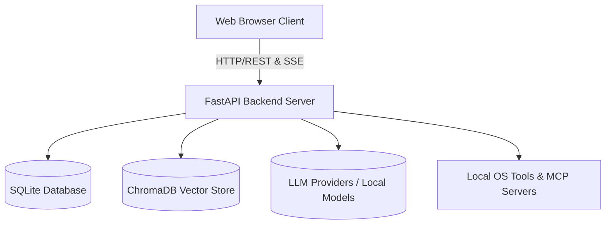

### Core Responsibilities
- **Frontend (Vanilla JS):** Manages user interactions, chat rendering, file attachments, state management, and real-time streaming updates.
- **Backend (FastAPI):** Orchestrates API routes, manages the database, executes agent loops and system tools, and interfaces with LLM providers or local models.
- **Cookbook & Hardware Fitness:** Analyzes the host's hardware (RAM, VRAM, GPU bandwidth) to recommend and manage local LLM serving (via `vLLM` or `llama.cpp`).
- **Memory & Storage:** Stores conversations, preferences, and calendars in SQLite, and maintains persistent semantic memory using ChromaDB.

---

</details>

</details>

## Frontend Architecture
<details>
<summary>View Frontend Architecture</summary>

### Frontend Architecture (Vanilla JS)

<details>
<summary>View Frontend Architecture (Vanilla JS)</summary>


The frontend avoids heavy frameworks like React or Vue, opting for vanilla JavaScript ES modules. This choice keeps the application lightweight and reduces build complexity.

### Directory Structure
- **[`static/index.html`](../static/index.html)**: The main entry point. It defines the layout and loads all scripts.
- **[`static/app.js`](../static/app.js)**: Orchestrates initialization.
- **[`static/js/`](../static/js/)**: Contains modular logic files:
  - [`chat.js`](../static/js/chat.js), [`chatRenderer.js`](../static/js/chatRenderer.js), [`chatStream.js`](../static/js/chatStream.js): Handle chat state, message submission, rendering markdown, and SSE (Server-Sent Events) streaming.
  - [`ui.js`](../static/js/ui.js): General UI utilities, toast notifications, auto-scrolling.
  - [`sessions.js`](../static/js/sessions.js), [`memory.js`](../static/js/memory.js), [`models.js`](../static/js/models.js), [`document.js`](../static/js/document.js): Manage specific application domains.

### Communication Pattern
The frontend communicates with the backend primarily through standard REST APIs. However, for chat generation and long-running tasks, it heavily relies on **Server-Sent Events (SSE)**.

- **Streaming:** When a chat is submitted, the frontend opens an SSE connection (`/api/chat_stream`). The backend streams chunks of markdown text, which the frontend renders incrementally.
- **Tool Progress:** While the backend agent loop is executing tools, it streams progress indicators to the frontend, which are displayed as "thinking" or "executing" animations.
- **Document Streaming:** Changes to documents are streamed via specific SSE event types (e.g., `doc_stream_open`, `doc_stream_delta`) and updated live in the editor panel.

---

</details>

### Frontend Architecture (Vanilla JS)

<details>
<summary>View Frontend Architecture (Vanilla JS)</summary>


The frontend uses Vanilla JavaScript with an ES module architecture centered around [`static/app.js`](../static/app.js) and [`static/js/`](../static/js/).

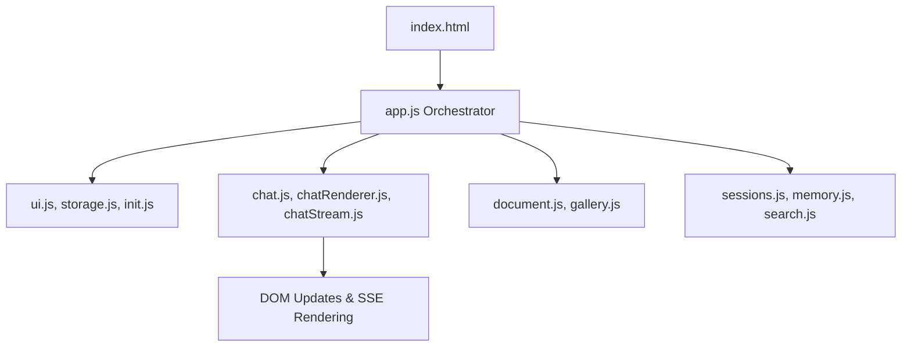

### Key Modules
- **[`app.js`](../static/app.js)**: The main entry point. Eagerly binds global event listeners (drag and drop, shortcuts) and initializes all feature modules.
- **Chat Engine ([`chat.js`](../static/js/chat.js), [`chatStream.js`](../static/js/chatStream.js), [`chatRenderer.js`](../static/js/chatRenderer.js))**: Handles chat session logic, submission, and SSE (Server-Sent Events) streaming. [`chat.js`](../static/js/chat.js) has a watchdog to detect stalled streams and recover them.
- **Document Editor ([`document.js`](../static/js/document.js), [`editor/`](../static/js/editor/))**: A multi-tab markdown/HTML editor with AI integration. [`document.js`](../static/js/document.js) manages state and SSE sync, while [`editor/`](../static/js/editor/) has specialized tools (e.g., inpainting, masking).
- **Session & Memory ([`sessions.js`](../static/js/sessions.js), [`memory.js`](../static/js/memory.js))**: Manages CRUD for chat sessions and user vector memory.
- **Component Specifics**: Modular features like UI helpers ([`ui.js`](../static/js/ui.js)), keyboard shortcuts, file handlers, voice recorders, and theming.

---

</details>

### Complete Frontend Layout ([`static/js/`](../static/js/))

<details>
<summary>View Complete Frontend Layout ([`static/js/`](../static/js/))</summary>


Odysseus' vanilla JS architecture is decentralized but tied together cleanly in [`static/app.js`](../static/app.js).

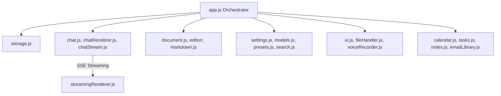

### Module Families
- **Core Wiring:** [`app.js`](../static/app.js) and [`init.js`](../static/js/init.js) bootstrap state. [`storage.js`](../static/js/storage.js) provides wrappers for LocalStorage persistence.
- **Chat Engine:** The largest monolith ([`chat.js`](../static/js/chat.js)) directs UI transitions, handles form submissions, and manages abort controllers. Rendering output and applying markdown logic is handled via [`chatRenderer.js`](../static/js/chatRenderer.js), [`streamingRenderer.js`](../static/js/streamingRenderer.js), and [`streamingSegmenter.js`](../static/js/streamingSegmenter.js).
- **Editors & Visuals:** [`document.js`](../static/js/document.js) manages multiple tabs and state. [`gallery.js`](../static/js/gallery.js) handles image assets and grids. The [`editor/`](../static/js/editor/) sub-folder contains extensions for masking and specialized layout.
- **Sub-Apps:** Major integrations are separated completely, e.g., [`emailLibrary.js`](../static/js/emailLibrary.js) (a full IMAP client UI), [`calendar.js`](../static/js/calendar.js) (CalDAV sync rendering), [`tasks.js`](../static/js/tasks.js), and [`notes.js`](../static/js/notes.js).
- **Cookbook (Hardware Management):** The `cookbook*.js` modules execute complex, multi-step tasks across SSE streams, including diagnosis, hardware fitting, and download signaling.

---

</details>

### Frontend Realtime Streaming & Chat

<details>
<summary>View Frontend Realtime Streaming & Chat</summary>


The real-time conversational UI relies heavily on Server-Sent Events (SSE) to update the UI without dropping frames or blocking user input during long text generations.

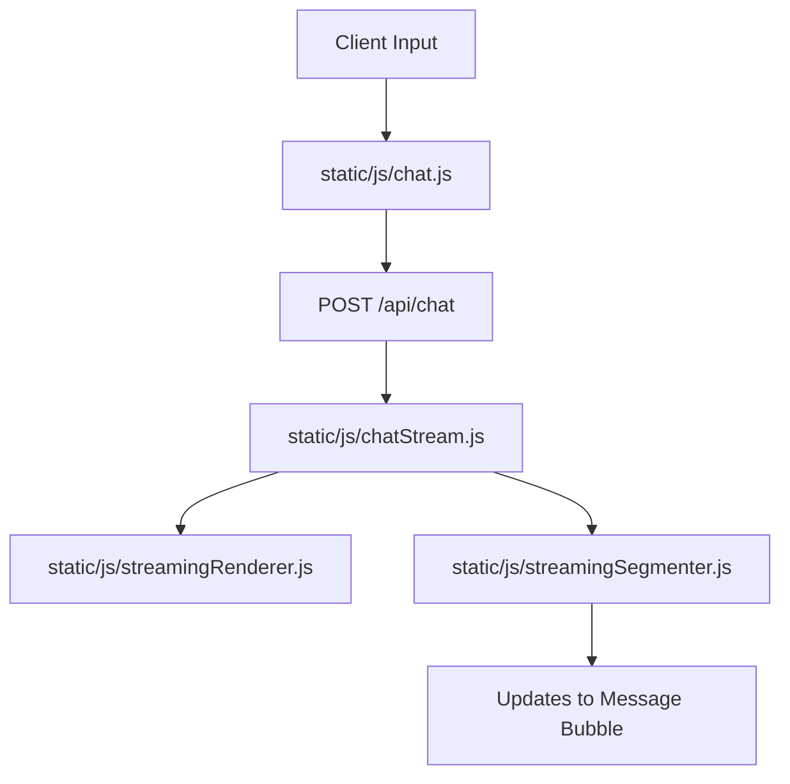

### Components
- **Chat Orchestrator ([`static/js/chat.js`](../static/js/chat.js) & [`chatRenderer.js`](../static/js/chatRenderer.js))**: The primary controller that captures user inputs, manages auto-scrolling, and delegates message rendering. It keeps the local message state in sync with the server response.
- **SSE Consumer ([`static/js/chatStream.js`](../static/js/chatStream.js))**: Opens the event stream and listens to JSON lines. It handles network disconnects, error codes, and maps raw text deltas into actionable state updates for the renderer.
- **Render Engine ([`static/js/streamingRenderer.js`](../static/js/streamingRenderer.js) & [`streamingSegmenter.js`](../static/js/streamingSegmenter.js))**: As tokens arrive sequentially, they are batched and flushed to the DOM. The segmenter handles complex boundary logic (e.g., detecting when a markdown code block ` ``` ` begins or ends) to ensure syntax highlighting is only applied once a block is complete, avoiding constant, CPU-heavy re-parsing of incomplete HTML.


</details>

### UI & UX Helpers

<details>
<summary>View UI & UX Helpers</summary>


Small foundational pieces to support the frontend SPA.

### Purpose
Provide localization, theming, and consistent rendering mechanics.

### Components
- **[`routes/emoji_routes.py`](../routes/emoji_routes.py) & [`routes/font_routes.py`](../routes/font_routes.py)**: Serves static SVGs and webfonts dynamically based on the current workspace themes.
- **[`src/text_helpers.py`](../src/text_helpers.py)**: Utilities for stripping reasoning chains or specific tokens from LLM output before presentation.
- **[`src/user_time.py`](../src/user_time.py)**: Manages timezone calculations so that when an agent is told "remind me tomorrow", it correctly translates to the user's localized time based on browser data.

---

</details>

### Compare Mode (Model Blind Testing)

<details>
<summary>View Compare Mode (Model Blind Testing)</summary>


Compare mode provides a dual-pane, blind AB testing interface to evaluate the quality of multiple AI models side-by-side on identical prompts.

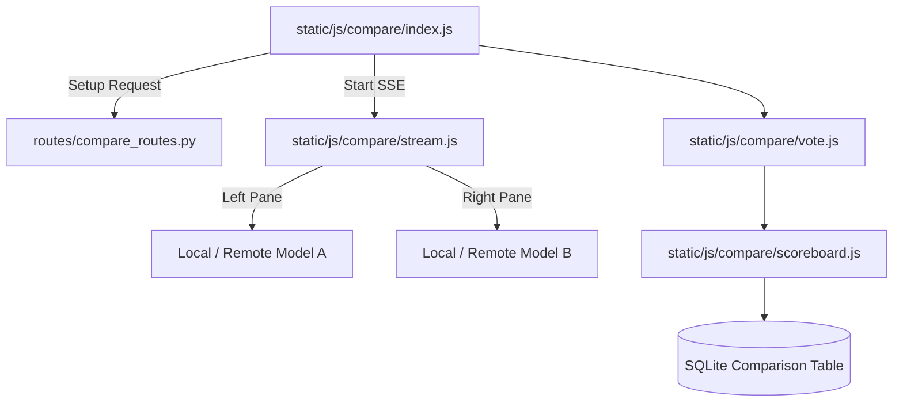

### Components
- **Frontend State ([`static/js/compare/`](../static/js/compare/))**: Comprises numerous modular files handling the dual UI ([`panes.js`](../static/js/compare/panes.js)), tracking connection health ([`probe.js`](../static/js/compare/probe.js)), and managing the synchronized SSE streams for both models ([`stream.js`](../static/js/compare/stream.js)). The models' identities remain obfuscated until a winner is declared ([`vote.js`](../static/js/compare/vote.js)).
- **Backend Routing ([`routes/compare_routes.py`](../routes/compare_routes.py))**: Manages the API surface area for starting a comparison, validating model access, handling vote submission, and managing the `RecordVoteRequest` schema to compile metrics over time.

---

</details>

### AI Canvas Editor Architecture

<details>
<summary>View AI Canvas Editor Architecture</summary>


The rich image editor features a comprehensive, multi-layer HTML5 Canvas architecture integrated tightly with local backend AI operations.

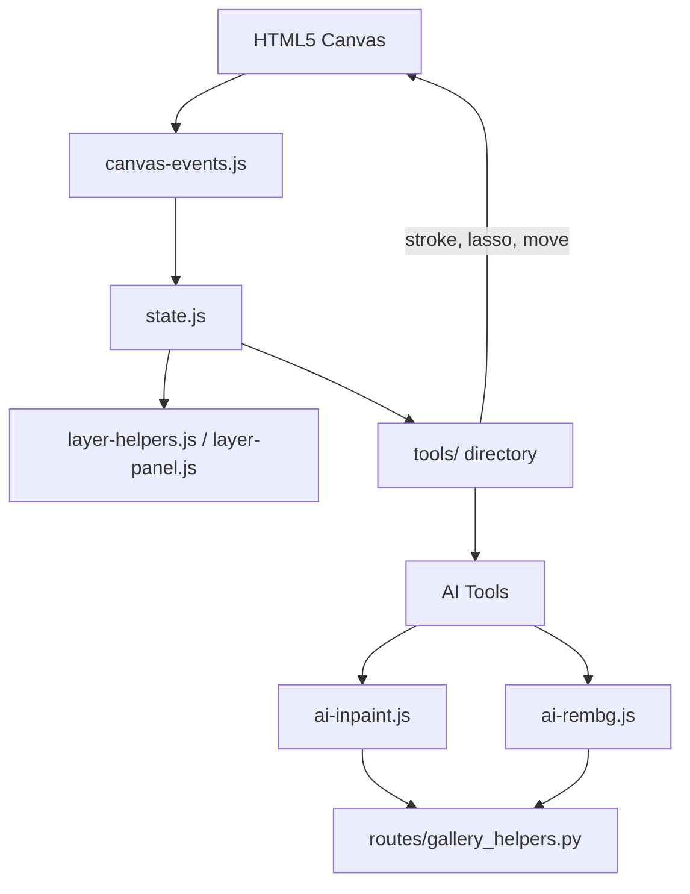

### Components
- **Core Canvas Logic ([`static/js/editor/`](../static/js/editor/))**: Managed by [`state.js`](../static/js/editor/state.js), with interactions translated through [`canvas-coords.js`](../static/js/editor/canvas-coords.js) and [`canvas-events.js`](../static/js/editor/canvas-events.js) to account for zooming and panning across the viewport.
- **Tools & Effects**: Standard editing tools (move, crop, flood-fill) live in the [`tools/`](../static/js/editor/tools/) directory, while non-destructive overlays and visual filters reside in [`fx/`](../static/js/editor/fx/) and [`filters/`](../static/js/editor/filters/).
- **AI Integrations**: Specific files like [`ai-inpaint.js`](../static/js/editor/ai-inpaint.js) and [`ai-rembg.js`](../static/js/editor/ai-rembg.js) hook into the active canvas state to generate masks ([`mask-utils.js`](../static/js/editor/mask-utils.js)), transmit them to the backend, and apply the returned images onto new, non-destructive canvas layers ([`layer-helpers.js`](../static/js/editor/layer-helpers.js)).

---

</details>

</details>

## Backend & Core Services
<details>
<summary>View Backend & Core Services</summary>

### Backend Architecture (FastAPI)

<details>
<summary>View Backend Architecture (FastAPI)</summary>


The backend is built around a slim orchestrator ([`app.py`](../app.py)), which glues together several sub-modules. It uses **FastAPI** for route handling and **SQLAlchemy** for database interactions.

### Directory Structure
- **[`app.py`](../app.py)**: The FastAPI entry point. Handles middleware, CORS, lifecycle events, and mounts routes.
- **[`core/`](../core/)**: Database configuration ([`database.py`](../core/database.py)), middleware, authentication, and constants.
- **[`src/`](../src/)**: The core logic engine. Contains the agent loop ([`agent_loop.py`](../src/agent_loop.py)), tool execution logic ([`agent_tools.py`](../src/agent_tools.py)), LLM interactions ([`llm_core.py`](../src/llm_core.py)), and more.
- **[`routes/`](../routes/)**: FastAPI router definitions, separated by feature (e.g., [`chat_routes.py`](../routes/chat_routes.py), [`document_routes.py`](../routes/document_routes.py), [`memory_routes.py`](../routes/memory_routes.py)).
- **[`services/`](../services/)**: Sub-services for specialized tasks like hardware fitness scoring ([`hwfit/`](../services/hwfit/)), search integrations, TTS/STT, etc.

---

</details>

### Backend Core & Routing (FastAPI)

<details>
<summary>View Backend Core & Routing (FastAPI)</summary>


The backend is structured around a centralized [`app.py`](../app.py) that mounts numerous feature-specific routers defined in [`routes/`](../routes/).

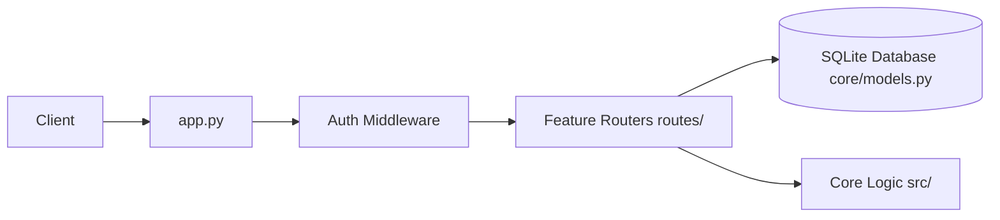

### Core Components
- **[`app.py`](../app.py)**: The FastAPI application builder. Applies middleware (CORS, Auth, Security Headers) and uses `include_router` to mount ~40 specialized route modules (e.g., [`chat_routes.py`](../routes/chat_routes.py), [`email_routes.py`](../routes/email_routes.py)).
- **[`core/models.py`](../core/models.py)**: SQLAlchemy declarative base models. It defines the schema for `ChatMessage`, `Session`, `Document`, `EmailAccount`, `McpServer`, etc.
- **[`core/database.py`](../core/database.py)**: Manages the SQLite connection pool, SQLAlchemy engine, and encrypted text types.
- **[`core/session_manager.py`](../core/session_manager.py)**: Handles transactional logic for session states and chat history persistence.

---

</details>

### API Routing & Controllers ([`routes/`](../routes/))

<details>
<summary>View API Routing & Controllers ([`routes/`](../routes/))</summary>


Odysseus isolates the API surface area from business logic through a highly modular router design. Instead of a monolithic routing file, the application features over 40 distinct route controllers in the [`routes/`](../routes/) directory.

### Routing Organization
- **[`app.py`](../app.py) Mounting:** The primary FastAPI application imports and mounts these routers using `include_router`.
- **Feature Encapsulation:** Endpoints are strictly scoped to their domain. For instance, [`document_routes.py`](../routes/document_routes.py) manages all `GET/POST /api/documents` operations, while [`chat_routes.py`](../routes/chat_routes.py) handles generation and SSE streams.
- **Helper Extraction:** Complex or reusable logic inside a router is often extracted to a companion file (e.g., [`chat_helpers.py`](../src/chat_helpers.py), [`document_helpers.py`](../routes/document_helpers.py), [`cookbook_helpers.py`](../routes/cookbook_helpers.py)).
- **Security Scope:** Middleware ensures that endpoints are protected based on user roles. Most routers perform their own checks against `get_current_user` to restrict data access to the session owner. Certain administrative routes ([`api_token_routes.py`](../routes/api_token_routes.py), [`webhook_routes.py`](../routes/webhook_routes.py)) mandate a higher privilege level via `require_admin`.

---

</details>

### Core Utilities ([`core/`](../core/))

<details>
<summary>View Core Utilities ([`core/`](../core/))</summary>


The core utilities manage foundational backend state, security, and process infrastructure.

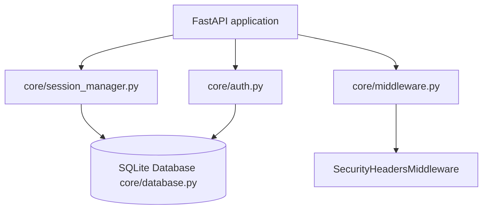

### Components
- **Session Management ([`core/session_manager.py`](../core/session_manager.py))**: A centralized state machine holding in-memory references to user chat sessions and synchronizing them with SQLite. This module guarantees the transaction lifecycle, archiving inactive chats, tracking history, and purging deleted threads gracefully.
- **Authentication ([`core/auth.py`](../core/auth.py))**: Provides security logic for the web application and external integrations. It handles Bearer tokens for API integrations and user TOTP secrets.
- **Security Middleware ([`core/middleware.py`](../core/middleware.py))**: Applies the `SecurityHeadersMiddleware`, issuing strict CSP boundaries, denying framing unless accessing specific isolated endpoints (like PDF previewers), and handling loopback agent requests securely.
- **Platform Compatibility & Atomic IO ([`core/platform_compat.py`](../core/platform_compat.py), [`core/atomic_io.py`](../core/atomic_io.py))**: Tools for writing files atomically, safely spawning processes across Windows/Linux, translating paths over WSL boundaries, and resolving execution environments.

---

</details>

### Core Platform Mechanisms ([`core/`](../core/))

<details>
<summary>View Core Platform Mechanisms ([`core/`](../core/))</summary>


The [`core/`](../core/) package provides the foundational bedrock upon which the rest of the application runs. It handles the lowest-level concerns such as database connections, security headers, and cross-platform file IO.

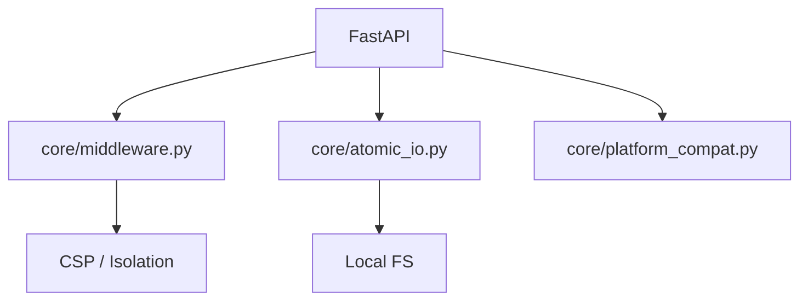

### Components
- **Atomic IO ([`core/atomic_io.py`](../core/atomic_io.py))**: Provides safe file-writing operations using temporary files and atomic renames. This ensures that a sudden power loss or application crash during a save operation (e.g., updating a [`user_prefs.json`](../data/user_prefs.json)) does not result in a corrupted, zero-byte file.
- **Platform Compatibility ([`core/platform_compat.py`](../core/platform_compat.py))**: Normalizes differences between Windows, macOS, and Linux. This includes abstracting file path creation, permission handling (which differs vastly between POSIX and NTFS), and process signal management.
- **Security Middleware ([`core/middleware.py`](../core/middleware.py))**: Intercepts all incoming requests to inject critical headers. It enforces the Content Security Policy (CSP), mitigates clickjacking by preventing framing (except on specific routes like the PDF previewer), and ensures cross-origin isolation where necessary.


---

</details>

### Internal Services ([`services/`](../services/))

<details>
<summary>View Internal Services ([`services/`](../services/))</summary>


The [`services/`](../services/) directory is reserved for self-contained, domain-specific modules that act as autonomous actors or external bridges, rather than core request/response routing.

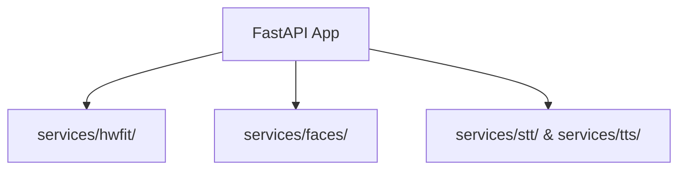

### Components
- **Hardware Fitness ([`services/hwfit/`](../services/hwfit/))**: Profiles the host machine dynamically. It uses utilities like `nvidia-smi` (via Python wrappers) or macOS `sysctl` to estimate available VRAM and system memory, which is then communicated to the frontend so it can warn users before downloading models that are too large.
- **AI Services (Faces) ([`services/faces/`](../services/faces/))**: A standalone worker and service module responsible for face detection and embedding services. It helps aggregate model personas ("faces") and exposes them to the frontend, allowing for rich, avatar-driven interactions in the UI (e.g., in [`modelPicker.js`](../static/js/modelPicker.js)).
- **Speech Processing ([`services/stt/`](../services/stt/) & [`services/tts/`](../services/tts/))**: Manages the abstraction over audio processing. For STT, it can process Whisper models. For TTS, it manages integrations with local Kokoro-82M endpoints or falls back to browser-based synthesized voices, maintaining audio caches to speed up repeated text generations.


---

</details>

### Background Services ([`services/`](../services/))

<details>
<summary>View Background Services ([`services/`](../services/))</summary>


The internal architecture separates discrete background jobs into standalone, stateless modules. These modules serve external integration requests triggered by the agent loop or via direct route access.

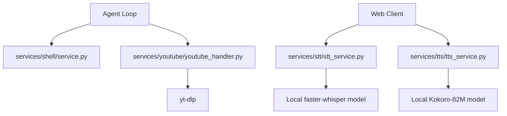

### Components
- **Shell Executor ([`services/shell/`](../services/shell/))**: Provides controlled subprocess execution capabilities complete with streaming outputs and rigid execution timeouts. Used to implement the "bash" native tool.
- **Speech Processing ([`services/stt/`](../services/stt/), [`services/tts/`](../services/tts/))**: Wraps speech-to-text (Whisper/Browser API) and text-to-speech (Kokoro-82M on GPU/API endpoints). Integrates transparent fallback if models fail to load or aren't installed locally.
- **YouTube Handler ([`services/youtube/`](../services/youtube/))**: Employs `youtube_transcript_api` and `yt-dlp` to asynchronously pull video transcripts and high-voted comments for deep content context injection into the LLM.

---

</details>

### Advanced Container Management ([`docker/`](../docker/))

<details>
<summary>View Advanced Container Management ([`docker/`](../docker/))</summary>


The [`docker/`](../docker/) directory contains critical infrastructure for securely and reliably hosting Odysseus on Linux environments.

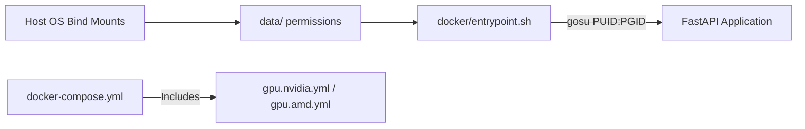

### Components
- **[`entrypoint.sh`](../docker/entrypoint.sh)**: Fixes the #1 self-hosting footgun—root ownership of bind-mounted volumes. It reads `PUID` and `PGID` environment variables, creates a matching unprivileged user (`odysseus`), `chown`s the `/data` directory appropriately, and drops privileges via `gosu` before starting the application. This ensures users can interact with downloaded SQLite or memory databases on the host OS natively without permission denied errors.
- **[`gpu.nvidia.yml`](../docker/gpu.nvidia.yml) & [`gpu.amd.yml`](../docker/gpu.amd.yml)**: Compose profiles that inject required hardware passthrough directives (`deploy.resources.reservations.devices` for NVIDIA, `/dev/kfd` and `/dev/dri` for AMD ROCm). The main compose file is kept minimal, while these profiles act as composable overlays depending on the user's hardware.

---

</details>

### Cookbook & System Utilities

<details>
<summary>View Cookbook & System Utilities</summary>


A collection of operational scripts, setup hooks, and diagnostic endpoints.

### Purpose
To initialize the app predictably and provide developers insights into the running system.

### Components
- **[`routes/cookbook_routes.py`](../routes/cookbook_routes.py), [`routes/hwfit_routes.py`](../routes/hwfit_routes.py), [`routes/diagnostics_routes.py`](../routes/diagnostics_routes.py)**: API endpoints exposing system load, GPU status (hardware fitness), and local recipes (cookbook).
- **[`routes/shell_routes.py`](../routes/shell_routes.py), [`routes/upload_routes.py`](../routes/upload_routes.py), [`routes/signature_routes.py`](../routes/signature_routes.py)**: Handles standard terminal requests to the host OS and manages file IO/upload chunking.
- **[`src/app_helpers.py`](../src/app_helpers.py), [`src/app_initializer.py`](../src/app_initializer.py), [`src/constants.py`](../src/constants.py), [`src/exceptions.py`](../src/exceptions.py)**: Foundational bootstrap code. Bootstraps the SQLite tables, loads `.env` variables, and defines global exception classes.

---

</details>

</details>

## Agent & AI Orchestration
<details>
<summary>View Agent & AI Orchestration</summary>

### Agent & AI Orchestration

<details>
<summary>View Agent & AI Orchestration</summary>


The most complex part of the backend is the agent loop ([`src/agent_loop.py`](../src/agent_loop.py)), which handles how the AI processes multi-step tasks.

### The Agent Loop
1. **Prompt Assembly:** The loop begins by gathering context: recent messages, available tools, system instructions, and RAG (Retrieval Augmented Generation) context.
2. **Tool Selection (RAG vs Fallback):**
   - Odysseus uses a `ToolIndex` to semantically match available tools to the user's query. This prevents overwhelming the LLM prompt with hundreds of tool schemas.
   - If RAG fails or is skipped, it falls back to a keyword-based heuristic.
3. **Execution Round:** The model generates a response. If the response contains tool calls (e.g., "search the web", "read a file"), the loop intercepts it.
4. **Tool Dispatch:** The backend maps the tool call to Python functions (defined in [`src/tool_implementations.py`](../src/tool_implementations.py)).
5. **Re-injection:** The results of the tool execution are appended to the conversation history as a "tool response" message.
6. **Recursion:** The loop iterates, sending the updated history back to the model until the model provides a final answer or hits a maximum round limit.

### Loop Breakers & Supervisors
- **Runaway Detector:** Identifies if a model is repeatedly calling the same tool with identical arguments without making progress, and breaks the loop.
- **Intent-without-action Supervisor:** Detects if a model says it will do something (e.g., "Let me check the logs") but fails to actually emit a tool call. It nudges the model to perform the action.
- **Completion Verifier:** A secondary, independent LLM evaluation pass that verifies if the requested task is genuinely complete before allowing the agent to end its turn.

### Teacher Escalation ([`src/teacher_escalation.py`](../src/teacher_escalation.py))
For self-hosted models that may struggle with complex tasks, Odysseus implements a "Teacher Escalation" mechanism.
1. If the student model fails (detected via regex on tool errors or "giving up" language), it pauses.
2. It sends the failing trace to a configured "Teacher" model (typically a stronger, cloud-based API like GPT-4o or Claude 3.5 Sonnet).
3. The Teacher explains how to solve the problem and creates a structured `SKILL.md` file.
4. This new skill is saved to the `SkillsManager`, empowering the student model to succeed on similar tasks in the future.

---

</details>

### Agent Orchestration, Tools & RAG

<details>
<summary>View Agent Orchestration, Tools & RAG</summary>


The Agent Loop is the brain of Odysseus, dynamically looping the LLM with local tools, semantic memory (RAG), and Teacher Escalation.

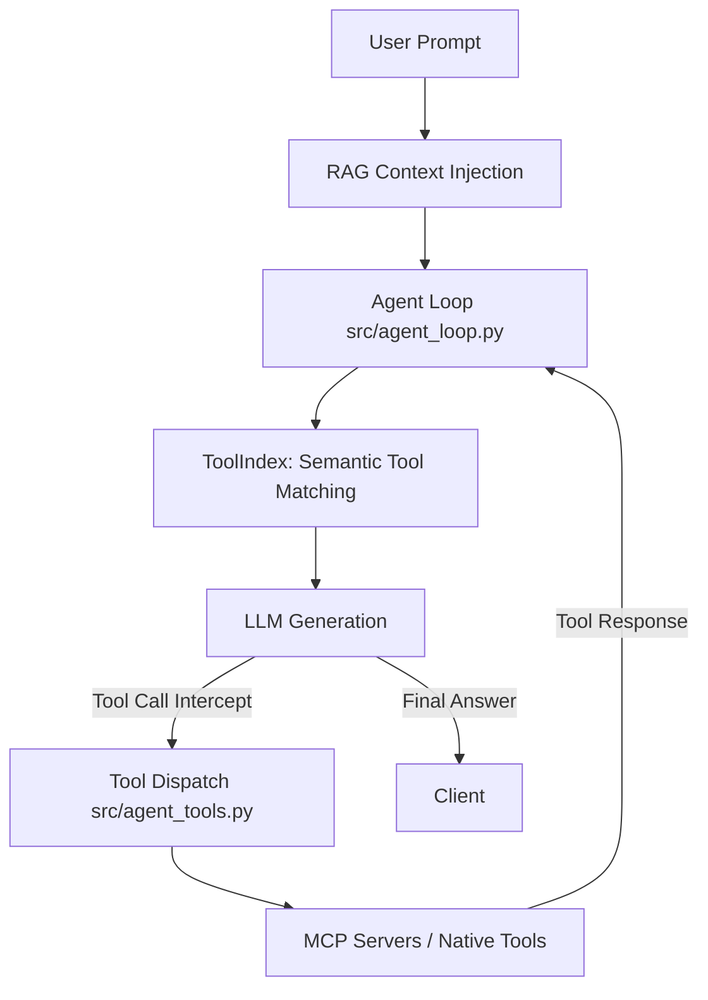

### Components
- **Agent Loop ([`src/agent_loop.py`](../src/agent_loop.py))**: Assembles prompts with context, checks tool use loops, and executes `stream_agent_loop`.
- **Tool Index ([`src/tool_index.py`](../src/tool_index.py))**: Semantically matches available tools to the query using embeddings, limiting prompt bloat.
- **Tool Dispatch ([`src/agent_tools.py`](../src/agent_tools.py))**: Maps requested tools (e.g., `bash`, `read_file`, `web_search`) to their native Python implementations or MCP counterparts.
- **MCP Manager ([`src/mcp_manager.py`](../src/mcp_manager.py))**: Dynamically connects external Model Context Protocol servers via stdio/HTTP.
- **RAG & Memory ([`src/rag_manager.py`](../src/rag_manager.py), [`src/memory_vector.py`](../src/memory_vector.py))**: Vector store abstractions around ChromaDB using `fastembed` to index personal documents and memories.
- **Teacher Escalation ([`src/teacher_escalation.py`](../src/teacher_escalation.py))**: Detects when an agent gets stuck, calls a stronger "Teacher" model to solve it, and saves the procedure as a new `SKILL.md`.

---

</details>

### Chat Processing & Engine Logic ([`src/`](../src/))

<details>
<summary>View Chat Processing & Engine Logic ([`src/`](../src/))</summary>


The core execution of conversational AI interactions lives primarily in [`src/chat_processor.py`](../src/chat_processor.py), [`src/chat_handler.py`](../src/chat_handler.py), and [`src/agent_runs.py`](../src/agent_runs.py).

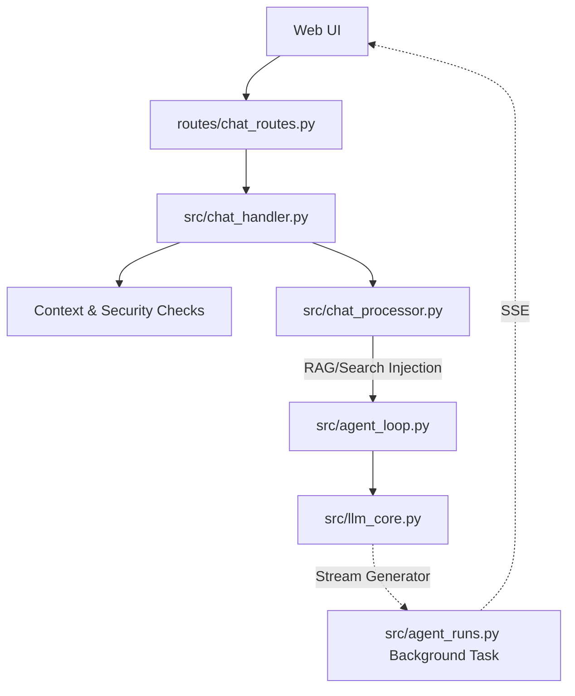

### Components
- **[`chat_handler.py`](../src/chat_handler.py):** Parses incoming chat requests, manages attachment validations, coerces sessions, and sets up the async streams.
- **[`chat_processor.py`](../src/chat_processor.py):** Applies NLP tasks. It checks for stopwords, extracts URLs directly via regex for immediate search querying, and handles security logic (like `UNTRUSTED_CONTEXT_POLICY`) to sanitize unsafe context windows.
- **[`agent_runs.py`](../src/agent_runs.py):** Implements detached agent-runs. The model streams text even if the browser drops the SSE connection. This module catches the stream into a replay buffer that users can re-subscribe to upon page refresh, preventing mid-thought data loss.

---

</details>

### Chat Engine & Memory Components

<details>
<summary>View Chat Engine & Memory Components</summary>


These files form the glue bridging conversational memory with the underlying agent loop.

### Purpose
To assemble context objects, record new learnings, and parse complex documents inline.

### Components
- **[`routes/assistant_routes.py`](../routes/assistant_routes.py), [`src/assistant_log.py`](../src/assistant_log.py)**: Manages the persona traits of the primary assistant and logging of its internal monologue.
- **[`src/memory_provider.py`](../src/memory_provider.py), [`src/ai_interaction.py`](../src/ai_interaction.py)**: The interface between raw text streams and the structured memory graph.
- **[`src/context_budget.py`](../src/context_budget.py)**: Dynamically truncates conversational history so it fits securely within the model's configured input token limit.
- **[`routes/compare_routes.py`](../routes/compare_routes.py), [`routes/editor_draft_routes.py`](../routes/editor_draft_routes.py), [`src/pdf_form_doc.py`](../src/pdf_form_doc.py)**: Specialized tools for editing rich text documents inside the interface, and generating PDFs inline based on text fields.
---


</details>

### Action Intents & Chat Routing ([`src/action_intents.py`](../src/action_intents.py))

<details>
<summary>View Action Intents & Chat Routing ([`src/action_intents.py`](../src/action_intents.py))</summary>


Odysseus employs a lightweight routing heuristic to determine when a standard chat prompt should be promoted to full "agent mode" (invoking the agent loop and tools).

```mermaid
graph TD
    Input[User Prompt] --> Regex[Regex Intent Detection]
    Regex --> |"can you search...", "read this..."| Agent[Promote to Agent Mode]
    Regex --> |General question| Chat[Standard Chat Completion]
    Agent --> LoadTools[Load Tools & System Prompt]
    Chat --> LLM[LLM Generation]
```

### Purpose
To avoid unnecessary LLM overhead and reduce latency/cost, the system uses deterministic regex patterns to detect when a user is explicitly asking the assistant to take an action (e.g., "can you search...", "please read this file...") rather than simply asking an informational question.

### Mechanics
- **`ToolIntent`**: A dataclass that evaluates `needs_tools`, `category`, and `reason`.
- **Patterns**: Scans for imperative verbs ("search", "read", "deploy"), modal questions ("can you", "would you"), UI/panel toggles, calendar lookups, and deep research invocations. It explicitly avoids triggering on explanatory questions (e.g., "how do I use grep?").
- **Outcome**: If an action intent is detected, the frontend is signaled or the backend automatically escalates the chat into the agent loop, loading the necessary tools and system prompts. This keeps general conversational chat fast and cheap, while reserving the heavy, multi-prompt `Agent Loop` strictly for tool-use workflows.

---

</details>

### Agent Tools Subsystem ([`src/agent_tools/`](../src/agent_tools/))

<details>
<summary>View Agent Tools Subsystem ([`src/agent_tools/`](../src/agent_tools/))</summary>


Odysseus provides its agent loop with a suite of highly privileged, local-first tools. These are organized functionally to limit scope and ensure secure execution.

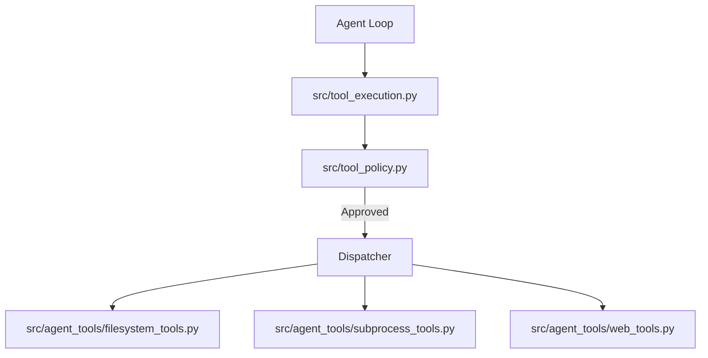

### Components
- **Filesystem Tools ([`src/agent_tools/filesystem_tools.py`](../src/agent_tools/filesystem_tools.py))**: Provides concrete implementations for `read_file`, `write_file`, `list_directory`, etc. These tools are heavily sandboxed by the policy layer, meaning they generally cannot escape the [`data/`](../data/) directory unless explicitly authorized by an admin context.
- **Subprocess Tools ([`src/agent_tools/subprocess_tools.py`](../src/agent_tools/subprocess_tools.py))**: Allows the agent to run arbitrary shell commands. It manages timeout constraints, captures `stdout` and `stderr` safely, and ensures long-running processes do not hang the main agent loop.
- **Web Tools ([`src/agent_tools/web_tools.py`](../src/agent_tools/web_tools.py))**: Includes utilities for fetching webpage content, often interacting with local headless browsers or `BeautifulSoup` to strip away visual clutter and return clean markdown directly to the agent's context.


---

</details>

### Built-in Actions & Scheduled Tasks ([`src/builtin_actions.py`](../src/builtin_actions.py))

<details>
<summary>View Built-in Actions & Scheduled Tasks ([`src/builtin_actions.py`](../src/builtin_actions.py))</summary>


Odysseus features a registry of native automation actions that can be executed periodically by the task scheduler without needing to spin up an LLM.

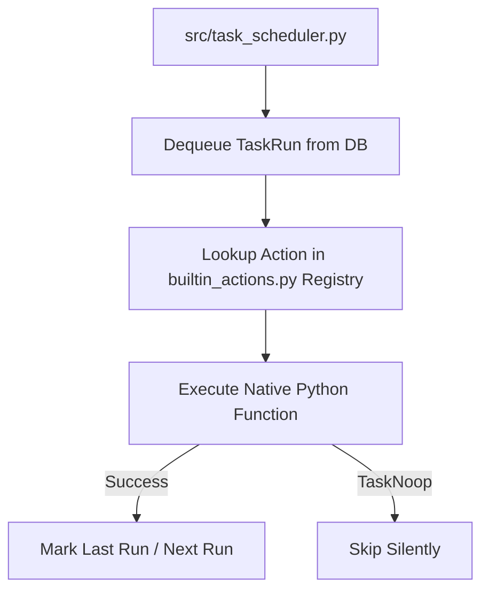

### Purpose
Provides reliable, zero-cost execution for routine system maintenance and user-defined scheduled tasks.

### Mechanics
- **Registry**: Houses predefined python functions mapped to string identifiers (e.g., `system.tidy_calendar`, `system.poll_email`).
- **`TaskNoop` Exception**: A silent exception used by actions to indicate there was nothing to do (e.g., no new emails, calendar already synced), preventing log spam.
- **Execution**: The scheduler ([`src/task_scheduler.py`](../src/task_scheduler.py)) dequeues pending tasks from the database and invokes the corresponding function in [`builtin_actions.py`](../src/builtin_actions.py).

---

</details>

</details>

## Data, Memory & RAG
<details>
<summary>View Data, Memory & RAG</summary>

### Data, Memory, and Storage

<details>
<summary>View Data, Memory, and Storage</summary>


All data is kept local within the [`data/`](../data/) directory, adhering to the project's privacy-first ethos.

### SQLite Database
- **Relational Data:** Managed via SQLAlchemy ([`data/app.db`](../data/app.db)).
- **Stores:** Chats, sessions, API tokens, MCP server configs, Webhooks, user privileges, scheduled tasks, and calendar events.

### ChromaDB (Vector Store)
- **Semantic Memory:** Odysseus uses `ChromaDB` and ONNX `fastembed` for vector similarity search.
- **`MemoryManager` ([`src/memory.py`](../src/memory.py)):** Extracts and stores long-term facts, preferences, and contacts. It uses hybrid search (Jaccard similarity + semantic keyword boosting) to inject relevant memories into the agent's context.

### SkillsManager
- Manages `SKILL.md` files representing procedures.
- Published skills and teacher-escalation drafts are injected into the agent prompt based on relevance to the current conversation.

---

</details>

### Model Configuration & RAG Core

<details>
<summary>View Model Configuration & RAG Core</summary>


The system coordinates between multiple LLM backends (local Ollama, OpenAI, Anthropic) while also maintaining a persistent RAG index.

### Purpose
Provides a unified layer to interact with LLMs and Vector Embeddings, hiding the implementation specifics from the main Agent Loop.

### Components
- **[`routes/model_routes.py`](../routes/model_routes.py) & [`src/model_discovery.py`](../src/model_discovery.py)**: Automatically polls APIs (e.g., standard `localhost:11434`) to list available models. [`model_discovery.py`](../src/model_discovery.py) aggregates these lists and surfaces them to the UI.
- **[`src/model_context.py`](../src/model_context.py) & [`src/endpoint_resolver.py`](../src/endpoint_resolver.py)**: Resolves logical model names to concrete endpoint URLs and handles context window limit calculations to prevent prompt overflow.
- **[`routes/embedding_routes.py`](../routes/embedding_routes.py) & [`src/embeddings.py`](../src/embeddings.py) & [`src/embedding_lanes.py`](../src/embedding_lanes.py)**: Configures the semantic search backend. Manages switching between external API embeddings (like OpenAI text-embedding-ada-002) and local fastembed onnx models.
- **[`src/chroma_client.py`](../src/chroma_client.py), [`src/rag_singleton.py`](../src/rag_singleton.py), [`src/rag_vector.py`](../src/rag_vector.py)**: Wrapper clients for the ChromaDB vector store, managing RAG collection logic and querying similarities.

---

</details>

### Advanced Memory & Skills Pipeline

<details>
<summary>View Advanced Memory & Skills Pipeline</summary>


Long-term semantic context goes beyond just storing facts; the system contains a dedicated pipeline for discovering, extracting, and importing structured "Skills".

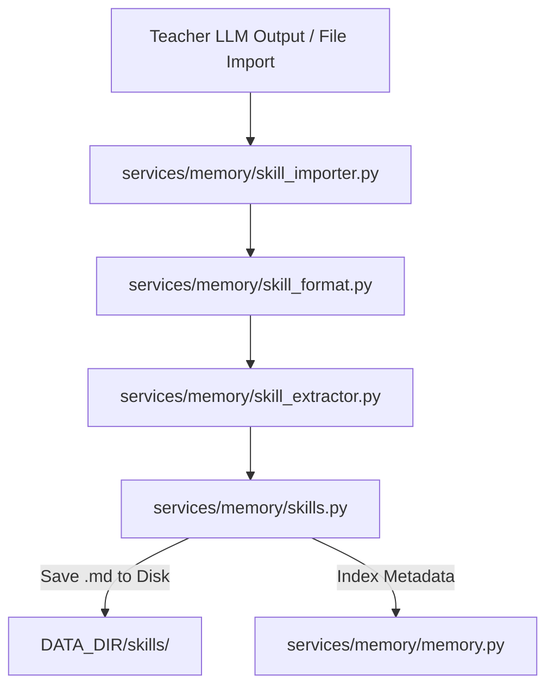

### Components
- **Skill Extraction ([`services/memory/skill_extractor.py`](../services/memory/skill_extractor.py))**: Uses intelligent parsing to derive structured procedure steps and preconditions from freeform conversation text or teacher model outputs.
- **Skill Formatting ([`services/memory/skill_format.py`](../services/memory/skill_format.py))**: Ensures that every skill strictly adheres to the markdown specifications required for the Agent loop to parse it effectively (e.g., maintaining `SKILL.md` boundaries).
- **Skill Importer ([`services/memory/skill_importer.py`](../services/memory/skill_importer.py))**: Handles the ingest of external skill packs (like those from the integrations folder), safely validating content without trusting external metadata completely.
- **Manager ([`services/memory/skills.py`](../services/memory/skills.py))**: The central service that orchestrates reading and writing skills to the local disk and synchronizing them with the Vector Database for semantic retrieval later.


</details>

</details>

## Features & Integrations
<details>
<summary>View Features & Integrations</summary>

### Integrations & Advanced Features

<details>
<summary>View Integrations & Advanced Features</summary>


### MCP (Model Context Protocol) Manager ([`src/mcp_manager.py`](../src/mcp_manager.py))
- Allows connecting external tool servers via standard IO (stdio), SSE, or HTTP.
- Dynamically converts MCP JSON schemas into OpenAI-compatible function calling schemas, injected into the agent loop.
- Handles OAuth flows for tools requiring authentication.

### Deep Research ([`src/deep_research.py`](../src/deep_research.py))
- An iterative `Think → Search → Extract → Synthesize` loop.
- Generates sub-queries, executes searches via SearXNG (or others), extracts content from webpages using an LLM, and continuously synthesizes findings into a comprehensive final report.

### Email & CalDAV
- **Email:** Built-in IMAP/SMTP triage. It can summarize, auto-tag, and draft replies using AI.
- **CalDAV:** Local-first calendar synchronization with external providers (Radicale, Nextcloud, Apple, Fastmail).

---

</details>

### Integrations & Companion

<details>
<summary>View Integrations & Companion</summary>


Odysseus can pair with companion apps and handle external webhooks.

- **Companion App ([`companion/pairing.py`](../companion/pairing.py), [`companion/routes.py`](../companion/routes.py))**: Manages secure pairing using tokens and QR codes, allowing mobile or external apps to interact with the API securely.
- **Webhook Manager ([`src/webhook_manager.py`](../src/webhook_manager.py))**: Dispatches system events out to configured webhooks securely (filtering out private IP loopbacks).
- **Integrations ([`src/integrations.py`](../src/integrations.py))**: A generalized module to store and resolve API keys, OAuth tokens, and connection configs for external tools.

---

</details>

### Companion Bridge ([`companion/`](../companion/))

<details>
<summary>View Companion Bridge ([`companion/`](../companion/))</summary>


The Companion Bridge provides an additive layer for Local Area Network (LAN) clients (like a mobile companion app) to securely discover and pair with the Odysseus server without duplicating core LLM logic.

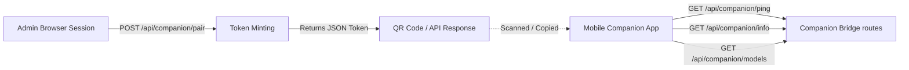

### Components & Posture
- **Capabilities & Discovery ([`companion/routes.py`](../companion/routes.py))**: Endpoints like `/api/companion/info` and `/api/companion/models` allow an authenticated client to discover what AI providers, tools, and endpoints the server makes available. Model requests scope strictly to the authenticated user.
- **Pairing Flow & CSRF Security ([`companion/pairing.py`](../companion/pairing.py))**: To pair a new device, an admin session requests a one-time API pairing token. The server enforces strict CSRF protections by requiring this token minting to be an explicit `POST` operation, protected by a `SameSite=Lax` cookie policy. The `GET /pair` route only returns an HTML form, preventing unintended token minting via cross-site GET navigations.

---

</details>

### External Integrations ([`integrations/`](../integrations/))

<details>
<summary>View External Integrations ([`integrations/`](../integrations/))</summary>


Odysseus provides an integration layer that acts as a secure bridge for third-party AI agents (e.g., Claude Code, OpenAI integrations) to execute tools locally through the Odysseus server.

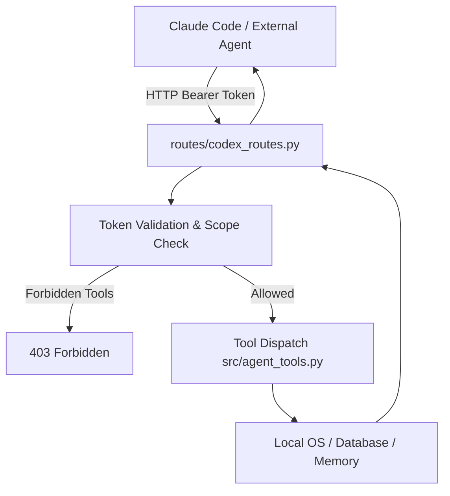

### Components & Posture
- **The "Codex" Abstraction ([`routes/codex_routes.py`](../routes/codex_routes.py))**: Historically named "codex", this router exposes the canonical, scope-gated API endpoints (`/api/codex/*`) that external agents hit to list available tools and execute them.
- **Plugin Bundles ([`integrations/claude/`](../integrations/claude/))**: Directories like `integrations/claude` contain ready-to-use skill bundles (`SKILL.md` and wrapper scripts). A user installs this into their external agent (like Anthropic's `claude-code` CLI).
- **Scope Enforcement**: API tokens generated for integrations are heavily scope-gated. If an external agent attempts to execute a tool (e.g., `bash` or `read_file`) that the user has not explicitly enabled in the Integrations UI, Odysseus rejects the request. This ensures external platforms cannot access the host machine unconditionally.

---

</details>

### Integrations & MCP Extensibility

<details>
<summary>View Integrations & MCP Extensibility</summary>


The system natively supports adding extensions via the Model Context Protocol (MCP) and third-party subscriptions.

### Purpose
Provides dynamic loading of tools that aren't natively compiled into the python source.

### Components
- **[`routes/mcp_routes.py`](../routes/mcp_routes.py) & [`src/builtin_mcp.py`](../src/builtin_mcp.py) & [`src/mcp_oauth.py`](../src/mcp_oauth.py)**: Scaffolds the setup and oauth workflows required to integrate external MCP servers (e.g., Google Drive, GitHub) via stdio or HTTP.
- **[`routes/copilot_routes.py`](../routes/copilot_routes.py), [`routes/chatgpt_subscription_routes.py`](../routes/chatgpt_subscription_routes.py), [`src/chatgpt_subscription.py`](../src/chatgpt_subscription.py)**: Modules handling proxying requests to proprietary endpoints like GitHub Copilot or ChatGPT by intercepting subscription headers, emulating an OpenAI-compatible interface.

---

</details>

### Built-in MCP Servers ([`mcp_servers/`](../mcp_servers/))

<details>
<summary>View Built-in MCP Servers ([`mcp_servers/`](../mcp_servers/))</summary>


Odysseus uses the **Model Context Protocol (MCP)** to register native functionalities into the LLM prompt. These servers act directly on the local database and API, standardizing internal functions as tools.

```mermaid
graph TD
    Loop[Agent Loop] --> MCPManager[src/mcp_manager.py]
    MCPManager --> Memory[mcp_servers/memory_server.py]
    MCPManager --> RAG[mcp_servers/rag_server.py]
    MCPManager --> Email[mcp_servers/email_server.py]
    MCPManager --> Image[mcp_servers/image_gen_server.py]
    Memory --> MemoryService[services/memory/memory.py]
    RAG --> RAGManager[src/rag_manager.py]
    Image --> ImageProvider[OpenAI Compatible API]
```

### Components
- **Memory Server ([`mcp_servers/memory_server.py`](../mcp_servers/memory_server.py))**: Exposes facts, preferences, and events. Directly bridges to `MemoryManager` to index new vectors or delete outdated recollections.
- **RAG Server ([`mcp_servers/rag_server.py`](../mcp_servers/rag_server.py))**: Gives the agent control over the semantic store, enabling it to add or remove paths from its own search index based on user instructions.
- **Email Server ([`mcp_servers/email_server.py`](../mcp_servers/email_server.py))**: A massive suite of endpoints allowing the AI to query IMAP folders, download file attachments, and compose replies over SMTP. Uses helper objects to fetch, decrypt headers, and generate outgoing drafts securely.
- **Image Generation ([`mcp_servers/image_gen_server.py`](../mcp_servers/image_gen_server.py))**: Proxies image generation commands to configured models (e.g., Dall-E 3, SDXL endpoints), resolving the image, caching the blob securely in `DATA_DIR/generated_images/`, and inserting a URL response right back into the chat context.

---

</details>

### Copilot Provider Support ([`src/copilot.py`](../src/copilot.py))

<details>
<summary>View Copilot Provider Support ([`src/copilot.py`](../src/copilot.py))</summary>


Odysseus integrates natively with GitHub Copilot, allowing users with Copilot subscriptions to use Copilot's backing models as their LLM provider.

```mermaid
graph LR
    User[User] --> |Authorizes Device Code| GH[GitHub OAuth]
    GH --> |access_token| Odysseus
    Odysseus --> |Headers + Token| CopilotAPI[api.githubcopilot.com/chat/completions]
```

### Purpose
To leverage existing Copilot subscriptions without needing a separate OpenAI or Anthropic API key.

### Mechanics
- **Device Flow Auth**: Implements the GitHub OAuth Device Flow. The user authorizes a device code in their browser, and Odysseus receives a long-lived `access_token`.
- **API Emulation**: Copilot exposes an OpenAI-compatible endpoint (`/chat/completions`). [`copilot.py`](../src/copilot.py) manages the injection of required, provider-specific headers (e.g., API version, editor-style User-Agent, and `x-initiator`).
- **No Exchange Required**: Unlike some integrations, the bearer token is sent directly to the Copilot API without a secondary token exchange.

---


</details>

</details>

## Core Systems (Search, Auth, Files)
<details>
<summary>View Core Systems (Search, Auth, Files)</summary>

### Security & Authentication

<details>
<summary>View Security & Authentication</summary>


Odysseus treats the self-hosted environment like an admin console due to powerful local tools (shell, file IO).

- **AuthManager ([`core/auth.py`](../core/auth.py)):** Handles bcrypt-hashed passwords and session cookies. Enabled by `AUTH_ENABLED=true`.
- **API Tokens:** Supports Bearer token authentication for external integrations (like Webhooks or Zapier). Tokens are cached for performance and invalidated on change.
- **Security Middleware:** `SecurityHeadersMiddleware` enforces safe browser headers. `AuthMiddleware` protects routes and validates proxy/tunnel forwarding headers to prevent auth bypass.

---

</details>

### Authentication & User Management

<details>
<summary>View Authentication & User Management</summary>


The system uses a combination of route handling and helper logic to manage access control.

### Purpose
To authenticate incoming requests, issue and validate tokens, and provide device-flow authorization when needed.

### Components
- **[`routes/auth_routes.py`](../routes/auth_routes.py) & [`src/auth_helpers.py`](../src/auth_helpers.py)**: Manages user login, session token validation, and password verification. Contains core logic to authenticate against the user database and generate JWT tokens or session cookies.
- **[`routes/device_flow.py`](../routes/device_flow.py)**: Facilitates the OAuth 2.0 Device Authorization Grant, allowing head-less devices (like a companion app) to securely pair with the server.
- **[`src/api_key_manager.py`](../src/api_key_manager.py)**: Manages the lifecycle and verification of static API keys, providing an alternative to standard login for external integrations calling into Odysseus endpoints.

---

</details>

### Vault & Secret Storage ([`src/secret_storage.py`](../src/secret_storage.py), [`routes/vault_routes.py`](../routes/vault_routes.py))

<details>
<summary>View Vault & Secret Storage ([`src/secret_storage.py`](../src/secret_storage.py), [`routes/vault_routes.py`](../routes/vault_routes.py))</summary>


Odysseus provides an encrypted secret store, safeguarding credentials while ensuring usability.

```mermaid
graph TD
    App[FastAPI Endpoints] --> SecretStore[src/secret_storage.py]
    SecretStore --> KeyFile[.app_key (chmod 600)]
    SecretStore --> SQLite[(data/app.db)]
    App --> VaultRoute[routes/vault_routes.py]
    VaultRoute --> VaultCLI[bw / Bitwarden CLI]
    VaultCLI --> TokenFile[(data/vault.json)]
```

### Components
- **Secret Storage ([`src/secret_storage.py`](../src/secret_storage.py))**: A Fernet-based symmetric encryption module. It generates an [`.app_key`](../data/.app_key) (secured with `0o600` permissions) to encrypt sensitive configuration data, such as IMAP/SMTP passwords, before storing them in the SQLite database. Encrypted rows are prepended with `enc:` to seamlessly handle unencrypted legacy values.
- **Vault Integration ([`routes/vault_routes.py`](../routes/vault_routes.py))**: A wrapper around the `bw` (Bitwarden / Vaultwarden) CLI. It allows admins to unlock their vault, caching the session token in [`data/vault.json`](../data/vault.json). Passwords are deliberately passed via `stdin` rather than command-line arguments to prevent leakage into `ps` or `/proc/<pid>/cmdline`.

---

</details>

### Threat Model ([`THREAT_MODEL.md`](../THREAT_MODEL.md))

<details>
<summary>View Threat Model ([`THREAT_MODEL.md`](../THREAT_MODEL.md))</summary>


Odysseus's threat model acknowledges its nature as a privileged admin console.

### Key Tenets
1. **Admin Isolation**: Admins have full access (shell, files, MCP, etc.). Non-admin users are strictly segregated and cannot execute commands or read arbitrary files.
2. **Internal Tool Loopback**: The agent loop talks back to the API over a secured loopback using a random, non-persisted `INTERNAL_TOOL_TOKEN`. Even if an agent operates on behalf of a non-admin, the backend explicitly verifies the user's privilege before allowing the loopback to execute an admin-only tool.
3. **No Network Egress Sandbox**: Currently, tools executed by the LLM run directly as the app process user. A successful prompt-injection attack that escapes the [`prompt_security.py`](../src/prompt_security.py) wrapper *could* execute shell commands, but only if the user is an admin.

---

</details>

### Prompt Engineering & Security ([`src/preset_manager.py`](../src/preset_manager.py), [`src/prompt_security.py`](../src/prompt_security.py))

<details>
<summary>View Prompt Engineering & Security ([`src/preset_manager.py`](../src/preset_manager.py), [`src/prompt_security.py`](../src/prompt_security.py))</summary>


Managing the interaction between the system, the LLM, and external data is critical for both utility and safety.

### Components
- **Preset Manager ([`src/preset_manager.py`](../src/preset_manager.py))**: Maintains predefined system prompts, temperature configurations, and max token limits (`Code Analyze`, `Brainstorm`, `Reason`) as well as user-created templates. It performs atomic, concurrent-safe writes to [`data/presets.json`](../data/presets.json).
- **Prompt Security ([`src/prompt_security.py`](../src/prompt_security.py))**: Defends against prompt-injection attacks. Any text originating from a potentially untrusted source (emails, web results, external URLs) is sandboxed inside a `<<<UNTRUSTED_SOURCE_DATA>>>` boundary. The wrapper instructs the LLM strictly to treat the encapsulated content as data rather than executable instructions, preventing malicious documents from co-opting the agent.

---

</details>

### Search Provider & Ranking Engine

<details>
<summary>View Search Provider & Ranking Engine</summary>


Odysseus implements a modular and extensible search abstraction tier, allowing swapping of underlying search providers while maintaining unified output format and caching.

```mermaid
graph TD
    Agent[Deep Research / Web Search Tool] --> Core[src/search/core.py]
    Core --> Cache[src/search/cache.py]
    Cache --> |Miss| Providers[src/search/providers.py]
    Providers --> |SearXNG, DuckDuckGo| Fetch[External Web]
    Providers --> Ranking[src/search/ranking.py]
    Ranking --> Stats[src/search/analytics.py]
    Ranking --> |Return Standardized Format| Core
```

### Components
- **Core Orchestrator ([`src/search/core.py`](../src/search/core.py), [`services/search/`](../services/search/))**: Manages the flow of fetching configurations and routing the search term to the designated active provider.
- **Caching ([`src/search/cache.py`](../src/search/cache.py))**: Reduces outbound requests by locally caching queries with identical parameters.
- **Provider Implementations ([`src/search/providers.py`](../src/search/providers.py))**: Abstracts provider-specific API oddities (e.g., JSON handling from SearXNG vs raw HTTP scraping from DuckDuckGo) into a standardized `dict` format.
- **Ranking & Analytics ([`src/search/ranking.py`](../src/search/ranking.py), [`src/search/analytics.py`](../src/search/analytics.py))**: Analyzes results to filter out spam or low-quality hits before they reach the LLM, tracking failure rates and error conditions centrally.

---

</details>

### Deep Research & Web Integration

<details>
<summary>View Deep Research & Web Integration</summary>


Deep Research allows multi-step, autonomous information gathering resulting in a visually appealing HTML report.

```mermaid
graph TD
    Query[Research Prompt] --> Plan[LLM Planning]
    Plan --> Gen[Generate Sub-Queries]
    Gen --> Search[Search via SearXNG]
    Search --> Fetch[Fetch & Extract URL Content]
    Fetch --> Synthesize[Synthesize Findings]
    Synthesize --> |Iterate if needed| Gen
    Synthesize --> Final[Generate Final Report]
    Final --> Visual[visual_report.py HTML Render]
```

### Components
- **Deep Researcher ([`src/deep_research.py`](../src/deep_research.py))**: The orchestration class. Implements an iterative think-search-extract-synthesize loop.
- **Search Service ([`services/search/`](../services/search/))**: Provides abstractions over search providers (SearXNG, DuckDuckGo) for ranking, caching, and querying.
- **Visual Report ([`src/visual_report.py`](../src/visual_report.py))**: Transforms the synthesized markdown report and JSON sources into a self-contained, themed HTML file with a table of contents and inline references.

---

</details>

### Research & Topic Analysis

<details>
<summary>View Research & Topic Analysis</summary>


An advanced capability of the system is recursive, Deep Research where agents investigate topics deeply.

### Purpose
To facilitate complex web searching, summarization, and extracting topic intent from queries.

### Components
- **[`routes/research_routes.py`](../routes/research_routes.py) & [`src/research_handler.py`](../src/research_handler.py)**: Manages the API surface and underlying orchestration to spin off long-running deep research loops.
- **[`src/research_utils.py`](../src/research_utils.py) & [`routes/search_routes.py`](../routes/search_routes.py)**: Utilities for parsing web scrape data and routes to interface with SearXNG backends for general querying.
- **[`src/topic_analyzer.py`](../src/topic_analyzer.py) & [`src/goal_based_extractor.py`](../src/goal_based_extractor.py)**: Analyzes the generated content dynamically to form a structured summary or determine if the research goal has been met.

---

</details>

</details>

## Workspace & Apps
<details>
<summary>View Workspace & Apps</summary>

### Document & Workspace Logic

<details>
<summary>View Document & Workspace Logic</summary>


Odysseus supports an AI-assisted rich text and markdown editor.

### Components
- **[`src/document_processor.py`](../src/document_processor.py):** Determines if a document is code, text, or binary. Applies syntax formatting to specific extensions and prepares text to be manipulated by the LLM.
- **[`src/document_actions.py`](../src/document_actions.py):** Contains functions that process AI commands on documents (like inpainting, summarization, or translation) directly on the document body.
- **Document Editor Streaming:** Much like chat, document updates are streamed live to the UI via Server-Sent Events, ensuring that AI transformations (or collaborative sync updates) are rendered immediately in the markdown editor without requiring full page reloads. This relies heavily on invariants tested by the Node.js suite inside [`tests/streaming/`](../tests/streaming/).

---

</details>

### Personal & Workspace Data

<details>
<summary>View Personal & Workspace Data</summary>


This module handles isolated user contexts such as personal settings, contacts, and workspace-specific document storage.

### Purpose
To ensure multi-tenancy and data isolation where users only interact with their configured environment.

### Components
- **Personal Document RAG ([`services/docs/service.py`](../services/docs/service.py))**: A dedicated service wrapper `DocsService` that interfaces with the underlying `RAGManager`. It handles bulk directory indexing, querying the document vector index, and surfacing retrieval stats.
- **[`routes/personal_routes.py`](../routes/personal_routes.py) & [`src/personal_docs.py`](../src/personal_docs.py)**: Handles user-specific document uploads that feed into their personalized RAG store.
- **[`src/settings.py`](../src/settings.py) & [`src/settings_scrub.py`](../src/settings_scrub.py) & [`routes/prefs_routes.py`](../routes/prefs_routes.py)**: Manages reading and writing application preferences, including redacting (scrubbing) secrets before returning config to the client.
- **[`routes/contacts_routes.py`](../routes/contacts_routes.py)**: Stores and retrieves contact lists used by agents for communication tasks.
- **[`routes/backup_routes.py`](../routes/backup_routes.py) & [`routes/admin_wipe_routes.py`](../routes/admin_wipe_routes.py)**: Administrative endpoints to export the entire workspace data as zip or to perform dangerous reset operations safely.

---

</details>

### Tasks, Background Jobs & Notes

<details>
<summary>View Tasks, Background Jobs & Notes</summary>


Odysseus implements a built-in scheduler to manage long-running operations and recurring events natively.

### Components
- **[`src/task_scheduler.py`](../src/task_scheduler.py):** An asynchronous scheduler managing `ScheduledTask` entries from the database. It handles deduplication of API fetches with a TTL cache (`_shared_cache`) for simultaneous triggers and executes recurring tasks reliably.
- **[`src/bg_jobs.py`](../src/bg_jobs.py):** Runs heavy operations (like `ffmpeg`, model downloads, package installations via the `bash` tool) in a detached process. The agent writes exit-code status files rather than relying on live PIDs, guaranteeing survival across server restarts.
- **[`src/task_endpoint.py`](../src/task_endpoint.py) / [`src/note_routes.py`](../routes/note_routes.py):** Expose endpoints for creating quick-capture notes, to-do lists, and scheduled actions that the system acts on periodically.

---

</details>

### File Uploads & Document Parsers

<details>
<summary>View File Uploads & Document Parsers</summary>


To extract and interpret user data natively, Odysseus incorporates several parsing strategies.

### Components
- **[`src/upload_handler.py`](../src/upload_handler.py):** Governs file ingests. It standardizes sanitization (`secure_filename`), applies environment-defined limits ([`upload_limits.py`](../src/upload_limits.py)), and moves the artifacts to `DATA_DIR/uploads`.
- **PDF Infrastructure ([`src/pdf_runtime.py`](../src/pdf_runtime.py), [`src/pdf_forms.py`](../src/pdf_forms.py), [`src/pdf_form_doc.py`](../src/pdf_form_doc.py))**:
  - Uses `PyMuPDF` (when optionally installed) for robust PDF handling.
  - Extracts text and parses fillable AcroForm fields.
  - Features dynamic HTML-comment and markdown generation (`pdf_form_doc.py`) to turn a visual PDF form into an editable markdown document, preserving the hidden widget metadata in sidecar files.
  - Provides advanced abilities like stamping user-drawn signature PNGs or text directly onto exact X/Y coordinates over a PDF page.
- **Office Document Parsing ([`src/markitdown_runtime.py`](../src/markitdown_runtime.py)):** Provides extraction for proprietary office formats (`.docx`, `.xlsx`, `.pptx`) using the `markitdown` tool, converting complex structural elements into flat Markdown suitable for the LLM context window.

---

</details>

### Gallery & Media Editing

<details>
<summary>View Gallery & Media Editing</summary>


Odysseus includes an AI-integrated gallery and media editor.

### Components
- **Gallery Routes ([`routes/gallery_routes.py`](../routes/gallery_routes.py))**: Exposes REST endpoints to query, filter, and upload images. All queries are heavily owner-scoped to ensure strict tenant isolation.
- **Frontend State ([`static/js/gallery.js`](../static/js/gallery.js))**: Manages the multi-select interface, tag filtering, album sorting, and dynamic grid rendering.
- **AI Editor ([`static/js/editor/`](../static/js/editor/))**: A complex, multi-layered HTML5 canvas application. Features include checkerboard backgrounds, mask creation tools ([`wand.js`](../static/js/editor/tools/wand.js), [`lasso.js`](../static/js/editor/tools/lasso.js)), image composition ([`clone.js`](../static/js/editor/tools/clone.js)), and direct hooks to the backend for AI-assisted operations like inpainting or background removal ([`ai-inpaint.js`](../static/js/editor/ai-inpaint.js), [`ai-rembg.js`](../static/js/editor/ai-rembg.js)).

---

</details>

### Session & History Management

<details>
<summary>View Session & History Management</summary>


A core feature of the agent UI is managing conversational sessions and historical context over time.

### Purpose
To persist user chats across reloads, prune stale data, and provide search functionalities over past conversations.

### Components
- **[`routes/session_routes.py`](../routes/session_routes.py) & [`src/session_actions.py`](../src/session_actions.py)**: Manages REST API endpoints for loading, renaming, and exporting chat sessions. Handles state logic like creating new empty sessions.
- **[`src/session_search.py`](../src/session_search.py) & [`routes/history_routes.py`](../routes/history_routes.py)**: Powers the UI's sidebar history lookup. [`session_search.py`](../src/session_search.py) performs the database lookups across raw JSON blobs containing chat history.
- **[`routes/cleanup_routes.py`](../routes/cleanup_routes.py) & [`src/cleanup_service.py`](../src/cleanup_service.py)**: Manages garbage collection of orphaned session data, preventing the SQLite database from bloating infinitely with abandoned drafts.

---

</details>

### Context Compaction ([`src/context_compactor.py`](../src/context_compactor.py))

<details>
<summary>View Context Compaction ([`src/context_compactor.py`](../src/context_compactor.py))</summary>


To prevent the LLM context window from overflowing during long sessions, Odysseus implements an automatic context compaction mechanism.

```mermaid
graph TD
    History[Conversation History] --> Check[Estimate Token Count]
    Check --> |Exceeds Threshold| Isolate[Isolate Oldest Messages]
    Isolate --> Summarize[LLM Summarization Call]
    Summarize --> DBUpdate[Replace Messages with Summary System Message]
    DBUpdate --> NewHistory[Compacted Conversation History]
    Check --> |Within Threshold| Proceed[Continue Normally]
```

### Purpose
It ensures that long-running conversations do not crash due to token limits while preserving essential context and historical facts.

### Mechanics
- **Token Estimation**: Monitors the token count of the conversation history.
- **Compaction Trigger**: When the context approaches a predefined limit, it isolates the oldest messages.
- **Summarization**: It uses a fast LLM call (often a smaller model or the current one) to generate a dense summary of the oldest interactions.
- **State Update**: Replaces the summarized block in the SQLite database with a single "system" message containing the summary, significantly reducing token usage while maintaining narrative continuity.

---

</details>

### Email & Calendar Sync

<details>
<summary>View Email & Calendar Sync</summary>


Odysseus features robust, local-first syncing for emails (IMAP/SMTP) and calendars (CalDAV).

```mermaid
graph TD
    ExtCal[External CalDAV Server] <--> Sync[caldav_sync.py]
    ExtMail[IMAP / SMTP Server] <--> MailPoll[email_pollers.py]
    Sync <--> DB[(SQLite Local Cache)]
    MailPoll <--> DB
    MailPoll --> Parser[email_thread_parser.py]
    MailPoll --> LLM[Auto Summarize & Classify]
```

### Components
- **CalDAV Sync ([`src/caldav_sync.py`](../src/caldav_sync.py), [`src/caldav_writeback.py`](../src/caldav_writeback.py))**: Resolves CalDAV hosts, fetches `.ics` events, caches them locally, and pushes local edits back to the remote server.
- **Email Pollers ([`routes/email_pollers.py`](../routes/email_pollers.py))**: Background threads that poll IMAP folders, detect new mail, and run background LLM tasks to summarize, tag, or auto-reply.
- **Thread Parser ([`src/email_thread_parser.py`](../src/email_thread_parser.py))**: An advanced HTML/plaintext parser that strips quotes, mashes headers, and normalizes email body contents for LLM consumption.

---

</details>

### Cookbook & Hardware Fitness

<details>
<summary>View Cookbook & Hardware Fitness</summary>


The "Cookbook" automatically analyzes host hardware to recommend, download, and serve models.

```mermaid
graph LR
    OS[OS / sysfs / WMI] --> HW[Hardware Discovery hardware.py]
    HW --> Fit[Fitness Scoring fit.py]
    Fit --> Serve[Model Serving cookbook_serve_lifecycle.py]
    Serve --> Engine[vLLM / llama.cpp / tmux]
```

### Components
- **Hardware Discovery ([`services/hwfit/hardware.py`](../services/hwfit/hardware.py))**: Reads `/sys/class/drm`, `nvidia-smi`, or Windows WMI to accurately gauge CPU, RAM, GPU architectures, and VRAM availability.
- **Fitness Scoring & Routing ([`services/hwfit/fit.py`](../services/hwfit/fit.py))**:
  - Computes a dynamic `_fit_score` based on required vs. available VRAM and context window parameters.
  - Manages quantization formats (e.g., distinguishing between GGUF for llama.cpp vs AWQ/FP8 for vLLM).
  - Explicitly restricts consumer AMD hardware (RDNA) and Apple Silicon platforms to GGUF formats to ensure compatibility, hiding models that won't run locally.
- **Serve Lifecycle ([`src/cookbook_serve_lifecycle.py`](../src/cookbook_serve_lifecycle.py))**: Orchestrates the downloading and serving of models via `tmux` sessions, hooking directly into local inference engines like vLLM or Ollama.

---

</details>

### Cookbook UI State Machine

<details>
<summary>View Cookbook UI State Machine</summary>


The local model manager ("Cookbook") features a robust client-side state machine capable of tracking detached background processes safely across browser refreshes.

```mermaid
graph TD
    User[Client] --> CookbookUI[cookbook.js]
    CookbookUI --> Diagnosis[cookbook-diagnosis.js]
    CookbookUI --> HWFit[cookbook-hwfit.js]
    HWFit --> |Fetch Metrics| HWAPI[routes/hwfit_routes.py]
    CookbookUI --> Actions[Download / Serve]
    Actions --> Download[cookbookDownload.js]
    Actions --> Serve[cookbookServe.js]
    Download --> |SSE Tracking| Signal[cookbookProgressSignal.js]
    Serve --> Running[cookbookRunning.js]
```

### Components
- **UI Diagnostics ([`static/js/cookbook-diagnosis.js`](../static/js/cookbook-diagnosis.js))**: Polling mechanisms to verify if background processes like `ollama` or `vllm` are accessible before allowing operations.
- **Hardware Fitness Client ([`static/js/cookbook-hwfit.js`](../static/js/cookbook-hwfit.js))**: Renders the visual bars for required VRAM and Context Window budgeting based on the data provided by the backend's [`fit.py`](../services/hwfit/fit.py) via [`hwfit_routes.py`](../routes/hwfit_routes.py).
- **Process Signals ([`static/js/cookbookProgressSignal.js`](../static/js/cookbookProgressSignal.js), [`cookbookRunning.js`](../static/js/cookbookRunning.js))**: Tracks asynchronous SSE streams. If the browser tab is closed during a download, the next time the Cookbook is opened, [`cookbookRunning.js`](../static/js/cookbookRunning.js) attempts to reconnect and parse the active system state to restore the progress bar seamlessly.

---

</details>

### Tooling, Execution & Security

<details>
<summary>View Tooling, Execution & Security</summary>


Odysseus dynamically gives tools to the LLMs, requiring strict security boundaries.

### Purpose
To execute code and filesystem tools securely while protecting the host machine from rogue LLM behavior.

### Components
- **[`src/tool_execution.py`](../src/tool_execution.py) & [`src/tool_utils.py`](../src/tool_utils.py)**: Core executors that actually perform requested actions, like appending to a file or running a bash command.
- **[`src/tool_parsing.py`](../src/tool_parsing.py) & [`src/tool_schemas.py`](../src/tool_schemas.py)**: Maps unstructured LLM responses (JSON or XML) into strictly typed Pydantic models for execution.
- **[`src/tool_policy.py`](../src/tool_policy.py) & [`src/tool_security.py`](../src/tool_security.py)**: Enforces rules about which tools an agent can call. Blocks read/write paths outside the designated `/data` workspace unless running as an explicit administrator.
- **[`src/url_safety.py`](../src/url_safety.py) & [`src/url_security.py`](../src/url_security.py) & [`src/tls_overrides.py`](../src/tls_overrides.py)**: Analyzes generated outbound URLs (e.g., web scraping calls) to ensure they are external, preventing Server Side Request Forgery (SSRF) onto local networks.

---

</details>

### Multimedia & Background Tasks

<details>
<summary>View Multimedia & Background Tasks</summary>


The system handles more than just text generation, acting as an ambient AI workspace.

### Purpose
To handle audio processing (TTS/STT), gallery imaging, background scheduling, and calendar synchronization.

### Components
- **[`routes/stt_routes.py`](../routes/stt_routes.py) & [`routes/tts_routes.py`](../routes/tts_routes.py)**: Fast endpoints interfacing with whisper (or remote endpoints) for speech-to-text and text-to-speech.
- **[`routes/gallery_helpers.py`](../routes/gallery_helpers.py) & [`src/generated_images.py`](../src/generated_images.py)**: Helper logic routing for AI image generation (e.g., Stable Diffusion) and parsing EXIF data.
- **[`routes/task_routes.py`](../routes/task_routes.py), [`routes/calendar_routes.py`](../routes/calendar_routes.py), [`src/bg_monitor.py`](../src/bg_monitor.py)**: Core routing for user-scheduled tasks and cron jobs. [`bg_monitor.py`](../src/bg_monitor.py) polls for detached subprocesses to ensure background routines complete cleanly.

---

</details>

</details>

## Infrastructure, Ops & Testing
<details>
<summary>View Infrastructure, Ops & Testing</summary>

### Deployment & Local Serving (Cookbook)

<details>
<summary>View Deployment & Local Serving (Cookbook)</summary>


Odysseus is designed to run anywhere, but Docker is recommended.

### Hardware Discovery ([`services/hwfit/`](../services/hwfit/))
The `hwfit` module analyzes the host machine (RAM, VRAM, GPU bandwidth) to score HuggingFace models. Models fitting entirely in VRAM are prioritized.

### Deployment Models
- **Docker Compose:** The default setup runs Odysseus alongside ChromaDB and SearXNG.
- **GPU Passthrough:** Special overlays ([`docker-compose.gpu-nvidia.yml`](../docker-compose.gpu-nvidia.yml), [`docker-compose.gpu-amd.yml`](../docker-compose.gpu-amd.yml)) configure NVIDIA or AMD ROCm passthrough.
- **Local Serving Engine:** The "Cookbook" dynamically installs and configures `vLLM` or `llama.cpp` in the local data directory, orchestrating inference via `tmux` sessions.

---

</details>

### Deployment & Background Jobs

<details>
<summary>View Deployment & Background Jobs</summary>


Odysseus employs standard and GPU-accelerated Docker builds along with native OS scripts.

- **Docker Entrypoints ([`docker/entrypoint.sh`](../docker/entrypoint.sh))**: Runs PUID/PGID matching to ensure bind-mounted volumes don't suffer from root-ownership permission issues.
- **Docker Compose Profiles ([`docker-compose.gpu-nvidia.yml`](../docker-compose.gpu-nvidia.yml), [`docker-compose.gpu-amd.yml`](../docker-compose.gpu-amd.yml))**: Extend the base deployment with passthrough configuration for hardware acceleration.
- **Native Launchers ([`launch-windows.ps1`](../launch-windows.ps1), [`start-macos.sh`](../start-macos.sh))**: Automate Venv creation, dependency installation, and server binding on native OSes.
- **Task Scheduler ([`src/task_scheduler.py`](../src/task_scheduler.py), [`src/bg_jobs.py`](../src/bg_jobs.py))**: Background loops that execute delayed actions, background research runs, ping reminders, and cron-scheduled tasks.

---

</details>

### Event Bus & Application Readiness

<details>
<summary>View Event Bus & Application Readiness</summary>


Odysseus incorporates a lightweight, in-memory event bus to trigger automated jobs without relying on heavyweight external message brokers (like Redis or RabbitMQ).

```mermaid
graph TD
    System[Application Events] --> |fire_event| Bus[src/event_bus.py]
    Bus --> |Loop create_task| Handler[_handle_event]
    Handler --> |If threshold met| Scheduler[src/task_scheduler.py]
    Scheduler --> DB[(SQLite ScheduledTasks)]
```

### Components
- **Event Bus ([`src/event_bus.py`](../src/event_bus.py))**: Provides a decoupled way to fire events (e.g., `session.created`, `message.sent`). It manages in-memory counters and triggers specific tasks via the scheduler when thresholds are crossed.
- **Readiness Probes ([`src/readiness.py`](../src/readiness.py))**: Implements strict `GET /api/ready` logic. Beyond simple liveness, it executes real SQL (`SELECT 1`) to ensure the DB connection pool is functional, and tests write permissions to the `DATA_DIR`.
- **Rate Limiter ([`src/rate_limiter.py`](../src/rate_limiter.py))**: Uses an in-memory sliding window algorithm to throttle abuse of endpoints (e.g., token minting or login attempts) before the requests reach the deeper application logic.

---

</details>

### Outgoing Webhooks ([`src/webhook_manager.py`](../src/webhook_manager.py))

<details>
<summary>View Outgoing Webhooks ([`src/webhook_manager.py`](../src/webhook_manager.py))</summary>


Odysseus can dispatch system events to external HTTP endpoints, allowing automation platforms like ntfy, Zapier, or custom scripts to react to chat completions and new sessions.

```mermaid
graph TD
    EventBus[Event Bus / Agent Loop] --> |session.created, chat.completed| Manager[src/webhook_manager.py]
    Manager --> |Lookup Subscriptions| DB[(SQLite Webhooks)]
    Manager --> |Validate URL| SSRF[SSRF Security Layer]
    SSRF --> |Block Private IP| Drop[Discard]
    SSRF --> |Permit| Dispatch[HTTPX Async POST]
    Dispatch --> |X-Odysseus-Signature| External[External Webhook URL]
```

### Components & Security
- **Event Dispatch**: Monitored events trigger `webhook_manager.dispatch(event_type, payload)` asynchronously in the background.
- **SSRF Protection (`_PRIVATE_NETWORKS`)**: To prevent Server-Side Request Forgery, where a user configures a webhook to attack internal infrastructure (e.g., querying `127.0.0.1` or `10.0.x.x`), the webhook manager strictly resolves target domains and drops requests bound for private, loopback, or link-local subnets.
- **Signature Validation**: Outgoing requests include an `X-Odysseus-Signature` header computed via HMAC-SHA256, allowing external recipients to verify that the webhook legitimately originated from Odysseus and hasn't been tampered with.

---

</details>

### Configuration & Third-party Services ([`config/`](../config/), [`licenses/`](../licenses/))

<details>
<summary>View Configuration & Third-party Services ([`config/`](../config/), [`licenses/`](../licenses/))</summary>


Odysseus relies on several external components and strictly manages their configuration.

### Components
- **[`config/searxng/settings.yml`](../config/searxng/settings.yml)**: A pre-configured settings file for the SearXNG search aggregator. Odysseus mounts this into the SearXNG container to enforce specific output formats (JSON/HTML) and inject a secret key securely without requiring user intervention.
- **[`licenses/`](../licenses/)**: The directory tracking open-source licenses for embedded components. Odysseus uses modified or integrated parts of tools like `DeepResearch` or `llmfit`, and this directory ensures proper MIT/Apache 2.0 attribution without bloating the root project directory.

---

</details>

### Operational CLI Scripts ([`scripts/`](../scripts/))

<details>
<summary>View Operational CLI Scripts ([`scripts/`](../scripts/))</summary>


For maintenance, debugging, and offline operations, Odysseus includes a suite of Python CLI tools.

### Components
- **`odysseus-*` commands**: A collection of scripts starting with `odysseus-` (e.g., [`odysseus-backup`](../scripts/odysseus-backup), [`odysseus-logs`](../scripts/odysseus-logs), [`odysseus-sessions`](../scripts/odysseus-sessions), [`odysseus-memory`](../scripts/odysseus-memory)) providing low-level access to the database and systems.
- **[`_lib/cli.py`](../scripts/_lib/cli.py)**: A shared library simplifying the process of writing CLI tools, managing initialization, loading the [`app.db`](../data/app.db), and setting up rich console output.
- **[`update_database.py`](../scripts/update_database.py)**: An essential operational script to run schema migrations and ensure the database reflects the current SQLAlchemy models without data loss.
- **[`index_documents.py`](../scripts/index_documents.py)**: A script to manually force re-indexing of documents into ChromaDB.
- **[`migrate_faiss_to_chroma.py`](../scripts/migrate_faiss_to_chroma.py)**: A historical migration script ensuring safe transfer of semantic memories.
- **[`check-docker-gpu.sh`](../scripts/check-docker-gpu.sh) & [`check-docker-amd-gpu.sh`](../scripts/check-docker-amd-gpu.sh)**: Utilities used during deployment to confirm the container runtime supports the hardware passthrough required.

---

</details>

### Testing and Tooling ([`tests/`](../tests/), [`scripts/`](../scripts/))

<details>
<summary>View Testing and Tooling ([`tests/`](../tests/), [`scripts/`](../scripts/))</summary>


A robust local environment requires automated regression assurance and operations tooling.

```mermaid
graph TD
    TestRunner[Pytest] --> PythonTests[tests/test_*.py]
    TestRunnerNode[Node.js test] --> StreamingTests[tests/streaming/*.test.mjs]
    StreamingTests --> Segmenter[static/js/streamingSegmenter.js]
    CLI[scripts/_lib/cli.py] --> OdyScripts[scripts/odysseus-*]
    OdyScripts --> Core[Core Python Application]
```

### Components
- **Pytest Suite ([`tests/`](../tests/))**: High-coverage Python testing logic isolating the agent, session, search, and uploading modules.
- **Streaming Invariants ([`tests/streaming/`](../tests/streaming/))**: Node.js harness scripts ensuring the Server-Sent Event boundary ([`streamingSegmenter.js`](../static/js/streamingSegmenter.js)) accurately matches equivalent static Markdown rendering paths without leaking mid-generation tags.
- **Operational CLI ([`scripts/`](../scripts/))**: Repositories for standalone CLI ops, from database maintenance ([`update_database.py`](../scripts/update_database.py)), headless model indexing ([`index_documents.py`](../scripts/index_documents.py)), hardware profiling scripts, and GitHub action analyzers ([`pr_blocker_audit.py`](../scripts/pr_blocker_audit.py)).

</details>

### Testing Taxonomy ([`tests/`](../tests/), [`TESTING_STANDARD.md`](../tests/TESTING_STANDARD.md))

<details>
<summary>View Testing Taxonomy ([`tests/`](../tests/), [`TESTING_STANDARD.md`](../tests/TESTING_STANDARD.md))</summary>


Odysseus enforces a strict, deterministic testing strategy designed to eliminate order-dependence and global state leakage.

```mermaid
graph TD
    TestRunner[Pytest Runner] --> Collection[conftest.py / _taxonomy.py]
    Collection --> Tags[Taxonomy Area Tags]
    Tags --> Unit[tests/ unit / helpers]
    Tags --> Routes[tests/ routes integration]
    Tags --> Services[tests/ services / background]
    Tags --> Security[tests/ security / isolation]
    TestRunnerNode[Node.js Runner] --> JS[tests/ streaming/*.mjs]
    Unit -.-> |Import State Isolation| Module[Core Modules]
```

### Components & Principles
- **Taxonomy Tags ([`tests/_taxonomy.py`](../tests/_taxonomy.py))**: Tests are categorized (e.g., `security`, `routes`, `cli`, `js`) during collection based on filename conventions.
- **Determinism & Isolation ([`tests/helpers/import_state.py`](../tests/helpers/import_state.py))**: Tests are heavily isolated. `sys.modules`, `os.environ`, and `cwd` are strictly guarded against cross-test leakage, preventing order-dependent execution failures.
- **In-memory Default ([`tests/conftest.py`](../tests/conftest.py))**: Pytest initiates with a fallback in-memory SQLite database to prevent collection-time side-effects within the user's [`data/`](../data/) directory.
- **Behavior-First Validation**: The testing philosophy strongly discourages `read_text()` or `ast.parse` style source code checks. Tests are required to exercise routing, database interactions, and module calls directly, prioritizing real-world execution state over text inspection.

---

</details>

### Streaming Invariant Tests ([`tests/streaming/`](../tests/streaming/))

<details>
<summary>View Streaming Invariant Tests ([`tests/streaming/`](../tests/streaming/))</summary>


Testing streamed server-sent events mathematically ensures the frontend markdown parsing never tears or flashes mid-stream. Since the segmenter logic resides in [`static/js/`](../static/js/), these tests are written natively in Node.js rather than Pytest.

### Mechanics
- **[`invariant.test.mjs`](../tests/streaming/invariant.test.mjs)**: The core correctness loop. It feeds a known Markdown corpus into the segmenter character-by-character. At every tick, it asserts that the sum of all finalized HTML chunks plus the live tail rendering matches what a static renderer would produce given the same exact prefix.
- **Isolation**: These node tests run without a DOM (via `node:test` and `node:assert`), executing purely functional validations. If the streaming segmenter logic fails, the CI block is caught at the Node level, preventing UI degradation in production.


</details>

</details>

## Future
<details>
<summary>View Future</summary>

### Future Upgrade Paths

<details>
<summary>View Future Upgrade Paths</summary>


For developers looking to extend or upgrade Odysseus:

1. **Frontend Refactoring:** Break down massive modules like [`chat.js`](../static/js/chat.js) into smaller, more manageable state machines.
2. **Database Migration:** Introduce an abstraction layer to support PostgreSQL, enabling scalability for small teams.
3. **Enhanced Teacher Self-Eval:** Implement a "Tier 2" LLM-based self-evaluation step in [`teacher_escalation.py`](../src/teacher_escalation.py) for more nuanced failure detection.
4. **OAuth Authentication:** Integrate standard OAuth2 providers (GitHub, Google) for user login, augmenting the current username/password system.

---
*Generated by Jules, Vibecoder.*

</details>

### Known Issues & Future Improvements

<details>
<summary>View Known Issues & Future Improvements</summary>


While Odysseus is robust, its architecture reflects organic growth. Several areas are identified for future refinement.

### Frontend Monoliths
- **Large Files**: Core modules like [`chat.js`](../static/js/chat.js) and [`document.js`](../static/js/document.js) have grown significantly. Refactoring these into smaller, dedicated state machines or leveraging a lightweight reactive store would improve maintainability.
- **Censoring ([`censor.js`](../static/js/censor.js))**: The frontend uses regex to detect and blur sensitive information (API keys, passwords) in LLM responses. This is a heuristic approach and could be improved with more robust parsing or moved to a backend middleware for unified enforcement.

### Testing & Stability
- **Test Coverage**: While critical paths are covered, edge cases in streaming and hardware discovery (`hwfit`) could benefit from deeper integration tests across different OS environments.
- **Background Jobs**: The [`bg_jobs.py`](../src/bg_jobs.py) system relies on writing exit-code files to track detached processes. A more robust IPC (Inter-Process Communication) or lightweight queue (like Redis or Celery, though contrary to the zero-config ethos) might be necessary if workloads increase.

### Database Abstraction
- Currently tightly coupled to SQLite. While SQLite is fantastic for single-user self-hosting, abstracting the ORM to easily support PostgreSQL would enable multi-user scaling or team deployments.


</details>

</details>
