# Odysseus Architecture Report

Odysseus is a self-hosted AI workspace. It is designed to be local-first and privacy-focused, offering features typically seen in platforms like ChatGPT or Claude, but fully controlled by the user.

This document serves as a comprehensive overview of the system's architecture, including its backend orchestration, frontend structure, deployment models, integrations, and core algorithms. It is intended for new contributors, system administrators, and anyone interested in understanding the inner workings of Odysseus.

---

## 1. High-level System Overview

At a high level, Odysseus is a client-server web application with an embedded background task runner. The backend is built in Python using **FastAPI**, while the frontend is a **Vanilla JavaScript** single-page application (SPA).

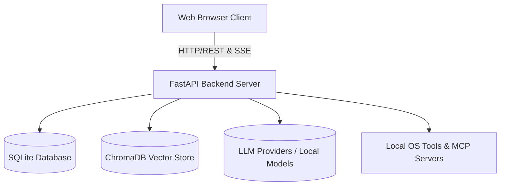

### Core Responsibilities
- **Frontend (Vanilla JS):** Manages user interactions, chat rendering, file attachments, state management, and real-time streaming updates.
- **Backend (FastAPI):** Orchestrates API routes, manages the database, executes agent loops and system tools, and interfaces with LLM providers or local models.
- **Cookbook & Hardware Fitness:** Analyzes the host's hardware (RAM, VRAM, GPU bandwidth) to recommend and manage local LLM serving (via `vLLM` or `llama.cpp`).
- **Memory & Storage:** Stores conversations, preferences, and calendars in SQLite, and maintains persistent semantic memory using ChromaDB.

---

## 2. Frontend Architecture (Vanilla JS)

The frontend avoids heavy frameworks like React or Vue, opting for vanilla JavaScript ES modules. This choice keeps the application lightweight and reduces build complexity.

### Directory Structure
- **`static/index.html`**: The main entry point. It defines the layout and loads all scripts.
- **`static/app.js`**: Orchestrates initialization.
- **`static/js/`**: Contains modular logic files:
  - `chat.js`, `chatRenderer.js`, `chatStream.js`: Handle chat state, message submission, rendering markdown, and SSE (Server-Sent Events) streaming.
  - `ui.js`: General UI utilities, toast notifications, auto-scrolling.
  - `sessions.js`, `memory.js`, `models.js`, `document.js`: Manage specific application domains.

### Communication Pattern
The frontend communicates with the backend primarily through standard REST APIs. However, for chat generation and long-running tasks, it heavily relies on **Server-Sent Events (SSE)**.

- **Streaming:** When a chat is submitted, the frontend opens an SSE connection (`/api/chat_stream`). The backend streams chunks of markdown text, which the frontend renders incrementally.
- **Tool Progress:** While the backend agent loop is executing tools, it streams progress indicators to the frontend, which are displayed as "thinking" or "executing" animations.
- **Document Streaming:** Changes to documents are streamed via specific SSE event types (e.g., `doc_stream_open`, `doc_stream_delta`) and updated live in the editor panel.

---

## 3. Backend Architecture (FastAPI)

The backend is built around a slim orchestrator (`app.py`), which glues together several sub-modules. It uses **FastAPI** for route handling and **SQLAlchemy** for database interactions.

### Directory Structure
- **`app.py`**: The FastAPI entry point. Handles middleware, CORS, lifecycle events, and mounts routes.
- **`core/`**: Database configuration (`database.py`), middleware, authentication, and constants.
- **`src/`**: The core logic engine. Contains the agent loop (`agent_loop.py`), tool execution logic (`agent_tools.py`), LLM interactions (`llm_core.py`), and more.
- **`routes/`**: FastAPI router definitions, separated by feature (e.g., `chat_routes.py`, `document_routes.py`, `memory_routes.py`).
- **`services/`**: Sub-services for specialized tasks like hardware fitness scoring (`hwfit/`), search integrations, TTS/STT, etc.

---

## 4. Agent & AI Orchestration

The most complex part of the backend is the agent loop (`src/agent_loop.py`), which handles how the AI processes multi-step tasks.

### The Agent Loop
1. **Prompt Assembly:** The loop begins by gathering context: recent messages, available tools, system instructions, and RAG (Retrieval Augmented Generation) context.
2. **Tool Selection (RAG vs Fallback):**
   - Odysseus uses a `ToolIndex` to semantically match available tools to the user's query. This prevents overwhelming the LLM prompt with hundreds of tool schemas.
   - If RAG fails or is skipped, it falls back to a keyword-based heuristic.
3. **Execution Round:** The model generates a response. If the response contains tool calls (e.g., "search the web", "read a file"), the loop intercepts it.
4. **Tool Dispatch:** The backend maps the tool call to Python functions (defined in `src/tool_implementations.py`).
5. **Re-injection:** The results of the tool execution are appended to the conversation history as a "tool response" message.
6. **Recursion:** The loop iterates, sending the updated history back to the model until the model provides a final answer or hits a maximum round limit.

### Loop Breakers & Supervisors
- **Runaway Detector:** Identifies if a model is repeatedly calling the same tool with identical arguments without making progress, and breaks the loop.
- **Intent-without-action Supervisor:** Detects if a model says it will do something (e.g., "Let me check the logs") but fails to actually emit a tool call. It nudges the model to perform the action.
- **Completion Verifier:** A secondary, independent LLM evaluation pass that verifies if the requested task is genuinely complete before allowing the agent to end its turn.

### Teacher Escalation (`src/teacher_escalation.py`)
For self-hosted models that may struggle with complex tasks, Odysseus implements a "Teacher Escalation" mechanism.
1. If the student model fails (detected via regex on tool errors or "giving up" language), it pauses.
2. It sends the failing trace to a configured "Teacher" model (typically a stronger, cloud-based API like GPT-4o or Claude 3.5 Sonnet).
3. The Teacher explains how to solve the problem and creates a structured `SKILL.md` file.
4. This new skill is saved to the `SkillsManager`, empowering the student model to succeed on similar tasks in the future.

---

## 5. Data, Memory, and Storage

All data is kept local within the `data/` directory, adhering to the project's privacy-first ethos.

### SQLite Database
- **Relational Data:** Managed via SQLAlchemy (`data/app.db`).
- **Stores:** Chats, sessions, API tokens, MCP server configs, Webhooks, user privileges, scheduled tasks, and calendar events.

### ChromaDB (Vector Store)
- **Semantic Memory:** Odysseus uses `ChromaDB` and ONNX `fastembed` for vector similarity search.
- **`MemoryManager` (`src/memory.py`):** Extracts and stores long-term facts, preferences, and contacts. It uses hybrid search (Jaccard similarity + semantic keyword boosting) to inject relevant memories into the agent's context.

### SkillsManager
- Manages `SKILL.md` files representing procedures.
- Published skills and teacher-escalation drafts are injected into the agent prompt based on relevance to the current conversation.

---

## 6. Integrations & Advanced Features

### MCP (Model Context Protocol) Manager (`src/mcp_manager.py`)
- Allows connecting external tool servers via standard IO (stdio), SSE, or HTTP.
- Dynamically converts MCP JSON schemas into OpenAI-compatible function calling schemas, injected into the agent loop.
- Handles OAuth flows for tools requiring authentication.

### Deep Research (`src/deep_research.py`)
- An iterative `Think → Search → Extract → Synthesize` loop.
- Generates sub-queries, executes searches via SearXNG (or others), extracts content from webpages using an LLM, and continuously synthesizes findings into a comprehensive final report.

### Email & CalDAV
- **Email:** Built-in IMAP/SMTP triage. It can summarize, auto-tag, and draft replies using AI.
- **CalDAV:** Local-first calendar synchronization with external providers (Radicale, Nextcloud, Apple, Fastmail).

---

## 7. Security & Authentication

Odysseus treats the self-hosted environment like an admin console due to powerful local tools (shell, file IO).

- **AuthManager (`core/auth.py`):** Handles bcrypt-hashed passwords and session cookies. Enabled by `AUTH_ENABLED=true`.
- **API Tokens:** Supports Bearer token authentication for external integrations (like Webhooks or Zapier). Tokens are cached for performance and invalidated on change.
- **Security Middleware:** `SecurityHeadersMiddleware` enforces safe browser headers. `AuthMiddleware` protects routes and validates proxy/tunnel forwarding headers to prevent auth bypass.

---

## 8. Deployment & Local Serving (Cookbook)

Odysseus is designed to run anywhere, but Docker is recommended.

### Hardware Discovery (`services/hwfit/`)
The `hwfit` module analyzes the host machine (RAM, VRAM, GPU bandwidth) to score HuggingFace models. Models fitting entirely in VRAM are prioritized.

### Deployment Models
- **Docker Compose:** The default setup runs Odysseus alongside ChromaDB and SearXNG.
- **GPU Passthrough:** Special overlays (`docker-compose.gpu-nvidia.yml`, `docker-compose.gpu-amd.yml`) configure NVIDIA or AMD ROCm passthrough.
- **Local Serving Engine:** The "Cookbook" dynamically installs and configures `vLLM` or `llama.cpp` in the local data directory, orchestrating inference via `tmux` sessions.

---

## 9. Future Upgrade Paths

For developers looking to extend or upgrade Odysseus:

1. **Frontend Refactoring:** Break down massive modules like `chat.js` into smaller, more manageable state machines.
2. **Database Migration:** Introduce an abstraction layer to support PostgreSQL, enabling scalability for small teams.
3. **Enhanced Teacher Self-Eval:** Implement a "Tier 2" LLM-based self-evaluation step in `teacher_escalation.py` for more nuanced failure detection.
4. **OAuth Authentication:** Integrate standard OAuth2 providers (GitHub, Google) for user login, augmenting the current username/password system.

---
*Generated by Jules, Vibecoder.*

## 10. Deep Dive: Frontend Architecture (Vanilla JS)

The frontend uses Vanilla JavaScript with an ES module architecture centered around `static/app.js` and `static/js/`.

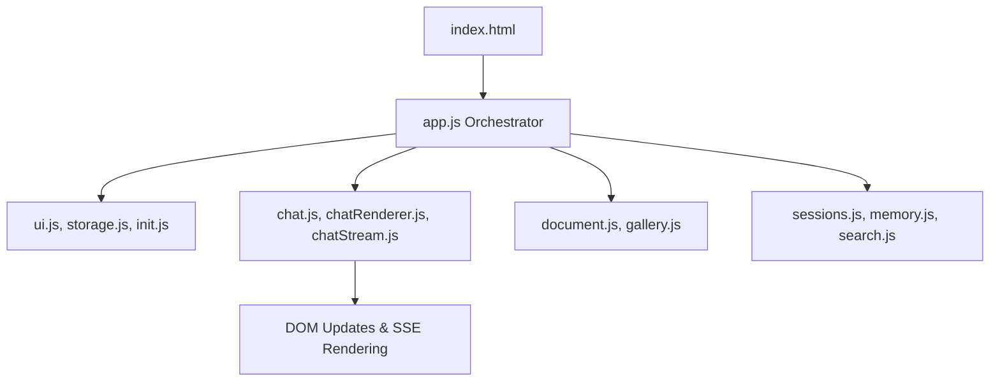

### Key Modules
- **`app.js`**: The main entry point. Eagerly binds global event listeners (drag and drop, shortcuts) and initializes all feature modules.
- **Chat Engine (`chat.js`, `chatStream.js`, `chatRenderer.js`)**: Handles chat session logic, submission, and SSE (Server-Sent Events) streaming. `chat.js` has a watchdog to detect stalled streams and recover them.
- **Document Editor (`document.js`, `editor/`)**: A multi-tab markdown/HTML editor with AI integration. `document.js` manages state and SSE sync, while `editor/` has specialized tools (e.g., inpainting, masking).
- **Session & Memory (`sessions.js`, `memory.js`)**: Manages CRUD for chat sessions and user vector memory.
- **Component Specifics**: Modular features like UI helpers (`ui.js`), keyboard shortcuts, file handlers, voice recorders, and theming.

---

## 11. Deep Dive: Backend Core & Routing (FastAPI)

The backend is structured around a centralized `app.py` that mounts numerous feature-specific routers defined in `routes/`.

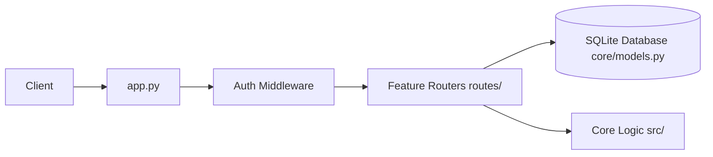

### Core Components
- **`app.py`**: The FastAPI application builder. Applies middleware (CORS, Auth, Security Headers) and uses `include_router` to mount ~40 specialized route modules (e.g., `chat_routes.py`, `email_routes.py`).
- **`core/models.py`**: SQLAlchemy declarative base models. It defines the schema for `ChatMessage`, `Session`, `Document`, `EmailAccount`, `McpServer`, etc.
- **`core/database.py`**: Manages the SQLite connection pool, SQLAlchemy engine, and encrypted text types.
- **`core/session_manager.py`**: Handles transactional logic for session states and chat history persistence.

---

## 12. Deep Dive: Agent Orchestration, Tools & RAG

The Agent Loop is the brain of Odysseus, dynamically looping the LLM with local tools, semantic memory (RAG), and Teacher Escalation.

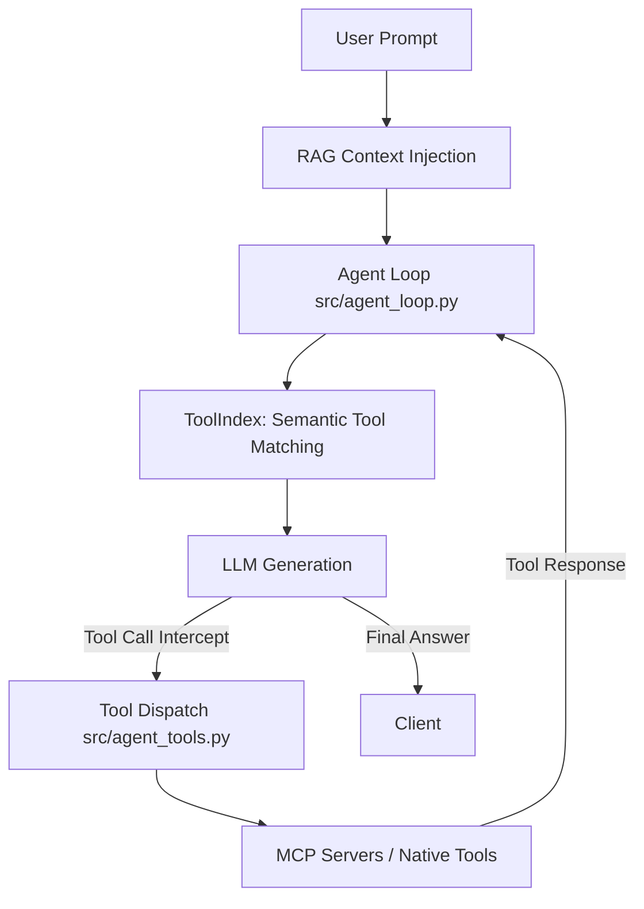

### Components
- **Agent Loop (`src/agent_loop.py`)**: Assembles prompts with context, checks tool use loops, and executes `stream_agent_loop`.
- **Tool Index (`src/tool_index.py`)**: Semantically matches available tools to the query using embeddings, limiting prompt bloat.
- **Tool Dispatch (`src/agent_tools.py`)**: Maps requested tools (e.g., `bash`, `read_file`, `web_search`) to their native Python implementations or MCP counterparts.
- **MCP Manager (`src/mcp_manager.py`)**: Dynamically connects external Model Context Protocol servers via stdio/HTTP.
- **RAG & Memory (`src/rag_manager.py`, `src/memory_vector.py`)**: Vector store abstractions around ChromaDB using `fastembed` to index personal documents and memories.
- **Teacher Escalation (`src/teacher_escalation.py`)**: Detects when an agent gets stuck, calls a stronger "Teacher" model to solve it, and saves the procedure as a new `SKILL.md`.

---

## 13. Deep Dive: Deep Research & Web Integration

Deep Research allows multi-step, autonomous information gathering resulting in a visually appealing HTML report.

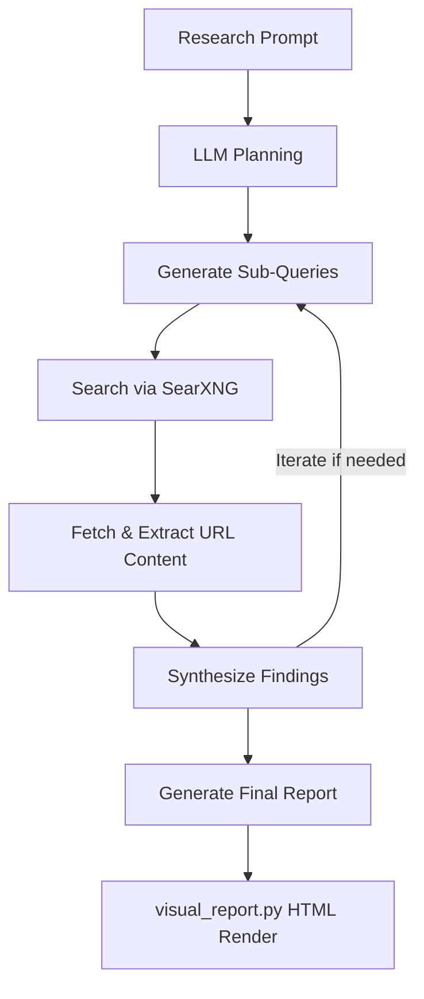

### Components
- **Deep Researcher (`src/deep_research.py`)**: The orchestration class. Implements an iterative think-search-extract-synthesize loop.
- **Search Service (`services/search/`)**: Provides abstractions over search providers (SearXNG, DuckDuckGo) for ranking, caching, and querying.
- **Visual Report (`src/visual_report.py`)**: Transforms the synthesized markdown report and JSON sources into a self-contained, themed HTML file with a table of contents and inline references.

---

## 14. Deep Dive: Email & Calendar Sync

Odysseus features robust, local-first syncing for emails (IMAP/SMTP) and calendars (CalDAV).

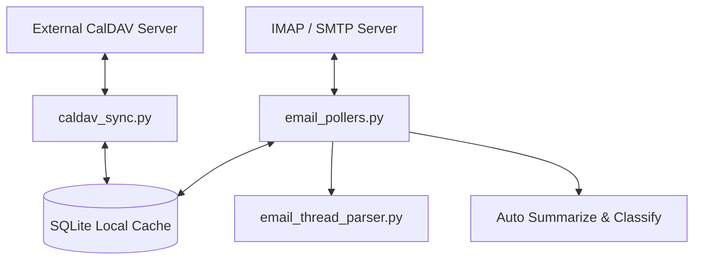

### Components
- **CalDAV Sync (`src/caldav_sync.py`, `src/caldav_writeback.py`)**: Resolves CalDAV hosts, fetches `.ics` events, caches them locally, and pushes local edits back to the remote server.
- **Email Pollers (`routes/email_pollers.py`)**: Background threads that poll IMAP folders, detect new mail, and run background LLM tasks to summarize, tag, or auto-reply.
- **Thread Parser (`src/email_thread_parser.py`)**: An advanced HTML/plaintext parser that strips quotes, mashes headers, and normalizes email body contents for LLM consumption.

---

## 15. Deep Dive: Cookbook & Hardware Fitness

The "Cookbook" automatically analyzes host hardware to recommend, download, and serve models.

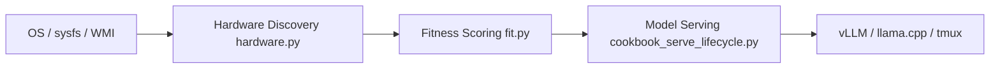

### Components
- **Hardware Discovery (`services/hwfit/hardware.py`)**: Reads `/sys/class/drm`, `nvidia-smi`, or Windows WMI to accurately gauge CPU, RAM, GPU architectures, and VRAM availability.
- **Fitness Scoring (`services/hwfit/fit.py`)**: Computes `_fit_score` based on required vs. available VRAM and ranks models for the user.
- **Serve Lifecycle (`src/cookbook_serve_lifecycle.py`)**: Orchestrates the downloading and serving of models via `tmux` sessions.

---

## 16. Deep Dive: Integrations & Companion

Odysseus can pair with companion apps and handle external webhooks.

- **Companion App (`companion/pairing.py`, `companion/routes.py`)**: Manages secure pairing using tokens and QR codes, allowing mobile or external apps to interact with the API securely.
- **Webhook Manager (`src/webhook_manager.py`)**: Dispatches system events out to configured webhooks securely (filtering out private IP loopbacks).
- **Integrations (`src/integrations.py`)**: A generalized module to store and resolve API keys, OAuth tokens, and connection configs for external tools.

---

## 17. Deep Dive: Deployment & Background Jobs

Odysseus employs standard and GPU-accelerated Docker builds along with native OS scripts.

- **Docker Entrypoints (`docker/entrypoint.sh`)**: Runs PUID/PGID matching to ensure bind-mounted volumes don't suffer from root-ownership permission issues.
- **Docker Compose Profiles (`docker-compose.gpu-nvidia.yml`, `docker-compose.gpu-amd.yml`)**: Extend the base deployment with passthrough configuration for hardware acceleration.
- **Native Launchers (`launch-windows.ps1`, `start-macos.sh`)**: Automate Venv creation, dependency installation, and server binding on native OSes.
- **Task Scheduler (`src/task_scheduler.py`, `src/bg_jobs.py`)**: Background loops that execute delayed actions, background research runs, ping reminders, and cron-scheduled tasks.

---

## 18. Deep Dive: Core Utilities (`core/`)

The core utilities manage foundational backend state, security, and process infrastructure.

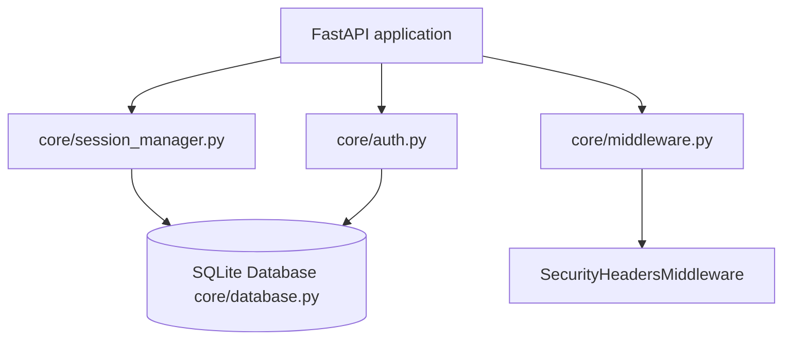

### Components
- **Session Management (`core/session_manager.py`)**: A centralized state machine holding in-memory references to user chat sessions and synchronizing them with SQLite. This module guarantees the transaction lifecycle, archiving inactive chats, tracking history, and purging deleted threads gracefully.
- **Authentication (`core/auth.py`)**: Provides security logic for the web application and external integrations. It handles Bearer tokens for API integrations and user TOTP secrets.
- **Security Middleware (`core/middleware.py`)**: Applies the `SecurityHeadersMiddleware`, issuing strict CSP boundaries, denying framing unless accessing specific isolated endpoints (like PDF previewers), and handling loopback agent requests securely.
- **Platform Compatibility & Atomic IO (`core/platform_compat.py`, `core/atomic_io.py`)**: Tools for writing files atomically, safely spawning processes across Windows/Linux, translating paths over WSL boundaries, and resolving execution environments.

---

## 19. Deep Dive: Background Services (`services/`)

The internal architecture separates discrete background jobs into standalone, stateless modules. These modules serve external integration requests triggered by the agent loop or via direct route access.

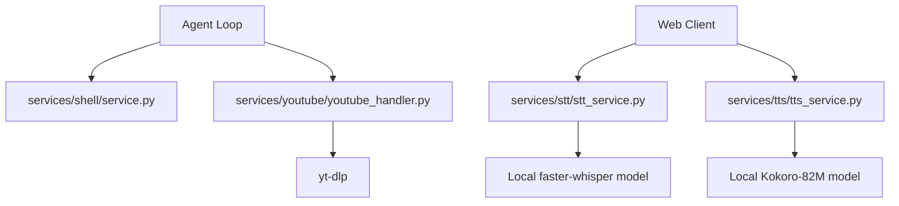

### Components
- **Shell Executor (`services/shell/`)**: Provides controlled subprocess execution capabilities complete with streaming outputs and rigid execution timeouts. Used to implement the "bash" native tool.
- **Speech Processing (`services/stt/`, `services/tts/`)**: Wraps speech-to-text (Whisper/Browser API) and text-to-speech (Kokoro-82M on GPU/API endpoints). Integrates transparent fallback if models fail to load or aren't installed locally.
- **YouTube Handler (`services/youtube/`)**: Employs `youtube_transcript_api` and `yt-dlp` to asynchronously pull video transcripts and high-voted comments for deep content context injection into the LLM.

---

## 20. Deep Dive: Built-in MCP Servers (`mcp_servers/`)

Odysseus uses the **Model Context Protocol (MCP)** to register native functionalities into the LLM prompt. These servers act directly on the local database and API, standardizing internal functions as tools.

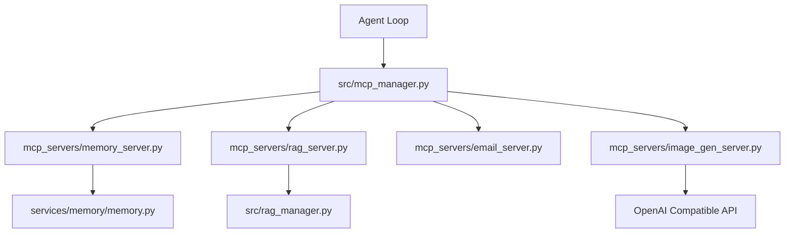

### Components
- **Memory Server (`mcp_servers/memory_server.py`)**: Exposes facts, preferences, and events. Directly bridges to `MemoryManager` to index new vectors or delete outdated recollections.
- **RAG Server (`mcp_servers/rag_server.py`)**: Gives the agent control over the semantic store, enabling it to add or remove paths from its own search index based on user instructions.
- **Email Server (`mcp_servers/email_server.py`)**: A massive suite of endpoints allowing the AI to query IMAP folders, download file attachments, and compose replies over SMTP.
- **Image Generation (`mcp_servers/image_gen_server.py`)**: Proxies image generation commands to configured models (e.g., Dall-E 3, SDXL endpoints), resolving the image and inserting a URL response right back into the chat context.

---

## 21. Deep Dive: Testing and Tooling (`tests/`, `scripts/`)

A robust local environment requires automated regression assurance and operations tooling.

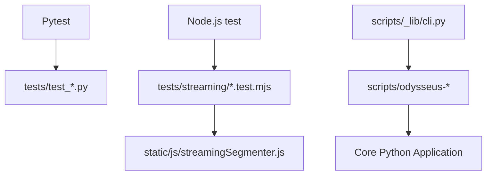

### Components
- **Pytest Suite (`tests/`)**: High-coverage Python testing logic isolating the agent, session, search, and uploading modules.
- **Streaming Invariants (`tests/streaming/`)**: Node.js harness scripts ensuring the Server-Sent Event boundary (`streamingSegmenter.js`) accurately matches equivalent static Markdown rendering paths without leaking mid-generation tags.
- **Operational CLI (`scripts/`)**: Repositories for standalone CLI ops, from database maintenance (`update_database.py`), headless model indexing (`index_documents.py`), hardware profiling scripts, and GitHub action analyzers (`pr_blocker_audit.py`).
