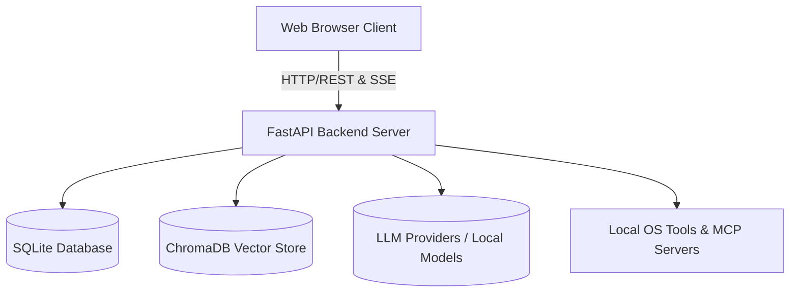

# Odysseus Architecture Report

Odysseus is a self-hosted AI workspace. It is designed to be local-first and privacy-focused, offering features typically seen in platforms like ChatGPT or Claude, but fully controlled by the user.

This document serves as a comprehensive overview of the system's architecture, including its backend orchestration, frontend structure, deployment models, integrations, and core algorithms. It is intended for new contributors, system administrators, and anyone interested in understanding the inner workings of Odysseus.

---

## 1. High-level System Overview

At a high level, Odysseus is a client-server web application with an embedded background task runner. The backend is built in Python using **FastAPI**, while the frontend is a **Vanilla JavaScript** single-page application (SPA).

### Core Responsibilities
- **Frontend (Vanilla JS):** Manages user interactions, chat rendering, file attachments, state management, and real-time streaming updates.
- **Backend (FastAPI):** Orchestrates API routes, manages the database, executes agent loops and system tools, and interfaces with LLM providers or local models.
- **Cookbook & Hardware Fitness:** Analyzes the host's hardware (RAM, VRAM, GPU bandwidth) to recommend and manage local LLM serving (via `vLLM` or `llama.cpp`).
- **Memory & Storage:** Stores conversations, preferences, and calendars in SQLite, and maintains persistent semantic memory using ChromaDB.

---

## 2. Frontend Architecture (Vanilla JS)

The frontend avoids heavy frameworks like React or Vue, opting for vanilla JavaScript ES modules. This choice keeps the application lightweight and reduces build complexity.

### Directory Structure
- **`static/index.html`**: The main entry point. It defines the layout and loads all scripts.
- **`static/app.js`**: Orchestrates initialization.
- **`static/js/`**: Contains modular logic files:
  - `chat.js`, `chatRenderer.js`, `chatStream.js`: Handle chat state, message submission, rendering markdown, and SSE (Server-Sent Events) streaming.
  - `ui.js`: General UI utilities, toast notifications, auto-scrolling.
  - `sessions.js`, `memory.js`, `models.js`, `document.js`: Manage specific application domains.

### Communication Pattern
The frontend communicates with the backend primarily through standard REST APIs. However, for chat generation and long-running tasks, it heavily relies on **Server-Sent Events (SSE)**.

- **Streaming:** When a chat is submitted, the frontend opens an SSE connection (`/api/chat_stream`). The backend streams chunks of markdown text, which the frontend renders incrementally.
- **Tool Progress:** While the backend agent loop is executing tools, it streams progress indicators to the frontend, which are displayed as "thinking" or "executing" animations.
- **Document Streaming:** Changes to documents are streamed via specific SSE event types (e.g., `doc_stream_open`, `doc_stream_delta`) and updated live in the editor panel.

---

## 3. Backend Architecture (FastAPI)

The backend is built around a slim orchestrator (`app.py`), which glues together several sub-modules. It uses **FastAPI** for route handling and **SQLAlchemy** for database interactions.

### Directory Structure
- **`app.py`**: The FastAPI entry point. Handles middleware, CORS, lifecycle events, and mounts routes.
- **`core/`**: Database configuration (`database.py`), middleware, authentication, and constants.
- **`src/`**: The core logic engine. Contains the agent loop (`agent_loop.py`), tool execution logic (`agent_tools.py`), LLM interactions (`llm_core.py`), and more.
- **`routes/`**: FastAPI router definitions, separated by feature (e.g., `chat_routes.py`, `document_routes.py`, `memory_routes.py`).
- **`services/`**: Sub-services for specialized tasks like hardware fitness scoring (`hwfit/`), search integrations, TTS/STT, etc.

---

## 4. Agent & AI Orchestration

The most complex part of the backend is the agent loop (`src/agent_loop.py`), which handles how the AI processes multi-step tasks.

### The Agent Loop
1. **Prompt Assembly:** The loop begins by gathering context: recent messages, available tools, system instructions, and RAG (Retrieval Augmented Generation) context.
2. **Tool Selection (RAG vs Fallback):**
   - Odysseus uses a `ToolIndex` to semantically match available tools to the user's query. This prevents overwhelming the LLM prompt with hundreds of tool schemas.
   - If RAG fails or is skipped, it falls back to a keyword-based heuristic.
3. **Execution Round:** The model generates a response. If the response contains tool calls (e.g., "search the web", "read a file"), the loop intercepts it.
4. **Tool Dispatch:** The backend maps the tool call to Python functions (defined in `src/tool_implementations.py`).
5. **Re-injection:** The results of the tool execution are appended to the conversation history as a "tool response" message.
6. **Recursion:** The loop iterates, sending the updated history back to the model until the model provides a final answer or hits a maximum round limit.

### Loop Breakers & Supervisors
- **Runaway Detector:** Identifies if a model is repeatedly calling the same tool with identical arguments without making progress, and breaks the loop.
- **Intent-without-action Supervisor:** Detects if a model says it will do something (e.g., "Let me check the logs") but fails to actually emit a tool call. It nudges the model to perform the action.
- **Completion Verifier:** A secondary, independent LLM evaluation pass that verifies if the requested task is genuinely complete before allowing the agent to end its turn.

### Teacher Escalation (`src/teacher_escalation.py`)
For self-hosted models that may struggle with complex tasks, Odysseus implements a "Teacher Escalation" mechanism.
1. If the student model fails (detected via regex on tool errors or "giving up" language), it pauses.
2. It sends the failing trace to a configured "Teacher" model (typically a stronger, cloud-based API like GPT-4o or Claude 3.5 Sonnet).
3. The Teacher explains how to solve the problem and creates a structured `SKILL.md` file.
4. This new skill is saved to the `SkillsManager`, empowering the student model to succeed on similar tasks in the future.

---

## 5. Data, Memory, and Storage

All data is kept local within the `data/` directory, adhering to the project's privacy-first ethos.

### SQLite Database
- **Relational Data:** Managed via SQLAlchemy (`data/app.db`).
- **Stores:** Chats, sessions, API tokens, MCP server configs, Webhooks, user privileges, scheduled tasks, and calendar events.

### ChromaDB (Vector Store)
- **Semantic Memory:** Odysseus uses `ChromaDB` and ONNX `fastembed` for vector similarity search.
- **`MemoryManager` (`src/memory.py`):** Extracts and stores long-term facts, preferences, and contacts. It uses hybrid search (Jaccard similarity + semantic keyword boosting) to inject relevant memories into the agent's context.

### SkillsManager
- Manages `SKILL.md` files representing procedures.
- Published skills and teacher-escalation drafts are injected into the agent prompt based on relevance to the current conversation.

---

## 6. Integrations & Advanced Features

### MCP (Model Context Protocol) Manager (`src/mcp_manager.py`)
- Allows connecting external tool servers via standard IO (stdio), SSE, or HTTP.
- Dynamically converts MCP JSON schemas into OpenAI-compatible function calling schemas, injected into the agent loop.
- Handles OAuth flows for tools requiring authentication.

### Deep Research (`src/deep_research.py`)
- An iterative `Think → Search → Extract → Synthesize` loop.
- Generates sub-queries, executes searches via SearXNG (or others), extracts content from webpages using an LLM, and continuously synthesizes findings into a comprehensive final report.

### Email & CalDAV
- **Email:** Built-in IMAP/SMTP triage. It can summarize, auto-tag, and draft replies using AI.
- **CalDAV:** Local-first calendar synchronization with external providers (Radicale, Nextcloud, Apple, Fastmail).

---

## 7. Security & Authentication

Odysseus treats the self-hosted environment like an admin console due to powerful local tools (shell, file IO).

- **AuthManager (`core/auth.py`):** Handles bcrypt-hashed passwords and session cookies. Enabled by `AUTH_ENABLED=true`.
- **API Tokens:** Supports Bearer token authentication for external integrations (like Webhooks or Zapier). Tokens are cached for performance and invalidated on change.
- **Security Middleware:** `SecurityHeadersMiddleware` enforces safe browser headers. `AuthMiddleware` protects routes and validates proxy/tunnel forwarding headers to prevent auth bypass.

---

## 8. Deployment & Local Serving (Cookbook)

Odysseus is designed to run anywhere, but Docker is recommended.

### Hardware Discovery (`services/hwfit/`)
The `hwfit` module analyzes the host machine (RAM, VRAM, GPU bandwidth) to score HuggingFace models. Models fitting entirely in VRAM are prioritized.

### Deployment Models
- **Docker Compose:** The default setup runs Odysseus alongside ChromaDB and SearXNG.
- **GPU Passthrough:** Special overlays (`docker-compose.gpu-nvidia.yml`, `docker-compose.gpu-amd.yml`) configure NVIDIA or AMD ROCm passthrough.
- **Local Serving Engine:** The "Cookbook" dynamically installs and configures `vLLM` or `llama.cpp` in the local data directory, orchestrating inference via `tmux` sessions.

---

## 9. Future Upgrade Paths

For developers looking to extend or upgrade Odysseus:

1. **Frontend Refactoring:** Break down massive modules like `chat.js` into smaller, more manageable state machines.
2. **Database Migration:** Introduce an abstraction layer to support PostgreSQL, enabling scalability for small teams.
3. **Enhanced Teacher Self-Eval:** Implement a "Tier 2" LLM-based self-evaluation step in `teacher_escalation.py` for more nuanced failure detection.
4. **OAuth Authentication:** Integrate standard OAuth2 providers (GitHub, Google) for user login, augmenting the current username/password system.

---
*Generated by Jules, Vibecoder.*