# Odysseus Architecture Report

Odysseus is a self-hosted AI workspace. It is designed to be local-first and privacy-focused, offering features typically seen in platforms like ChatGPT or Claude, but fully controlled by the user.

This document serves as a comprehensive overview of the system's architecture, including its backend orchestration, frontend structure, deployment models, integrations, and core algorithms. It is intended for new contributors, system administrators, and anyone interested in understanding the inner workings of Odysseus.

---

## 1. High-level System Overview

At a high level, Odysseus is a client-server web application with an embedded background task runner. The backend is built in Python using **FastAPI**, while the frontend is a **Vanilla JavaScript** single-page application (SPA).

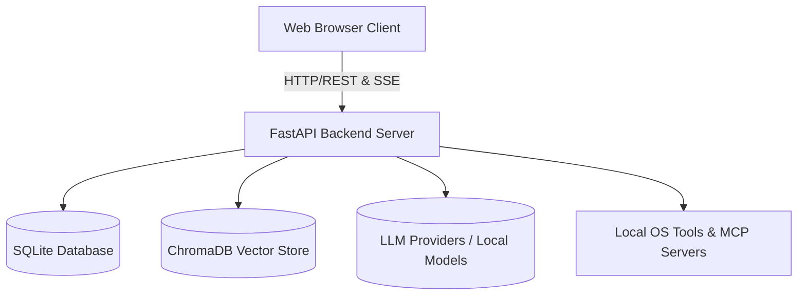

### Core Responsibilities
- **Frontend (Vanilla JS):** Manages user interactions, chat rendering, file attachments, state management, and real-time streaming updates.
- **Backend (FastAPI):** Orchestrates API routes, manages the database, executes agent loops and system tools, and interfaces with LLM providers or local models.
- **Cookbook & Hardware Fitness:** Analyzes the host's hardware (RAM, VRAM, GPU bandwidth) to recommend and manage local LLM serving (via `vLLM` or `llama.cpp`).
- **Memory & Storage:** Stores conversations, preferences, and calendars in SQLite, and maintains persistent semantic memory using ChromaDB.

---

## 2. Frontend Architecture (Vanilla JS)

The frontend avoids heavy frameworks like React or Vue, opting for vanilla JavaScript ES modules. This choice keeps the application lightweight and reduces build complexity.

### Directory Structure
- **`static/index.html`**: The main entry point. It defines the layout and loads all scripts.
- **`static/app.js`**: Orchestrates initialization.
- **`static/js/`**: Contains modular logic files:
  - `chat.js`, `chatRenderer.js`, `chatStream.js`: Handle chat state, message submission, rendering markdown, and SSE (Server-Sent Events) streaming.
  - `ui.js`: General UI utilities, toast notifications, auto-scrolling.
  - `sessions.js`, `memory.js`, `models.js`, `document.js`: Manage specific application domains.

### Communication Pattern
The frontend communicates with the backend primarily through standard REST APIs. However, for chat generation and long-running tasks, it heavily relies on **Server-Sent Events (SSE)**.

- **Streaming:** When a chat is submitted, the frontend opens an SSE connection (`/api/chat_stream`). The backend streams chunks of markdown text, which the frontend renders incrementally.
- **Tool Progress:** While the backend agent loop is executing tools, it streams progress indicators to the frontend, which are displayed as "thinking" or "executing" animations.
- **Document Streaming:** Changes to documents are streamed via specific SSE event types (e.g., `doc_stream_open`, `doc_stream_delta`) and updated live in the editor panel.

---

## 3. Backend Architecture (FastAPI)

The backend is built around a slim orchestrator (`app.py`), which glues together several sub-modules. It uses **FastAPI** for route handling and **SQLAlchemy** for database interactions.

### Directory Structure
- **`app.py`**: The FastAPI entry point. Handles middleware, CORS, lifecycle events, and mounts routes.
- **`core/`**: Database configuration (`database.py`), middleware, authentication, and constants.
- **`src/`**: The core logic engine. Contains the agent loop (`agent_loop.py`), tool execution logic (`agent_tools.py`), LLM interactions (`llm_core.py`), and more.
- **`routes/`**: FastAPI router definitions, separated by feature (e.g., `chat_routes.py`, `document_routes.py`, `memory_routes.py`).
- **`services/`**: Sub-services for specialized tasks like hardware fitness scoring (`hwfit/`), search integrations, TTS/STT, etc.

---

## 4. Agent & AI Orchestration

The most complex part of the backend is the agent loop (`src/agent_loop.py`), which handles how the AI processes multi-step tasks.

### The Agent Loop
1. **Prompt Assembly:** The loop begins by gathering context: recent messages, available tools, system instructions, and RAG (Retrieval Augmented Generation) context.
2. **Tool Selection (RAG vs Fallback):**
   - Odysseus uses a `ToolIndex` to semantically match available tools to the user's query. This prevents overwhelming the LLM prompt with hundreds of tool schemas.
   - If RAG fails or is skipped, it falls back to a keyword-based heuristic.
3. **Execution Round:** The model generates a response. If the response contains tool calls (e.g., "search the web", "read a file"), the loop intercepts it.
4. **Tool Dispatch:** The backend maps the tool call to Python functions (defined in `src/tool_implementations.py`).
5. **Re-injection:** The results of the tool execution are appended to the conversation history as a "tool response" message.
6. **Recursion:** The loop iterates, sending the updated history back to the model until the model provides a final answer or hits a maximum round limit.

### Loop Breakers & Supervisors
- **Runaway Detector:** Identifies if a model is repeatedly calling the same tool with identical arguments without making progress, and breaks the loop.
- **Intent-without-action Supervisor:** Detects if a model says it will do something (e.g., "Let me check the logs") but fails to actually emit a tool call. It nudges the model to perform the action.
- **Completion Verifier:** A secondary, independent LLM evaluation pass that verifies if the requested task is genuinely complete before allowing the agent to end its turn.

### Teacher Escalation (`src/teacher_escalation.py`)
For self-hosted models that may struggle with complex tasks, Odysseus implements a "Teacher Escalation" mechanism.
1. If the student model fails (detected via regex on tool errors or "giving up" language), it pauses.
2. It sends the failing trace to a configured "Teacher" model (typically a stronger, cloud-based API like GPT-4o or Claude 3.5 Sonnet).
3. The Teacher explains how to solve the problem and creates a structured `SKILL.md` file.
4. This new skill is saved to the `SkillsManager`, empowering the student model to succeed on similar tasks in the future.

---

## 5. Data, Memory, and Storage

All data is kept local within the `data/` directory, adhering to the project's privacy-first ethos.

### SQLite Database
- **Relational Data:** Managed via SQLAlchemy (`data/app.db`).
- **Stores:** Chats, sessions, API tokens, MCP server configs, Webhooks, user privileges, scheduled tasks, and calendar events.

### ChromaDB (Vector Store)
- **Semantic Memory:** Odysseus uses `ChromaDB` and ONNX `fastembed` for vector similarity search.
- **`MemoryManager` (`src/memory.py`):** Extracts and stores long-term facts, preferences, and contacts. It uses hybrid search (Jaccard similarity + semantic keyword boosting) to inject relevant memories into the agent's context.

### SkillsManager
- Manages `SKILL.md` files representing procedures.
- Published skills and teacher-escalation drafts are injected into the agent prompt based on relevance to the current conversation.

---

## 6. Integrations & Advanced Features

### MCP (Model Context Protocol) Manager (`src/mcp_manager.py`)
- Allows connecting external tool servers via standard IO (stdio), SSE, or HTTP.
- Dynamically converts MCP JSON schemas into OpenAI-compatible function calling schemas, injected into the agent loop.
- Handles OAuth flows for tools requiring authentication.

### Deep Research (`src/deep_research.py`)
- An iterative `Think → Search → Extract → Synthesize` loop.
- Generates sub-queries, executes searches via SearXNG (or others), extracts content from webpages using an LLM, and continuously synthesizes findings into a comprehensive final report.

### Email & CalDAV
- **Email:** Built-in IMAP/SMTP triage. It can summarize, auto-tag, and draft replies using AI.
- **CalDAV:** Local-first calendar synchronization with external providers (Radicale, Nextcloud, Apple, Fastmail).

---

## 7. Security & Authentication

Odysseus treats the self-hosted environment like an admin console due to powerful local tools (shell, file IO).

- **AuthManager (`core/auth.py`):** Handles bcrypt-hashed passwords and session cookies. Enabled by `AUTH_ENABLED=true`.
- **API Tokens:** Supports Bearer token authentication for external integrations (like Webhooks or Zapier). Tokens are cached for performance and invalidated on change.
- **Security Middleware:** `SecurityHeadersMiddleware` enforces safe browser headers. `AuthMiddleware` protects routes and validates proxy/tunnel forwarding headers to prevent auth bypass.

---

## 8. Deployment & Local Serving (Cookbook)

Odysseus is designed to run anywhere, but Docker is recommended.

### Hardware Discovery (`services/hwfit/`)
The `hwfit` module analyzes the host machine (RAM, VRAM, GPU bandwidth) to score HuggingFace models. Models fitting entirely in VRAM are prioritized.

### Deployment Models
- **Docker Compose:** The default setup runs Odysseus alongside ChromaDB and SearXNG.
- **GPU Passthrough:** Special overlays (`docker-compose.gpu-nvidia.yml`, `docker-compose.gpu-amd.yml`) configure NVIDIA or AMD ROCm passthrough.
- **Local Serving Engine:** The "Cookbook" dynamically installs and configures `vLLM` or `llama.cpp` in the local data directory, orchestrating inference via `tmux` sessions.

---

## 9. Future Upgrade Paths

For developers looking to extend or upgrade Odysseus:

1. **Frontend Refactoring:** Break down massive modules like `chat.js` into smaller, more manageable state machines.
2. **Database Migration:** Introduce an abstraction layer to support PostgreSQL, enabling scalability for small teams.
3. **Enhanced Teacher Self-Eval:** Implement a "Tier 2" LLM-based self-evaluation step in `teacher_escalation.py` for more nuanced failure detection.
4. **OAuth Authentication:** Integrate standard OAuth2 providers (GitHub, Google) for user login, augmenting the current username/password system.

---
*Generated by Jules, Vibecoder.*

## 10. Deep Dive: Frontend Architecture (Vanilla JS)

The frontend uses Vanilla JavaScript with an ES module architecture centered around `static/app.js` and `static/js/`.

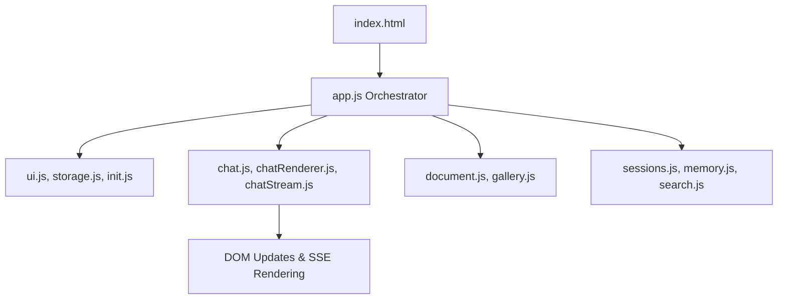

### Key Modules
- **`app.js`**: The main entry point. Eagerly binds global event listeners (drag and drop, shortcuts) and initializes all feature modules.
- **Chat Engine (`chat.js`, `chatStream.js`, `chatRenderer.js`)**: Handles chat session logic, submission, and SSE (Server-Sent Events) streaming. `chat.js` has a watchdog to detect stalled streams and recover them.
- **Document Editor (`document.js`, `editor/`)**: A multi-tab markdown/HTML editor with AI integration. `document.js` manages state and SSE sync, while `editor/` has specialized tools (e.g., inpainting, masking).
- **Session & Memory (`sessions.js`, `memory.js`)**: Manages CRUD for chat sessions and user vector memory.
- **Component Specifics**: Modular features like UI helpers (`ui.js`), keyboard shortcuts, file handlers, voice recorders, and theming.

---

## 11. Deep Dive: Backend Core & Routing (FastAPI)

The backend is structured around a centralized `app.py` that mounts numerous feature-specific routers defined in `routes/`.

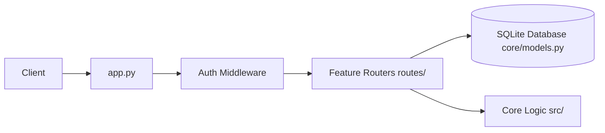

### Core Components
- **`app.py`**: The FastAPI application builder. Applies middleware (CORS, Auth, Security Headers) and uses `include_router` to mount ~40 specialized route modules (e.g., `chat_routes.py`, `email_routes.py`).
- **`core/models.py`**: SQLAlchemy declarative base models. It defines the schema for `ChatMessage`, `Session`, `Document`, `EmailAccount`, `McpServer`, etc.
- **`core/database.py`**: Manages the SQLite connection pool, SQLAlchemy engine, and encrypted text types.
- **`core/session_manager.py`**: Handles transactional logic for session states and chat history persistence.

---

## 12. Deep Dive: Agent Orchestration, Tools & RAG

The Agent Loop is the brain of Odysseus, dynamically looping the LLM with local tools, semantic memory (RAG), and Teacher Escalation.

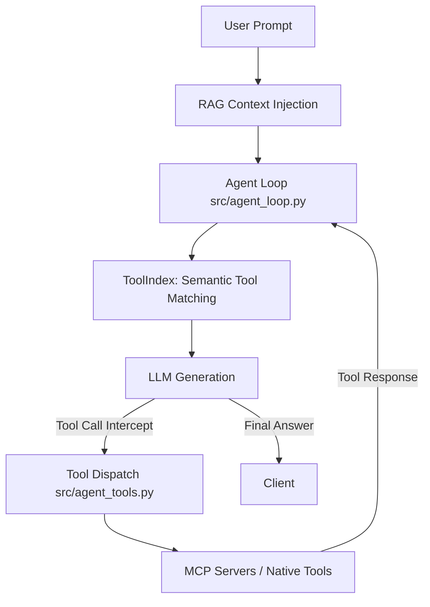

### Components
- **Agent Loop (`src/agent_loop.py`)**: Assembles prompts with context, checks tool use loops, and executes `stream_agent_loop`.
- **Tool Index (`src/tool_index.py`)**: Semantically matches available tools to the query using embeddings, limiting prompt bloat.
- **Tool Dispatch (`src/agent_tools.py`)**: Maps requested tools (e.g., `bash`, `read_file`, `web_search`) to their native Python implementations or MCP counterparts.
- **MCP Manager (`src/mcp_manager.py`)**: Dynamically connects external Model Context Protocol servers via stdio/HTTP.
- **RAG & Memory (`src/rag_manager.py`, `src/memory_vector.py`)**: Vector store abstractions around ChromaDB using `fastembed` to index personal documents and memories.
- **Teacher Escalation (`src/teacher_escalation.py`)**: Detects when an agent gets stuck, calls a stronger "Teacher" model to solve it, and saves the procedure as a new `SKILL.md`.

---

## 13. Deep Dive: Deep Research & Web Integration

Deep Research allows multi-step, autonomous information gathering resulting in a visually appealing HTML report.

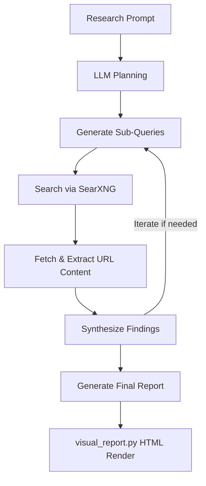

### Components
- **Deep Researcher (`src/deep_research.py`)**: The orchestration class. Implements an iterative think-search-extract-synthesize loop.
- **Search Service (`services/search/`)**: Provides abstractions over search providers (SearXNG, DuckDuckGo) for ranking, caching, and querying.
- **Visual Report (`src/visual_report.py`)**: Transforms the synthesized markdown report and JSON sources into a self-contained, themed HTML file with a table of contents and inline references.

---

## 14. Deep Dive: Email & Calendar Sync

Odysseus features robust, local-first syncing for emails (IMAP/SMTP) and calendars (CalDAV).

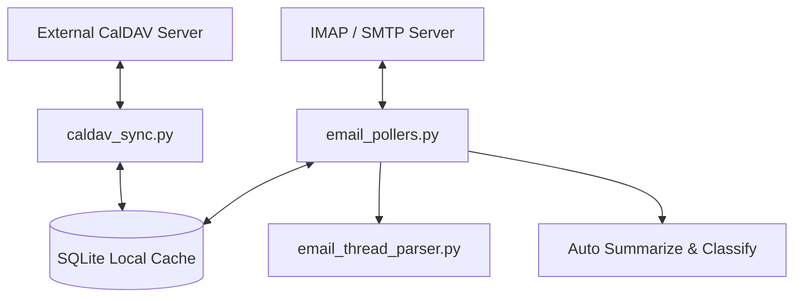

### Components
- **CalDAV Sync (`src/caldav_sync.py`, `src/caldav_writeback.py`)**: Resolves CalDAV hosts, fetches `.ics` events, caches them locally, and pushes local edits back to the remote server.
- **Email Pollers (`routes/email_pollers.py`)**: Background threads that poll IMAP folders, detect new mail, and run background LLM tasks to summarize, tag, or auto-reply.
- **Thread Parser (`src/email_thread_parser.py`)**: An advanced HTML/plaintext parser that strips quotes, mashes headers, and normalizes email body contents for LLM consumption.

---

## 15. Deep Dive: Cookbook & Hardware Fitness

The "Cookbook" automatically analyzes host hardware to recommend, download, and serve models.

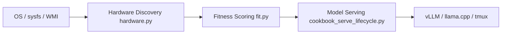

### Components
- **Hardware Discovery (`services/hwfit/hardware.py`)**: Reads `/sys/class/drm`, `nvidia-smi`, or Windows WMI to accurately gauge CPU, RAM, GPU architectures, and VRAM availability.
- **Fitness Scoring (`services/hwfit/fit.py`)**: Computes `_fit_score` based on required vs. available VRAM and ranks models for the user.
- **Serve Lifecycle (`src/cookbook_serve_lifecycle.py`)**: Orchestrates the downloading and serving of models via `tmux` sessions.

---

## 16. Deep Dive: Integrations & Companion

Odysseus can pair with companion apps and handle external webhooks.

- **Companion App (`companion/pairing.py`, `companion/routes.py`)**: Manages secure pairing using tokens and QR codes, allowing mobile or external apps to interact with the API securely.
- **Webhook Manager (`src/webhook_manager.py`)**: Dispatches system events out to configured webhooks securely (filtering out private IP loopbacks).
- **Integrations (`src/integrations.py`)**: A generalized module to store and resolve API keys, OAuth tokens, and connection configs for external tools.

---

## 17. Deep Dive: Deployment & Background Jobs

Odysseus employs standard and GPU-accelerated Docker builds along with native OS scripts.

- **Docker Entrypoints (`docker/entrypoint.sh`)**: Runs PUID/PGID matching to ensure bind-mounted volumes don't suffer from root-ownership permission issues.
- **Docker Compose Profiles (`docker-compose.gpu-nvidia.yml`, `docker-compose.gpu-amd.yml`)**: Extend the base deployment with passthrough configuration for hardware acceleration.
- **Native Launchers (`launch-windows.ps1`, `start-macos.sh`)**: Automate Venv creation, dependency installation, and server binding on native OSes.
- **Task Scheduler (`src/task_scheduler.py`, `src/bg_jobs.py`)**: Background loops that execute delayed actions, background research runs, ping reminders, and cron-scheduled tasks.

---

## 18. Deep Dive: Core Utilities (`core/`)

The core utilities manage foundational backend state, security, and process infrastructure.

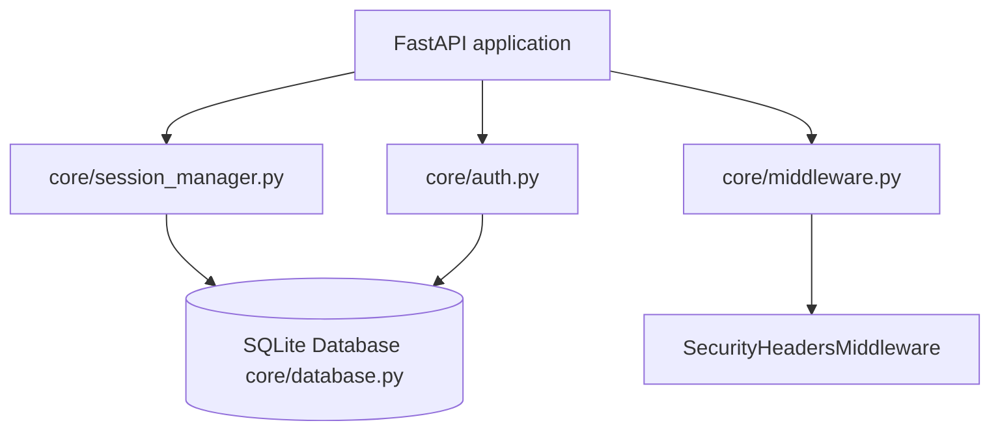

### Components
- **Session Management (`core/session_manager.py`)**: A centralized state machine holding in-memory references to user chat sessions and synchronizing them with SQLite. This module guarantees the transaction lifecycle, archiving inactive chats, tracking history, and purging deleted threads gracefully.
- **Authentication (`core/auth.py`)**: Provides security logic for the web application and external integrations. It handles Bearer tokens for API integrations and user TOTP secrets.
- **Security Middleware (`core/middleware.py`)**: Applies the `SecurityHeadersMiddleware`, issuing strict CSP boundaries, denying framing unless accessing specific isolated endpoints (like PDF previewers), and handling loopback agent requests securely.
- **Platform Compatibility & Atomic IO (`core/platform_compat.py`, `core/atomic_io.py`)**: Tools for writing files atomically, safely spawning processes across Windows/Linux, translating paths over WSL boundaries, and resolving execution environments.

---

## 19. Deep Dive: Background Services (`services/`)

The internal architecture separates discrete background jobs into standalone, stateless modules. These modules serve external integration requests triggered by the agent loop or via direct route access.

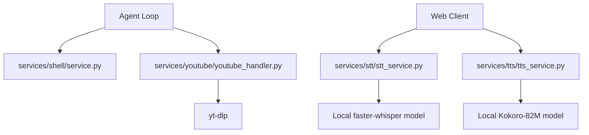

### Components
- **Shell Executor (`services/shell/`)**: Provides controlled subprocess execution capabilities complete with streaming outputs and rigid execution timeouts. Used to implement the "bash" native tool.
- **Speech Processing (`services/stt/`, `services/tts/`)**: Wraps speech-to-text (Whisper/Browser API) and text-to-speech (Kokoro-82M on GPU/API endpoints). Integrates transparent fallback if models fail to load or aren't installed locally.
- **YouTube Handler (`services/youtube/`)**: Employs `youtube_transcript_api` and `yt-dlp` to asynchronously pull video transcripts and high-voted comments for deep content context injection into the LLM.

---

## 20. Deep Dive: Built-in MCP Servers (`mcp_servers/`)

Odysseus uses the **Model Context Protocol (MCP)** to register native functionalities into the LLM prompt. These servers act directly on the local database and API, standardizing internal functions as tools.

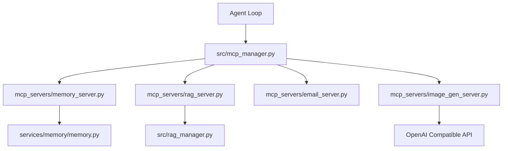

### Components
- **Memory Server (`mcp_servers/memory_server.py`)**: Exposes facts, preferences, and events. Directly bridges to `MemoryManager` to index new vectors or delete outdated recollections.
- **RAG Server (`mcp_servers/rag_server.py`)**: Gives the agent control over the semantic store, enabling it to add or remove paths from its own search index based on user instructions.
- **Email Server (`mcp_servers/email_server.py`)**: A massive suite of endpoints allowing the AI to query IMAP folders, download file attachments, and compose replies over SMTP.
- **Image Generation (`mcp_servers/image_gen_server.py`)**: Proxies image generation commands to configured models (e.g., Dall-E 3, SDXL endpoints), resolving the image and inserting a URL response right back into the chat context.

---

## 21. Deep Dive: Testing and Tooling (`tests/`, `scripts/`)

A robust local environment requires automated regression assurance and operations tooling.

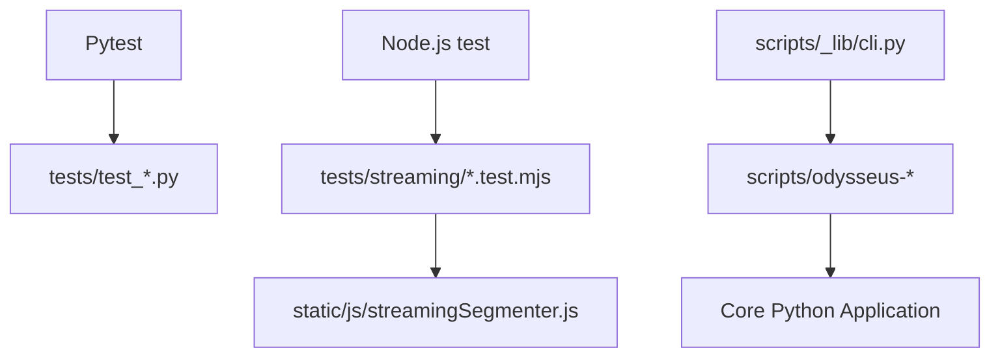

### Components
- **Pytest Suite (`tests/`)**: High-coverage Python testing logic isolating the agent, session, search, and uploading modules.
- **Streaming Invariants (`tests/streaming/`)**: Node.js harness scripts ensuring the Server-Sent Event boundary (`streamingSegmenter.js`) accurately matches equivalent static Markdown rendering paths without leaking mid-generation tags.
- **Operational CLI (`scripts/`)**: Repositories for standalone CLI ops, from database maintenance (`update_database.py`), headless model indexing (`index_documents.py`), hardware profiling scripts, and GitHub action analyzers (`pr_blocker_audit.py`).

## 22. Deep Dive: API Routing & Controllers (`routes/`)

Odysseus isolates the API surface area from business logic through a highly modular router design. Instead of a monolithic routing file, the application features over 40 distinct route controllers in the `routes/` directory.

### Routing Organization
- **`app.py` Mounting:** The primary FastAPI application imports and mounts these routers using `include_router`.
- **Feature Encapsulation:** Endpoints are strictly scoped to their domain. For instance, `document_routes.py` manages all `GET/POST /api/documents` operations, while `chat_routes.py` handles generation and SSE streams.
- **Helper Extraction:** Complex or reusable logic inside a router is often extracted to a companion file (e.g., `chat_helpers.py`, `document_helpers.py`, `cookbook_helpers.py`).
- **Security Scope:** Middleware ensures that endpoints are protected based on user roles. Most routers perform their own checks against `get_current_user` to restrict data access to the session owner. Certain administrative routes (`api_token_routes.py`, `webhook_routes.py`) mandate a higher privilege level via `require_admin`.

---

## 23. Deep Dive: Chat Processing & Engine Logic (`src/`)

The core execution of conversational AI interactions lives primarily in `src/chat_processor.py`, `src/chat_handler.py`, and `src/agent_runs.py`.

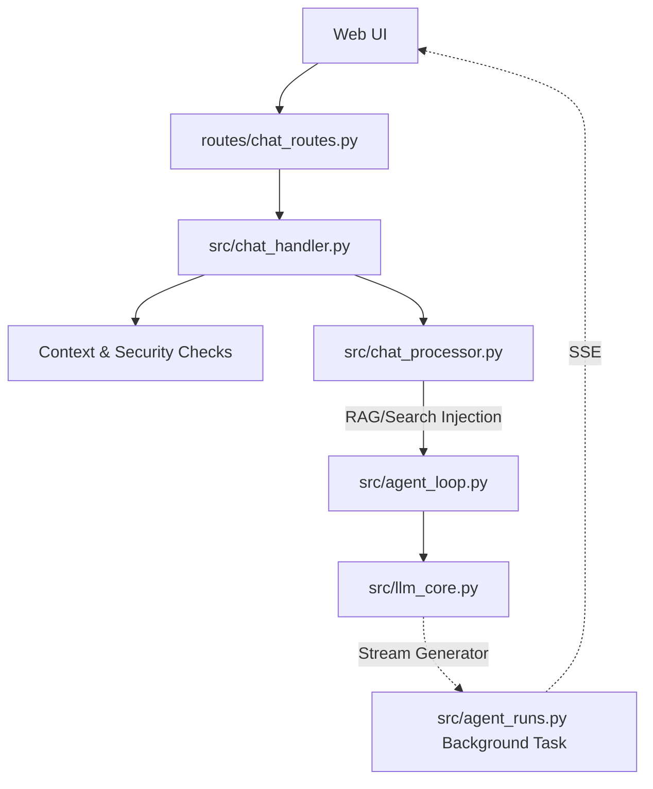

### Components
- **`chat_handler.py`:** Parses incoming chat requests, manages attachment validations, coerces sessions, and sets up the async streams.
- **`chat_processor.py`:** Applies NLP tasks. It checks for stopwords, extracts URLs directly via regex for immediate search querying, and handles security logic (like `UNTRUSTED_CONTEXT_POLICY`) to sanitize unsafe context windows.
- **`agent_runs.py`:** Implements detached agent-runs. The model streams text even if the browser drops the SSE connection. This module catches the stream into a replay buffer that users can re-subscribe to upon page refresh, preventing mid-thought data loss.

---

## 24. Deep Dive: Document & Workspace Logic

Odysseus supports an AI-assisted rich text and markdown editor.

### Components
- **`src/document_processor.py`:** Determines if a document is code, text, or binary. Applies syntax formatting to specific extensions and prepares text to be manipulated by the LLM.
- **`src/document_actions.py`:** Contains functions that process AI commands on documents (like inpainting, summarization, or translation) directly on the document body.

---

## 25. Deep Dive: Tasks, Background Jobs & Notes

Odysseus implements a built-in scheduler to manage long-running operations and recurring events natively.

### Components
- **`src/task_scheduler.py`:** An asynchronous scheduler managing `ScheduledTask` entries from the database. It handles deduplication of API fetches with a TTL cache (`_shared_cache`) for simultaneous triggers and executes recurring tasks reliably.
- **`src/bg_jobs.py`:** Runs heavy operations (like `ffmpeg`, model downloads, package installations via the `bash` tool) in a detached process. The agent writes exit-code status files rather than relying on live PIDs, guaranteeing survival across server restarts.
- **`src/task_endpoint.py` / `src/note_routes.py`:** Expose endpoints for creating quick-capture notes, to-do lists, and scheduled actions that the system acts on periodically.

---

## 26. Deep Dive: File Uploads & Document Parsers

To extract and interpret user data natively, Odysseus incorporates several parsing strategies.

### Components
- **`src/upload_handler.py`:** Governs file ingests. It standardizes sanitization (`secure_filename`), applies environment-defined limits (`upload_limits.py`), and moves the artifacts to `DATA_DIR/uploads`.
- **`src/pdf_runtime.py` / `pdf_forms.py`:** Uses libraries like `PyMuPDF` (if installed) to parse PDF contents natively, extracting raw text and structure.
- **`src/markitdown_runtime.py`:** Provides extraction for proprietary office formats (`.docx`, `.xlsx`, `.pptx`) converting them reliably into Markdown for the context window.

---

## 27. Deep Dive: Complete Frontend Layout (`static/js/`)

Odysseus' vanilla JS architecture is decentralized but tied together cleanly in `static/app.js`.

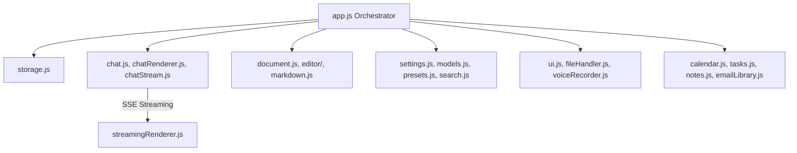

### Module Families
- **Core Wiring:** `app.js` and `init.js` bootstrap state. `storage.js` provides wrappers for LocalStorage persistence.
- **Chat Engine:** The largest monolith (`chat.js`) directs UI transitions, handles form submissions, and manages abort controllers. Rendering output and applying markdown logic is handled via `chatRenderer.js`, `streamingRenderer.js`, and `streamingSegmenter.js`.
- **Editors & Visuals:** `document.js` manages multiple tabs and state. `gallery.js` handles image assets and grids. The `editor/` sub-folder contains extensions for masking and specialized layout.
- **Sub-Apps:** Major integrations are separated completely, e.g., `emailLibrary.js` (a full IMAP client UI), `calendar.js` (CalDAV sync rendering), `tasks.js`, and `notes.js`.
- **Cookbook (Hardware Management):** The `cookbook*.js` modules execute complex, multi-step tasks across SSE streams, including diagnosis, hardware fitting, and download signaling.

---

## 28. Deep Dive: Testing Taxonomy (`tests/`, `TESTING_STANDARD.md`)

Odysseus enforces a strict, deterministic testing strategy designed to eliminate order-dependence and global state leakage.

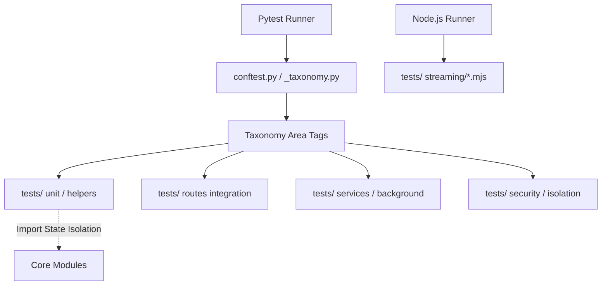

### Components & Principles
- **Taxonomy Tags (`tests/_taxonomy.py`)**: Tests are categorized (e.g., `security`, `routes`, `cli`, `js`) during collection based on filename conventions.
- **Determinism & Isolation (`tests/helpers/import_state.py`)**: Tests are heavily isolated. `sys.modules`, `os.environ`, and `cwd` are strictly guarded against cross-test leakage, preventing order-dependent execution failures.
- **In-memory Default (`tests/conftest.py`)**: Pytest initiates with a fallback in-memory SQLite database to prevent collection-time side-effects within the user's `data/` directory.
- **Behavior-First Validation**: The testing philosophy strongly discourages `read_text()` or `ast.parse` style source code checks. Tests are required to exercise routing, database interactions, and module calls directly, prioritizing real-world execution state over text inspection.

---

## 29. Deep Dive: Companion Bridge (`companion/`)

The Companion Bridge provides an additive layer for Local Area Network (LAN) clients (like a mobile companion app) to securely discover and pair with the Odysseus server without duplicating core LLM logic.

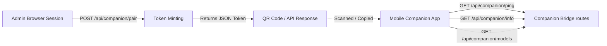

### Components & Posture
- **Capabilities & Discovery (`companion/routes.py`)**: Endpoints like `/api/companion/info` and `/api/companion/models` allow an authenticated client to discover what AI providers, tools, and endpoints the server makes available. Model requests scope strictly to the authenticated user.
- **Pairing Flow & CSRF Security (`companion/pairing.py`)**: To pair a new device, an admin session requests a one-time API pairing token. The server enforces strict CSRF protections by requiring this token minting to be an explicit `POST` operation, protected by a `SameSite=Lax` cookie policy. The `GET /pair` route only returns an HTML form, preventing unintended token minting via cross-site GET navigations.

---

## 30. Deep Dive: Outgoing Webhooks (`src/webhook_manager.py`)

Odysseus can dispatch system events to external HTTP endpoints, allowing automation platforms like ntfy, Zapier, or custom scripts to react to chat completions and new sessions.

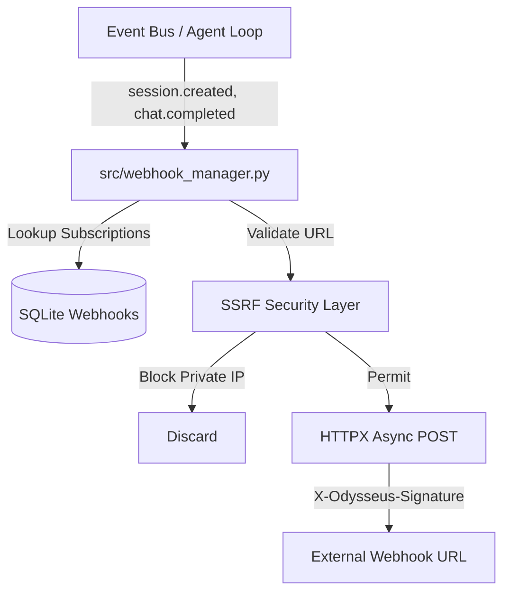

### Components & Security
- **Event Dispatch**: Monitored events trigger `webhook_manager.dispatch(event_type, payload)` asynchronously in the background.
- **SSRF Protection (`_PRIVATE_NETWORKS`)**: To prevent Server-Side Request Forgery, where a user configures a webhook to attack internal infrastructure (e.g., querying `127.0.0.1` or `10.0.x.x`), the webhook manager strictly resolves target domains and drops requests bound for private, loopback, or link-local subnets.
- **Signature Validation**: Outgoing requests include an `X-Odysseus-Signature` header computed via HMAC-SHA256, allowing external recipients to verify that the webhook legitimately originated from Odysseus and hasn't been tampered with.

---

## 31. Deep Dive: External Integrations (`integrations/`)

Odysseus provides an integration layer that acts as a secure bridge for third-party AI agents (e.g., Claude Code, OpenAI integrations) to execute tools locally through the Odysseus server.

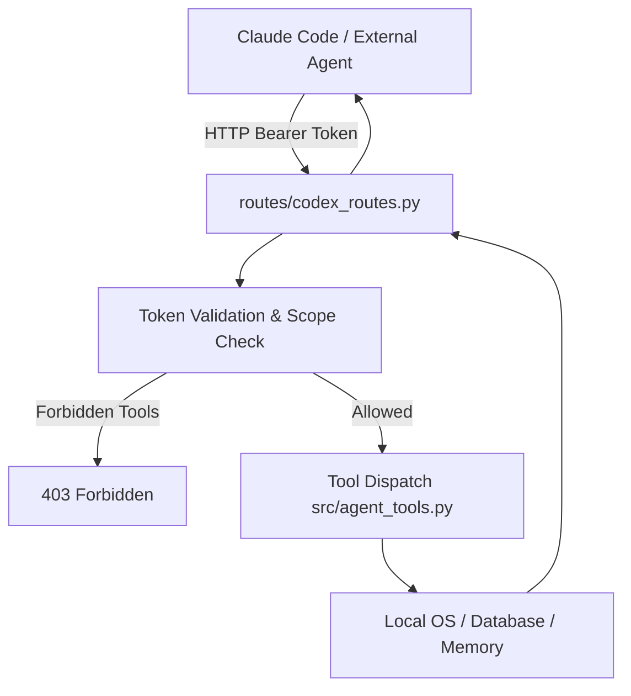

### Components & Posture
- **The "Codex" Abstraction (`routes/codex_routes.py`)**: Historically named "codex", this router exposes the canonical, scope-gated API endpoints (`/api/codex/*`) that external agents hit to list available tools and execute them.
- **Plugin Bundles (`integrations/claude/`)**: Directories like `integrations/claude` contain ready-to-use skill bundles (`SKILL.md` and wrapper scripts). A user installs this into their external agent (like Anthropic's `claude-code` CLI).
- **Scope Enforcement**: API tokens generated for integrations are heavily scope-gated. If an external agent attempts to execute a tool (e.g., `bash` or `read_file`) that the user has not explicitly enabled in the Integrations UI, Odysseus rejects the request. This ensures external platforms cannot access the host machine unconditionally.

---

## 32. Deep Dive: Operational CLI Scripts (`scripts/`)

For maintenance, debugging, and offline operations, Odysseus includes a suite of Python CLI tools.

### Components
## 34. Deep Dive: Action Intents & Chat Routing (`src/action_intents.py`)

Odysseus employs a lightweight routing heuristic to determine when a standard chat prompt should be promoted to full "agent mode" (invoking the agent loop and tools).

```mermaid
graph TD
    Input[User Prompt] --> Regex[Regex Intent Detection]
    Regex --> |"can you search...", "read this..."| Agent[Promote to Agent Mode]
    Regex --> |General question| Chat[Standard Chat Completion]
    Agent --> LoadTools[Load Tools & System Prompt]
    Chat --> LLM[LLM Generation]
```

### Purpose
To avoid unnecessary LLM overhead, the system uses deterministic regex patterns to detect when a user is explicitly asking the assistant to take an action (e.g., "can you search...", "please read this file...") rather than simply asking a question.

### Mechanics
- **`ToolIntent`**: A dataclass that evaluates `needs_tools`, `category`, and `reason`.
- **Patterns**: Scans for phrases like "can you", "would you", or specific verbs ("search", "read", "run") combined with action requests.
- **Outcome**: If an action intent is detected, the frontend is signaled or the backend automatically escalates the chat into the agent loop, loading the necessary tools and system prompts.

---

## 35. Deep Dive: Context Compaction (`src/context_compactor.py`)

To prevent the LLM context window from overflowing during long sessions, Odysseus implements an automatic context compaction mechanism.

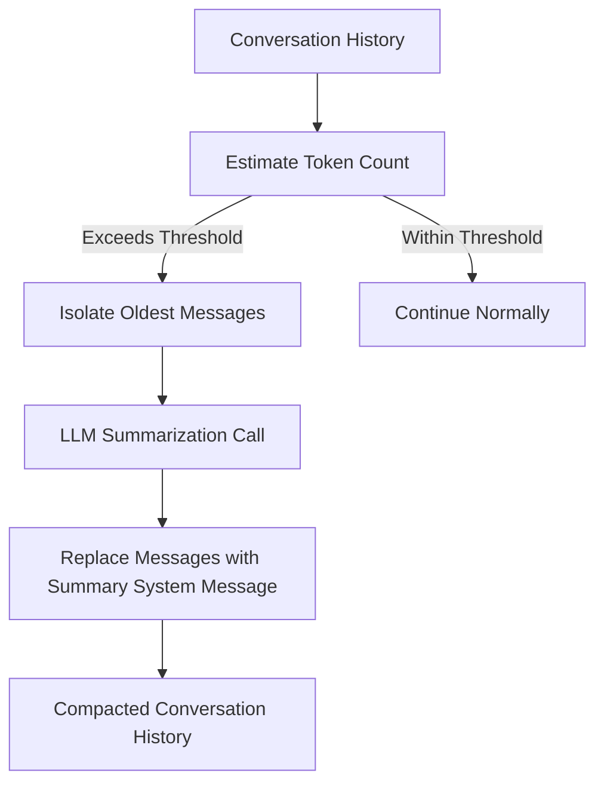

### Purpose
It ensures that long-running conversations do not crash due to token limits while preserving essential context and historical facts.

### Mechanics
- **Token Estimation**: Monitors the token count of the conversation history.
- **Compaction Trigger**: When the context approaches a predefined limit, it isolates the oldest messages.
- **Summarization**: It uses a fast LLM call (often a smaller model or the current one) to generate a dense summary of the oldest interactions.
- **State Update**: Replaces the summarized block in the SQLite database with a single "system" message containing the summary, significantly reducing token usage while maintaining narrative continuity.

---

## 36. Deep Dive: Built-in Actions & Scheduled Tasks (`src/builtin_actions.py`)

Odysseus features a registry of native automation actions that can be executed periodically by the task scheduler without needing to spin up an LLM.

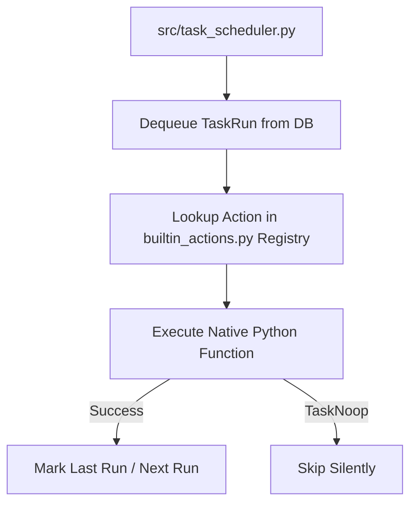

### Purpose
Provides reliable, zero-cost execution for routine system maintenance and user-defined scheduled tasks.

### Mechanics
- **Registry**: Houses predefined python functions mapped to string identifiers (e.g., `system.tidy_calendar`, `system.poll_email`).
- **`TaskNoop` Exception**: A silent exception used by actions to indicate there was nothing to do (e.g., no new emails, calendar already synced), preventing log spam.
- **Execution**: The scheduler (`src/task_scheduler.py`) dequeues pending tasks from the database and invokes the corresponding function in `builtin_actions.py`.

---

## 37. Deep Dive: Copilot Provider Support (`src/copilot.py`)

Odysseus integrates natively with GitHub Copilot, allowing users with Copilot subscriptions to use Copilot's backing models as their LLM provider.

```mermaid
graph LR
    User[User] --> |Authorizes Device Code| GH[GitHub OAuth]
    GH --> |access_token| Odysseus
    Odysseus --> |Headers + Token| CopilotAPI[api.githubcopilot.com/chat/completions]
```

### Purpose
To leverage existing Copilot subscriptions without needing a separate OpenAI or Anthropic API key.

### Mechanics
- **Device Flow Auth**: Implements the GitHub OAuth Device Flow. The user authorizes a device code in their browser, and Odysseus receives a long-lived `access_token`.
- **API Emulation**: Copilot exposes an OpenAI-compatible endpoint (`/chat/completions`). `copilot.py` manages the injection of required, provider-specific headers (e.g., API version, editor-style User-Agent, and `x-initiator`).
- **No Exchange Required**: Unlike some integrations, the bearer token is sent directly to the Copilot API without a secondary token exchange.

---

## 38. Known Issues & Future Improvements

While Odysseus is robust, its architecture reflects organic growth. Several areas are identified for future refinement.

### Frontend Monoliths
- **Large Files**: Core modules like `chat.js` and `document.js` have grown significantly. Refactoring these into smaller, dedicated state machines or leveraging a lightweight reactive store would improve maintainability.
- **Censoring (`censor.js`)**: The frontend uses regex to detect and blur sensitive information (API keys, passwords) in LLM responses. This is a heuristic approach and could be improved with more robust parsing or moved to a backend middleware for unified enforcement.

### Testing & Stability
- **Test Coverage**: While critical paths are covered, edge cases in streaming and hardware discovery (`hwfit`) could benefit from deeper integration tests across different OS environments.
- **Background Jobs**: The `bg_jobs.py` system relies on writing exit-code files to track detached processes. A more robust IPC (Inter-Process Communication) or lightweight queue (like Redis or Celery, though contrary to the zero-config ethos) might be necessary if workloads increase.

### Database Abstraction
- Currently tightly coupled to SQLite. While SQLite is fantastic for single-user self-hosting, abstracting the ORM to easily support PostgreSQL would enable multi-user scaling or team deployments.

## 34. Deep Dive: Action Intents & Chat Routing (`src/action_intents.py`)

Odysseus employs a lightweight routing heuristic to determine when a standard chat prompt should be promoted to full "agent mode" (invoking the agent loop and tools).

```mermaid
graph TD
    Input[User Prompt] --> Regex[Regex Intent Detection]
    Regex --> |"can you search...", "read this..."| Agent[Promote to Agent Mode]
    Regex --> |General question| Chat[Standard Chat Completion]
    Agent --> LoadTools[Load Tools & System Prompt]
    Chat --> LLM[LLM Generation]
```

### Purpose
To avoid unnecessary LLM overhead, the system uses deterministic regex patterns to detect when a user is explicitly asking the assistant to take an action (e.g., "can you search...", "please read this file...") rather than simply asking a question.

### Mechanics
- **`ToolIntent`**: A dataclass that evaluates `needs_tools`, `category`, and `reason`.
- **Patterns**: Scans for phrases like "can you", "would you", or specific verbs ("search", "read", "run") combined with action requests.
- **Outcome**: If an action intent is detected, the frontend is signaled or the backend automatically escalates the chat into the agent loop, loading the necessary tools and system prompts.

---

## 35. Deep Dive: Context Compaction (`src/context_compactor.py`)

To prevent the LLM context window from overflowing during long sessions, Odysseus implements an automatic context compaction mechanism.

```mermaid
graph TD
    History[Conversation History] --> Check[Estimate Token Count]
    Check --> |Exceeds Threshold| Isolate[Isolate Oldest Messages]
    Isolate --> Summarize[LLM Summarization Call]
    Summarize --> DBUpdate[Replace Messages with Summary System Message]
    DBUpdate --> NewHistory[Compacted Conversation History]
    Check --> |Within Threshold| Proceed[Continue Normally]
```

### Purpose
It ensures that long-running conversations do not crash due to token limits while preserving essential context and historical facts.

### Mechanics
- **Token Estimation**: Monitors the token count of the conversation history.
- **Compaction Trigger**: When the context approaches a predefined limit, it isolates the oldest messages.
- **Summarization**: It uses a fast LLM call (often a smaller model or the current one) to generate a dense summary of the oldest interactions.
- **State Update**: Replaces the summarized block in the SQLite database with a single "system" message containing the summary, significantly reducing token usage while maintaining narrative continuity.

---

## 36. Deep Dive: Built-in Actions & Scheduled Tasks (`src/builtin_actions.py`)

Odysseus features a registry of native automation actions that can be executed periodically by the task scheduler without needing to spin up an LLM.

```mermaid
graph TD
    Scheduler[src/task_scheduler.py] --> Dequeue[Dequeue TaskRun from DB]
    Dequeue --> Lookup[Lookup Action in builtin_actions.py Registry]
    Lookup --> Execute[Execute Native Python Function]
    Execute --> |Success| Mark[Mark Last Run / Next Run]
    Execute --> |TaskNoop| Skip[Skip Silently]
```

### Purpose
Provides reliable, zero-cost execution for routine system maintenance and user-defined scheduled tasks.

### Mechanics
- **Registry**: Houses predefined python functions mapped to string identifiers (e.g., `system.tidy_calendar`, `system.poll_email`).
- **`TaskNoop` Exception**: A silent exception used by actions to indicate there was nothing to do (e.g., no new emails, calendar already synced), preventing log spam.
- **Execution**: The scheduler (`src/task_scheduler.py`) dequeues pending tasks from the database and invokes the corresponding function in `builtin_actions.py`.

---

## 37. Deep Dive: Copilot Provider Support (`src/copilot.py`)

Odysseus integrates natively with GitHub Copilot, allowing users with Copilot subscriptions to use Copilot's backing models as their LLM provider.

```mermaid
graph LR
    User[User] --> |Authorizes Device Code| GH[GitHub OAuth]
    GH --> |access_token| Odysseus
    Odysseus --> |Headers + Token| CopilotAPI[api.githubcopilot.com/chat/completions]
```

### Purpose
To leverage existing Copilot subscriptions without needing a separate OpenAI or Anthropic API key.

### Mechanics
- **Device Flow Auth**: Implements the GitHub OAuth Device Flow. The user authorizes a device code in their browser, and Odysseus receives a long-lived `access_token`.
- **API Emulation**: Copilot exposes an OpenAI-compatible endpoint (`/chat/completions`). `copilot.py` manages the injection of required, provider-specific headers (e.g., API version, editor-style User-Agent, and `x-initiator`).
- **No Exchange Required**: Unlike some integrations, the bearer token is sent directly to the Copilot API without a secondary token exchange.

---

## 38. Known Issues & Future Improvements

While Odysseus is robust, its architecture reflects organic growth. Several areas are identified for future refinement.

### Frontend Monoliths
- **Large Files**: Core modules like `chat.js` and `document.js` have grown significantly. Refactoring these into smaller, dedicated state machines or leveraging a lightweight reactive store would improve maintainability.
- **Censoring (`censor.js`)**: The frontend uses regex to detect and blur sensitive information (API keys, passwords) in LLM responses. This is a heuristic approach and could be improved with more robust parsing or moved to a backend middleware for unified enforcement.

### Testing & Stability
- **Test Coverage**: While critical paths are covered, edge cases in streaming and hardware discovery (`hwfit`) could benefit from deeper integration tests across different OS environments.
- **Background Jobs**: The `bg_jobs.py` system relies on writing exit-code files to track detached processes. A more robust IPC (Inter-Process Communication) or lightweight queue (like Redis or Celery, though contrary to the zero-config ethos) might be necessary if workloads increase.

### Database Abstraction
- Currently tightly coupled to SQLite. While SQLite is fantastic for single-user self-hosting, abstracting the ORM to easily support PostgreSQL would enable multi-user scaling or team deployments.

## 34. Deep Dive: Action Intents & Chat Routing (`src/action_intents.py`)

Odysseus employs a lightweight routing heuristic to determine when a standard chat prompt should be promoted to full "agent mode" (invoking the agent loop and tools).

```mermaid
graph TD
    Input[User Prompt] --> Regex[Regex Intent Detection]
    Regex --> |"can you search...", "read this..."| Agent[Promote to Agent Mode]
    Regex --> |General question| Chat[Standard Chat Completion]
    Agent --> LoadTools[Load Tools & System Prompt]
    Chat --> LLM[LLM Generation]
```

### Purpose
To avoid unnecessary LLM overhead, the system uses deterministic regex patterns to detect when a user is explicitly asking the assistant to take an action (e.g., "can you search...", "please read this file...") rather than simply asking a question.

### Mechanics
- **`ToolIntent`**: A dataclass that evaluates `needs_tools`, `category`, and `reason`.
- **Patterns**: Scans for phrases like "can you", "would you", or specific verbs ("search", "read", "run") combined with action requests.
- **Outcome**: If an action intent is detected, the frontend is signaled or the backend automatically escalates the chat into the agent loop, loading the necessary tools and system prompts.

---

## 35. Deep Dive: Context Compaction (`src/context_compactor.py`)

To prevent the LLM context window from overflowing during long sessions, Odysseus implements an automatic context compaction mechanism.

```mermaid
graph TD
    History[Conversation History] --> Check[Estimate Token Count]
    Check --> |Exceeds Threshold| Isolate[Isolate Oldest Messages]
    Isolate --> Summarize[LLM Summarization Call]
    Summarize --> DBUpdate[Replace Messages with Summary System Message]
    DBUpdate --> NewHistory[Compacted Conversation History]
    Check --> |Within Threshold| Proceed[Continue Normally]
```

### Purpose
It ensures that long-running conversations do not crash due to token limits while preserving essential context and historical facts.

### Mechanics
- **Token Estimation**: Monitors the token count of the conversation history.
- **Compaction Trigger**: When the context approaches a predefined limit, it isolates the oldest messages.
- **Summarization**: It uses a fast LLM call (often a smaller model or the current one) to generate a dense summary of the oldest interactions.
- **State Update**: Replaces the summarized block in the SQLite database with a single "system" message containing the summary, significantly reducing token usage while maintaining narrative continuity.

---

## 36. Deep Dive: Built-in Actions & Scheduled Tasks (`src/builtin_actions.py`)

Odysseus features a registry of native automation actions that can be executed periodically by the task scheduler without needing to spin up an LLM.

```mermaid
graph TD
    Scheduler[src/task_scheduler.py] --> Dequeue[Dequeue TaskRun from DB]
    Dequeue --> Lookup[Lookup Action in builtin_actions.py Registry]
    Lookup --> Execute[Execute Native Python Function]
    Execute --> |Success| Mark[Mark Last Run / Next Run]
    Execute --> |TaskNoop| Skip[Skip Silently]
```

### Purpose
Provides reliable, zero-cost execution for routine system maintenance and user-defined scheduled tasks.

### Mechanics
- **Registry**: Houses predefined python functions mapped to string identifiers (e.g., `system.tidy_calendar`, `system.poll_email`).
- **`TaskNoop` Exception**: A silent exception used by actions to indicate there was nothing to do (e.g., no new emails, calendar already synced), preventing log spam.
- **Execution**: The scheduler (`src/task_scheduler.py`) dequeues pending tasks from the database and invokes the corresponding function in `builtin_actions.py`.

---

## 37. Deep Dive: Copilot Provider Support (`src/copilot.py`)

Odysseus integrates natively with GitHub Copilot, allowing users with Copilot subscriptions to use Copilot's backing models as their LLM provider.

```mermaid
graph LR
    User[User] --> |Authorizes Device Code| GH[GitHub OAuth]
    GH --> |access_token| Odysseus
    Odysseus --> |Headers + Token| CopilotAPI[api.githubcopilot.com/chat/completions]
```

### Purpose
To leverage existing Copilot subscriptions without needing a separate OpenAI or Anthropic API key.

### Mechanics
- **Device Flow Auth**: Implements the GitHub OAuth Device Flow. The user authorizes a device code in their browser, and Odysseus receives a long-lived `access_token`.
- **API Emulation**: Copilot exposes an OpenAI-compatible endpoint (`/chat/completions`). `copilot.py` manages the injection of required, provider-specific headers (e.g., API version, editor-style User-Agent, and `x-initiator`).
- **No Exchange Required**: Unlike some integrations, the bearer token is sent directly to the Copilot API without a secondary token exchange.

---

## 38. Known Issues & Future Improvements

While Odysseus is robust, its architecture reflects organic growth. Several areas are identified for future refinement.

### Frontend Monoliths
- **Large Files**: Core modules like `chat.js` and `document.js` have grown significantly. Refactoring these into smaller, dedicated state machines or leveraging a lightweight reactive store would improve maintainability.
- **Censoring (`censor.js`)**: The frontend uses regex to detect and blur sensitive information (API keys, passwords) in LLM responses. This is a heuristic approach and could be improved with more robust parsing or moved to a backend middleware for unified enforcement.

### Testing & Stability
- **Test Coverage**: While critical paths are covered, edge cases in streaming and hardware discovery (`hwfit`) could benefit from deeper integration tests across different OS environments.
- **Background Jobs**: The `bg_jobs.py` system relies on writing exit-code files to track detached processes. A more robust IPC (Inter-Process Communication) or lightweight queue (like Redis or Celery, though contrary to the zero-config ethos) might be necessary if workloads increase.

### Database Abstraction
- Currently tightly coupled to SQLite. While SQLite is fantastic for single-user self-hosting, abstracting the ORM to easily support PostgreSQL would enable multi-user scaling or team deployments.

## 34. Deep Dive: Action Intents & Chat Routing (`src/action_intents.py`)

Odysseus employs a lightweight routing heuristic to determine when a standard chat prompt should be promoted to full "agent mode" (invoking the agent loop and tools).

```mermaid
graph TD
    Input[User Prompt] --> Regex[Regex Intent Detection]
    Regex --> |"can you search...", "read this..."| Agent[Promote to Agent Mode]
    Regex --> |General question| Chat[Standard Chat Completion]
    Agent --> LoadTools[Load Tools & System Prompt]
    Chat --> LLM[LLM Generation]
```

### Purpose
To avoid unnecessary LLM overhead, the system uses deterministic regex patterns to detect when a user is explicitly asking the assistant to take an action (e.g., "can you search...", "please read this file...") rather than simply asking a question.

### Mechanics
- **`ToolIntent`**: A dataclass that evaluates `needs_tools`, `category`, and `reason`.
- **Patterns**: Scans for phrases like "can you", "would you", or specific verbs ("search", "read", "run") combined with action requests.
- **Outcome**: If an action intent is detected, the frontend is signaled or the backend automatically escalates the chat into the agent loop, loading the necessary tools and system prompts.

---

## 35. Deep Dive: Context Compaction (`src/context_compactor.py`)

To prevent the LLM context window from overflowing during long sessions, Odysseus implements an automatic context compaction mechanism.

```mermaid
graph TD
    History[Conversation History] --> Check[Estimate Token Count]
    Check --> |Exceeds Threshold| Isolate[Isolate Oldest Messages]
    Isolate --> Summarize[LLM Summarization Call]
    Summarize --> DBUpdate[Replace Messages with Summary System Message]
    DBUpdate --> NewHistory[Compacted Conversation History]
    Check --> |Within Threshold| Proceed[Continue Normally]
```

### Purpose
It ensures that long-running conversations do not crash due to token limits while preserving essential context and historical facts.

### Mechanics
- **Token Estimation**: Monitors the token count of the conversation history.
- **Compaction Trigger**: When the context approaches a predefined limit, it isolates the oldest messages.
- **Summarization**: It uses a fast LLM call (often a smaller model or the current one) to generate a dense summary of the oldest interactions.
- **State Update**: Replaces the summarized block in the SQLite database with a single "system" message containing the summary, significantly reducing token usage while maintaining narrative continuity.

---

## 36. Deep Dive: Built-in Actions & Scheduled Tasks (`src/builtin_actions.py`)

Odysseus features a registry of native automation actions that can be executed periodically by the task scheduler without needing to spin up an LLM.

```mermaid
graph TD
    Scheduler[src/task_scheduler.py] --> Dequeue[Dequeue TaskRun from DB]
    Dequeue --> Lookup[Lookup Action in builtin_actions.py Registry]
    Lookup --> Execute[Execute Native Python Function]
    Execute --> |Success| Mark[Mark Last Run / Next Run]
    Execute --> |TaskNoop| Skip[Skip Silently]
```

### Purpose
Provides reliable, zero-cost execution for routine system maintenance and user-defined scheduled tasks.

### Mechanics
- **Registry**: Houses predefined python functions mapped to string identifiers (e.g., `system.tidy_calendar`, `system.poll_email`).
- **`TaskNoop` Exception**: A silent exception used by actions to indicate there was nothing to do (e.g., no new emails, calendar already synced), preventing log spam.
- **Execution**: The scheduler (`src/task_scheduler.py`) dequeues pending tasks from the database and invokes the corresponding function in `builtin_actions.py`.

---

## 37. Deep Dive: Copilot Provider Support (`src/copilot.py`)

Odysseus integrates natively with GitHub Copilot, allowing users with Copilot subscriptions to use Copilot's backing models as their LLM provider.

```mermaid
graph LR
    User[User] --> |Authorizes Device Code| GH[GitHub OAuth]
    GH --> |access_token| Odysseus
    Odysseus --> |Headers + Token| CopilotAPI[api.githubcopilot.com/chat/completions]
```

### Purpose
To leverage existing Copilot subscriptions without needing a separate OpenAI or Anthropic API key.

### Mechanics
- **Device Flow Auth**: Implements the GitHub OAuth Device Flow. The user authorizes a device code in their browser, and Odysseus receives a long-lived `access_token`.
- **API Emulation**: Copilot exposes an OpenAI-compatible endpoint (`/chat/completions`). `copilot.py` manages the injection of required, provider-specific headers (e.g., API version, editor-style User-Agent, and `x-initiator`).
- **No Exchange Required**: Unlike some integrations, the bearer token is sent directly to the Copilot API without a secondary token exchange.

---

## 38. Known Issues & Future Improvements

While Odysseus is robust, its architecture reflects organic growth. Several areas are identified for future refinement.

### Frontend Monoliths
- **Large Files**: Core modules like `chat.js` and `document.js` have grown significantly. Refactoring these into smaller, dedicated state machines or leveraging a lightweight reactive store would improve maintainability.
- **Censoring (`censor.js`)**: The frontend uses regex to detect and blur sensitive information (API keys, passwords) in LLM responses. This is a heuristic approach and could be improved with more robust parsing or moved to a backend middleware for unified enforcement.

### Testing & Stability
- **Test Coverage**: While critical paths are covered, edge cases in streaming and hardware discovery (`hwfit`) could benefit from deeper integration tests across different OS environments.
- **Background Jobs**: The `bg_jobs.py` system relies on writing exit-code files to track detached processes. A more robust IPC (Inter-Process Communication) or lightweight queue (like Redis or Celery, though contrary to the zero-config ethos) might be necessary if workloads increase.

### Database Abstraction
- Currently tightly coupled to SQLite. While SQLite is fantastic for single-user self-hosting, abstracting the ORM to easily support PostgreSQL would enable multi-user scaling or team deployments.

---

## 34. Deep Dive: Action Intents & Chat Routing (`src/action_intents.py`)

Odysseus employs a lightweight routing heuristic to determine when a standard chat prompt should be promoted to full "agent mode" (invoking the agent loop and tools).

```mermaid
graph TD
    Input[User Prompt] --> Regex[Regex Intent Detection]
    Regex --> |"can you search...", "read this..."| Agent[Promote to Agent Mode]
    Regex --> |General question| Chat[Standard Chat Completion]
    Agent --> LoadTools[Load Tools & System Prompt]
    Chat --> LLM[LLM Generation]
```

### Purpose
To avoid unnecessary LLM overhead, the system uses deterministic regex patterns to detect when a user is explicitly asking the assistant to take an action (e.g., "can you search...", "please read this file...") rather than simply asking a question.

### Mechanics
- **`ToolIntent`**: A dataclass that evaluates `needs_tools`, `category`, and `reason`.
- **Patterns**: Scans for phrases like "can you", "would you", or specific verbs ("search", "read", "run") combined with action requests.
- **Outcome**: If an action intent is detected, the frontend is signaled or the backend automatically escalates the chat into the agent loop, loading the necessary tools and system prompts.

---

## 35. Deep Dive: Context Compaction (`src/context_compactor.py`)

To prevent the LLM context window from overflowing during long sessions, Odysseus implements an automatic context compaction mechanism.

```mermaid
graph TD
    History[Conversation History] --> Check[Estimate Token Count]
    Check --> |Exceeds Threshold| Isolate[Isolate Oldest Messages]
    Isolate --> Summarize[LLM Summarization Call]
    Summarize --> DBUpdate[Replace Messages with Summary System Message]
    DBUpdate --> NewHistory[Compacted Conversation History]
    Check --> |Within Threshold| Proceed[Continue Normally]
```

### Purpose
It ensures that long-running conversations do not crash due to token limits while preserving essential context and historical facts.

### Mechanics
- **Token Estimation**: Monitors the token count of the conversation history.
- **Compaction Trigger**: When the context approaches a predefined limit, it isolates the oldest messages.
- **Summarization**: It uses a fast LLM call (often a smaller model or the current one) to generate a dense summary of the oldest interactions.
- **State Update**: Replaces the summarized block in the SQLite database with a single "system" message containing the summary, significantly reducing token usage while maintaining narrative continuity.

---

## 36. Deep Dive: Built-in Actions & Scheduled Tasks (`src/builtin_actions.py`)

Odysseus features a registry of native automation actions that can be executed periodically by the task scheduler without needing to spin up an LLM.

```mermaid
graph TD
    Scheduler[src/task_scheduler.py] --> Dequeue[Dequeue TaskRun from DB]
    Dequeue --> Lookup[Lookup Action in builtin_actions.py Registry]
    Lookup --> Execute[Execute Native Python Function]
    Execute --> |Success| Mark[Mark Last Run / Next Run]
    Execute --> |TaskNoop| Skip[Skip Silently]
```

### Purpose
Provides reliable, zero-cost execution for routine system maintenance and user-defined scheduled tasks.

### Mechanics
- **Registry**: Houses predefined python functions mapped to string identifiers (e.g., `system.tidy_calendar`, `system.poll_email`).
- **`TaskNoop` Exception**: A silent exception used by actions to indicate there was nothing to do (e.g., no new emails, calendar already synced), preventing log spam.
- **Execution**: The scheduler (`src/task_scheduler.py`) dequeues pending tasks from the database and invokes the corresponding function in `builtin_actions.py`.

---

## 37. Deep Dive: Copilot Provider Support (`src/copilot.py`)

Odysseus integrates natively with GitHub Copilot, allowing users with Copilot subscriptions to use Copilot's backing models as their LLM provider.

```mermaid
graph LR
    User[User] --> |Authorizes Device Code| GH[GitHub OAuth]
    GH --> |access_token| Odysseus
    Odysseus --> |Headers + Token| CopilotAPI[api.githubcopilot.com/chat/completions]
```

### Purpose
To leverage existing Copilot subscriptions without needing a separate OpenAI or Anthropic API key.

### Mechanics
- **Device Flow Auth**: Implements the GitHub OAuth Device Flow. The user authorizes a device code in their browser, and Odysseus receives a long-lived `access_token`.
- **API Emulation**: Copilot exposes an OpenAI-compatible endpoint (`/chat/completions`). `copilot.py` manages the injection of required, provider-specific headers (e.g., API version, editor-style User-Agent, and `x-initiator`).
- **No Exchange Required**: Unlike some integrations, the bearer token is sent directly to the Copilot API without a secondary token exchange.

---

## 38. Known Issues & Future Improvements

While Odysseus is robust, its architecture reflects organic growth. Several areas are identified for future refinement.

### Frontend Monoliths
- **Large Files**: Core modules like `chat.js` and `document.js` have grown significantly. Refactoring these into smaller, dedicated state machines or leveraging a lightweight reactive store would improve maintainability.
- **Censoring (`censor.js`)**: The frontend uses regex to detect and blur sensitive information (API keys, passwords) in LLM responses. This is a heuristic approach and could be improved with more robust parsing or moved to a backend middleware for unified enforcement.

### Testing & Stability
- **Test Coverage**: While critical paths are covered, edge cases in streaming and hardware discovery (`hwfit`) could benefit from deeper integration tests across different OS environments.
- **Background Jobs**: The `bg_jobs.py` system relies on writing exit-code files to track detached processes. A more robust IPC (Inter-Process Communication) or lightweight queue (like Redis or Celery, though contrary to the zero-config ethos) might be necessary if workloads increase.

### Database Abstraction
- Currently tightly coupled to SQLite. While SQLite is fantastic for single-user self-hosting, abstracting the ORM to easily support PostgreSQL would enable multi-user scaling or team deployments.

---

## 34. Deep Dive: Action Intents & Chat Routing (`src/action_intents.py`)

Odysseus employs a lightweight routing heuristic to determine when a standard chat prompt should be promoted to full "agent mode" (invoking the agent loop and tools).

```mermaid
graph TD
    Input[User Prompt] --> Regex[Regex Intent Detection]
    Regex --> |"can you search...", "read this..."| Agent[Promote to Agent Mode]
    Regex --> |General question| Chat[Standard Chat Completion]
    Agent --> LoadTools[Load Tools & System Prompt]
    Chat --> LLM[LLM Generation]
```

### Purpose
To avoid unnecessary LLM overhead, the system uses deterministic regex patterns to detect when a user is explicitly asking the assistant to take an action (e.g., "can you search...", "please read this file...") rather than simply asking a question.

### Mechanics
- **`ToolIntent`**: A dataclass that evaluates `needs_tools`, `category`, and `reason`.
- **Patterns**: Scans for phrases like "can you", "would you", or specific verbs ("search", "read", "run") combined with action requests.
- **Outcome**: If an action intent is detected, the frontend is signaled or the backend automatically escalates the chat into the agent loop, loading the necessary tools and system prompts.

---

## 35. Deep Dive: Context Compaction (`src/context_compactor.py`)

To prevent the LLM context window from overflowing during long sessions, Odysseus implements an automatic context compaction mechanism.

```mermaid
graph TD
    History[Conversation History] --> Check[Estimate Token Count]
    Check --> |Exceeds Threshold| Isolate[Isolate Oldest Messages]
    Isolate --> Summarize[LLM Summarization Call]
    Summarize --> DBUpdate[Replace Messages with Summary System Message]
    DBUpdate --> NewHistory[Compacted Conversation History]
    Check --> |Within Threshold| Proceed[Continue Normally]
```

### Purpose
It ensures that long-running conversations do not crash due to token limits while preserving essential context and historical facts.

### Mechanics
- **Token Estimation**: Monitors the token count of the conversation history.
- **Compaction Trigger**: When the context approaches a predefined limit, it isolates the oldest messages.
- **Summarization**: It uses a fast LLM call (often a smaller model or the current one) to generate a dense summary of the oldest interactions.
- **State Update**: Replaces the summarized block in the SQLite database with a single "system" message containing the summary, significantly reducing token usage while maintaining narrative continuity.

---

## 36. Deep Dive: Built-in Actions & Scheduled Tasks (`src/builtin_actions.py`)

Odysseus features a registry of native automation actions that can be executed periodically by the task scheduler without needing to spin up an LLM.

```mermaid
graph TD
    Scheduler[src/task_scheduler.py] --> Dequeue[Dequeue TaskRun from DB]
    Dequeue --> Lookup[Lookup Action in builtin_actions.py Registry]
    Lookup --> Execute[Execute Native Python Function]
    Execute --> |Success| Mark[Mark Last Run / Next Run]
    Execute --> |TaskNoop| Skip[Skip Silently]
```

### Purpose
Provides reliable, zero-cost execution for routine system maintenance and user-defined scheduled tasks.

### Mechanics
- **Registry**: Houses predefined python functions mapped to string identifiers (e.g., `system.tidy_calendar`, `system.poll_email`).
- **`TaskNoop` Exception**: A silent exception used by actions to indicate there was nothing to do (e.g., no new emails, calendar already synced), preventing log spam.
- **Execution**: The scheduler (`src/task_scheduler.py`) dequeues pending tasks from the database and invokes the corresponding function in `builtin_actions.py`.

---

## 37. Deep Dive: Copilot Provider Support (`src/copilot.py`)

Odysseus integrates natively with GitHub Copilot, allowing users with Copilot subscriptions to use Copilot's backing models as their LLM provider.

```mermaid
graph LR
    User[User] --> |Authorizes Device Code| GH[GitHub OAuth]
    GH --> |access_token| Odysseus
    Odysseus --> |Headers + Token| CopilotAPI[api.githubcopilot.com/chat/completions]
```

### Purpose
To leverage existing Copilot subscriptions without needing a separate OpenAI or Anthropic API key.

### Mechanics
- **Device Flow Auth**: Implements the GitHub OAuth Device Flow. The user authorizes a device code in their browser, and Odysseus receives a long-lived `access_token`.
- **API Emulation**: Copilot exposes an OpenAI-compatible endpoint (`/chat/completions`). `copilot.py` manages the injection of required, provider-specific headers (e.g., API version, editor-style User-Agent, and `x-initiator`).
- **No Exchange Required**: Unlike some integrations, the bearer token is sent directly to the Copilot API without a secondary token exchange.

---

## 38. Known Issues & Future Improvements

While Odysseus is robust, its architecture reflects organic growth. Several areas are identified for future refinement.

### Frontend Monoliths
- **Large Files**: Core modules like `chat.js` and `document.js` have grown significantly. Refactoring these into smaller, dedicated state machines or leveraging a lightweight reactive store would improve maintainability.
- **Censoring (`censor.js`)**: The frontend uses regex to detect and blur sensitive information (API keys, passwords) in LLM responses. This is a heuristic approach and could be improved with more robust parsing or moved to a backend middleware for unified enforcement.

### Testing & Stability
- **Test Coverage**: While critical paths are covered, edge cases in streaming and hardware discovery (`hwfit`) could benefit from deeper integration tests across different OS environments.
- **Background Jobs**: The `bg_jobs.py` system relies on writing exit-code files to track detached processes. A more robust IPC (Inter-Process Communication) or lightweight queue (like Redis or Celery, though contrary to the zero-config ethos) might be necessary if workloads increase.

### Database Abstraction
- Currently tightly coupled to SQLite. While SQLite is fantastic for single-user self-hosting, abstracting the ORM to easily support PostgreSQL would enable multi-user scaling or team deployments.
