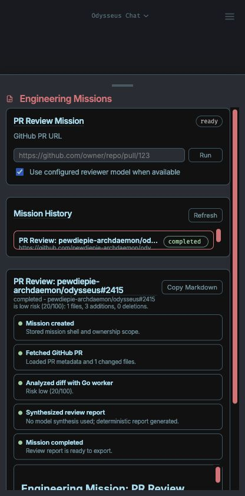
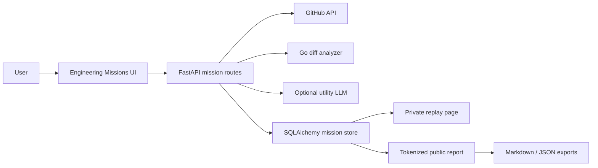
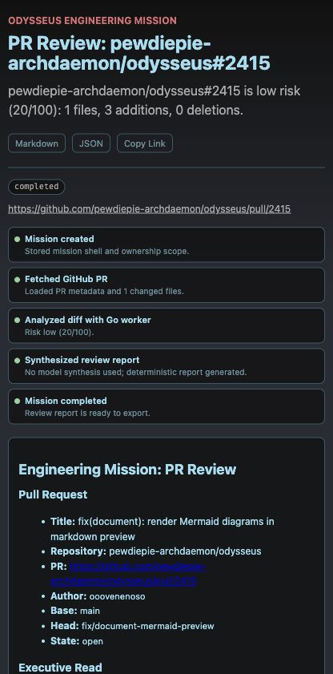

# Engineering Missions Case Study

Engineering Missions turns Odysseus into a developer-operations cockpit: paste a
GitHub pull request URL, run deterministic diff intelligence, persist a mission
receipt, and publish a clean report that can be shared outside the workspace.



## Product Goal

The goal was to build a portfolio-quality fullstack feature that demonstrates
engineering range without feeling bolted on. A recruiter or hiring manager
should be able to see:

- A real user workflow: run a PR review, inspect a timeline, export the result,
  and publish a public report.
- Backend ownership: authenticated mission APIs, owner-scoped records,
  tokenized public access, export endpoints, and migration-safe persistence.
- Polyglot implementation: Python/FastAPI, SQLAlchemy, Go, JavaScript,
  TypeScript contracts, HTML/CSS, and GitHub Actions.
- Product resilience: deterministic reports work even when no AI model is
  configured.

## Architecture



## Runtime Flow

1. The user submits a GitHub PR URL in `/engineering`.
2. The API validates the PR URL and creates an `engineering_missions` row.
3. Odysseus fetches pull request metadata and changed files from the GitHub API.
4. A local Go worker scores risk, classifies languages, and emits review
   recommendations.
5. If a utility/default model is configured, Odysseus asks it for a concise
   reviewer synthesis. Otherwise, the deterministic report is still complete.
6. The final Markdown report and audit log are persisted.
7. The user can open a private replay page, export Markdown/JSON, or publish a
   revocable public report URL.

## Implementation Map

| Area | File |
|---|---|
| API and mission orchestration | `routes/engineering_mission_routes.py` |
| Persistence model and migration | `core/database.py` |
| Go diff intelligence worker | `tools/github-diff-analyzer/main.go` |
| Cockpit runtime UI | `static/js/engineeringMissions.js` |
| Public report page | `static/engineering-report.html`, `static/js/engineeringReportPage.js` |
| Typed API contract | `static/ts/engineeringMissions.ts` |
| CI coverage | `.github/workflows/engineering-missions.yml` |

## Public Report

Published reports are intentionally separate from the authenticated workspace.
The public page uses a random share token and only exposes report data for a
mission that has been explicitly published.



## Demo In 60 Seconds

1. Open `/engineering`.
2. Paste a public PR URL, for example:
   `https://github.com/pewdiepie-archdaemon/odysseus/pull/2415`.
3. Run the mission and point out the audit timeline.
4. Open `/engineering/missions/{mission_id}` to show private replay.
5. Click `Publish Link` and open `/engineering/reports/{share_token}`.
6. Download the Markdown or JSON export.

## Verification

```bash
python -m py_compile routes/engineering_mission_routes.py core/database.py app.py
pytest tests/test_engineering_missions.py
node --check static/js/engineeringMissions.js
node --check static/js/engineeringReportPage.js
cd tools/github-diff-analyzer && go test ./...
```

The demo mission was verified end to end against PR `pewdiepie-archdaemon/odysseus#2415`.
