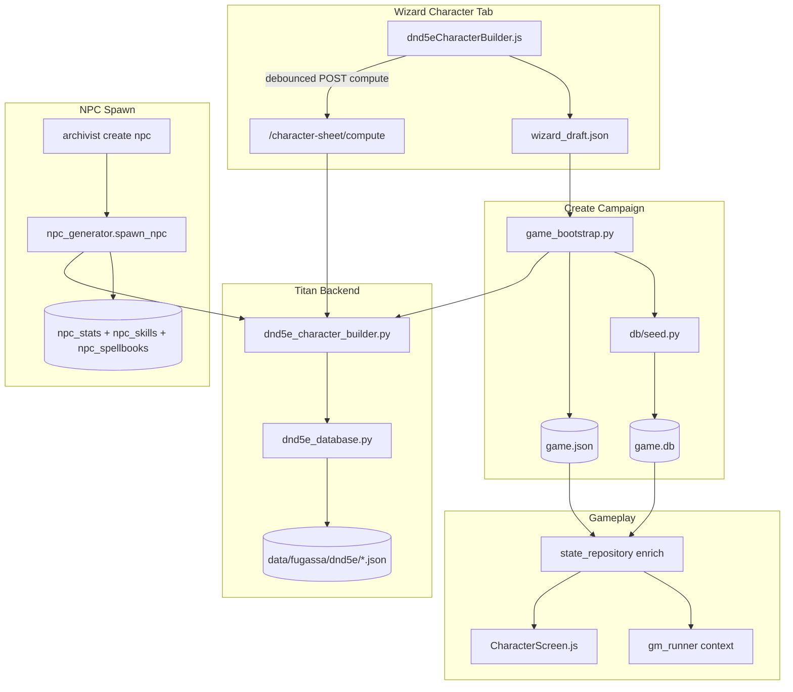

# Fugassa Character Sheet — implementační plán

> **Status:** schváleno (2026-07-11)  
> **Scope:** plná parita wizard Character tab + gameplay Character screen + **NPC sheet generátor** (friendly i enemy) s Fugassa II / ADR §B  
> **Zásada:** **jedna kanonická výpočtová vrstva**, žádné rozbíhání JS vs Python; integrace end-to-end před „poloviční MVP“  
> **Souvisí s:** ADR paměť §Migrace (`character_sheet` → SQL), ADR §J (combat/rest), wizard draft schema, `rules_mode` / `playstyle_framework`  
> **Reference:** Fugassa-II `DnD5eCharacterBuilder.gd`, `DnD5eDatabase.gd`, `Main.gd` (~L3400+)  
> **Graphify:** před každou fází `graphify query/path/explain`; po změnách `graphify update .`

---

## 1. Executive summary

Titan dnes má **MVP character builder** — identita, point-buy, hardcoded race bonusy, skill checkboxy a textový preview. **Chybí** vše, co ve Fugassa II dělá plný list:

| Oblast | Fugassa II | Titan dnes |
|--------|------------|------------|
| SRD data z JSON (`traits`, `features`, `spells`, `feats`) | ✅ `DnD5eDatabase` | ⚠️ API `GET /dnd5e/*` existuje, UI je nečte |
| Výpočet listu (`build()`) | ✅ `DnD5eCharacterBuilder` | ⚠️ ~150 řádků inline v `dnd5eCharacterBuilder.js` |
| Spell picker (cantrips + by level) | ✅ | ❌ draft pole existuje, UI ne |
| ASI / Feat picker | ✅ | ❌ draft pole existuje, UI ne |
| Racial traits (SRD) | ✅ z `traits.json` | ❌ jen `RACE_BONUSES` map |
| Class / subclass features | ✅ | ❌ |
| Spellcasting (sloty, DC, attack) | ✅ | ❌ DB sloupce existují, neplní se |
| Subrace | ✅ | ❌ |
| Expertise picker | ✅ | ❌ draft pole, UI ne |
| Homebrew LLM generate | ✅ iterace 5 | ❌ `homebrew_details` draft only |
| Gameplay Character screen | ✅ taby | ❌ abilities + HP + equip only |

**Cíl:** portovat kanonickou logiku z Godotu do Titanu, napojit wizard → draft → bootstrap → `game.json` → SQL seed → gameplay UI → GM kontext, s testy proti referenčním vektorům z Fugassa II.

**Mimo scope této vlny (explicitně):**
- Combat resolver pro cast spell / slot spend (ADR §J4) — pouze **data + GM kontext**, ne mechanický spell engine
- Level-up po startu kampaně (wizard level 1–20 ano, mid-campaign level-up ne)
- Party 1+4 companions sheet (schema ready, UI ne)

### Schválená rozhodnutí (2026-07-11)

| # | Rozhodnutí |
|---|------------|
| **Q1** | Výpočet listu **jen v Pythonu** (`dnd5e_character_builder.py` + API). JS nedělá 5e math. |
| **Q2** | SQL **child tables** dle ADR (`player_*` + `npc_spellbooks`). |
| **Q3** | **Subrace povinná**, když SRD nabízí; custom race/class/subrace → **LLM homebrew** (`homebrew_details`). |
| **Q4** | **LLM homebrew panel v MVP** (custom race/class/subrace — tlačítko Generate mechanics). |
| **Q5** | **`5e-style` a `homebrew` — stejná validace**: chybějící spell/ASI/skill → **Create zablokován** + konkrétní hláška. Výjimka jen **`playstyle_framework: freeform`** (Slice of Life) — list volitelný. |
| **Q6** | Mid-campaign level-up mimo scope. |
| **Q7** | **NPC sheet** — stejný builder pipeline pro T2/T3 (friendly + hostile); archivist/engine spawn; ADR §B kompletní balík. |

---

## 2. Současný stav (as-is)

### 2.1 Data assets — hotovo

```
data/fugassa/dnd5e/
  ability_scores.json, classes.json, races.json, subclasses.json,
  skills.json, spells.json, features.json, traits.json, feats.json, index.json
```

Backend: `titan/fugassa/dnd5e_data.py` — `load_resource(name)` + route `GET /api/fugassa/dnd5e/{resource}`.

### 2.2 Wizard draft schema — scaffolding hotovo

Pole v `wizard_draft_defaults.py` / `defaultDraft.js` / `draft.js` merge:

| Pole | Účel |
|------|------|
| `skill_proficiencies`, `expertise` | skill picks |
| `selected_cantrips`, `selected_spells_by_level` | spell picks |
| `asi_choices` | ASI/feat per level |
| `homebrew_details` | LLM homebrew override |
| `sheet_snapshot` | preview snapshot (dnes minimální) |

Persist: `wizard_draft_store.py` (create flow), debounced flush ve `WizardShell.js`.

### 2.3 Wizard UI — partial

| Soubor | Co dělá | Gap |
|--------|---------|-----|
| `dnd5eCharacterBuilder.js` | identity, abilities, skills, text preview | hardcoded `RACE_BONUSES`, `CLASS_HIT_DIE`, …; žádné SRD query |
| `dnd5eOptions.js` | dropdown labely | bez subrace |
| `helpers.js` | `characterProfile()` | jen jméno/race/class/abilities — **bez spells/feats/traits** |
| `WizardShell.js` | tab 4 Character, `validateTab(4)` | validace jen jméno/věk/race/class; **žádná spell/ASI validace** |
| `fugassaApi.js` | `getDnd5e()` | nepoužívá character builder |

### 2.4 Create / bootstrap — partial

`game_bootstrap.py` `_apply_draft_to_state()`:

- `character_sheet.stable_sheet` — identity, abilities, weapon/armor mirror
- `derived.proficiency_bonus` — jen PB
- `wizard_draft_snapshot` — ukládá `selected_spells_by_level`, `asi_choices`, … ale **nepoužívá je pro sheet**
- `wizard_sheet_snapshot` — kopie draft preview

`db/seed.py` → `player_characters`: scores, HP, AC, level — **bez** `spell_save_dc`, `spell_attack_bonus`, `speed_walk`, `passive_perception`, skills, spells.

### 2.5 Gameplay — partial

| Soubor | Gap |
|--------|-----|
| `CharacterScreen.js` | žádné Spells / Features / Feats / Traits |
| `gm_runner.py` | `_gear_loadout_summary()` čte weapon/armor; **character_sheet spells/features ne** |
| Frontend `characterProfile()` | posílá se do GM API — **bez spell listu** |
| `item_engine.py` | čte `stable_sheet` pro equip mirror |
| `turn_resolver.py` | `rest` intent stub — **sloty neobnovuje** |

### 2.6 SQL schema — připraveno, nevyplněno

`player_characters` má: `spell_save_dc`, `spell_attack_bonus`, `speed_walk`, `passive_perception`.

**Chybí tabulky** (ADR §B + migrace):

- `player_skills`, `player_feats`, `player_features`, `player_spells`
- `npc_spellbooks` (ADR §B — v `schema.sql` **chybí**, `npc_skills` existuje ale spawn neplní)

### 2.7 NPC generátor — dnes zjednodušený (gap vs ADR §B)

`npc_generator.spawn_npc()` dnes:

- T0/T1: keyword preset (`wolf`, `goblin`) → `_cr_to_stats()` — **lite bestiary**, bez SRD sheetu
- T2/T3: CR band + **náhodné ability scores 8–13**, prázdné `npc_skills`, **žádné kouzla/features**
- Archivist `op: create` → předá `race`, `class_role` — **nepoužije** pro plný 5e list

ADR §B požaduje: `npc_stats` + `npc_skills` + `npc_spellbooks` jako u hráče. **Cíl:** sdílený `dnd5e_character_builder` + `sheet_to_sql()` helper pro PC i NPC.

---

## 3. Cílový stav (to-be)

### 3.1 Kanonická výpočtová vrstva (Python)

Nový modul **`titan/fugassa/dnd5e_database.py`** — port `DnD5eDatabase.gd`:

- cache JSON z `DND5E_DIR`, index rebuild
- `get_class_data`, `list_spells_for`, `list_traits_for`, `ability_bonuses_for`, …
- `proficiency_bonus_at_level(level)`

Nový modul **`titan/fugassa/dnd5e_character_builder.py`** — port `DnD5eCharacterBuilder.build()`:

- vstup: draft-shaped dict (viz §4.1)
- výstup: strukturovaný sheet dict (abilities, saves, skills, HP, AC, speed, features, traits, feats, spellcasting, class_resources, flags homebrew, …)
- helpery: `spell_budgets`, `can_select_spell`, `trim_spell_selections`, `_asi_levels_reached`

**Proč Python, ne JS:** stejná math pro bootstrap, seed, budoucí server-side validaci, pytest s referenčními vektory. Wizard UI volá compute endpoint (debounced), ne duplikuje logiku.

### 3.2 API

| Endpoint | Účel |
|----------|------|
| `POST /api/fugassa/character-sheet/compute` | draft fragment → full sheet (wizard live preview + server validation) |
| `POST /api/fugassa/character-sheet/validate` | striktní kontrola před Create (spell counts, ASI completeness, skill caps) |
| existující `GET /dnd5e/{resource}` | SRD bundles pro picker UI (filtrování client-side nebo nové query params) |

### 3.3 Wizard UI (Fugassa II parity)

Rozšíření Character tabu v `dnd5eCharacterBuilder.js` + `WizardShell.js`:

1. **Subrace** dropdown (when race has subraces)
2. **Skill picker** — cap z SRD class + race trait choices (nahradit hardcoded `CLASS_SKILL_CAP`)
3. **Expertise** (Bard/Rogue/… level gates)
4. **ASI / Feat** — per ASI level accordion; feat picker z `feats.json`
5. **Spell picker** — cantrips + per spell level; filtr `list_spells_for(class)`; budget counters
6. **Features & Traits** — read-only panels z computed sheet
7. **Homebrew LLM (MVP)** — custom race/class/subrace:
   - panel „Generate mechanics“ → `wizard_engine.py` (port Fugassa II prompt)
   - výsledek do `homebrew_details` → merge v `build()`

`renderSheet()` → debounced `POST compute` → update `sheet_snapshot` + summary + validation badges.

**Validace před Create** (`validateTab(4)` + `createCampaign()` volá `POST /character-sheet/validate`):

| Podmínka | `5e-style` | `homebrew` | `freeform` playstyle |
|----------|------------|------------|----------------------|
| Povinná jména/race/class | ✅ blok | ✅ blok | ✅ blok |
| Skill cap | ✅ blok + hláška | ✅ blok + hláška | ⚪ skip |
| ASI levels complete | ✅ blok + hláška | ✅ blok + hláška | ⚪ skip |
| Spell budgets (caster) | ✅ blok + hláška | ✅ blok + hláška | ⚪ skip |
| Custom bez `homebrew_details` | ✅ blok | ✅ blok | ⚪ skip |

**Pravidlo Q5:** `5e-style` a `homebrew` se chovají **identicky** — varování není „soft“, vždy **zastaví Create** s textem co chybí (např. „Wizard level 1: pick 2 more cantrips (1/3)“).

### 3.4 Bootstrap + persistence

`game_bootstrap.py`:

```python
sheet = dnd5e_character_builder.build(draft)
state["character_sheet"] = sheet_to_game_json(sheet)  # stable + derived + volatile + llm_summary
state["wizard_draft_snapshot"]  # unchanged keys + selected_cantrips
```

`sheet_to_game_json()` mapuje na existující `character_sheet` tvar + rozšíření:

```json
{
  "stable_sheet": {
    "identity": { "...": "..." },
    "abilities": { "strength": 16, ... },
    "skills": [ { "id": "perception", "bonus": 5, "proficient": true } ],
    "saving_throws": [ ... ],
    "features": [ { "index": "...", "name": "...", "source": "class" } ],
    "traits": [ ... ],
    "feats": [ ... ],
    "spellcasting": {
      "ability": "int", "model": "prepared",
      "slots": { "1": 4, "2": 0, ... },
      "spells_known": [ "fire-bolt", "magic-missile" ],
      "cantrips": [ "fire-bolt" ],
      "save_dc": 13, "attack_bonus": 5
    },
    "inventory": { "weapon": "...", "armor": "..." }
  },
  "derived": { "proficiency_bonus": 2, "passive_perception": 15, ... },
  "volatile_state": { "hp_current": 10, "spell_slots_remaining": { ... }, ... },
  "llm_summary": { "character_summary_compact": "...", "spell_summary": "...", "feature_summary": "..." }
}
```

### 3.5 SQL seed (M3 bridge)

`db/seed.py` po insert `player_characters`:

- fill `spell_save_dc`, `spell_attack_bonus`, `speed_walk`, `passive_perception`, `initiative_bonus`
- insert `player_skills`, `player_feats`, `player_features`, `player_spells`

`state_repository.py`:

- `enrich_game_state_from_db()` — načíst spells/features zpět do `character_sheet` pro gameplay (dual-read ADR M2)

### 3.6 Gameplay UI

`CharacterScreen.js` — taby jako Fugassa II:

| Tab | Obsah |
|-----|-------|
| Overview | identity, HP, AC, speed, PB (dnes) |
| Abilities & Skills | tabulka + passive perception |
| Spells | cantrips, sloty, prepared/known list |
| Features | class + subclass |
| Traits & Feats | racial + picked feats |

Read-only v MVP; edit až level-up / rest mechanics.

### 3.7 GM / engine kontext

| Spot | Změna |
|------|-------|
| `helpers.js` `characterProfile()` | přidat spell summary, top features, spell DC |
| `gm_runner.py` | `_character_sheet_summary(gs)` → block v `_build_campaign_lore_block` nebo three-layer |
| `routes.py` GM submit body | `characterProfile` bohatší z frontendu nebo server rebuild from state |
| `archivist.py` / `reality_guard.py` | awareness spell slots (read-only) — optional fáze 2 |

### 3.8 NPC sheet generátor (ADR §B — schváleno Q7)

**Sdílená vrstva:** `dnd5e_character_builder.build()` + nový **`sheet_persistence.py`** (map sheet → SQL pro PC i NPC).

#### Kdy plný SRD sheet vs lite preset

| Tier / typ | Sheet pipeline |
|------------|----------------|
| **T0/T1 + monster preset** (`wolf`, `goblin`, …) | **Zachovat** `_cr_to_stats()` lite — ADR B4 „monstery: zjednodušený balík“ |
| **T2/T3 humanoid** (má `race` + `class_role`) | **Plný builder** — level z CR/tier mapy, auto spell picks (seeded RNG nebo class defaults) |
| **Custom / ne-SRD race-class** | LLM `homebrew_details` pro NPC (stejný prompt shape jako wizard) → `build()` |
| **Friendly i hostile** | stejný pipeline; liší se tagy (`hostile`, `monster`) a combat_stance |

#### Spawn kanály (všechny musí volat helper)

| Kanál | Soubor | Změna |
|-------|--------|-------|
| Archivist create | `archivist.py` | `spawn_npc(...)` → `build_npc_sheet(...)` |
| Engine grid spawn | `state_repository.py`, `grid_engine.py` | stejně pro materializované NPC |
| Wizard opening NPCs | `game_bootstrap.py` / seed | pokud opening seeduje NPC |

#### NPC SQL (migrace 010)

```sql
CREATE TABLE npc_spellbooks (
  id, npc_id, spell_index, spell_level, is_cantrip, ...
);
-- npc_skills: spawn_npc začne plnit bonusy z computed skills
-- npc_stats: doplnit spell_save_dc, spell_attack_bonus z sheet.spellcasting
```

#### NPC → GM kontext

| Spot | Změna |
|------|-------|
| `get_npc_scene_brief_conn()` | spells + key features v briefu |
| `get_npc_detail()` | full spell list pro debug card |
| `combat_engine.py` | read spell attack/DC from npc_stats (future cast) |
| NPC card UI (M6) | Spells/Features tab — read-only jako u hráče |

#### Auto spell selection pro NPC

Hráč v wizardu vybírá ručně; NPC generátor **automaticky** (deterministický seed z `npc_code`):

- cantrips + known/prepared spells do budgetu z `spell_budgets()`
- prefer class staple spells (heuristic list per class_id)
- test: stejný `npc_code` → stejný spellbook

---

## 4. Datový model a kontrakty

### 4.1 Vstup `build()` (draft subset)

```python
{
  "class_label": str,           # effective_class(draft)
  "subclass_label": str,
  "race_label": str,
  "subrace_label": str,         # NEW draft field: player_subrace_idx/custom
  "level": int,
  "abilities_pre_race": { "str": 10, ... },
  "skill_proficiencies": { "perception": true, ... },
  "expertise": { "stealth": true, ... },
  "selected_cantrips": ["fire-bolt"],
  "selected_spells_by_level": { "1": ["magic-missile"], "2": [] },
  "asi_choices": { "4": { "kind": "feat", "feat": "great-weapon-master" }, ... },
  "hp_method": "average",
  "homebrew_details": { ... },
  "spell_list_class_id": str,   # homebrew class template
  "rules_mode": "5e-style" | "homebrew" | "freeform",
}
```

**Nové draft pole:** `player_subrace_idx`, `player_subrace_custom` — mirror race pattern; defaults v `wizard_draft_defaults.py` + `defaultDraft.js`.

### 4.2 Persistenční strategie (rozhodnutí)

| Vrstva | MVP této vlny | Později (ADR M4+) |
|--------|---------------|-------------------|
| Wizard draft | flat JSON (existuje) | — |
| `game.json` `character_sheet` | **kanon pro gameplay** + snapshot | JSON = export only |
| SQLite | seed at create + enrich on load | authoritative pro slots/HP changes |

**Pravidlo:** každá změna sheetu ve hře musí updatovat JSON **a** SQL (stejný helper `apply_sheet_patch()`).

### 4.3 SQL migrace `010_player_sheet.sql`

```sql
CREATE TABLE player_skills ( ... );      -- mirror npc_skills + expertise flag
CREATE TABLE player_feats ( ... );
CREATE TABLE player_features ( ... );
CREATE TABLE player_spells ( ... );

CREATE TABLE npc_spellbooks (
  id INTEGER PRIMARY KEY AUTOINCREMENT,
  npc_id INTEGER NOT NULL,
  spell_index TEXT NOT NULL,
  spell_level INTEGER NOT NULL DEFAULT 0,
  is_cantrip INTEGER NOT NULL DEFAULT 0,
  UNIQUE(npc_id, spell_index),
  FOREIGN KEY (npc_id) REFERENCES npcs(id) ON DELETE CASCADE
);
```

Indexy na `player_character_id` / `npc_id`. FK CASCADE.

**Helper:** `sheet_persistence.apply_player_sheet(conn, pc_id, sheet)` a `apply_npc_sheet(conn, npc_id, sheet)`.

---

## 5. Mapa doteků (kompletní checklist)

### 5.1 Backend — nové / major

| Soubor | Akce |
|--------|------|
| `dnd5e_database.py` | **NEW** — port DnD5eDatabase |
| `dnd5e_character_builder.py` | **NEW** — port DnD5eCharacterBuilder |
| `routes.py` | compute + validate endpoints |
| `game_bootstrap.py` | call builder; expand `character_sheet`; party HP/AC from computed |
| `db/migrations/010_player_sheet.sql` | **NEW** |
| `db/schema.sql` | sync 010 |
| `db/seed.py` | populate extended PC + child tables |
| `db/state_repository.py` | enrich/read sheet fragments |
| `wizard_draft_defaults.py` | subrace fields |
| `wizard_draft_store.py` | persist subrace + selected_cantrips |
| `wizard_engine.py` | homebrew LLM (wizard + NPC) — **MVP** |
| `sheet_persistence.py` | **NEW** — sheet → SQL pro PC + NPC |
| `npc_generator.py` | **MAJOR** — T2/T3 full sheet; populate npc_skills + npc_spellbooks |
| `archivist.py` | spawn_npc s role/race → full sheet |
| `dnd5e_data.py` | optional thin wrapper over database |

### 5.2 Backend — minor / kontext

| Soubor | Akce |
|--------|------|
| `gm_runner.py` | character sheet summary in GM context |
| `item_engine.py` | read AC from derived if armor not equipped |
| `investigate_engine.py` | passive_perception from derived (not hardcoded) |
| `crafting_engine.py` | no change expected |
| `turn_resolver.py` | stub note for future slot refresh on long rest |
| `dnd5e_options.py` | subrace lists if needed server-side |

### 5.3 Frontend — wizard

| Soubor | Akce |
|--------|------|
| `dnd5eCharacterBuilder.js` | major rewrite: SRD-driven, pickers, API compute |
| `dnd5eOptions.js` | subrace choices |
| `defaultDraft.js` / `draft.js` | subrace merge |
| `WizardShell.js` | validation, summary lines, homebrew UX |
| `helpers.js` | `characterProfile()` expansion |
| `fugassaApi.js` | `computeCharacterSheet`, `validateCharacterSheet` |
| wizard CSS | picker panels, spell lists |

### 5.4 Frontend — gameplay

| Soubor | Akce |
|--------|------|
| `CharacterScreen.js` | tabs Spells/Features/Traits/Feats |
| `GameplayHub.js` | ensure state includes enriched sheet after load |
| `RightSidebar.js` | optional: spell DC in combat panel (later) |

### 5.5 Testy

| Soubor | Akce |
|--------|------|
| `tests/test_dnd5e_character_builder.py` | **NEW** — port Godot test vectors |
| `tests/test_dnd5e_database.py` | **NEW** — spot checks list_spells_for |
| `tests/test_game_bootstrap.py` | wizard fighter/wizard level 1 sheet fields |
| `tests/test_db_seed.py` | spells/skills rows after seed |
| `tests/test_character_sheet_api.py` | **NEW** — compute/validate routes |
| `tests/test_npc_sheet_generator.py` | **NEW** — spawn T2 wizard NPC → spellbook rows |

### 5.6 NPC / spawn doteky

| Soubor | Akce |
|--------|------|
| `npc_generator.py` | `build_npc_sheet()`, auto spells, persist |
| `archivist.py` | create npc op |
| `state_repository.py` | location NPC sync |
| `memory_context.py` | brief includes spells |
| `combat_engine.py` | read npc spell DC (stub ok) |
| `debug_snapshot.py` | NPC detail shows spellbook |

### 5.7 Data / deploy

| Item | Akce |
|------|------|
| `data/fugassa/dnd5e/*.json` | verify v Docker image; sync script from Fugassa-II if drift |
| `paths.py` `DND5E_DIR` | already configured |

### 5.8 Dokumentace

| Soubor | Akce |
|--------|------|
| `docs/fugassa-character-sheet-plan.md` | tento dokument |
| Vault mirror | `Projects/Titan/Fugassa — character sheet (implementační plán).md` |
| ADR | optional cross-link v §Migrace |

---

## 6. Fáze implementace

### Fáze 0 — Příprava (0.5 dne)

- [x] Schválit plán (Q1–Q7)
- [ ] Export 5–10 referenčních `build()` vektorů z Fugassa II
- [ ] `graphify query "character sheet bootstrap seed gm context npc_generator"`

### Fáze 1 — Python kanon (1.5–2 dne)

- [ ] `dnd5e_database.py` — load + index + core queries
- [ ] `dnd5e_character_builder.py` — `build()` + spell helpers
- [ ] pytest proti referenčním vektorům
- [ ] `POST /character-sheet/compute`

**Exit:** curl compute pro level 1 Wizard vrátí spellcasting block shodný s Godot.

### Fáze 2 — Wizard UI + Homebrew LLM (3–4 dne)

- [ ] Subrace + SRD race bonuses (remove hardcoded maps)
- [ ] Skill / expertise pickers se správnými capy
- [ ] ASI/feat UI + spell picker UI
- [ ] Live preview via compute API
- [ ] **Homebrew LLM panel** (custom race/class/subrace)
- [ ] `validateTab(4)` + `createCampaign()` — **hard block** pro 5e-style i homebrew

**Exit:** Wizard 3 s cantrips; custom race + Generate; incomplete spells → Create blocked with message.

### Fáze 3 — Bootstrap + SQL (1.5 dne)

- [ ] `game_bootstrap.py` integration
- [ ] migrace 010 (`player_*` + `npc_spellbooks`) + `sheet_persistence.py`
- [ ] seed + state_repository enrich

**Exit:** nová save → `player_spells` + `game.json` spellcasting.

### Fáze 4 — Gameplay + GM (1 den)

- [ ] `CharacterScreen.js` tabs
- [ ] `characterProfile()` + gm_runner summary

**Exit:** GM turn dostane spell list; Character screen ukáže kouzla.

### Fáze 5 — NPC sheet generátor (1.5–2 dne)

- [ ] `npc_generator.build_npc_sheet()` — T2/T3 humanoid
- [ ] auto spell selection (seeded)
- [ ] archivist + state_repository spawn paths
- [ ] `get_npc_scene_brief_conn()` + tests

**Exit:** archivist spawn „Elara, Elf Wizard“ → `npc_spellbooks` rows; combat brief mentions spells.

### Fáze 6 — Hardening (0.5 dne)

- [ ] E2E manual checklist (§8)
- [ ] `graphify update .`
- [ ] docker pytest green

---

## 7. Diagram toku dat



---

## 8. Test plán a acceptance criteria

### 8.1 Automatické

| Test | Assert |
|------|--------|
| Human Fighter 1 | HP, prof +2, no spellcasting |
| Hill Dwarf Cleric 3 | darkvision trait, 1st level slots, domain features |
| Wizard 3 spell budget | cannot exceed cantrip + spell known limits |
| ASI level 4 feat | feat in sheet, STR unchanged |
| Bootstrap wizard draft | `character_sheet.stable_sheet.spellcasting` present |
| Seed | `player_spells` count = known spells |
| Compute API invalid | 422 with spell budget error |
| Validate API incomplete wizard | 422, same rules for 5e-style and homebrew |
| NPC spawn T2 Elf Wizard | npc_spellbooks ≥ cantrips; npc_skills populated |
| NPC spawn T0 wolf | lite preset, no spellbook |

### 8.2 Manuální E2E

1. Wizard: Elf Wizard 1 — vybrat 3 cantrips + 2 first-level spells → Create
2. Hard refresh wizard draft — výběry persist
3. Gameplay Character → Spells tab shows selections
4. GM chat „I cast Magic Missile“ — GM knows spell (context)
5. Custom race (homebrew) + Generate — sheet dostane LLM numbers
6. Rules mode **homebrew** — incomplete ASI → Create **blocked** (same as 5e-style)
7. Slice of Life freeform — Create **allowed** without spells
8. Archivist spawns hostile Elf Wizard — NPC has spellbook in DB

### 8.3 Definition of Done

- [ ] Žádná hardcoded `RACE_BONUSES` / `CLASS_HIT_DIE` v JS (SRD nebo compute)
- [ ] JS a Python dávají **identický** sheet pro stejný draft (jediný zdroj — Python)
- [ ] Create → seed → load round-trip bez ztráty spells/feats/traits
- [ ] 230+ existující pytest stále green
- [ ] NPC T2/T3 spawn → full sheet v DB (ADR §B)
- [ ] Nové testy ≥ 30 case (builder + NPC)

---

## 9. Rizika a mitigace

| Riziko | Dopad | Mitigace |
|--------|-------|----------|
| JS/Python drift | špatný sheet ve hře | Python only compute; JS nedělá math |
| Velké JSON spells (652KB) | pomalý picker | lazy load + class filter server-side |
| SRD license / index mismatch | broken picker | pin index.json version; test `list_spells_for` |
| Homebrew bez LLM u custom | prázdný custom class | Create blocked until Generate or manual homebrew_details |
| SQL migrace starých save | missing tables | migrace idempotent; enrich fallback z game.json |
| Subrace scope creep | delay | MVP: SRD subraces only; custom subrace = homebrew |
| Combat spell spend | hráč očekává mechaniku | UI disclaimer; GM narrative only until combat phase |

---

## 10. Schválená rozhodnutí (záznam)

| # | Rozhodnutí | Status |
|---|------------|--------|
| Q1 | Python compute only | ✅ |
| Q2 | SQL child tables (ADR) | ✅ |
| Q3 | Subrace povinná; custom → LLM homebrew | ✅ |
| Q4 | LLM homebrew v MVP | ✅ |
| Q5 | 5e-style = homebrew validace; hard block Create; freeform výjimka | ✅ |
| Q6 | Mid-campaign level-up mimo scope | ✅ |
| Q7 | NPC sheet stejný pipeline (T2/T3); T0/T1 lite preset | ✅ |

---

## 11. Odhad effort

| Fáze | Effort |
|------|--------|
| 0 Příprava | 0.5 d |
| 1 Python kanon | 2 d |
| 2 Wizard UI + Homebrew | 3.5 d |
| 3 Bootstrap + SQL | 1.5 d |
| 4 Gameplay + GM | 1 d |
| 5 NPC generator | 1.75 d |
| 6 Hardening | 0.5 d |
| **Celkem** | **~10.25 d** |

---

## 12. Po schválení — první kroky implementace

1. Vytvořit `tests/fixtures/character_sheet_vectors.json` z Fugassa II
2. Implementovat `dnd5e_database.py` + test spell list filtru
3. Port `build()` — test green před jakýmkoli UI
4. Teprve pak `dnd5eCharacterBuilder.js` refactor

---

*Schváleno 2026-07-11. Začít Fází 0.*
