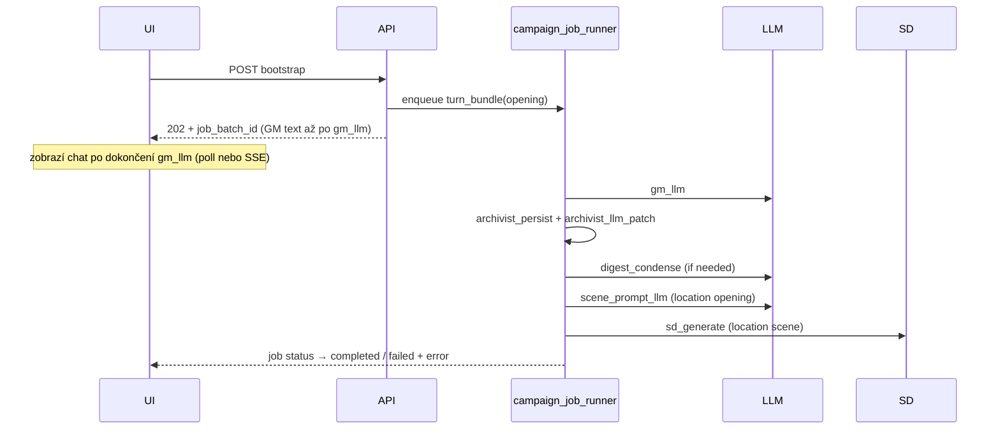
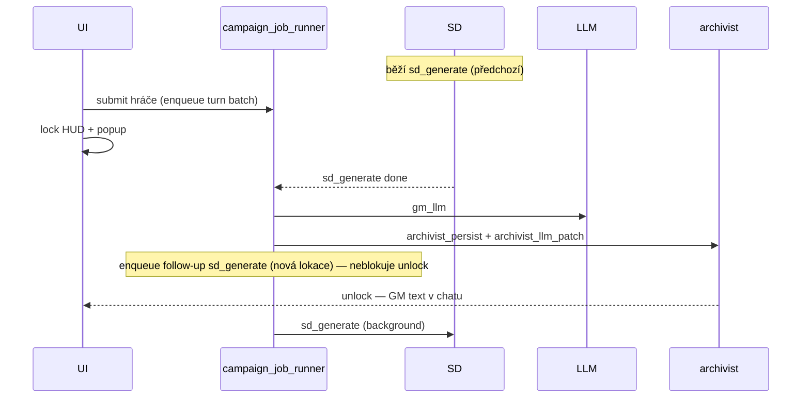

# Fugassa HUD + Campaign Job Pipeline — implementační plán

> **Status:** schváleno (2026-07-10)  
> **Scope:** herní HUD (Time, Location, obrázky), orchestrace úloh (GM → archivist → LLM prompty → SD), debug  
> **Zásada:** **žádný quick fix** — jedna správná pipeline, perzistentní fronta, testovatelná, obnovitelná po restartu  
> **Souvisí s:** ADR §K (turn pipeline), ADR §L (SD assety), ADR §L11 (reading phase), Titan VRAM scheduler  
> **Graphify:** před implementací každé fáze `graphify query/path/explain`; po změnách kódu `graphify update .`

---

## 1. Executive summary

Uživatel při prvním vstupu do hry (po wizardu) vidí:

| Symptom | Příčina (zjištěná) |
|---------|-------------------|
| **TIME prázdný / neúplný** | Wizard `opening_time_hint` se mapuje jen na `hour`; GM timestamp není fallback; `moon_phase` se z GM neukládá; UI edge case u prázdného `hhmm` |
| **Location téměř bez popisu** | Seed záměrně `"You find yourself in {name}."`; archivist `description_append` není garantovaný na turn 0 |
| **Scéna lokace (✨) se nevygeneruje** | SD fronta se sama nečte; `drain_once` max 1×; fáze `processing` blokuje ruční generaci; chyby se neukazují; VRAM/scheduler |
| **Scéna zprávy (📷) nefunguje / špatně chápaná** | UI existuje, ale chybí LLM krok pro prompt; deterministická šablona z raw textu |
| **„Něco běží, generace nedosáhne“** | **Neexistuje skutečný job orchestrator** — jen synchronní řetězec v jednom HTTP requestu + in-memory `turn_phase` |

**Cíl implementace:** zavést **perzistentní campaign job pipeline** per save, která řadí a spouští kroky (engine → GM LLM → archivist → digest → scene prompt LLM → SD), koordinuje VRAM s Titan schedulerem, a HUD + frontend na ni spolehlivě navazují.

---

## 2. Současný stav (as-is)

### 2.1 Turn pipeline — synchronní, v jednom requestu

```
POST /game/bootstrap | /game/submit
  turn_phase = processing
  resolve_turn (engine)
  await GM LLM                    ← llm_client._ensure_llm_awake()
  sync_from_state + enqueue assets (SQLite assets.status=queued)
  await archivist.run_archivist   ← volitelný 2. LLM (patch)
  await campaign_digest.maybe_condense  ← volitelný 3. LLM
  save_game_state
  turn_phase = reading
  await drain_once()              ← MAX 1 SD job, blocking až 300s
  return response
```

**Soubory:** `game_session.py`, `archivist.py`, `turn_resolver.py`, `state_repository.py`, `campaign_digest.py`, `llm_client.py`, `asset_worker.py`, `asset_gen.py`

### 2.2 SD „fronta“ — není worker

| Co existuje | Co chybí |
|-------------|----------|
| Tabulka `assets` (`queued` → `generating` → `ready`/`failed`) | Background loop / job runner |
| `drain_once()` | `drain_until_idle()` nebo kontinuální worker |
| `turn_phase` in-memory (`processing`/`reading`) | Perzistence fáze (DB / `game.json`) |
| `preempt()` při nové akci hráče | Retry + resume po restartu |
| ADR §L11 komentář „reading phase“ | Vynucení pořadí LLM ↔ SD na úrovni Fugassy |

### 2.3 VRAM scheduler (Titan, externí)

- **LLM:** `POST /v1/external/ensure-llm` (volá `llm_client` před každým chat completion)
- **SD:** `POST /v1/images/generations` (volá `asset_gen` přímo, bez explicitního „ensure-sd“)
- Scheduler interně swapuje LLM ↔ SD, ale Fugassa **nemá jednotnou frontu**, která by mezi kroky čekala na uvolnění VRAM a reportovala stav.

### 2.4 Frontend

| Soubor | Role |
|--------|------|
| `GameplayHub.js` | bootstrap, refresh panelů, `turn_phase` implicitně |
| `RightSidebar.js` | TIME, Location, Currency |
| `CenterView.js` | ✨ scéna lokace |
| `ChatPanel.js` | 📷 scéna GM zprávy |
| `fugassaApi.js` | API klient |

Chyby generace se polykají (`catch {}`), není polling job stavu.

---

## 3. Cílový stav (to-be)

### 3.1 Campaign Job Pipeline (jádro)

Nový modul **`campaign_job_runner.py`** + tabulka **`campaign_jobs`** (migration `009_campaign_jobs.sql`, schema v8 → v9).

#### Job typy

| `job_type` | Popis | VRAM |
|------------|-------|------|
| `engine_resolve` | `resolve_turn`, sync location, enqueue asset *requests* | — |
| `gm_llm` | GM generování prose + timestamp parse | LLM |
| `archivist_persist` | `apply_archivist` (SQL turn_history) | — |
| `archivist_llm_patch` | `run_llm_patch` | LLM |
| `digest_condense` | `campaign_digest.maybe_condense` | LLM |
| `scene_prompt_llm` | LLM → SD positive/negative prompt | LLM |
| `sd_generate` | `asset_gen.generate_image` + backfill SQL | SD |
| `state_sync` | enrich JSON, rebuild manifest, notify UI hooks | — |

#### Job stavy

`pending` → `running` → `completed` | `failed` | `cancelled`

Per save **jeden aktivní worker** (asyncio task), FIFO s prioritou turnu (starší turn dřív).

#### Perzistentní session fáze

`save_meta.campaign_phase`: `idle` | `processing` | `reading` | `generating_assets`

Nahradí / doplní in-memory `_turn_phases` v `asset_worker.py` (RAM cache jako optimalizace, **kanon v DB**).

#### Tok opening bootstrap (cíl)



**Klíč:** HTTP request **neblokuje** na SD (volitelně konfigurovatelné `wait_for_assets=false` default).

### 3.2 Dva typy generování obrázků (UX)

| UI | Účel | Entity | Prompt |
|----|------|--------|--------|
| **✨ CenterView** | Scéna **aktuální lokace** (regenerace) | `location` + `scene` | LLM z lokace + GM kontextu (viz otázky §8) |
| **📷 ChatPanel** | Scéna **konkrétní GM zprávy** | `other` + `turn_number` | LLM z `turn_history.ai_text` |

Oba typy = job `scene_prompt_llm` → job `sd_generate` ve frontě, ne inline v route handleru.

### 3.3 HUD datové zdroje

| Panel | Kanon po implementaci |
|-------|----------------------|
| **TIME** | `world_time` plně z wizard `opening_time_hint` při Create; merge z GM timestamp; fallback wizard při chybějícím GM |
| **Location** | `description_short` v SQL obohacený seed + archivist; sync do `state.location_state` po každém relevantním jobu |
| **Scéna** | `locations.image_path` / `assets` přes job runner; UI poll `GET /game/jobs` nebo SSE |

---

## 4. Fáze implementace

> Pořadí respektuje závislosti (graphify `path` ověřit před každou fází).  
> **Každá fáze = mergeovatelný PR** s testy + `graphify update .`

### Fáze 0 — Příprava a rozhodnutí (§8)

- [ ] Odsouhlasit otevřené otázky (LLM pro ✨, auto 📷, API tvar)
- [ ] Schválit DB schema `campaign_jobs`
- [ ] Zapsat rozhodnutí do tohoto dokumentu (changelog)

### Fáze 0b — Migrace stávajících save (v1 → pipeline v2)

| Soubor | Akce |
|--------|------|
| `db/save_pipeline_migration.py` | **NEW** — `ensure_save_ready()`, crash recovery |
| `game_session.py` | migrace na začátku `load_game_state` |
| `db/sqlite_store.py` | nové save: `save_meta.pipeline_model=v2` |
| `game_bootstrap.py` | `apply_opening_time_hint_to_world_time()` |

**Trigger:** každé načtení save (`load_game_state`).

**Kroky:** schema 009 → recover running/generating → enqueue orphaned `queued` assets → doplnit `world_time` z wizardu → `pipeline_model=v2` → schedule worker.

**Testy:** `test_save_pipeline_migration.py`

### Fáze 1 — Job pipeline foundation

**Backend (nové / refaktor):**

| Soubor | Akce |
|--------|------|
| `db/migrations/009_campaign_jobs.sql` | **NEW** — tabulka + indexy |
| `db/schema.sql` | bump schema_version → 9 |
| `db/job_repository.py` | **NEW** — CRUD, claim next, mark done/fail |
| `campaign_job_runner.py` | **NEW** — worker loop, enqueue API, per-save lock |
| `game_session.py` | refaktor `_complete_gm_turn` → enqueue job bundle místo inline await chain |
| `asset_worker.py` | `sd_generate` handler volaný z runneru; deprecate přímé `drain_once` z routes |
| `save_meta` / `game.json` | `campaign_phase` persist |

**Chování:**

- Worker běží jako asyncio task spuštěný při prvním jobu per save; obnoví se po restartu serveru (pending jobs).
- `_drain_asset_queue_sync` RuntimeError **opravit** — v async kontextu vždy `await`, nikdy tichý skip.
- `preempt`: nová hráčova akce → `cancel` běžící SD job (kromě kritických), requeue s `pending`.

**Testy:** `tests/test_campaign_job_runner.py` — pořadí, retry, preempt, restart recovery (simulace).

### Fáze 2 — VRAM / scheduler integrace

| Soubor | Akce |
|--------|------|
| `llm_client.py` | `_ensure_llm_awake()` před každým LLM jobem (už existuje) |
| `asset_gen.py` | **NEW** `_ensure_sd_ready()` — volání scheduler endpointu (nebo dokumentovaný contract s `/v1/images/generations` blocking swap) |
| `campaign_job_runner.py` | mezi LLM a SD joby explicitní fáze „release LLM / acquire SD“ + timeout + error do job metadata |

**Testy:** mock scheduler; selhání VRAM → job `failed` s `error` JSON, ne tichý `queued`.

### Fáze 3 — TIME + Location (HUD data)

| Soubor | Akce |
|--------|------|
| `game_bootstrap.py` | **NEW** `apply_opening_time_hint_to_world_time()` — celá wizard tabulka |
| `game_session.py` | `_apply_world_time` + `moon_phase`; fallback wizard time při opening |
| `game_bootstrap.py` | bohatší location seed (1. odstavec hook / GM excerpt) |
| `archivist.py` | po `apply_ops` sync location description → state |
| `state_repository.py` | `enrich_state_from_sql` beze změny kontraktu, ověřit po sync |
| `RightSidebar.js` | `timeDisplayHtml` fallback fix; zobrazit všechna `world_time` pole |

**Testy:** `test_game_bootstrap.py` (time hint columns), nový `test_world_time_opening.py`.

### Fáze 4 — Scene prompt LLM

| Soubor | Akce |
|--------|------|
| `scene_prompt_engine.py` | **NEW** — analogie `wizard_engine.generate_portrait_sd_prompts` |
| `wizard_engine.py` | referenční pattern (negative prompt, theme, image_style) |
| `routes.py` | `POST /assets/generate` → enqueue jobs, ne inline drain |
| `campaign_job_runner.py` | handler `scene_prompt_llm` pro `location` i `other` entity |

**Testy:** mock LLM JSON; validace prázdného promptu → job failed.

### Fáze 5 — Frontend + API

| Soubor | Akce |
|--------|------|
| `fugassaApi.js` | `getCampaignJobs(saveId)`, `getJobBatch(id)`; bootstrap může vracet `job_batch_id` |
| `GameplayHub.js` | job poller; **PipelineWaitModal** lock/unlock; refresh panelů |
| `PipelineWaitModal.js` | **NEW** — blocking popup, spinner, pipeline step labels |
| `CenterView.js` | stavy ✨: idle / queued / generating / ready / failed + toast |
| `ChatPanel.js` | 📷 stejně; zobrazit error z job metadata |
| `StatusBar.js` | indikátor background SD po odemčení popupu |

**UX:**

- **Chat submit** → vždy blocking popup až po GM + archivist (Q11); během SD nejdřív „Dokončuji scénu…“
- ✨/📷 disabled uvnitř popupu; po odemčení běží normálně
- Po failed job v popupu: chybová hláška + Retry / Zavřít (jen pokud batch failed)

### Fáze 6 — Debug a observability

| Položka | Popis |
|---------|-------|
| `GET /saves/{id}/game/jobs` | filtr: status, job_type, turn_number, limit |
| `GET /saves/{id}/game/jobs/{job_id}` | detail vč. `error`, `metadata_json`, timings |
| `POST /saves/{id}/game/jobs/{job_id}/retry` | admin/debug retry failed job |
| Logování | struct log: `save_id`, `job_id`, `job_type`, `duration_ms`, `error` |
| Dev panel | volitelně v Pause menu — posledních 20 jobů (Fáze 5+) |

**Docker debug checklist:**

```bash
docker exec titan-odysseus-1 sh -c 'cd /app && python3 -m pytest titan/fugassa/tests/test_campaign_job_runner.py -q'
# ověřit scheduler z kontejneru:
curl -s http://host.docker.internal:8150/health || true
# stav fronty v save:
sqlite3 /path/to/save/game.db "SELECT id, job_type, status, error FROM campaign_jobs ORDER BY id DESC LIMIT 10;"
```

### Fáze 7 — Regrese a graphify

- [ ] Plný pytest: `titan/fugassa/tests/`
- [ ] `graphify update .` v repo root
- [ ] Manuální E2E: nový save → wizard → Create → play → TIME / Location / ✨ / 📷
- [ ] Manuální: chat submit během SD → popup, FIFO, odemčení po GM + archivist, auto ✨ na pozadí
- [ ] Manuální: restart odysseus během pending jobs → worker pokračuje

---

## 5. DB schema návrh (`campaign_jobs`)

```sql
-- migration 009_campaign_jobs.sql
CREATE TABLE IF NOT EXISTS campaign_jobs (
  id              INTEGER PRIMARY KEY AUTOINCREMENT,
  code            TEXT NOT NULL UNIQUE,
  job_type        TEXT NOT NULL,
  status          TEXT NOT NULL DEFAULT 'pending',
  priority        INTEGER NOT NULL DEFAULT 100,
  turn_number     INTEGER,
  batch_id        TEXT NOT NULL,
  depends_on_id   INTEGER REFERENCES campaign_jobs(id),
  payload_json    TEXT,
  result_json     TEXT,
  error           TEXT,
  attempts        INTEGER NOT NULL DEFAULT 0,
  max_attempts    INTEGER NOT NULL DEFAULT 3,
  created_at      TEXT NOT NULL,
  started_at      TEXT,
  finished_at     TEXT,
  updated_at      TEXT NOT NULL
);
CREATE INDEX IF NOT EXISTS idx_campaign_jobs_status ON campaign_jobs(status, priority, id);
CREATE INDEX IF NOT EXISTS idx_campaign_jobs_batch ON campaign_jobs(batch_id);
CREATE INDEX IF NOT EXISTS idx_campaign_jobs_save ON campaign_jobs(batch_id, status);
```

`batch_id` = `{save_id}:{turn_number}:{uuid}` pro jeden „turn bundle“.

**Vztah k `assets`:** `sd_generate` job v `payload_json` referencuje `asset_id`; po success aktualizuje stejně jako dnešní `asset_worker`.

---

## 6. Mapa dotčených souborů (graphify)

### Backend — must touch

```
titan/fugassa/db/save_pipeline_migration.py          NEW
titan/fugassa/campaign_job_runner.py          NEW
titan/fugassa/db/job_repository.py            NEW
titan/fugassa/db/migrations/009_campaign_jobs.sql  NEW
titan/fugassa/game_session.py                 REFACTOR
titan/fugassa/asset_worker.py                 REFACTOR
titan/fugassa/asset_gen.py                    EXTEND
titan/fugassa/asset_service.py                REFACTOR (enqueue, not drain)
titan/fugassa/routes.py                       NEW routes + refactor generate/bootstrap
titan/fugassa/game_bootstrap.py               EXTEND (time, location seed)
titan/fugassa/archivist.py                    SYNC location to state
titan/fugassa/scene_prompt_engine.py          NEW
titan/fugassa/llm_client.py                   (ensure-llm — keep)
titan/fugassa/db/state_repository.py          verify enqueue path
titan/fugassa/db/asset_repository.py          unchanged contract
titan/fugassa/db/migrations.py                register 009
titan/fugassa/db/schema.sql                   v9
```

### Frontend — must touch

```
static/js/fugassa/fugassaApi.js
static/js/fugassa/gameplay/GameplayHub.js
static/js/fugassa/gameplay/hud/PipelineWaitModal.js  NEW
static/js/fugassa/gameplay/hud/RightSidebar.js
static/js/fugassa/gameplay/hud/CenterView.js
static/js/fugassa/gameplay/hud/ChatPanel.js
static/js/fugassa/gameplay/hud/StatusBar.js   optional indicator
```

### Tests — must add/extend

```
titan/fugassa/tests/test_save_pipeline_migration.py NEW
titan/fugassa/tests/test_campaign_job_runner.py     NEW
titan/fugassa/tests/test_world_time_opening.py      NEW
titan/fugassa/tests/test_scene_prompt_engine.py     NEW
titan/fugassa/tests/test_game_bootstrap.py          EXTEND
titan/fugassa/tests/test_asset_pipeline.py          REFACTOR (job-based drain)
titan/fugassa/tests/test_db_seed_sublocation.py     verify location seed
```

---

## 7. Rizika a mitigace

| Riziko | Mitigace |
|--------|----------|
| Breaking change bootstrap API (202 vs sync) | Frontend okamžitě na async model; hard switch (Q8) |
| Dvojitá fronta (`assets` + `campaign_jobs`) | SD vždy přes job; `assets` zůstane výstupní entita pro UI/manifest |
| Deadlock worker per save | timeout per job; max attempts; manual retry endpoint |
| Graphify drift | `graphify update .` v CI / před merge |
| Regrese turn / undo | testy undo — **wait policy** (Q7): undo disabled while jobs pending |

---

## 8. Schválená rozhodnutí (2026-07-10)

| # | Téma | Rozhodnutí |
|---|------|------------|
| **Q1** | Scope A–E | **Vše** — pořadí implementace: **E first** (Fáze 1–2), pak A–D |
| **Q2** | ✨ SD prompt | **LLM** (`scene_prompt_llm`) pro ✨ i 📷 |
| **Q3** | 📷 chat scény | **Manuální** tlačítko u každé GM zprávy; po `ready`: popup + **Open** / **Regenerate** |
| **Q4** | Bootstrap HTTP | Končí po **GM + archivist**; SD joby běží **na pozadí** |
| **Q5** | Currency | Zobrazovat v **sidebaru i Inventory** |
| **Q6** | Fronta vs preempt | **Strict FIFO per save** — běžící SD se **neukoncuje**; LLM/archivist/GM turn se **zařadí za** běžící job. **Zrušit** dnešní `preempt()` kill SD. |
| **Q7** | Undo | **Disabled** dokud nedoběhnou joby posledního turnu |
| **Q8** | Rollout | **Hard switch** — bez feature flagu |
| **Q9** | Location popis | Z **opening** — LLM vydestiluje popis lokace (+ SD prompt). Propojení archivist vs dedikovaný job dle data flow (implementační detail). |
| **Q10** | Auto ✨ | Ano při **prvním vstupu** do lokace + po **travel/move** do nové |
| **Q11** | Submit během SD | **Blocking popup** — viz §8.1 |
| **Q12** | Job UI sync | Poll `GET /game/jobs` každé **2 s** |

### 8.1 Q11 — blocking pipeline popup (upřesnění 2026-07-10)

**Kontext:** ochrana před zahlcením fronty. Hráč smí odeslat zprávu i během běžící SD, ale UI se chová jako „jedna interaktivní fronta“.

**Trigger:** hráč odešle chat akci (`POST /game/submit`) zatímco běží `sd_generate` (auto ✨ nebo ruční) — nebo obecně kdykoli po submitu, dokud nedoběhne interaktivní část turnu.

**Chování backendu (FIFO, Q6):**



**Chování frontendu:**

| Prvek | Během popupu |
|-------|----------------|
| Celé HUD (chat, move, sidebar akce, overlay) | **disabled** |
| Popup | spinner + **aktuální krok** z `GET /game/jobs` (poll 2s) |
| Chat scroll | GM odpověď se objeví **před** odemčením (modal ještě chvíli „Archivist…“) |
| Odemčení | GM text v `chat_history` **+** žádný pending `gm_llm` / `archivist_*` pro `batch_id` turnu |
| Po odemčení | auto ✨ / travel SD jen indikátor v CenterView / status bar (Q4, Q10) |

**Nový UI modul:** `PipelineWaitModal.js` (mount z `GameplayHub.js`), props: `phase`, `currentJob`, `error`.

**API:** `GET /game/jobs` vrací `blocking_phase` + `current_job` + `unlock_when` pro frontend bez hádání.

**Poznámka k Q7:** Undo zůstává disabled, dokud nedoběhnou **všechny** joby posledního turnu včetně background SD — konzistentní s „wait“.

### Q6 — upřesnění implementace

- `max_attempts` pro SD job: **3**, backoff **5s / 15s / 45s** (při selhání scheduleru, ne při FIFO wait)
- **Nikdy** nepřerušovat běžící SD kvůli novému LLM jobu ani hráčově akci — pouze **enqueue** další joby
- Dnešní `asset_worker.preempt()` a `_active_jobs` flag pro kill → **odstranit / nahradit** queue semantics

---

## 9. Acceptance criteria (hotovo =)

- [ ] Nový save: TIME ukazuje wizard hodnoty (time of day, hh:mm, era, season, weather, moon) ještě před první GM akcí hráče
- [ ] Location popis není jen generická věta — obsahuje smysluplný seed z opening
- [ ] Opening location scene (✨) se **automaticky** enqueuuje a **dokončí** na pozadí bez ručního kliknutí (pokud SD dostupné)
- [ ] Ruční ✨ a 📷 vytvoří joby ve frontě; UI ukazuje progress a **chybu** při fail
- [ ] Chat submit během SD: celé HUD locked + popup se stavem pipeline; odemčení po GM + archivist
- [ ] Po odemčení: auto ✨ nové lokace běží na pozadí bez dalšího locku
- [ ] Po restartu Odysseus pending jobs pokračují
- [ ] **Legacy save:** po upgradu se dokončí orphaned `queued` scény; TIME doplněno z wizardu
- [ ] `pytest titan/fugassa/tests/` green
- [ ] `graphify update .` bez broken edges na nových modulech
- [ ] Debug endpoint `/game/jobs` vrací poslední joby s error textem

---

## 10. Changelog dokumentu

| Datum | Autor | Změna |
|-------|-------|-------|
| 2026-07-10 | diagnostika + plán | První verze — HUD bugs + job pipeline E2 |
| 2026-07-10 | Q1–Q12 schváleno | Rozhodnutí zapsána — strict FIFO, no preempt, poll 2s |
| 2026-07-11 | Fáze 0 | Migrace stávajících save v1→v2 (`save_pipeline_migration.py`) |
| 2026-07-10 | Q11 upřesnění | Blocking pipeline popup — lock HUD, unlock po GM + archivist, SD follow-up na pozadí |

---

## 11. Odkazy na kód (reference)

```python
# Současný synchronní konec turnu — nahradit enqueue batch
# game_session.py ~L240-241
asset_worker.set_turn_phase(save_id, "reading")
state = await _drain_asset_queue(save_id, state, db_path)
```

```python
# SD fronta dnes — pouze 1 položka, gate on reading
# asset_worker.py drain_once()
if get_turn_phase(save_id) != "reading":
    return {"drained": 0, "reason": "not_reading"}
```

```python
# Wizard time — jen hour dnes
# game_bootstrap.py apply_wizard_draft
start_hour = _parse_hour_from_time_hint(world_profile["opening_time_hint"])
```
