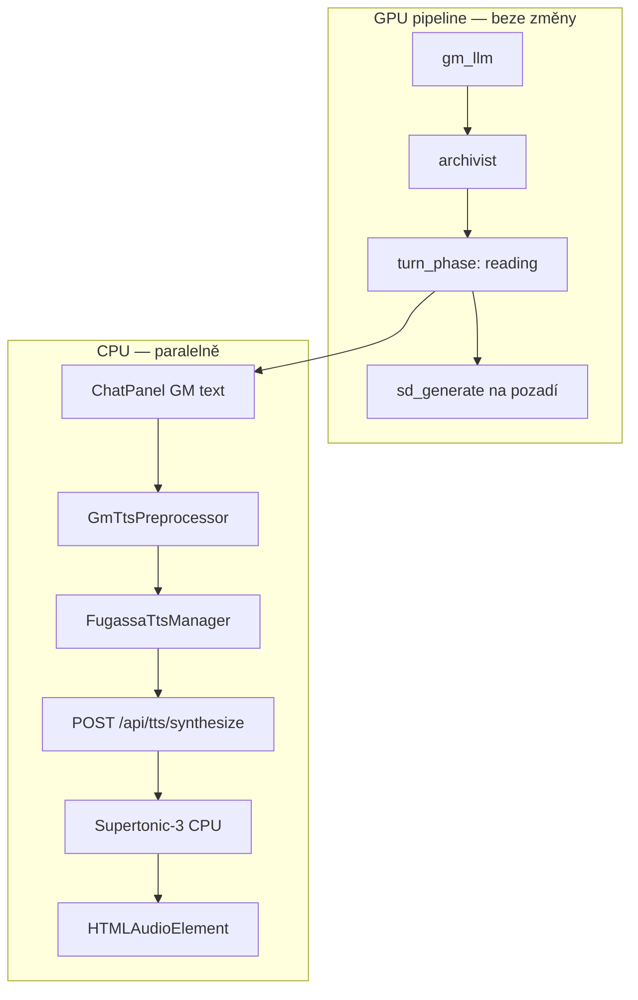

# Fugassa — TTS (implementační plán)

> **Kanónická kopie v Obsidianu:** `Vault/Projects/Titan/Fugassa — TTS (implementační plán).md`  
> **Souvisí s:** implementační plán Fugassa Titan, HUD job pipeline, ADR paměť, Titan pilíř 7

---

## Proč tento dokument

Hráč chce **číst GM zprávy nahlas** ve stylu AI Realm — automaticky nebo na vyžádání. Inspirace z Fugassa I / AI Realm; v Fugassa II Godot **TTS nebylo** implementováno ani zdokumentováno.

Titan už má obecný `TTSService` + `AITTSManager` pro hlavní chat. Fugassa `ChatPanel` TTS **nemá**. Tento plán popisuje **Fugassa-specifickou** vrstvu nad existující Titan infrastrukturou.

---

## Rozhodnutí (2026-07-13)

| # | Rozhodnutí |
|---|------------|
| **T1** | **Engine:** pouze **sherpa-onnx Supertonic-3** (multijazyčný). **Piper zatím ne.** |
| **T2** | **Jazyky v první instalaci:** angličtina, čeština, ukrajinština (`en`, `cs`, `uk`). |
| **T3** | **Hlasy:** Supertonic-3 má **10 speaker ID (0–9)** na jazyk — nabídnout všechny. **Zatím dummy labely** (`Hlas 1` … `Hlas 10` v UI; `Voice 1` … pro EN, `Голос 1` … pro UK dle `language` save). **Kalibrace** (pohlaví, přátelštější názvy) **až jako poslední fáze**. |
| **T4** | **Auto-play default:** **vypnuto** (`mode: manual`). |
| **T5** | **Nastavení:** **per-save** (`tts_prefs` v save), ne globální Fugassa config. |
| **T6** | **Fallback:** **žádný**. Model není stažený / syntéza selže → TTS se **neprovede** (tichý skip, volitelně toast v debug). |
| **T7** | **Priorita vs job pipeline:** **paralelně**, ne blokující. TTS běží na **CPU** — **mimo** VRAM scheduler (LLM ↔ SD). |
| **T8** | **Rozsah:** číst **jen GM zprávy** (`role: assistant`), **nikdy** zprávy hráče. |
| **T9** | **UI nastavení:** Pause menu → záložka **Audio** (jazyk, hlas, rychlost, režim). |
| **T10** | **Stažení modelu:** Titan Model Hub preset **„Fugassa TTS (Supertonic-3)“** — jedno tlačítko, ~123 MB (int8). |

---

## Cíl UX (AI Realm styl)

| Chování | Popis |
|---------|--------|
| **Manual (default)** | U každé GM bubliny tlačítko ▶ — přečte narativní část zprávy. ⏹ zastaví. |
| **Auto** | Po přepnutí do `turn_phase: reading` a doručení GM textu do chatu → automaticky spustit čtení poslední GM zprávy. |
| **Stop** | Nový submit hráče → okamžitě `stop()` (přerušení běžícího čtení). |
| **Pause Audio** | Per-save: režim, jazyk, speaker ID, rychlost 0.75–1.5×. |

---

## Engine — Supertonic-3

**Zdroj:** [sherpa-onnx](https://github.com/k2-fsa/sherpa-onnx) · model **Supertonic-3** (Supertone)

| Vlastnost | Hodnota |
|-----------|---------|
| Jazyky | 31 včetně `en`, `cs`, `uk` |
| Speakery | 10 (`sid` 0–9) per jazyk |
| Sample rate | 24 kHz |
| VRAM | **0** — ONNX na CPU |
| Balíček | `sherpa-onnx-supertonic-3-tts-int8-2026-05-11.tar.bz2` (~123 MB) |

**Proč ne Piper (zatím):** jeden model pokrývá všechny tři jazyky + 10 variant hlasu; menší složitost instalace a kódu. Piper (pojmenované hlasy, lepší EN) — **fáze 2+**, až bude potřeba.

### Manifest hlasů (dummy — od začátku)

Statický manifest v repu — **bez poslechové kalibrace**. `speaker_id` 0–9 mapuje na pořadové dummy názvy:

| `speaker_id` | Label (CS) | Label (EN) | Label (UK) |
|--------------|------------|------------|------------|
| 0 | Hlas 1 | Voice 1 | Голос 1 |
| 1 | Hlas 2 | Voice 2 | Голос 2 |
| … | … | … | … |
| 9 | Hlas 10 | Voice 10 | Голос 10 |

Soubor: `data/tts/supertonic-voice-manifest.json` — generovat programově nebo ručně; UI bere label podle `tts_prefs.lang` / jazyka hry.

```json
{
  "engine": "supertonic-3",
  "speakers": [
    { "id": 0, "labels": { "cs": "Hlas 1", "en": "Voice 1", "uk": "Голос 1" } },
    { "id": 1, "labels": { "cs": "Hlas 2", "en": "Voice 2", "uk": "Голос 2" } }
  ]
}
```

**Kalibrace** (poslech `sid` 0–9, doplnění `gender`, případně přejmenování) — **fáze 8, až po E2E**; nesmí blokovat fáze 0–7.

---

## Architektura — CPU paralelně, ne v GPU pipeline

TTS **není** job v `campaign_jobs` a **neúčastní se** VRAM swapu LLM ↔ SD.



### Pravidla souběhu

| Situace | TTS chování |
|---------|-------------|
| `turn_phase: processing` | **Nečíst** — GM text ještě není finální. |
| `turn_phase: reading` | Manual: ▶ dostupné. Auto: spustit po doručení GM do chatu. |
| Běží SD na GPU | **Nezávislé** — TTS na CPU pokračuje. |
| Hráč odešle nový tah | `stop()` — přerušit čtení. |
| Model chybí | **Skip** — žádný fallback na browser/Kokoro. |
| Dlouhá GM zpráva | Syntéza po **větách** (fronta), stejně jako `AITTSManager` v Titan chatu. |

---

## Text pro čtení — GM preprocessor

GM výstup má strukturu (timestamp tabulka, recap, scéna, summary, suggestions). Pro TTS číst primárně **narativní prózu**:

| Sekce | Číst? |
|-------|-------|
| Timestamp tabulka (`\| Time of Day \|…`) | **Ne** |
| Recap | Volitelně (default **ne** — kratší poslech) |
| **Current scene** (3–4 odstavce) | **Ano** (hlavní obsah) |
| Round summary | **Ne** |
| Suggestions / volby | **Ne** |
| Markdown, kostky, systémové řádky | **Ne** |

Implementace: `static/js/fugassa/gameplay/GmTtsPreprocessor.js` — heuristiky + regex podle `gm_output_format.txt`; unit testy na reálných GM ukázkách ze save.

---

## Persistence — per-save `tts_prefs`

Uložit v **`game.db`** (kanon) — sloupec / JSON v `save_meta` nebo dedikovaná tabulka.

```json
{
  "tts_prefs": {
    "enabled": true,
    "mode": "manual",
    "lang": "cs",
    "speaker_id": 3,
    "speed": 1.0
  }
}
```

| Pole | Typ | Default |
|------|-----|---------|
| `enabled` | bool | `true` |
| `mode` | `off` \| `manual` \| `auto` | `manual` |
| `lang` | `en` \| `cs` \| `uk` | odvozeno z `language` save / wizardu |
| `speaker_id` | int 0–9 | `0` (`Hlas 1` / `Voice 1`) |
| `speed` | float 0.75–1.5 | `1.0` |

**API:**

- `GET /api/fugassa/saves/{id}/game/pause` — rozšířit o `tts_prefs`
- `PATCH` — merge `tts_prefs` spolu s world/rules/GM guides

Nové save: defaulty při `init_game_db` / prvním loadu.

---

## Backend změny

### 1. Rozšíření `TTSService` (`services/tts/tts_service.py`)

Nový provider: `local:supertonic`

| Metoda / endpoint | Účel |
|-------------------|------|
| `synthesize(text, lang=, speaker_id=, speed=)` | Supertonic inference |
| `GET /api/tts/voices?engine=supertonic&lang=cs` | Seznam 10 hlasů z manifestu |
| `GET /api/tts/stats` | `supertonic_ready: bool`, cesta k modelu |

Lazy-load: model se načte při první syntéze; držet v procesu (singleton). **Nepřidávat** do VRAM scheduleru.

### 2. Závislosti

```
pip install sherpa-onnx
```

Model na disk: `data/tts/models/supertonic-3-int8/` (nebo pod Model Hub cestou).

### 3. Model Hub

Preset v Titan Model Hub UI:

- Název: **Fugassa TTS — Supertonic-3**
- URL: GitHub release `sherpa-onnx-supertonic-3-tts-int8-2026-05-11.tar.bz2`
- Po stažení: `tts_supertonic_ready: true` v health/stats

---

## Frontend změny

### 1. `FugassaTtsManager.js` (nový, nebo tenký wrapper)

Reuse logiky z `static/js/tts-ai.js` (`AITTSManager`):

- `extractPlainText` → nahradit / doplnit `GmTtsPreprocessor`
- Fronta vět, `stop()`, cache klíč včetně `lang` + `speaker_id` + `speed`
- Request na `/api/tts/synthesize` s query/body parametry z `tts_prefs`

**Nesdílet** globální Titan `window.aiTTSManager` s Fugassou — oddělená instance kvůli per-save prefs.

### 2. `ChatPanel.js`

- U GM zpráv (`role === 'assistant'`): tlačítko ▶/⏹ vedle těla zprávy
- Hook na `setMessages` / `turn_phase === 'reading'`: pokud `mode === 'auto'`, enqueue poslední GM
- Submit hráče (callback z `GameplayHub`): `fugassaTts.stop()`

### 3. `PauseScreen.js`

Nová záložka **Audio** (vedle Settings / Debug):

| Kontrola | Widget |
|----------|--------|
| Povolit TTS | toggle `enabled` |
| Režim | radio: Vypnuto / Na vyžádání / Automaticky |
| Jazyk | select `en` / `cs` / `uk` |
| Hlas | select 10 speakerů (`Hlas 1` … `Hlas 10` z manifestu) |
| Rychlost | select nebo slider 0.75–1.5 |
| Náhled | tlačítko „Poslechnout ukázku“ (krátká GM ukázková věta) |
| Model | stav: „Supertonic-3 ✓“ / „Není stažený — Model Hub“ (jen informace) |

Uložení: existující **Save pause settings** + `tts_prefs` v payload.

---

## Implementační fáze

| Fáze | Deliverable | Odhad |
|------|-------------|-------|
| **0** | PoC skript: sherpa supertonic-3, syntéza 1 věty CS/EN/UK (`sid` 0) | 0.5 dne |
| **1** | `TTSService` provider `local:supertonic`, dummy voice manifest, API voices/stats, pytest | 1 den |
| **2** | Model Hub preset + cesta k modelu, health check | 0.5 dne |
| **3** | `GmTtsPreprocessor` + unit testy | 0.5 dne |
| **4** | `FugassaTtsManager` + `ChatPanel` ▶/auto/stop | 1 den |
| **5** | `tts_prefs` per-save (DB + pause API) + Pause Audio tab | 1 den |
| **6** | Integrace s `turn_phase: reading` v `GameplayHub` | 0.5 dne |
| **7** | Regrese: pytest, manuální E2E checklist, `graphify update` | 0.5 dne |
| **8** | **Kalibrace hlasů** (poslech, `gender`, lepší názvy v manifestu) — **volitelně, po go-live** | 0.5 dne |

**Celkem:** ~5–6 dní (paralelně s HUD pipeline — žádná závislost na fázi E job pipeline).

### Pořadí vůči HUD pipeline

```
HUD pipeline (GPU)     ████████████████████  (samostatná linka)
Fugassa TTS (CPU)      ████████████          (paralelně od fáze 0)
```

---

## Mapa souborů (cílový stav)

| Soubor | Změna |
|--------|-------|
| `services/tts/tts_service.py` | Supertonic provider |
| `services/tts/supertonic_pipeline.py` | **Nový** — ONNX load + generate |
| `data/tts/supertonic-voice-manifest.json` | **Nový** — dummy `Hlas 1`…`10` (kalibrace fáze 8) |
| `routes/tts_routes.py` | `lang`, `speaker_id` v requestu; `/voices` |
| `titan/fugassa/game_session.py` | `tts_prefs` get/set v pause |
| `titan/fugassa/routes.py` | dokumentace `GamePauseBody` |
| `static/js/fugassa/gameplay/GmTtsPreprocessor.js` | **Nový** |
| `static/js/fugassa/gameplay/FugassaTtsManager.js` | **Nový** |
| `static/js/fugassa/gameplay/hud/ChatPanel.js` | ▶ tlačítko, auto hook |
| `static/js/fugassa/gameplay/screens/PauseScreen.js` | Audio tab |
| `static/js/fugassa/gameplay/GameplayHub.js` | turn_phase + stop on submit |
| `tests/test_gm_tts_preprocessor.py` | **Nový** |
| `tests/test_supertonic_tts.py` | **Nový** (skip if model missing) |
| `docs/fugassa-tts-plan.md` | tento soubor |

---

## Acceptance criteria

- [ ] Model Hub stáhne Supertonic-3; `/api/tts/stats` hlásí `ready`
- [ ] Syntéza CS/EN/UK s `speaker_id` 0–9 vrací WAV/MP3
- [ ] GM zpráva: ▶ přečte **jen narativ** (bez timestamp tabulky)
- [ ] Zpráva hráče: **žádné** TTS tlačítko
- [ ] Default `mode: manual` — auto se nespustí bez změny v pause
- [ ] `mode: auto` — čtení po `reading` + GM v chatu
- [ ] Submit nového tahu přeruší běžící TTS
- [ ] TTS běží souběžně se SD generováním (CPU vs GPU)
- [ ] Model chybí → žádné přehrání, žádný crash
- [ ] `tts_prefs` per-save přežije reload / Continue
- [ ] Pause Audio: jazyk, hlas, rychlost, režim — uložitelné
- [ ] pytest green (supertonic testy skip bez modelu)

---

## Graphify workflow (povinné)

```bash
cd ~/titan
graphify query "TTSService ChatPanel turn_phase reading FugassaTts"
graphify path "ChatPanel" "tts_service.synthesize"
# po každé fázi:
graphify update .
```

---

## Otevřené pro fázi 2+ (mimo scope)

- **Kalibrace hlasů** (fáze 8) — poslech, `gender`, přátelštější názvy místo `Hlas N`
- Piper doplňkové hlasy (pojmenované EN/CS/UK)
- STT / oboustranná konverzace (Pilíř 7)
- Čtení recap sekce (volitelný toggle)
- Streaming syntéza po větách během `processing` (dřívější start) — zatím **ne**, čekáme na finální GM text

---

## Historie

| Datum | Změna |
|-------|-------|
| 2026-07-13 | Dummy labely `Hlas 1`…`10`; kalibrace přesunuta na fázi 8 |
| 2026-07-13 | Vytvořeno; schváleno: Supertonic-only, per-save, manual default, no fallback, CPU paralelně |
