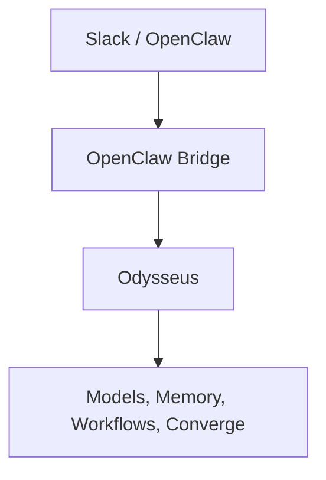

# OpenClaw Bridge

## Purpose

The OpenClaw bridge allows external clients (OpenClaw, Slack bots, scripts, automation platforms) to interact with Odysseus through a scoped API.

Odysseus remains the system of record for:
- Chat sessions
- Memory
- Converge/Redmine access
- Scheduled workflows
- Research
- Tool execution

OpenClaw acts as a client/UI layer.



## Design Goals

- Local-first
- Least privilege
- Explicit scope-based access
- Safe workflow triggering
- Slack thread ↔ Odysseus session mapping
- Read-only by default

## Environment Variables

Configure the following environment variables in your `.env` file to enable Converge and Workflow integrations:

- `CONVERGE_BASE_URL`: The base URL of the Converge/Redmine Dashboard instance (e.g., `http://redmine-dashboard:3000`).
- `CONVERGE_API_KEY`: The API key for Converge. **This key should be read-only in Converge** (configured in Converge's `EXTERNAL_API_KEYS`).
- `OPENCLAW_ALLOWED_WORKFLOWS`: Controls which scheduled workflows can be triggered. See the Workflow Allowlist section below.

## Session Mapping

Slack conversations are mapped into deterministic Odysseus sessions.

**Format:** `openclaw:slack:<channel>:<thread>`

**Examples:**
- `openclaw:slack:C123456:1700000000.000100`
- `openclaw:slack:ops-alerts:root`

This allows OpenClaw to maintain conversation continuity across Slack threads.

## Authentication

The bridge supports API token authentication.

**Example:**
```http
Authorization: Bearer <token>
```

Token ownership determines the Odysseus user context used for requests.

## Scopes

### `chat`
Basic bridge access. Allows:
- `POST /api/openclaw/ask`
- Session creation
- Standard chat interactions

### `memory:read`
Allows retrieval of memory context.
Without this scope, `no_memory=True` is enforced.

### `memory:write`
Allows memory commands.
Examples: `/remember`, `/forget`
*Note: `memory:write` implicitly grants `memory:read`.*

### `web:read`
Allows web retrieval during chat requests.
Required for:
```json
{
  "use_web": true
}
```

### `research:run`
Allows Deep Research execution.
Required for:
```json
{
  "use_research": true
}
```

### `tools:use`
Allows tool preprocessing and tool execution.
Without this scope, `allow_tool_preprocessing=False`.

### `converge:read`
Allows access to Converge ticket data.
Required for:
- `GET /api/openclaw/converge/health`
- `POST /api/openclaw/tickets/search`
- `POST /api/openclaw/tickets/{ticket_id}/summary`

### `workflows:trigger`
Allows execution of scheduled workflows.
Required for:
- `POST /api/openclaw/workflows/{name}/trigger`

### `homelab:read`
Allows homelab service registry and health checks.
Required for:
- `GET /api/openclaw/homelab/health`
- `POST /api/openclaw/homelab/health/record`

### `events:read`
Allows listing and viewing homelab events.
Required for:
- `GET /api/openclaw/homelab/events`
- `GET /api/openclaw/homelab/events/{id}`

### `events:write`
Allows recording events from health checks.
Required for:
- `POST /api/openclaw/homelab/health/record`

### `events:ack`
Allows acknowledging or marking events as investigating.
Required for:
- `POST /api/openclaw/homelab/events/{id}/ack`
- `POST /api/openclaw/homelab/events/{id}/investigate`

### `events:resolve`
Allows resolving or ignoring events.
Required for:
- `POST /api/openclaw/homelab/events/{id}/resolve`
- `POST /api/openclaw/homelab/events/{id}/ignore`

## Workflow Allowlist

Workflow execution can be restricted using the `OPENCLAW_ALLOWED_WORKFLOWS` environment variable:

- **Comma-separated values**: Restricts execution to specific workflow names or IDs. (e.g., `OPENCLAW_ALLOWED_WORKFLOWS=daily-summary,redmine-triage`)
- `*`: Allows all workflows. (e.g., `OPENCLAW_ALLOWED_WORKFLOWS=*`)
- **Empty**: Disables allowlist enforcement completely, relying solely on scope checks. (e.g., `OPENCLAW_ALLOWED_WORKFLOWS=`)

*Recommendation: Use explicit allowlists for OpenClaw usage to prevent unintended workflow executions.*

## Routes & Examples

### `GET /api/openclaw/health`
Basic bridge health. Does not perform Converge smoke checks.
```bash
curl -H "Authorization: Bearer <token>" http://localhost:7000/api/openclaw/health
```

### `GET /api/openclaw/converge/health`
Converge integration health.
**Requires:** `converge:read`
```bash
curl -H "Authorization: Bearer <token>" http://localhost:7000/api/openclaw/converge/health
```

### `POST /api/openclaw/ask`
Chat entry point. Features: Slack thread session mapping, Memory integration, Optional web search, Optional research, Tool execution gating.
**Requires:** `chat` (and additional scopes for specific features)
```bash
curl -X POST -H "Authorization: Bearer <token>" -H "Content-Type: application/json" \
  -d '{"message": "What is the status of the API?", "channel": "C123", "thread": "170000.100"}' \
  http://localhost:7000/api/openclaw/ask
```

### `POST /api/openclaw/tickets/search`
Search Converge tickets.
**Requires:** `converge:read`
```bash
curl -X POST -H "Authorization: Bearer <token>" -H "Content-Type: application/json" \
  -d '{"query": "vpn down", "limit": 5}' \
  http://localhost:7000/api/openclaw/tickets/search
```

### `POST /api/openclaw/tickets/{ticket_id}/summary`
Generate a Slack-oriented ticket summary. Ticket payloads are sanitized before being sent to the model.
**Requires:** `converge:read`
```bash
curl -X POST -H "Authorization: Bearer <token>" \
  http://localhost:7000/api/openclaw/tickets/12345/summary
```

### `POST /api/openclaw/workflows/{name}/trigger`
Trigger an allowed scheduled workflow.
**Requires:** `workflows:trigger`
```bash
curl -X POST -H "Authorization: Bearer <token>" -H "Content-Type: application/json" \
  -d '{"force": true}' \
  http://localhost:7000/api/openclaw/workflows/daily-summary/trigger
```

### `GET /api/openclaw/homelab/health`
Run homelab health checks in compact Slack-friendly format.
**Requires:** `homelab:read`
```bash
curl -H "Authorization: Bearer <token>" http://localhost:7000/api/openclaw/homelab/health
```

### `POST /api/openclaw/homelab/health/record`
Run health checks and durably record failures as events.
**Requires:** `homelab:read` + `events:write`
```bash
curl -X POST -H "Authorization: Bearer <token>" http://localhost:7000/api/openclaw/homelab/health/record
```

### `GET /api/openclaw/homelab/events`
List homelab events. Supports `?status=open&limit=10`.
**Requires:** `events:read`
```bash
curl -H "Authorization: Bearer <token>" "http://localhost:7000/api/openclaw/homelab/events?status=open&limit=10"
```

### `GET /api/openclaw/homelab/events/{id}`
Get a single event by ID.
**Requires:** `events:read`
```bash
curl -H "Authorization: Bearer <token>" http://localhost:7000/api/openclaw/homelab/events/<id>
```

### `POST /api/openclaw/homelab/events/{id}/ack`
Acknowledge an open event.
**Requires:** `events:ack`
```bash
curl -X POST -H "Authorization: Bearer <token>" http://localhost:7000/api/openclaw/homelab/events/<id>/ack
```

### `POST /api/openclaw/homelab/events/{id}/investigate`
Mark an event as being investigated.
**Requires:** `events:ack`
```bash
curl -X POST -H "Authorization: Bearer <token>" http://localhost:7000/api/openclaw/homelab/events/<id>/investigate
```

### `POST /api/openclaw/homelab/events/{id}/resolve`
Mark an event as resolved.
**Requires:** `events:resolve`
```bash
curl -X POST -H "Authorization: Bearer <token>" http://localhost:7000/api/openclaw/homelab/events/<id>/resolve
```

### `POST /api/openclaw/homelab/events/{id}/ignore`
Ignore a non-actionable event.
**Requires:** `events:resolve`
```bash
curl -X POST -H "Authorization: Bearer <token>" http://localhost:7000/api/openclaw/homelab/events/<id>/ignore
```

## OpenClaw / Slack Command Reference

| Command | Route | Scope |
|---|---|---|
| `ops homelab health` | `GET /api/openclaw/homelab/health` | `homelab:read` |
| `ops homelab health --record` | `POST /api/openclaw/homelab/health/record` | `homelab:read` + `events:write` |
| `ops events` | `GET /api/openclaw/homelab/events?status=open` | `events:read` |
| `ops event <id>` | `GET /api/openclaw/homelab/events/{id}` | `events:read` |
| `ops ack <id>` | `POST /api/openclaw/homelab/events/{id}/ack` | `events:ack` |
| `ops investigate <id>` | `POST /api/openclaw/homelab/events/{id}/investigate` | `events:ack` |
| `ops resolve <id>` | `POST /api/openclaw/homelab/events/{id}/resolve` | `events:resolve` |
| `ops ignore <id>` | `POST /api/openclaw/homelab/events/{id}/ignore` | `events:resolve` |

## Security Notes

The bridge intentionally separates permissions. A token only receives the capabilities explicitly granted to it.

**Recommended OpenClaw token:**
- `chat`
- `converge:read`
- `homelab:read`
- `events:read`
- `events:ack`
- `events:resolve`

**Avoid granting unless explicitly required:**
- `workflows:trigger`
- `memory:write`
- `events:write` (only needed for `health --record`)

**Grant only when explicitly needed:**
- `web:read`
- `research:run`
- `tools:use`

## Testing

Current bridge tests validate:
- Session ID generation
- Scope enforcement
- Memory gating
- Tool gating
- Research warnings
- Workflow allowlists
- Ticket sanitization
- User message persistence
- Homelab event scope enforcement
- Missing event 404 handling
- Persistence failure 500 handling
- Destructive action stripping from responses

Run the targeted tests using:
```bash
pytest tests/test_openclaw_bridge_routes.py tests/test_openclaw_homelab_routes.py
```
