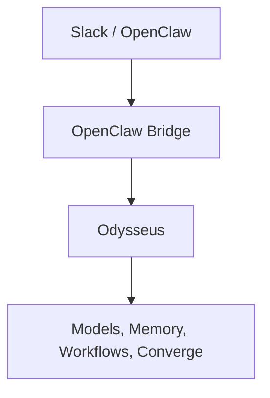

# OpenClaw Bridge

## Purpose

The OpenClaw bridge allows external clients (OpenClaw, Slack bots, scripts, automation platforms) to interact with Odysseus through a scoped API.

Odysseus remains the system of record for:
- Chat sessions
- Memory
- Converge/Redmine access
- Scheduled workflows
- Research
- Tool execution

OpenClaw acts as a client/UI layer.



## Design Goals

- Local-first
- Least privilege
- Explicit scope-based access
- Safe workflow triggering
- Slack thread ↔ Odysseus session mapping
- Read-only by default

## Session Mapping

Slack conversations are mapped into deterministic Odysseus sessions.

**Format:** `openclaw:slack:<channel>:<thread>`

**Examples:**
- `openclaw:slack:C123456:1700000000.000100`
- `openclaw:slack:ops-alerts:root`

This allows OpenClaw to maintain conversation continuity across Slack threads.

## Authentication

The bridge supports API token authentication.

**Example:**
```http
Authorization: Bearer <token>
```

Token ownership determines the Odysseus user context used for requests.

## Scopes

### `chat`
Basic bridge access. Allows:
- `POST /api/openclaw/ask`
- Session creation
- Standard chat interactions

### `memory:read`
Allows retrieval of memory context.
Without this scope, `no_memory=True` is enforced.

### `memory:write`
Allows memory commands.
Examples: `/remember`, `/forget`
*Note: `memory:write` implies `memory:read`.*

### `web:read`
Allows web retrieval during chat requests.
Required for:
```json
{
  "use_web": true
}
```

### `research:run`
Allows Deep Research execution.
Required for:
```json
{
  "use_research": true
}
```

### `tools:use`
Allows tool preprocessing and tool execution.
Without this scope, `allow_tool_preprocessing=False`.

### `converge:read`
Allows access to Converge ticket data.
Required for:
- `GET /api/openclaw/tickets/*`
- `GET /api/openclaw/converge/health`

### `workflows:trigger`
Allows execution of scheduled workflows.
Required for:
- `POST /api/openclaw/workflows/*`

## Workflow Allowlist

Workflow execution can be restricted using:
```env
OPENCLAW_ALLOWED_WORKFLOWS=daily-summary,redmine-triage
```

**Examples:**
- `OPENCLAW_ALLOWED_WORKFLOWS=*` : Allow all workflows.
- `OPENCLAW_ALLOWED_WORKFLOWS=` : Disable allowlist enforcement and rely on scope checks only.

## Routes

### `GET /api/openclaw/health`
Basic bridge health.

### `GET /api/openclaw/converge/health`
Converge integration health.
**Requires:** `converge:read`

### `POST /api/openclaw/ask`
Chat entry point.
Features:
- Slack thread session mapping
- Memory integration
- Optional web search
- Optional research
- Tool execution gating

### `POST /api/openclaw/tickets/search`
Search Converge tickets.
**Requires:** `converge:read`

### `POST /api/openclaw/tickets/{id}/summary`
Generate a Slack-oriented ticket summary.
*Note: Ticket payloads are sanitized before being sent to the model.*

### `POST /api/openclaw/workflows/{name}/trigger`
Trigger an allowed scheduled workflow.
**Requires:** `workflows:trigger`

## Security Notes

The bridge intentionally separates permissions:
- `chat`
- `memory`
- `web`
- `research`
- `tools`
- `converge`
- `workflows`

A token only receives the capabilities explicitly granted to it.

**Recommended OpenClaw token:**
- `chat`
- `converge:read`

**Recommended future Ops token:**
- `chat`
- `converge:read`
- `web:read`
- `research:run`
- `tools:use`

**Avoid granting:**
- `workflows:trigger`
- `memory:write`
*(unless explicitly required)*

## Testing

Current bridge tests validate:
- Session ID generation
- Scope enforcement
- Memory gating
- Tool gating
- Research warnings
- Workflow allowlists
- Ticket sanitization
- User message persistence
