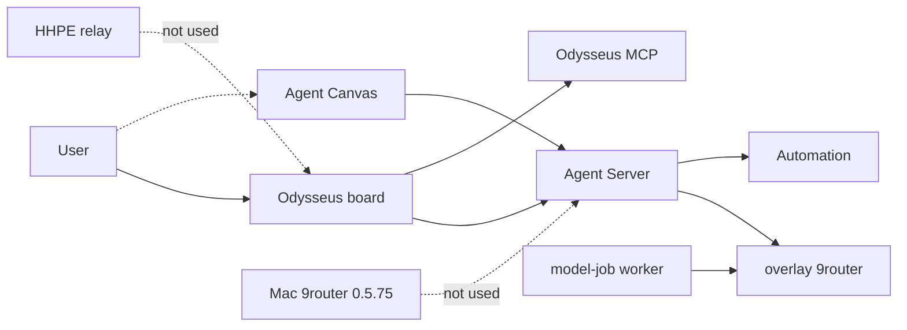

# feat: Deploy OpenHands overlay on the Linux VM

## Goal Capsule

Objective: Make this repository’s OpenHands + 9router overlay deployable on the Fusion Ubuntu VM so the modified Odysseus dashboard is the only product board, Agent Canvas runs beside it, and providers are added only after stack health.

Product authority: Odysseus owns the production frontend. OpenHands owns agent execution. Overlay 9router owns provider credentials for this stack. Mac 9router and HHPE relay are out of the inference path.

Stop conditions: Stop if a change would start a second Odysseus board, embed Canvas, route OpenHands or 9router through HHPE, point overlay inference at the Mac 9router, or add provider-connection tests before a healthy guest overlay.

Execution profile: Code and guest operations. Smoke-first: compose up and probe before live tokens. Compose `--pull never` after images exist. Do not treat GitHub Actions as the merge gate for this slice.

---

## Product Contract

### Summary

Replace the VM’s vendored Odysseus board with this repo’s overlay stack. Keep one Odysseus UI. Run Agent Canvas in parallel. Leave HHPE relay and host 9router out.

### Requirements

- R1. Operators open this repository’s Odysseus dashboard as the canonical production frontend for OpenHands + 9router work.
- R2. Agent Canvas may run in parallel as engineering UI for the same Agent Server conversations and must not be a second Odysseus board or an embedded iframe.
- R3. The Linux VM overlay must become healthy (`up --wait` plus stack probe) before any provider is connected.
- R4. Overlay 9router is provider authority for Agent Server, OpenCode, Hermes, and the model-job worker on that compose network.
- R5. The Mac host 9router install stays untouched and is not the overlay inference plane.
- R6. HHPE relay / adapter compose is not part of this stack. OpenHands and 9router do not enter through HHPE.
- R7. Odysseus must not receive 9router inference keys. Virtual keys stay in overlay 9router DATA_DIR (temporary sqlite bridge remains until a later control-API slice).
- R8. Live three-runtime token success is deferred until after R3. Existing credential-miss behavior may remain until providers are added on the guest overlay.

### Actors

- A1. Operator on the Mac, reaching the guest over SSH `orchestration-vm`.
- A2. Guest Docker engine on `hhpe-forge`.
- A3. Production user of the Odysseus board (after deploy).

### Key Flows

- F1. Power on VM, sync this tree, stop the old 7000 Odysseus project, start base + overlay compose, prove stack health.
- F2. User works on Odysseus; Canvas opens the bound conversation in a new tab.
- F3. After health, connect providers inside overlay 9router; then re-run live native/OpenCode/Hermes probes (follow-up, not this plan’s DoD).

### Acceptance Examples

- AE1. Guest compose has one Odysseus web on 7000 and Canvas on 8000; no second Odysseus project; no relay file in the compose file list.
- AE2. `openhands_probe.py stack` reports overlay services healthy; 9router `/api/health` succeeds on the overlay network; Odysseus env has no inference key.
- AE3. Odysseus UI still exposes Native/OpenCode and “Open in Agent Canvas” as a URL; no canvas iframe.
- AE4. Host process `9router -H 127.0.0.1` remains the Mac install; overlay does not bind host 20128 on the Mac.

### Scope Boundaries

In scope: guest checkout, image build, runtime-bin pins, overlay up, ops doc, contract/reachability/probe verification.

Deferred to follow-up: connecting providers on overlay 9router; bumping 0.5.69 to host 0.5.75; egress lock; Hermes chooser; Task 18; 9router/Canvas source changes; GPU Cookbook.

Outside this product’s identity: HHPE registry, relay, Forgejo, NATS, and other guest services as ingress for models.

---

## Planning Contract

### Assumptions

- SSH `orchestration-vm` still maps to the Fusion Ubuntu VM; `agent` can `sudo -n docker`.
- The vendored 7000 stack may be running when the VM is up; it must be stopped or removed as a compose project before this board binds 7000.
- Guest has no NVIDIA devices; GPU overlays are unused.
- Mac Docker Desktop stays off; this slice does not bring the overlay up on macOS.

### Key Technical Decisions

- KTD1. One Compose project from this repository: `docker-compose.yml` + `docker-compose.openhands.yml` only. Do not add HHPE `docker-compose.relay.yml`.
- KTD2. Replace the vendored board on guest 7000 rather than running two Odysseus UIs. Canvas remains the extra surface (`OPENHANDS_CANVAS_BIND` / `OPENHANDS_CANVAS_PORT`).
- KTD3. Overlay 9router stays unpublished on the host; reach it with `docker compose exec`. Do not publish 20128 on the Mac and do not proxy to Mac 9router.
- KTD4. Build `odysseus-odysseus:latest` from this tree before overlay `up` because overlay MCP/worker use `pull_policy: never`.
- KTD5. Install Linux OpenCode/Hermes pins into `data/openhands-runtime-bin` on the guest with `scripts/install_openhands_runtime_bin.py` (Agent Server is Linux amd64 on this VM).
- KTD6. Providers wait until stack probe + contract/reachability pass. Do not expand provider tests on the Mac first.
- KTD7. ntfy publishes guest `127.0.0.1:8091`; model-jobs uses unpublished container 8091. Do not publish the worker. No change required unless a later overlay publishes 8091.

### High-Level Technical Design

### Patterns to follow

- Overlay comments and tests already forbid Odysseus holding the inference key and forbid embedding Canvas.
- Ops startup in `docs/operations/openhands-stack.md` is the command shape to extend with VM-specific notes, not a second stack.

---

## Implementation Units

### U1. Guest checkout and single-board occupancy

Goal: This tree is on the VM; the old vendored Odysseus project is not bound to 7000; Docker is usable.

Requirements: R1, R6, AE1

Dependencies: none

Files:
- Create: `docs/operations/linux-vm-openhands-overlay.md` (guest runbook)
- Modify: `docs/operations/openhands-stack.md` (link the VM path; keep Canvas as URL)

Approach: Power on Fusion Ubuntu if needed. Sync this branch into a dedicated guest directory (not `external/vendors/odysseus`). Use `oldmac-vm` or `agent` + `sudo -n docker`. Stop the running `odysseus` compose project that includes the relay file. Do not delete guest data volumes until the new board is proven; stopping the project is enough to free 7000.

Execution note: This is packaging/ops; prefer runtime smoke over unit tests.

Test scenarios:
- Happy path: `docker compose ls` for the new project lists only the two compose files from this repo.
- Edge: VM powered off — start it before claiming failure.
- Error: 7000 still held by `docker-proxy` — do not start a second Odysseus.

Verification: Guest `ss` shows 7000 free or owned by the new project only. Relay file absent from `docker compose ls` CONFIG FILES.

### U2. Guest image and ACP runtime pins

Goal: `odysseus-odysseus:latest` is this tree; `/opt/oh-bin` will have pinned OpenCode and Hermes.

Requirements: R3, R4

Dependencies: U1

Files:
- Test: `tests/integration/openhands/test_runtime_bin_pins.py`
- Modify: none unless installer fails on guest glibc/arch (fix `scripts/install_openhands_runtime_bin.py` only with evidence)

Approach: `python3 scripts/install_openhands_runtime_bin.py` into `data/openhands-runtime-bin`. `docker compose -f docker-compose.yml -f docker-compose.openhands.yml build odysseus`. Tag/name must match overlay `image: odysseus-odysseus:latest`.

Execution note: Smoke the installer and image id before `up`.

Test scenarios:
- Happy path: pin files exist; `test_runtime_bin_pins` installer assertions still pass on the tree.
- Error: missing sha — installer exits; do not use `latest` OpenCode/Hermes.

Verification: Image exists locally; dest contains `opencode` and `hermes` binaries.

### U3. Overlay up without HHPE and without Mac 9router

Goal: Base + overlay services healthy on the guest loopback.

Requirements: R1, R2, R4, R5, R6, R7, AE1, AE4

Dependencies: U2

Files:
- Modify: `docker-compose.openhands.yml` only if guest `up` proves a real contract bug (keep 9router unpublished; keep Canvas published).
- Test: `tests/integration/openhands/test_stack_contract.py`

Approach: `cp .env.example .env` on the guest; `AUTH_ENABLED=true`; `APP_BIND=127.0.0.1`; `APP_PORT=7000`; Canvas loopback 8000. `docker compose -f docker-compose.yml -f docker-compose.openhands.yml up -d --wait --pull never`. Do not compose GPU or host-docker overlays. Do not start Docker Desktop overlay on the Mac.

Test scenarios:
- Happy path: `--wait` succeeds; Canvas reachable on guest 8000; Odysseus on 7000; 9router has no host port.
- Integration: Odysseus overlay env omits inference key (existing reachability test).
- Error: missing image with `--pull never` — fail; rebuild, do not pull `latest` MCP/worker.

Verification: `docker compose ps` all overlay services healthy. Mac `lsof` still shows host 9router on 20128 unchanged.

### U4. Stack probe and 9router reachability without providers

Goal: Prove deploy without connecting providers.

Requirements: R3, R7, R8, AE2

Dependencies: U3

Files:
- Test: `tests/integration/openhands/test_9router_reachability.py`
- Test: `tests/integration/openhands/test_live_three_runtime_9router.py` (may still assert credential miss)
- Modify: `docs/architecture/evidence/live-three-runtime-9router.md` only if a new guest observation is recorded

Approach: `python3 scripts/openhands_probe.py stack --json`. Pytest contract + reachability against that compose. Do not add new provider fixtures. Live three-runtime may still see `No active credentials`; that is success for routing, not for tokens.

Execution note: Smoke-first; do not treat token-less completions as a deploy failure.

Test scenarios:
- Happy path: stack probe healthy; live 9router health proven not skipped.
- Edge: ACP binaries present; live ACP still fails closed on missing credentials without hitting chatgpt.com / api.openai.com / api.anthropic.com.
- Error: 9router unhealthy — do not connect providers; diagnose overlay first.

Verification: Probe JSON and pytest pass. No new provider-connection tests landed.

### U5. Ops doc: one board, Canvas parallel, providers later

Goal: Operators can repeat the VM path from docs without rediscovering HHPE/Mac traps.

Requirements: R1, R2, R5, R6, AE3

Dependencies: U1, U3, U4

Files:
- Create: `docs/operations/linux-vm-openhands-overlay.md`
- Modify: `docs/operations/openhands-stack.md`
- Modify: `tests/README.md` OpenHands feasibility section (VM is the live overlay target; providers after probe)

Approach: Document SSH host, sudo docker, stop-old-project, build, install pins, compose files, probe, and explicit “providers after health / not Mac 9router / not HHPE”. Keep Canvas section as URL-only.

Test expectation: none — documentation; verify by reading that commands match U3/U4 and that relay/Mac 9router are named as non-goals.

Verification: Docs name one Odysseus board, Canvas parallel, overlay 9router, deferred providers.

---

## Verification Contract

- Guest: compose config quiet, `up -d --wait --pull never`, `python3 scripts/openhands_probe.py stack --json`.
- Guest pytest: `tests/integration/openhands/test_stack_contract.py`, `test_9router_reachability.py`, `test_runtime_bin_pins.py`.
- UI contract still green locally if JS/docs change: `tests/test_agent_ui_js.py`.
- Do not require `probe acceptance` `live_stack: true` until overlay providers exist.
- Do not start overlay 9router on the Mac as verification.

---

## Definition of Done

- This repo’s overlay is the Odysseus board on the Linux VM; vendored+relay compose is not the OpenHands + 9router frontend.
- Canvas is up beside it; not embedded; not a second Odysseus.
- Stack probe and 9router reachability pass without adding providers.
- Mac 9router remains the host install only.
- Ops docs describe the VM path and the provider deferral.
- Follow-up (not DoD): connect providers on overlay 9router, then live token probes.

---

## Risks and Dependencies

- Guest RAM ~8 GiB: overlay + existing Forgejo/redis/nats may pressure memory; stop unused compose projects if `--wait` hangs.
- `agent` is not in group `docker`; require sudo or the `oldmac-vm` account.
- Stale `odysseus-odysseus:latest` on the guest would run the wrong board; U2 rebuild is mandatory.
- Temporary 9router DATA_DIR sqlite mount remains; do not treat it as the long-term control API.

## Open Questions

- Deferred: which upstream providers to connect first on overlay 9router after U4 (not blocking deploy).
- Deferred: whether to later bump overlay 9router 0.5.69 toward host 0.5.75.
